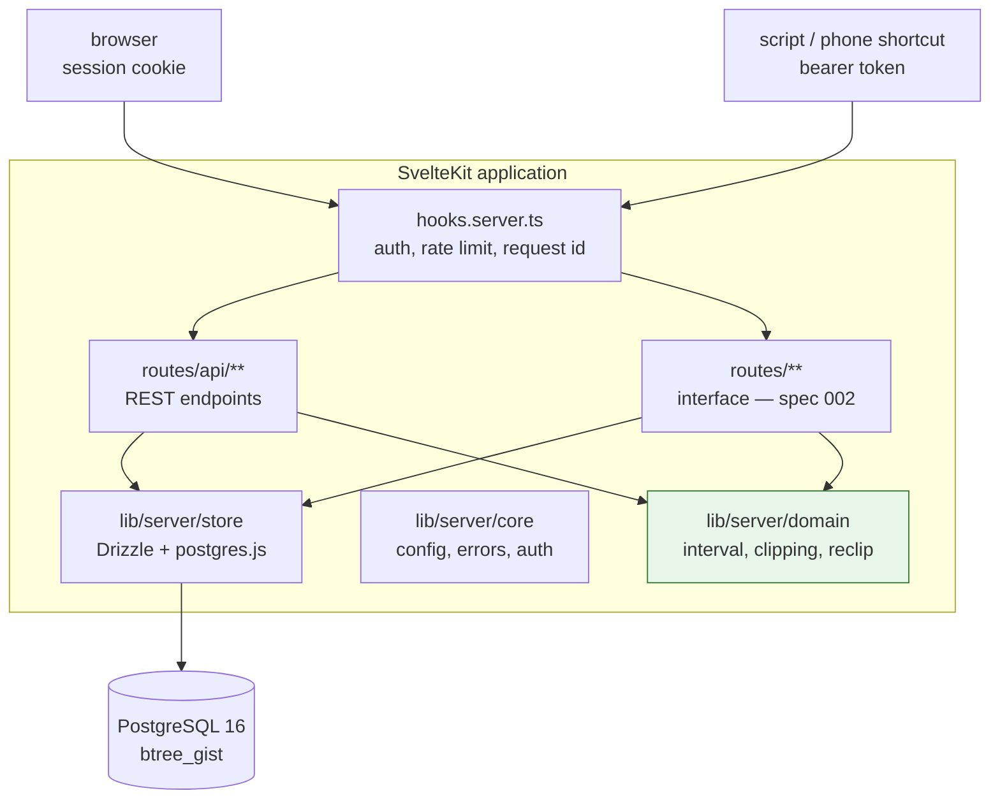
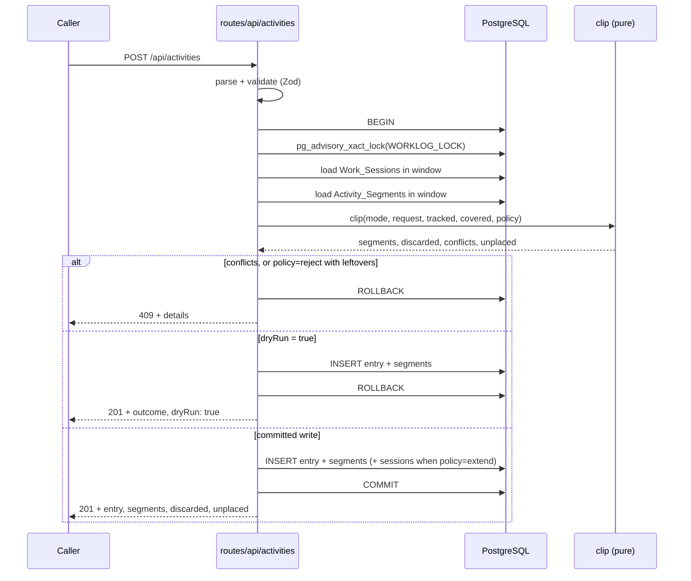
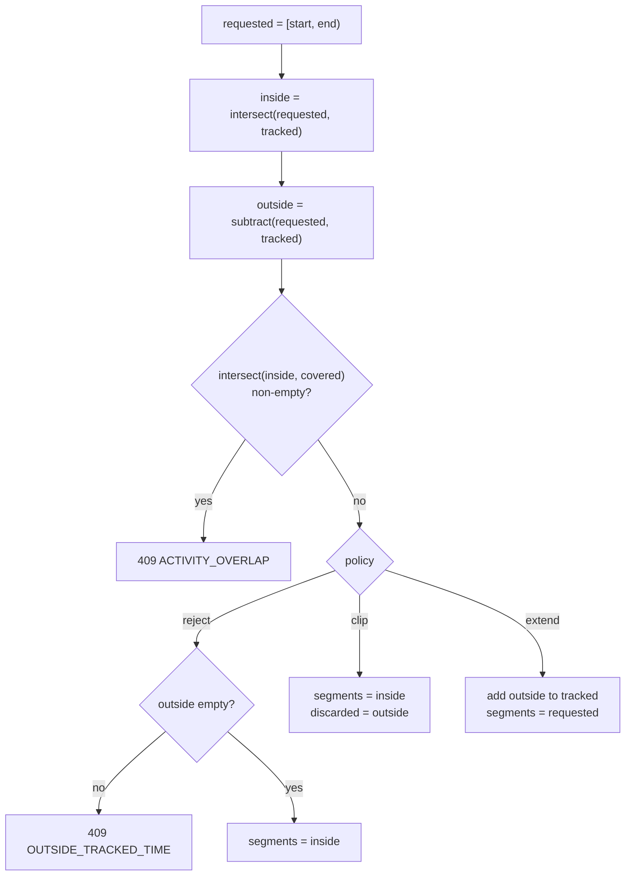
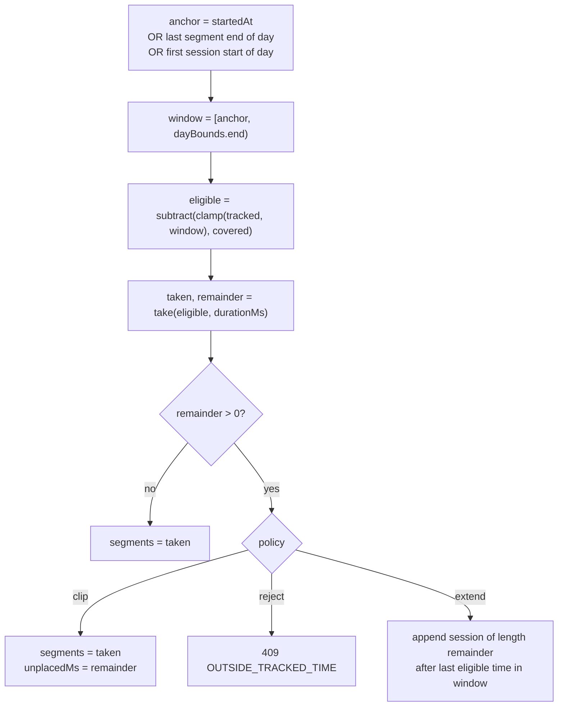
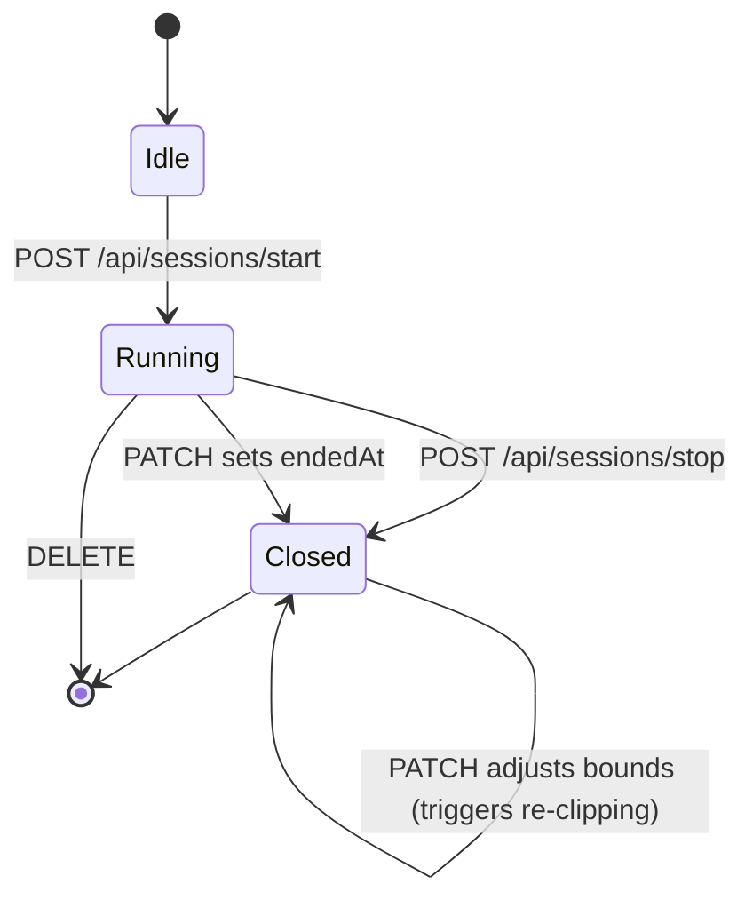

# Design Document: Worklog Domain and API

## Overview

Worklog is one SvelteKit application backed by PostgreSQL 16. This document covers the `Worklog_Server` — its server-side half: the reconciliation domain, the data layer, the `Auth_Hook` and the REST routes under `/api`. The browser interface is designed in `002-worklog-ui`.

The central design idea is that `Clipping` is a **pure function over interval lists**. All the difficult behavior — splitting a three-hour entry around a fifteen-minute break, walking a bare duration forward through eligible time, deciding what falls outside the timer frame — reduces to `normalize`, `intersect`, `subtract` and `take` over `Interval[]`. The data layer supplies the input lists and persists the output; it holds no reconciliation logic. This keeps the hard part testable without a database and makes it a natural fit for `fast-check`.

The second idea is that an `Activity_Entry` keeps **both** what the user asked for and what was actually stored. The requested interval or duration is written to the entry unchanged; the reconciled result lives in its `Activity_Segment` rows. A later audit can therefore show "you told me 13:00–16:00, and here are the two stretches that survived the break" rather than silently rewriting history. Because the same pure function drives both the real write and a `Dry_Run`, the interface can show that outcome *before* the user commits to it.

**Key design decisions:**

- **Pure domain**: `src/lib/server/domain/` imports no database client, no SvelteKit runtime and no `$env`. Every reconciliation rule is a total function on sorted, disjoint interval lists, and a test enforces the restriction.
- **Database-enforced non-overlap**: PostgreSQL `EXCLUDE USING gist` constraints on `tstzrange` make overlapping `Work_Session` rows and overlapping `Activity_Segment` rows unrepresentable, independent of application code. A partial unique index enforces the single-`Open_Session` rule.
- **`postgres.js` driver instead of the workspace default**: the template stack uses `drizzle-orm/neon-http`, whose own code notes that `db.transaction()` always throws. Worklog's correctness model requires interactive transactions — for the advisory lock, for atomic entry-plus-segments writes, and for the deferred-constraint reshuffle during re-clipping — so this project uses `drizzle-orm/postgres-js`. Drizzle, the schema DSL and the query style are unchanged; only the driver differs. It also removes the Neon proxy from local and E2E runs.
- **Serialized writes via advisory lock**: every mutating request runs inside one transaction that first takes `pg_advisory_xact_lock`. The application is single-user, so the cost is irrelevant and it removes every read-modify-write race from `Clipping`.
- **`Dry_Run` is the same code path**: a dry run runs the identical transaction and rolls it back instead of committing. It cannot drift from the real write, because it *is* the real write.



Both the REST routes and the interface's load functions and form actions call the same store and domain modules. The REST layer is not a wrapper around the interface, nor the reverse — they are two entry points to one core.

## Architecture

### Request Flow for a Mutating Endpoint

Every write follows the same shape. The route parses and validates, opens one transaction, takes the advisory lock, loads the interval context, calls the pure `clip` function, persists the result, and commits — or, for a `Dry_Run`, rolls back and returns what would have happened.



The `Dry_Run` branch performs the same inserts as the real write before rolling back. This is deliberate: it exercises every database constraint, so a dry run that succeeds guarantees the real write will too, and the two paths cannot diverge.

### The Clipping Algorithm

`Clipping` has two entry paths that share the same output shape.

**Explicit_Mode** — the requested interval is known, so the algorithm is set arithmetic:



**Duration_Mode** — the interval is unknown, so the algorithm walks forward consuming eligible time:



`take` is what makes the user's example work. Given `eligible = [14:00–14:45, 15:00–17:00]` and `durationMs = 2h`, it consumes the first interval whole (45 min), then takes the first 1h15 of the second, returning `[14:00–14:45, 15:00–16:15]`. The break survives, and the segments still total exactly two hours.

### Re-clipping After a Timer Change

When a `Work_Session` is patched or deleted, `Tracked_Time` changes and existing segments may no longer be valid. The service recomputes them:

1. Compute `affected = union(old session interval, new session interval)`.
2. Select every `Activity_Entry` owning an `Activity_Segment` overlapping `affected`.
3. Order those entries by `requestedStartedAt` ascending, then by `createdAt` ascending — a total order, so the result is deterministic.
4. Delete all segments of those entries.
5. Re-run `clip` for each in order with policy `clip`, treating already re-clipped entries as part of `Covered_Time`.

Policy `extend` is never used here: the service is reacting to a change the user made to the frame, so it must not silently grow the frame back.

Step 4 deletes before step 5 reinserts, which is why `activity_segments_no_overlap` is declared `DEFERRABLE INITIALLY DEFERRED` — the intermediate state inside the transaction may violate it, the committed state may not.

## Project Structure

Files owned by this specification are marked; everything else is created by `002-worklog-ui`.

```
worklog/
├── messages/{cs,en}.json                 # Paraglide sources — 002 fills these
├── project.inlang/settings.json
├── migrations/                           # 001: hand-written SQL, root per steering
│   └── 001_init.sql
├── scripts/
│   ├── migrate.sh                        # 001: the only way migrations are applied
│   ├── build.sh  start-docker.sh  stop-docker.sh  deploy.sh
│   └── test-e2e.sh
├── src/
│   ├── app.d.ts                          # 001: App.Locals — requestId, auth
│   ├── hooks.server.ts                   # 001: sequence of handles
│   ├── db/schema/                        # 001: Drizzle table definitions
│   │   ├── projects.ts
│   │   ├── work-sessions.ts
│   │   ├── activity-entries.ts
│   │   ├── activity-segments.ts
│   │   ├── auth-sessions.ts
│   │   └── index.ts                      # barrel
│   ├── lib/server/
│   │   ├── domain/                       # 001: PURE — no db, no SvelteKit, no $env
│   │   │   ├── interval.ts               # normalize, intersect, subtract, take, gaps
│   │   │   ├── logical-day.ts            # createDayResolver
│   │   │   ├── clipping.ts               # clip, resolveAnchor
│   │   │   └── reclip.ts                 # reclipAffected, ports interface
│   │   ├── store/                        # 001: Drizzle queries, one file per aggregate
│   │   │   ├── tx.ts                     # withTx, advisory lock, constraint mapping
│   │   │   ├── work-sessions.ts
│   │   │   ├── projects.ts
│   │   │   ├── activities.ts
│   │   │   └── auth-sessions.ts
│   │   └── core/                         # 001: server infrastructure
│   │       ├── config.ts                 # env validation, fail fast
│   │       ├── errors.ts                 # ApiError, error codes, json helper
│   │       ├── auth.ts                   # session cookie + bearer token
│   │       ├── rate-limit.ts
│   │       ├── logger.ts
│   │       └── request-id.ts
│   ├── lib/ui/                           # 002: design system
│   ├── modules/                          # 002: feature logic
│   └── routes/
│       ├── api/                          # 001: REST for external callers
│       │   ├── health/+server.ts
│       │   ├── sessions/+server.ts
│       │   ├── sessions/start/+server.ts
│       │   ├── sessions/stop/+server.ts
│       │   ├── sessions/current/+server.ts
│       │   ├── sessions/[id]/+server.ts
│       │   ├── projects/+server.ts
│       │   ├── projects/[id]/+server.ts
│       │   ├── activities/+server.ts
│       │   ├── activities/[id]/+server.ts
│       │   ├── days/+server.ts
│       │   ├── days/[date]/+server.ts
│       │   └── coverage/+server.ts
│       └── …                             # 002: the interface
└── tests/
    ├── lib/server/domain/                # 001: unit + *.property.test.ts
    ├── lib/server/store/                 # 001: integration, needs PostgreSQL
    ├── lib/server/core/                  # 001: config, errors, auth
    └── api/                              # 001: REST route tests
```

### Module Boundaries

| Module | May import | Must never import |
|---|---|---|
| `lib/server/domain` | `@date-fns/tz`, standard library | anything under `store`, `core`, `$env`, `$app`, Drizzle, SvelteKit |
| `lib/server/store` | `domain`, `core`, Drizzle, `$db` | anything under `routes` |
| `lib/server/core` | standard library, `$env` | `domain`, `store` |
| `routes/api` | all of the above | — |

`reclip.ts` needs to read and write through the store but must stay pure, so it receives the operations it needs as a `ReclipPorts` object supplied by the caller. This keeps it testable against an in-memory fake with no database.

## Technology Choices

| Concern | Choice | Rationale |
|---|---|---|
| Runtime and package manager | Bun 1.2.15 | workspace convention; `bun.lock` committed |
| Framework | SvelteKit ^2.63 on Svelte 5 runes, `adapter-node` | workspace convention |
| Database client | Drizzle ORM ^0.45 over **`postgres.js` ^3.4** | the template's `neon-http` driver cannot run interactive transactions, which this design requires throughout |
| Non-overlap enforcement | `btree_gist` + `EXCLUDE USING gist` | makes the core invariant a schema property rather than an application convention |
| Migrations | hand-written SQL in `migrations/`, applied by `scripts/migrate.sh` | `EXCLUDE` constraints and partial indexes cannot be expressed in the Drizzle schema DSL, and the steering requires `migrations/` at the root with a shell entry point |
| Time zone maths | `@date-fns/tz` ^1.5 (`TZDate`) | DST-correct wall-clock arithmetic; verified against both Prague transitions before being adopted |
| Validation | Zod ^4 | workspace convention; applied at every route boundary |
| Unit and property tests | Vitest ^4, `fast-check` ^4 declared explicitly | workspace convention; `fast-check` is only transitively present in the template, so it is a direct dependency here |
| i18n | `@inlang/paraglide-js` ^2.18 | workspace convention; message keys only, no prose in code |

## Components and Interfaces

### 1. Interval Algebra (`src/lib/server/domain/interval.ts`)

The foundation. Every function takes and returns **normalized** lists: sorted by start, pairwise disjoint, non-touching. Intervals are half-open `[start, end)`, which is why two sessions may touch at 12:00 without overlapping.

```ts
/** A half-open time range [start, end). */
export type Interval = { start: Date; end: Date };

export function isEmpty(i: Interval): boolean;
export function duration(i: Interval): number;          // milliseconds
export function overlaps(a: Interval, b: Interval): boolean;

/** Sorts, drops empty intervals, merges overlapping and touching ones. Idempotent. */
export function normalize(input: Interval[]): Interval[];

export function union(a: Interval[], b: Interval[]): Interval[];

/** The parts of `a` that also lie in `b`. Result is always normalized. */
export function intersect(a: Interval[], b: Interval[]): Interval[];

/** The parts of `a` that do not lie in `b`. */
export function subtract(a: Interval[], b: Interval[]): Interval[];

export function clamp(input: Interval[], window: Interval): Interval[];

export function total(input: Interval[]): number;       // milliseconds

/**
 * Walks `input` forward consuming exactly `ms`, splitting the interval in which
 * it runs out. `remainder` is how much could not be consumed.
 */
export function take(input: Interval[], ms: number): { taken: Interval[]; remainder: number };

/** The complement of `input` within `window`. */
export function gaps(input: Interval[], window: Interval): Interval[];
```

### 2. Logical Day Resolution (`src/lib/server/domain/logical-day.ts`)

Converts between calendar dates and the `Logical_Day` windows they denote, using `TZDate` for DST-correct arithmetic.

```ts
export type DayResolver = {
  /** Window of the Logical_Day named by a "YYYY-MM-DD" string. */
  bounds(date: string): Interval;
  /** Name of the Logical_Day containing `t`; instants before startHour belong to the previous date. */
  dateOf(t: Date): string;
  /** One window per Logical_Day from dateOf(from) to dateOf(to). */
  range(from: Date, to: Date): Interval[];
};

/** Throws when `timezone` is not loadable or `startHour` is outside 0..23. */
export function createDayResolver(timezone: string, startHour: number): DayResolver;
```

A `Logical_Day` is not always 24 hours. With `startHour = 3` in `Europe/Prague` the window `03:00 → 03:00` contains the DST transition that happens at 02:00 the following morning, so the **day before** each transition is the short or long one — 2026-03-28 is 23 hours and 2026-10-24 is 25 hours, while the transition dates themselves are 24. This was verified against `@date-fns/tz` before the design was fixed, and the tests pin exactly these dates.

### 3. Clipping (`src/lib/server/domain/clipping.ts`)

The reconciliation core. Pure: it receives every list it needs and returns a description of what should be written. It never decides HTTP status codes — it reports conflicts and leftovers, and the route maps them.

```ts
export type ActivityMode = 'explicit' | 'duration' | 'open';
export type UncoveredPolicy = 'clip' | 'extend' | 'reject';   // 'clip' is the default

export type ClipInput = {
  mode: ActivityMode;
  /** Explicit mode only. */
  requested?: Interval;
  /** Duration mode only, in milliseconds. */
  durationMs?: number;
  /** Duration mode only: resolved placement start. */
  anchor?: Date;
  /** Duration mode only: bounds the forward search. */
  dayBounds?: Interval;
  /** Normalized Work_Session intervals. */
  tracked: Interval[];
  /** Normalized Activity_Segment intervals of OTHER entries. */
  covered: Interval[];
  policy: UncoveredPolicy;
};

export type ClipResult = {
  /** What to persist as Activity_Segment rows. */
  segments: Interval[];
  /** policy=clip: parts of the request dropped as untracked. */
  discarded: Interval[];
  /** policy=extend: intervals to add to Tracked_Time. */
  extend: Interval[];
  /** Explicit mode: overlaps with `covered`. Non-empty means the caller must reject. */
  conflicts: Interval[];
  /** Duration mode: milliseconds that found no eligible time. */
  unplacedMs: number;
};

/**
 * Total: never throws for well-formed input. Callers inspect `conflicts` and
 * `unplacedMs` to decide whether to accept the result.
 */
export function clip(input: ClipInput): ClipResult;

/**
 * Picks the Placement_Anchor for Duration_Mode and Open_Mode per Requirements
 * 5.2–5.5 and 15.2–15.3: the explicit start when given, else the end of the day's
 * latest segment, else the start of its earliest session.
 */
export function resolveAnchor(
  explicit: Date | null,
  segments: Interval[],
  sessions: Interval[]
): Date;   // throws NoPlacementAnchorError when the day holds neither
```

### 4. Re-clipping (`src/lib/server/domain/reclip.ts`)

```ts
/** The slice of persistence re-clipping needs. The store satisfies it; tests supply a fake. */
export type ReclipPorts = {
  trackedIntervals(window: Interval, now: Date): Promise<Interval[]>;
  entriesOverlapping(window: Interval): Promise<ActivityEntry[]>;
  coveredIntervals(window: Interval, excludeEntryId: string | null): Promise<Interval[]>;
  replaceSegments(entryId: string, segments: Interval[]): Promise<void>;
};

export type ReclipOutcome = {
  entryId: string;
  /** Carried so a preview can name the entry even when it belongs to another day. */
  projectName: string;
  description: string;
  before: Interval[];
  after: Interval[];
  removedMs: number;
  /** True when `after` is empty — the entry becomes an Orphaned_Entry. */
  orphaned: boolean;
};

/**
 * Re-runs clipping for every entry whose segments intersect `affected`, in
 * deterministic order, with policy 'clip'. The caller must already hold the
 * advisory lock and an open transaction; ports are bound to it.
 */
export function reclipAffected(
  ports: ReclipPorts,
  days: DayResolver,
  affected: Interval,
  now: Date
): Promise<ReclipOutcome[]>;
```

`ReclipOutcome` carries `before` and `after` so that a `Dry_Run` on a session change can show the user exactly which entries lose time and how much, satisfying Requirements 14.2 and 14.6.

### 5. Transaction Helper (`src/lib/server/store/tx.ts`)

```ts
export const WORKLOG_ADVISORY_LOCK = 4919372001;

export type Tx = PostgresJsTransaction<typeof schema, ExtractTablesWithRelations<typeof schema>>;

/**
 * Opens a transaction, takes the advisory lock as its first statement, runs `fn`,
 * then commits — or rolls back when `dryRun` is true, or when `fn` throws.
 */
export function withTx<T>(fn: (tx: Tx) => Promise<T>, opts?: { dryRun?: boolean }): Promise<T>;

/** Maps PostgreSQL constraint violations to ApiError codes. */
export function translateConstraintError(err: unknown): ApiError | null;
```

`withTx` implements `Dry_Run` by throwing a private `RollbackSignal` after `fn` resolves, catching it outside the transaction and returning the value. The database sees an ordinary rollback.

| SQLSTATE | Constraint | Error code |
|---|---|---|
| `23P01` | `work_sessions_no_overlap` | `SESSION_OVERLAP` |
| `23P01` | `activity_segments_no_overlap` | `ACTIVITY_OVERLAP` |
| `23505` | `work_sessions_one_open` | `SESSION_ALREADY_RUNNING` |
| `23505` | `projects_name_unique` | `PROJECT_EXISTS` |
| `23503` | `activity_entries_project_id_fkey` | `PROJECT_IN_USE` |

The application checks the same conditions before writing, so these translations are a safety net for races, not the primary path.

### 6. Stores (`src/lib/server/store/`)

```ts
// work-sessions.ts
export function openSession(tx: Tx, startedAt: Date): Promise<WorkSession>;
export function closeOpenSession(tx: Tx, endedAt: Date): Promise<WorkSession | null>;
export function currentOpenSession(tx: Tx): Promise<WorkSession | null>;
export function listSessionsOverlapping(tx: Tx, window: Interval): Promise<WorkSession[]>;
export function getSession(tx: Tx, id: string): Promise<WorkSession | null>;
export function updateSession(tx: Tx, id: string, patch: { startedAt?: Date; endedAt?: Date | null }): Promise<WorkSession>;
export function deleteSession(tx: Tx, id: string): Promise<void>;
export function insertSessions(tx: Tx, intervals: Interval[]): Promise<WorkSession[]>;
/** Normalized Tracked_Time; an Open_Session is treated as running until `now`. */
export function trackedIntervals(tx: Tx, window: Interval, now: Date): Promise<Interval[]>;

// activities.ts
export function createEntry(tx: Tx, entry: NewActivityEntry, segments: Interval[]): Promise<ActivityEntry>;
export function getEntry(tx: Tx, id: string): Promise<ActivityEntry | null>;
export function listEntriesOverlapping(tx: Tx, window: Interval, projectId?: string): Promise<ActivityEntry[]>;
export function updateEntryMeta(tx: Tx, id: string, patch: { description?: string; projectId?: string }): Promise<ActivityEntry>;
export function replaceSegments(tx: Tx, entryId: string, segments: Interval[]): Promise<void>;
export function deleteEntry(tx: Tx, id: string): Promise<void>;
export function coveredIntervals(tx: Tx, window: Interval, excludeEntryId?: string): Promise<Interval[]>;
/** Ordered by requestedStartedAt then createdAt — the deterministic re-clipping order. */
export function entriesOverlapping(tx: Tx, window: Interval): Promise<ActivityEntry[]>;

/**
 * Entries left with no segment, selected by their REQUESTED interval — the only
 * handle an Orphaned_Entry still has. Without this an emptied entry is invisible
 * in every listing yet keeps its project alive through ON DELETE RESTRICT.
 */
export function orphanedEntriesOverlapping(tx: Tx, window: Interval): Promise<ActivityEntry[]>;

/** Entry ids referencing a project, for the PROJECT_IN_USE details (Requirement 3.7). */
export function entryIdsForProject(tx: Tx, projectId: string): Promise<string[]>;

// projects.ts
/** Assigns the lowest colour index not held by a non-archived project, wrapping at 8. */
export function createProject(tx: Tx, name: string): Promise<Project>;
export function listProjects(tx: Tx, includeArchived: boolean): Promise<Project[]>;
export function updateProject(tx: Tx, id: string, patch: { name?: string; archived?: boolean; colorIndex?: number }): Promise<Project>;
export function deleteProject(tx: Tx, id: string): Promise<void>;

// auth-sessions.ts
export function createAuthSession(tx: Tx, token: string, expiresAt: Date): Promise<void>;
export function findAuthSession(tx: Tx, token: string): Promise<{ expiresAt: Date } | null>;
export function deleteAuthSession(tx: Tx, token: string): Promise<void>;
export function purgeExpiredAuthSessions(tx: Tx, now: Date): Promise<number>;
```

### 7. Authentication (`src/lib/server/core/auth.ts`, `src/hooks.server.ts`)

Two credentials reach the same endpoints. The browser carries a `Browser_Session` as an opaque cookie; scripts carry the static `API_Token`. Both are checked by the `Auth_Hook`, which exempts only the `Health_Endpoint` and the login route.

```ts
export const SESSION_COOKIE = 'worklog_session';

/** Constant-time comparison of two secrets. */
export function secretsMatch(a: string, b: string): boolean;

/** Creates an opaque session token, stores it, and returns it for the cookie. */
export function beginBrowserSession(): Promise<string>;

export type AuthResult = { kind: 'browser' } | { kind: 'token' } | { kind: 'none' };
export function authenticate(event: RequestEvent): Promise<AuthResult>;
```

The cookie is set with `httpOnly: true`, `sameSite: 'strict'`, `path: '/'`, an explicit `maxAge`, and `secure` unless `APP_ENV` is `development`. `strict` is chosen over the workspace's usual `lax` because nothing ever links into this application from elsewhere, and it removes the need for CSRF tokens on form actions.

`src/hooks.server.ts` composes the handles in this order, each exported individually so it can be unit tested:

```ts
export const handle = sequence(
  handleRequestId,     // X-Request-Id in, echoed out, stored on locals
  handleRequestLog,    // structured JSON line per request
  handleCors,          // configured origins only, never a reflected wildcard
  handleRateLimit,     // per address, plus the stricter login bucket
  handleAuth,          // populates locals.auth; 401 for /api, redirect otherwise
);
```

### 8. Error Envelope (`src/lib/server/core/errors.ts`)

```ts
export type ErrorCode =
  | 'VALIDATION_ERROR' | 'INVALID_INTERVAL' | 'AMBIGUOUS_MODE' | 'RANGE_TOO_LARGE'
  | 'UNAUTHORIZED' | 'NOT_FOUND'
  | 'SESSION_ALREADY_RUNNING' | 'NO_SESSION_RUNNING' | 'SESSION_OVERLAP'
  | 'ACTIVITY_OVERLAP' | 'OUTSIDE_TRACKED_TIME' | 'NO_PLACEMENT_ANCHOR' | 'NOTHING_TO_LOG'
  | 'PROJECT_EXISTS' | 'PROJECT_IN_USE' | 'PROJECT_ARCHIVED'
  | 'FUTURE_TIMESTAMP' | 'INTERVAL_TOO_SHORT' | 'STALE_PREVIEW'
  | 'PAYLOAD_TOO_LARGE' | 'RATE_LIMITED' | 'INTERNAL_ERROR';

export class ApiError extends Error {
  constructor(
    readonly status: number,
    readonly code: ErrorCode,
    /** English prose, for a human reading a shell script's output. */
    message: string,
    readonly details?: Record<string, unknown>
  );
}

/** Serializes to { error, message, messageKey, details }; unknown errors become INTERNAL_ERROR. */
export function errorResponse(err: unknown, requestId: string): Response;

/** `ACTIVITY_OVERLAP` → `errors_activity_overlap`. The one place the mapping lives. */
export function messageKeyFor(code: ErrorCode): string;
```

The envelope carries **both** a `message` and a `messageKey`. `message` is an English sentence, which is what the backend standard requires and what a shell script's output should show; `messageKey` is the Paraglide key the interface renders instead. Neither side has to derive anything: `002` reads `messageKey` and never parses `error` or `message`.

### Security Headers (`src/lib/server/core/security-headers.ts`)

A `handleSecurityHeaders` hook sets, on every response:

| Header | Value |
|---|---|
| `Content-Security-Policy` | `default-src 'self'; script-src 'self' 'nonce-<per-request>'; style-src 'self' 'nonce-<per-request>'; img-src 'self' data:; connect-src 'self'; frame-ancestors 'none'; base-uri 'none'; form-action 'self'` |
| `Strict-Transport-Security` | `max-age=31536000; includeSubDomains` — production only |
| `X-Content-Type-Options` | `nosniff` |
| `Referrer-Policy` | `strict-origin-when-cross-origin` |

The nonce is generated per request, placed on `event.locals`, and injected into `%sveltekit.nonce%` in `src/app.html` through `transformPageChunk`. Tailwind 4 compiles to a static stylesheet, so no inline style is needed; Svelte's own inline hydration script takes the nonce. Development relaxes the policy through configuration, never through a weakened production code path.

### 9. REST Route Contracts (`src/routes/api/`)

| Method | Path | Requirements |
|---|---|---|
| POST | `/api/sessions/start` | 1.1–1.4, 1.9 |
| POST | `/api/sessions/stop` | 1.5–1.7 |
| GET | `/api/sessions/current` | 1.8, 1.10 |
| GET · **POST** | `/api/sessions` | 2.1–2.4 |
| PATCH · DELETE | `/api/sessions/[id]` | 2.5–2.10, 14.2 |
| GET · POST | `/api/projects` | 3.1–3.5, 3.9 |
| PATCH · DELETE | `/api/projects/[id]` | 3.6–3.8, 3.10, 3.11 |
| GET · POST | `/api/activities` | 4.x, 5.x, 6.x, 7.1–7.6, 14.1, 15.x |
| GET · PATCH · DELETE | `/api/activities/[id]` | 7.7–7.11, 14.1 |
| GET | `/api/days` · `/api/days/[date]` | 8.1–8.10 |
| GET | `/api/coverage` | 9.1–9.7 |
| GET | `/api/health` | 13.1–13.4 |

`POST /api/sessions` is the "I forgot to start the timer" route: it creates a **closed** session from an explicit start and end, and re-clips like any other frame change. Without it the interface's add-session action (`002` Requirement 8.1) has nothing to call — and Requirements 2.6 and 2.7 already legislate for a POST.

### Field Naming

JSON request and response bodies use `camelCase`; query parameters use `snake_case`. This is Requirement 12.1 and it is the single rule that resolves the two spellings that appear across the API surface — `startedAt` in a body, `include_archived` in a query string.

Every route validates with a Zod schema declared here, so the interface's form actions and the REST routes share one definition and cannot drift (`002` forbids writing a second schema).

```ts
const isoOffset = z.iso.datetime({ offset: true });
const dryRunFields = { dryRun: z.boolean().default(false), previewToken: z.string().optional() };

// POST /api/activities — one schema covers all three modes; the handler picks the mode
export const createActivitySchema = z.object({
  projectId: z.uuid(),
  description: z.string().max(2000).default(''),
  /** Target_Day for Duration_Mode and Open_Mode. Defaults to the current Logical_Day. */
  date: z.string().regex(/^\d{4}-\d{2}-\d{2}$/).optional(),
  startedAt: isoOffset.optional(),
  endedAt: isoOffset.optional(),
  durationMinutes: z.number().int().positive().optional(),
  uncoveredPolicy: z.enum(['clip', 'extend', 'reject']).default('clip'),
  ...dryRunFields
}).strict();   // .strict() satisfies Requirement 12.4 — unknown fields are rejected

export const patchActivitySchema = z.object({
  projectId: z.uuid().optional(),
  description: z.string().max(2000).optional(),
  startedAt: isoOffset.optional(),
  endedAt: isoOffset.optional(),
  durationMinutes: z.number().int().positive().optional(),
  uncoveredPolicy: z.enum(['clip', 'extend', 'reject']).default('clip'),
  ...dryRunFields
}).strict();

export const createSessionSchema = z.object({
  startedAt: isoOffset,
  endedAt: isoOffset,
  ...dryRunFields
}).strict();

export const startSessionSchema = z.object({ startedAt: isoOffset.optional() }).strict();
export const stopSessionSchema  = z.object({ endedAt: isoOffset.optional() }).strict();

export const patchSessionSchema = z.object({
  startedAt: isoOffset.optional(),
  endedAt: isoOffset.nullable().optional(),
  ...dryRunFields
}).strict();

export const deleteSessionSchema = z.object({ ...dryRunFields }).strict();

export const createProjectSchema = z.object({
  name: z.string().trim().min(1).max(200)
}).strict();

export const patchProjectSchema = z.object({
  name: z.string().trim().min(1).max(200).optional(),
  archived: z.boolean().optional(),
  colorIndex: z.number().int().min(0).max(7).optional()
}).strict();

export type ActivityResponse = {
  entry: ActivityEntry;                 // includes its segments and `orphaned`
  discarded: Interval[];                // policy=clip, plus segments below MIN_INTERVAL_SECONDS
  extendedSessions: WorkSession[];      // policy=extend
  unplacedMinutes: number;              // duration mode
  removedSeconds: number;               // time taken from other entries — always present
  dryRun: boolean;
  previewToken: string;                 // frame fingerprint, see Requirement 14.7
};

// POST, PATCH or DELETE on a session, with dryRun
export type SessionChangePreview = {
  session: WorkSession | null;          // null for a delete
  reclipped: ReclipOutcome[];           // before/after segments per affected entry
  removedSeconds: number;               // total time that would disappear
  dryRun: true;
  previewToken: string;
};

export type CurrentSessionResponse = {
  session: WorkSession | null;
  elapsedSeconds: number;               // 0 when no session is open
  /** True for a Stale_Session — running past MAX_OPEN_SESSION_HOURS. */
  stale: boolean;
};

export type DaySummary = {
  date: string;                         // YYYY-MM-DD
  trackedSeconds: number;
  coveredSeconds: number;
  uncoveredSeconds: number;
  sessionCount: number;                 // sessions that began in this day — Requirement 8.9
  longestBlockSeconds: number;          // longest uninterrupted session — Requirement 8.11
  overtimeSeconds: number;              // Overtime — tracked time outside the Gauge_Window (Req 8.12)
  byProject: ProjectTotal[];
};

export type DaysRangeResponse = {
  days: DaySummary[];
  /**
   * The window holding the middle 90 % of tracked time across the range, as
   * wall-clock times in the server zone. The interface offers it as a better
   * Gauge_Window once real habits are known (Requirement 8.13).
   */
  suggestedWindow: { start: string; end: string };   // "07:20", "01:40"
};
```

A rejection is never a field: it is a non-2xx response carrying the standard error envelope. `002` maps that envelope into its own `rejection` shape — the server has no such concept.

Mode selection:

| `endedAt` | `durationMinutes` | Mode | Start | End |
|---|---|---|---|---|
| present | absent | `Explicit_Mode` | `startedAt`, required | `endedAt` |
| absent | present | `Duration_Mode` | `startedAt`, else the `Placement_Anchor` | walked forward through eligible time |
| absent | absent | `Open_Mode` | `startedAt`, else the `Placement_Anchor` | now |
| present | present | — | `AMBIGUOUS_MODE` 400 | |

`Open_Mode` is the one-call quick log: `POST /api/activities` with nothing but `projectId` and a description records everything since the last entry ended. It reuses `resolveAnchor` and then follows the `Explicit_Mode` path with the resolved interval, so it adds no new reconciliation rules. This is deliberately a server mode rather than a client convenience — a shell script or a phone shortcut gets the same behavior as the interface, and the anchor rule stays in one place.

### 10. Day and Coverage Contracts

```ts
export type CoverageResponse = {
  from: string; to: string;             // RFC 3339 UTC
  tracked: Interval[];
  covered: Interval[];
  uncovered: Interval[];                // Uncovered_Time — worked, nothing logged against it
  untracked: Interval[];                // Untracked_Time — breaks, the timer was not running
};

export type DayResponse = {
  date: string;                         // YYYY-MM-DD
  bounds: Interval;
  sessions: WorkSession[];
  entries: ActivityEntry[];
  coverage: CoverageResponse;
  totals: {
    trackedSeconds: number;
    coveredSeconds: number;
    uncoveredSeconds: number;
    byProject: { projectId: string; projectName: string; coveredSeconds: number }[];
  };
};
```

`uncovered` is computed as `subtract(tracked, covered)` and `untracked` as `gaps(tracked, window)`, which is what makes Requirement 9.3 hold by construction.

### 11. Configuration (`src/lib/server/core/config.ts`)

```ts
export type Config = {
  port: number;                 // PORT, default 3000
  databaseUrl: string;          // DATABASE_URL, required
  apiToken: string;             // WORKLOG_API_TOKEN, required, min 32 chars
  passphraseHash: string;       // WORKLOG_PASSPHRASE_HASH, required, argon2id
  timezone: string;             // TIMEZONE, default Europe/Prague
  dayStartHour: number;         // DAY_START_HOUR, default 3
  gaugeStart: string;           // GAUGE_START, default '06:00'
  gaugeEnd: string;             // GAUGE_END, default '00:00'
  allowDayBoundaryChange: boolean; // ALLOW_DAY_BOUNDARY_CHANGE, default false
  corsOrigins: string[];        // CORS_ORIGINS
  appEnv: 'development' | 'production';
  dbQueryTimeoutMs: number;     // DB_QUERY_TIMEOUT_SECONDS, default 5
  rateLimitPerMinute: number;   // RATE_LIMIT_PER_MINUTE, default 120
  sessionDurationHours: number; // SESSION_DURATION_HOURS, default 720
  maxOpenSessionHours: number;  // MAX_OPEN_SESSION_HOURS, default 12
  minIntervalSeconds: number;   // MIN_INTERVAL_SECONDS, default 60
  version: string;              // read from package.json — the single source of truth
};

/** Validates at module load and throws listing every problem, not just the first. */
export function loadConfig(): Config;
```

## Data Models

### Domain Types (`src/lib/server/domain/models.ts`)

```ts
export type WorkSession = {
  id: string;
  startedAt: Date;
  endedAt: Date | null;         // null while the timer runs
  createdAt: Date;
  updatedAt: Date;
};

export type Project = {
  id: string;
  name: string;
  colorIndex: number;           // 0..7, see 002-worklog-ui
  archivedAt: Date | null;
  createdAt: Date;
};

export type ActivityMode = 'explicit' | 'duration' | 'open';

export type ActivityEntry = {
  id: string;
  projectId: string;
  projectName: string;          // joined, read-only
  description: string;
  mode: ActivityMode;

  // The original request, stored verbatim and never rewritten by Clipping.
  requestedStartedAt: Date | null;
  requestedEndedAt: Date | null;
  requestedDurationMinutes: number | null;

  /** True when segments is empty — an Orphaned_Entry (Requirements 2.10, 7.3). */
  orphaned: boolean;

  createdAt: Date;
  updatedAt: Date;
  segments: ActivitySegment[];
};

export type ActivitySegment = {
  id: string;
  entryId: string;
  startedAt: Date;
  endedAt: Date;
};

export type ProjectTotal = {
  projectId: string;
  projectName: string;
  archived: boolean;
  coveredSeconds: number;
};
```

Timestamps are `Date` inside the server and RFC 3339 UTC strings on the wire (Requirement 10.3). The interface revives them on receipt; `002` states where.

### Schema (`migrations/001_init.sql`)

```sql
CREATE EXTENSION IF NOT EXISTS btree_gist;

CREATE TABLE projects (
    id          uuid PRIMARY KEY,
    name        text NOT NULL,
    -- Stable slot in the eight-colour categorical palette, so adding a project
    -- never recolours the history. The palette is fixed in 002-worklog-ui.
    color_index smallint NOT NULL DEFAULT 0,
    archived_at timestamptz,
    created_at  timestamptz NOT NULL DEFAULT now(),
    CONSTRAINT projects_name_length CHECK (char_length(name) BETWEEN 1 AND 200),
    CONSTRAINT projects_color_index_range CHECK (color_index BETWEEN 0 AND 7)
);

-- Case- and whitespace-insensitive uniqueness (Requirement 3.2).
CREATE UNIQUE INDEX projects_name_unique ON projects (lower(btrim(name)));

CREATE TABLE work_sessions (
    id         uuid PRIMARY KEY,
    started_at timestamptz NOT NULL,
    ended_at   timestamptz,
    created_at timestamptz NOT NULL DEFAULT now(),
    updated_at timestamptz NOT NULL DEFAULT now(),
    CONSTRAINT work_sessions_interval_valid
        CHECK (ended_at IS NULL OR started_at < ended_at),
    CONSTRAINT work_sessions_no_overlap EXCLUDE USING gist (
        tstzrange(started_at, ended_at) WITH &&
    ) WHERE (ended_at IS NOT NULL)
);

-- At most one Open_Session (Requirement 1.8).
CREATE UNIQUE INDEX work_sessions_one_open
    ON work_sessions ((true)) WHERE ended_at IS NULL;

-- The real query is "sessions overlapping [from, to)", which a plain btree on
-- started_at only half covers. A gist range index matches it, as on segments.
CREATE INDEX work_sessions_range
    ON work_sessions USING gist (tstzrange(started_at, ended_at));

CREATE TABLE activity_entries (
    id                         uuid PRIMARY KEY,
    project_id                 uuid NOT NULL REFERENCES projects (id) ON DELETE RESTRICT,
    description                text NOT NULL DEFAULT '',
    mode                       text NOT NULL,
    requested_started_at       timestamptz,
    requested_ended_at         timestamptz,
    requested_duration_minutes integer,
    created_at                 timestamptz NOT NULL DEFAULT now(),
    updated_at                 timestamptz NOT NULL DEFAULT now(),
    CONSTRAINT activity_entries_mode_valid CHECK (mode IN ('explicit', 'duration', 'open')),
    CONSTRAINT activity_entries_description_length CHECK (char_length(description) <= 2000),
    -- Open_Mode stores the resolved interval, so it carries the same fields as
    -- Explicit_Mode; only `mode` records that the times were inferred.
    CONSTRAINT activity_entries_mode_fields CHECK (
        (mode IN ('explicit', 'open')
            AND requested_started_at IS NOT NULL
            AND requested_ended_at IS NOT NULL
            AND requested_started_at < requested_ended_at)
     OR (mode = 'duration'
            AND requested_duration_minutes IS NOT NULL
            AND requested_duration_minutes > 0)
    )
);

CREATE INDEX activity_entries_project_id ON activity_entries (project_id);
CREATE INDEX activity_entries_order ON activity_entries (requested_started_at, created_at);

CREATE TABLE activity_segments (
    id         uuid PRIMARY KEY,
    entry_id   uuid NOT NULL REFERENCES activity_entries (id) ON DELETE CASCADE,
    started_at timestamptz NOT NULL,
    ended_at   timestamptz NOT NULL,
    CONSTRAINT activity_segments_interval_valid CHECK (started_at < ended_at),
    -- No two activities may claim the same instant (Requirements 4.5, 6.4).
    -- Deferred so re-clipping can delete and reinsert within one transaction.
    CONSTRAINT activity_segments_no_overlap EXCLUDE USING gist (
        tstzrange(started_at, ended_at) WITH &&
    ) DEFERRABLE INITIALLY DEFERRED
);

CREATE INDEX activity_segments_entry_id ON activity_segments (entry_id);
CREATE INDEX activity_segments_range
    ON activity_segments USING gist (tstzrange(started_at, ended_at));

-- Browser sessions (Requirements 11.7, 11.10, 11.14, 11.15).
-- The cookie carries the raw token; only its hash is stored, so a leaked dump
-- cannot be replayed.
CREATE TABLE auth_sessions (
    token_hash text PRIMARY KEY,
    created_at timestamptz NOT NULL DEFAULT now(),
    expires_at timestamptz NOT NULL
);

CREATE INDEX auth_sessions_expires_at ON auth_sessions (expires_at);

-- Idempotency for retried writes from scripts and phone shortcuts
-- (Requirements 12.8, 12.9).
CREATE TABLE idempotency_keys (
    key        text PRIMARY KEY,
    entry_id   uuid REFERENCES activity_entries (id) ON DELETE CASCADE,
    response   jsonb NOT NULL,
    created_at timestamptz NOT NULL DEFAULT now()
);

CREATE INDEX idempotency_keys_created_at ON idempotency_keys (created_at);

-- The day-boundary configuration the data was created under (Requirement 10.10).
-- A single row; the server refuses to start when it disagrees with the environment.
CREATE TABLE day_boundary_config (
    id             boolean PRIMARY KEY DEFAULT true CHECK (id),
    timezone       text NOT NULL,
    day_start_hour smallint NOT NULL CHECK (day_start_hour BETWEEN 0 AND 23),
    created_at     timestamptz NOT NULL DEFAULT now()
);

CREATE TABLE schema_migrations (
    filename   text PRIMARY KEY,
    applied_at timestamptz NOT NULL DEFAULT now()
);

-- Requirement 13.7: updated_at must reflect the last modification, not the insert.
CREATE FUNCTION set_updated_at() RETURNS trigger AS $$
BEGIN
    NEW.updated_at := now();
    RETURN NEW;
END;
$$ LANGUAGE plpgsql;

CREATE TRIGGER work_sessions_set_updated_at BEFORE UPDATE ON work_sessions
    FOR EACH ROW EXECUTE FUNCTION set_updated_at();

CREATE TRIGGER activity_entries_set_updated_at BEFORE UPDATE ON activity_entries
    FOR EACH ROW EXECUTE FUNCTION set_updated_at();
```

The constraint behavior above was verified against `postgres:16-alpine` before being written down: two open sessions are rejected by the partial unique index, overlapping closed sessions and overlapping segments are rejected by the exclusion constraints, touching intervals are accepted because `tstzrange` is half-open, and a delete-then-reinsert reshuffle inside one transaction succeeds thanks to the deferred constraint.

The Drizzle definitions in `src/db/schema/` mirror these tables for typed queries. Drizzle cannot express `EXCLUDE` constraints or expression-based partial indexes, so the SQL above is the authority and a test asserts the two stay in agreement.

### Work Session State Machine



`pause` is not a distinct state. Pausing is stopping: the client sends `/api/sessions/stop`, and resuming sends `/api/sessions/start`, producing two sessions with a gap between them. That gap is exactly the break the reconciliation later preserves.

## Correctness Properties

### Property 1: Segments never cover untracked time

*For any* set of `Work_Session` intervals and any `Activity_Entry` request clipped with policy `clip` or `reject`, every produced `Activity_Segment` SHALL lie entirely within `Tracked_Time`.

**Validates: Requirements 6.1, 6.2**

### Property 2: Duration mode preserves the requested duration

*For any* positive duration `d` and any `Tracked_Time` containing at least `d` of eligible time after the anchor and within the `Logical_Day`, the total duration of the produced `Activity_Segment` records SHALL equal `d` exactly, and `unplacedMs` SHALL be zero.

**Validates: Requirements 5.6, 5.7**

### Property 3: Breaks survive inside an entry

*For any* requested interval and any `Tracked_Time`, the gaps between consecutive `Activity_Segment` records of the produced entry SHALL contain no `Tracked_Time` that was eligible at write time.

**Validates: Requirements 6.3, 6.4**

### Property 4: Interval algebra is conservative

*For any* two interval lists `a` and `b`, `total(intersect(a,b)) + total(subtract(a,b))` SHALL equal `total(normalize(a))`.

**Validates: Requirements 9.3**

### Property 5: Normalization is idempotent and canonical

*For any* interval list `x`, `normalize(normalize(x))` SHALL equal `normalize(x)`, and the result SHALL be sorted by start, pairwise disjoint and non-touching.

**Validates: Requirements 9.2**

### Property 6: Take is exact and order-preserving

*For any* normalized list `input` and non-negative `ms`, `total(taken) + remainder` SHALL equal `ms`, `total(taken)` SHALL equal `min(total(input), ms)`, and `taken` SHALL be a time-ordered prefix of `input` — every instant in `taken` lies in `input`, and no instant of `input` before the end of `taken` is omitted.

**Validates: Requirements 5.6, 5.7**

### Property 7: Coverage partitions tracked time

*For any* range, the `covered` and `uncovered` lists returned by `/api/coverage` SHALL be pairwise disjoint and their union SHALL equal the returned `tracked` exactly.

**Validates: Requirements 9.3**

### Property 8: Activity segments never overlap globally

*For any* sequence of accepted write operations, no two `activity_segments` rows SHALL overlap.

**Validates: Requirements 4.5, 6.4**

### Property 9: Re-clipping is deterministic and idempotent

*For any* database state, applying `reclipAffected` twice over the same interval SHALL produce the same `Activity_Segment` rows as applying it once.

**Validates: Requirements 2.7, 2.8**

### Property 10: Rejected writes leave no trace

*For any* request rejected with HTTP 4xx, the contents of `work_sessions`, `activity_entries` and `activity_segments` SHALL be identical to their contents before the request.

**Validates: Requirements 6.9**

### Property 11: The original request is preserved

*For any* accepted `Activity_Entry`, the stored `requestedStartedAt`, `requestedEndedAt` and `requestedDurationMinutes` SHALL equal the submitted values, regardless of how `Clipping` altered the stored segments.

**Validates: Requirements 4.2**

### Property 12: Logical day assignment is a partition

*For any* instant `t`, `dateOf(t)` SHALL name exactly one `Logical_Day`, `t` SHALL lie inside `bounds(dateOf(t))`, and consecutive day windows SHALL touch without overlapping — including across both DST transitions.

**Validates: Requirements 10.5, 10.6**

### Property 13: A dry run predicts the write exactly

*For any* request, performing it as a `Dry_Run` and then performing it for real SHALL produce a database state matching what the `Dry_Run` reported, and the `Dry_Run` SHALL return the same status code as the real write.

**Validates: Requirements 14.1, 14.3, 14.4**

### Property 14: A dry run changes nothing

*For any* request executed as a `Dry_Run`, the contents of `work_sessions`, `activity_entries`, `activity_segments` and `projects` SHALL be identical before and after.

**Validates: Requirements 14.5**

### Property 15: Day totals partition the timeline

*For any* set of records and any consecutive run of `Logical_Day` values covering them, the sum of `trackedSeconds` over those days SHALL equal the total duration of `Tracked_Time` in the whole range — no interval crossing a boundary is counted twice or dropped.

**Validates: Requirements 8.3, 10.7**

### Property 16: Every entry stays reachable

*For any* sequence of accepted operations, every `Activity_Entry` in the database SHALL be returned by `/api/activities` for some range — an entry emptied by reconciliation is still selected by its requested interval.

**Validates: Requirements 2.10, 7.2**

### Property 17: No stored interval is shorter than the floor

*For any* accepted write, every `Work_Session` and every `Activity_Segment` in the database SHALL last at least `MIN_INTERVAL_SECONDS`.

**Validates: Requirements 1.14, 6.5**

### Property 18: Idempotent writes create one record

*For any* `POST /api/activities` repeated with the same `Idempotency-Key`, the database SHALL hold exactly one resulting `Activity_Entry` and both responses SHALL be identical.

**Validates: Requirements 12.8, 12.9**

## Error Handling

All error responses use the shape from Requirement 12.1: `{ error, message, details }`, where `message` is a Paraglide message key.

| Code | HTTP | Trigger | Details payload |
|---|---|---|---|
| `VALIDATION_ERROR` | 400 | malformed body, unknown field, bad query parameter, missing required field, naive timestamp, unknown `projectId` | `fields` map of field name to reason |
| `INVALID_INTERVAL` | 400 | start not strictly before end; `from` not before `to` | `start`, `end` |
| `AMBIGUOUS_MODE` | 400 | both `endedAt` and `durationMinutes` supplied | — |
| `RANGE_TOO_LARGE` | 400 | `/api/days` range exceeds 366 days | `maxDays` |
| `UNAUTHORIZED` | 401 | no valid session cookie and no valid bearer token | — |
| `NOT_FOUND` | 404 | path identifier matches no record | `resource` |
| `SESSION_ALREADY_RUNNING` | 409 | start while an `Open_Session` exists | `sessionId` |
| `NO_SESSION_RUNNING` | 409 | stop with no `Open_Session` | — |
| `SESSION_OVERLAP` | 409 | a session write would overlap another session | `conflicts[]` of `{ sessionId, interval }` |
| `ACTIVITY_OVERLAP` | 409 | an `Explicit_Mode` request overlaps another entry's segments | `conflicts[]` of `{ entryId, interval }` |
| `OUTSIDE_TRACKED_TIME` | 409 | policy `reject` and part of the request is untracked | `outside[]` of intervals |
| `NO_PLACEMENT_ANCHOR` | 409 | `Duration_Mode` or `Open_Mode` without `startedAt` in an empty day | `date` |
| `NOTHING_TO_LOG` | 409 | `Open_Mode` where the resolved start is not before the resolved end | `anchor` |
| `PROJECT_ARCHIVED` | 400 | a new entry targets an archived `Project` | `projectId` |
| `FUTURE_TIMESTAMP` | 400 | any supplied instant lies more than five minutes ahead | `field`, `value` |
| `INTERVAL_TOO_SHORT` | 400 | a session shorter than `MIN_INTERVAL_SECONDS` | `minSeconds` |
| `STALE_PREVIEW` | 409 | a write carries a `previewToken` the frame no longer matches | `expected` |
| `PROJECT_EXISTS` | 409 | duplicate project name | `projectId` |
| `PROJECT_IN_USE` | 409 | deleting a project referenced by an entry | `entryCount` |
| `PAYLOAD_TOO_LARGE` | 413 | request body over 1 MiB | `maxBytes` |
| `RATE_LIMITED` | 429 | over the configured limit; login has a stricter bucket | `retryAfterSeconds` |
| `INTERNAL_ERROR` | 500 | any unhandled failure | — |

## Testing Strategy

Tests live under `tests/`, mirroring `src/`, run by Vitest with the workspace's `test.projects` split (node for logic, jsdom for components). Property tests use `fast-check` with `fc.assert(fc.property(...), { numRuns: 100 })` and a `describe('Property N: …')` block matching the sections above.

**Unit tests** — `tests/lib/server/domain/interval.test.ts`, `logical-day.test.ts`, `clipping.test.ts`; `tests/lib/server/core/config.test.ts`, `errors.test.ts`. No database. `clipping.test.ts` carries the worked example from the requirements as a named case: tracked `[08:00–14:48, 15:12–18:00]`, explicit request `13:00–16:00` → segments `[13:00–14:48, 15:12–16:00]`; and the duration case anchored at `14:00` with `2h` over the same frame → `[14:00–14:48, 15:12–16:24]`, totalling exactly 120 minutes. `logical-day.test.ts` pins the DST dates: `2026-03-28` is 23 hours, `2026-10-24` is 25 hours, both transition dates are 24, and `02:30` belongs to the previous logical day.

**Property tests** — `tests/lib/server/domain/interval.property.test.ts`, `clipping.property.test.ts`, `logical-day.property.test.ts`, `reclip.property.test.ts`. Properties 1–7, 9, 11 and 12 are verified here without a database, using `fc.date()` and generators for random session frames and requests.

**Module boundary test** — `tests/lib/server/imports.test.ts` walks the import graph of `src/lib/server/` and fails when a module imports something the Module Boundaries table forbids, so the purity of `domain` cannot rot silently.

**Integration tests** — `tests/lib/server/store/*.test.ts` against a real PostgreSQL 16. These verify what pure code cannot: the single-`Open_Session` index, both exclusion constraints, the deferred reshuffle, the constraint-to-error mapping, and Properties 8, 10 and 14. A helper truncates every table between tests. The database is started with plain `docker run` on the sandbox's own network and reached by container name — never through a published port and never with Docker Compose.

**Route tests** — `tests/api/*.test.ts` call the `+server.ts` handlers directly with a constructed `RequestEvent`. They verify status codes, the error envelope, mode selection, `Uncovered_Policy` behavior, `Dry_Run` responses including Property 13, that `/api/health` is reachable without a credential, and that both the session cookie and the bearer token authenticate.

**Schema agreement test** — `tests/lib/server/store/schema.test.ts` asserts that every column in the Drizzle definitions exists in the migrated database with a compatible type, catching drift between `src/db/schema/` and `migrations/001_init.sql`.
