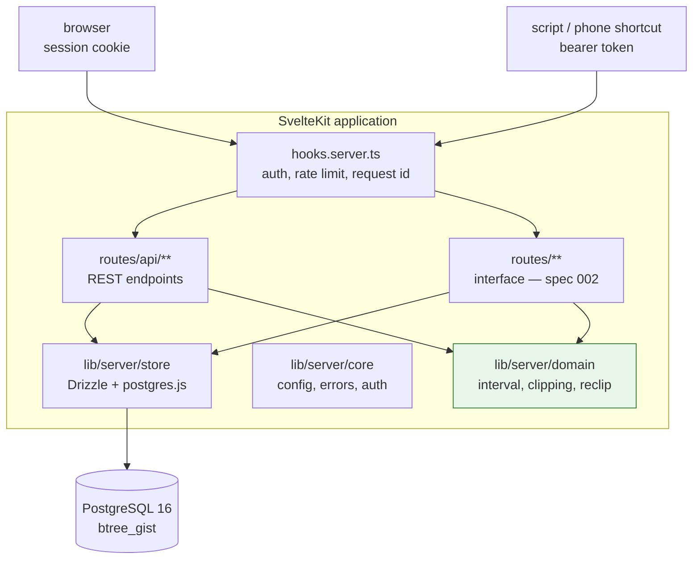
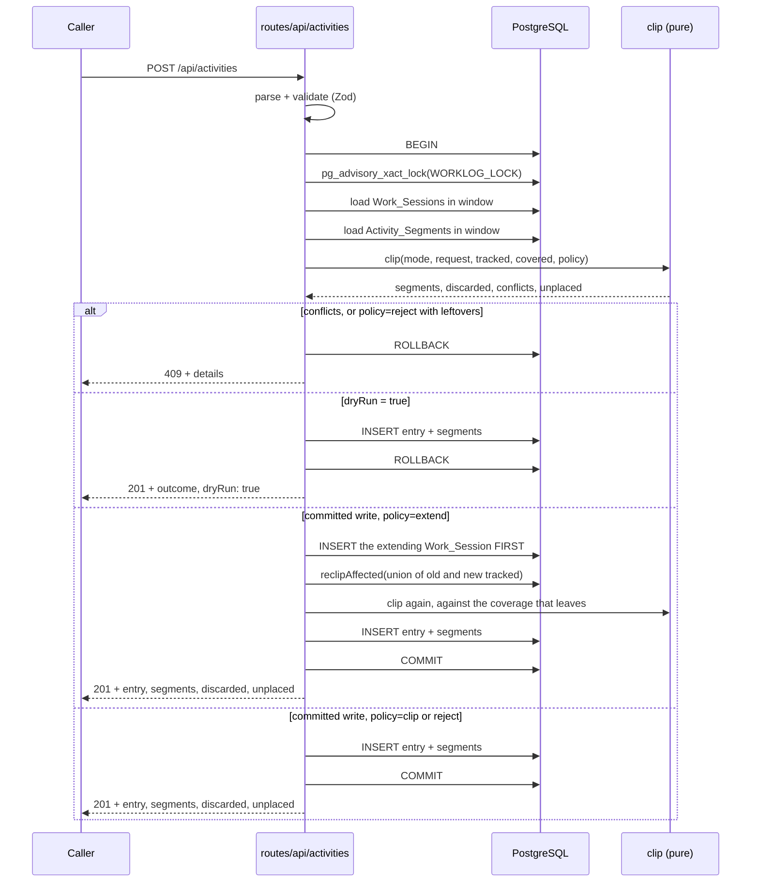
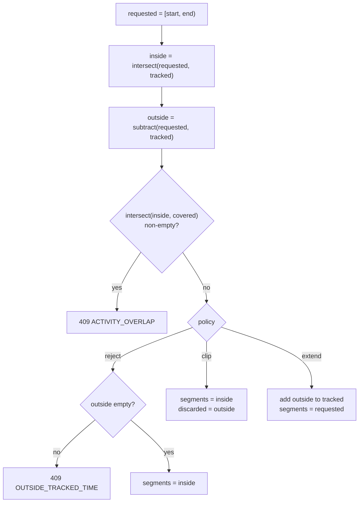
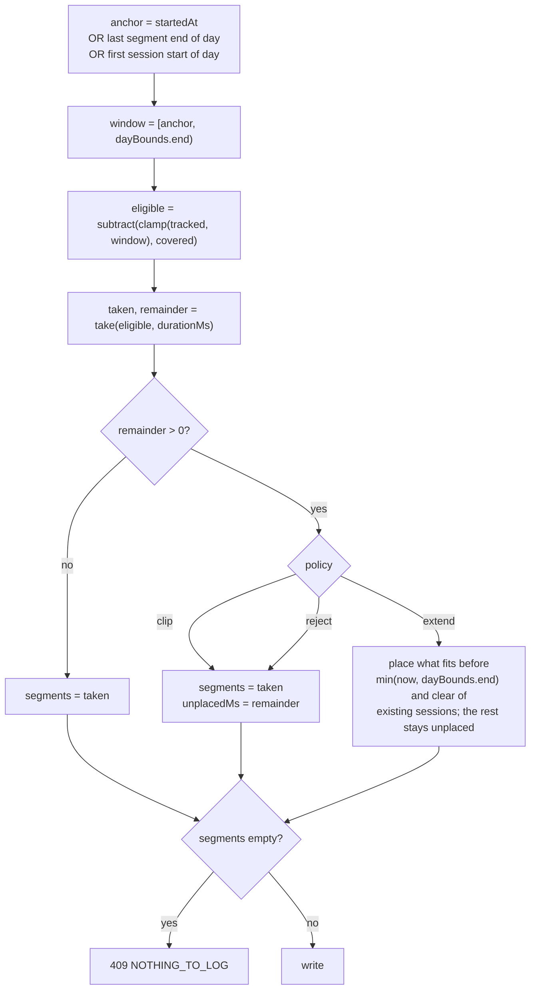
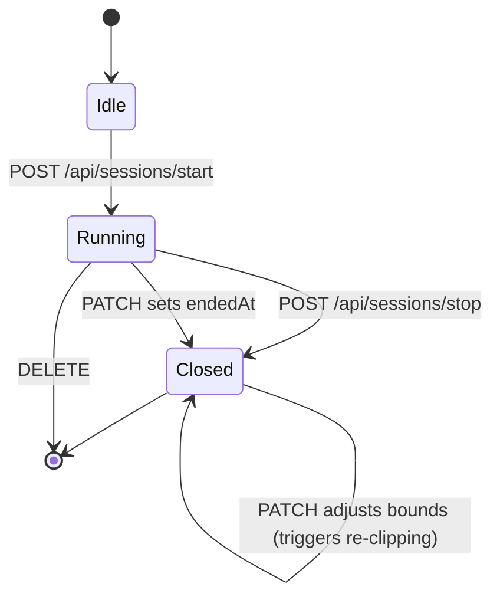

# Design Document: Worklog Domain and API

## Overview

Worklog is one SvelteKit application backed by PostgreSQL 16. This document covers the `Worklog_Server` — its server-side half: the reconciliation domain, the data layer, the `Auth_Hook` and the REST routes under `/api`. The browser interface is designed in `002-worklog-ui`.

The central design idea is that `Clipping` is a **pure function over interval lists**. All the difficult behavior — splitting a three-hour entry around a fifteen-minute break, walking a bare duration forward through eligible time, deciding what falls outside the timer frame — reduces to `normalize`, `intersect`, `subtract` and `take` over `Interval[]`. The data layer supplies the input lists and persists the output; it holds no reconciliation logic. This keeps the hard part testable without a database and makes it a natural fit for `fast-check`.

The second idea is that an `Activity_Entry` keeps **both** what the user asked for and what was actually stored. The requested interval or duration is written to the entry unchanged; the reconciled result lives in its `Activity_Segment` rows. A later audit can therefore show "you told me 13:00–16:00, and here are the two stretches that survived the break" rather than silently rewriting history. Because the same pure function drives both the real write and a `Dry_Run`, the interface can show that outcome *before* the user commits to it.

**Key design decisions:**

- **Pure domain**: `src/lib/server/domain/` imports no database client, no SvelteKit runtime and no `$env`. Every reconciliation rule is a total function on sorted, disjoint interval lists, and a test enforces the restriction.
- **Database-enforced non-overlap, with one documented hole**: PostgreSQL `EXCLUDE USING gist` constraints on `tstzrange` make overlapping **closed** `Work_Session` rows and overlapping `Activity_Segment` rows unrepresentable. A partial unique index enforces the single-`Open_Session` rule. The session constraint is declared `WHERE (ended_at IS NOT NULL)` because `tstzrange(start, NULL)` is unbounded and would collide with everything after it — so an `Open_Session` is **not** covered, and a closed session written across the running timer would pass the database. That gap is closed in the application (Requirements 1.15, 1.16), inside the same transaction and under the advisory lock. The invariant is therefore *database-enforced for closed sessions and lock-enforced for the open one*, which is what the code must be written to, rather than the stronger claim that overlap is unrepresentable.
- **`postgres.js` driver instead of the workspace default**: the template stack uses `drizzle-orm/neon-http`, whose own code notes that `db.transaction()` always throws. Worklog's correctness model requires interactive transactions — for the advisory lock, for atomic entry-plus-segments writes, and for the deferred-constraint reshuffle during re-clipping — so this project uses `drizzle-orm/postgres-js`. Drizzle, the schema DSL and the query style are unchanged; only the driver differs. It also removes the Neon proxy from local and E2E runs.
- **Serialized writes via advisory lock**: every mutating request runs inside one transaction that first takes `pg_advisory_xact_lock`. The application is single-user, so the cost is irrelevant and it removes every read-modify-write race from `Clipping`.
- **`Dry_Run` is the same code path**: a dry run runs the identical transaction and rolls it back instead of committing. It cannot drift from the real write, because it *is* the real write. For that to be true it must also see the same constraint failures: `activity_segments_no_overlap` is `DEFERRABLE INITIALLY DEFERRED`, so it is normally checked at `COMMIT` — which a dry run never reaches. The dry-run branch therefore issues `SET CONSTRAINTS ALL IMMEDIATE` **before** rolling back, forcing every deferred constraint to be evaluated. Without that line a dry run reports success for a write that would fail, and Property 13 is worthless.
- **The server owns every number the interface draws**: the `Gauge_Window`, the `Evening_Hour`, the per-day work intervals behind the day-rhythm strip and the `Project` colour slot all come from here, so the drawing in `.design/DESIGN.md` never has to derive one client-side. `.design/DESIGN.md` is the source of truth for appearance; this document is the source of truth for the values it consumes.



Both the REST routes and the interface's load functions and form actions call the same `lib/server/services/` functions. The REST layer is not a wrapper around the interface, nor the reverse — they are two entry points to one core, and `services` is that core. Reads go through the stores directly; every **write** goes through a service, so the orchestration exists once. See Module Boundaries below.

## Architecture

### Request Flow for a Mutating Endpoint

Every write follows the same shape. The route parses and validates, opens one transaction, takes the advisory lock, loads the interval context, calls the pure `clip` function, persists the result, and commits — or, for a `Dry_Run`, rolls back and returns what would have happened.



The `Dry_Run` branch performs the same inserts as the real write before rolling back. This is deliberate: it exercises every database constraint, so a dry run that succeeds guarantees the real write will too, and the two paths cannot diverge.

### The Clipping Algorithm

`Clipping` has two entry paths that share the same output shape.

**Explicit_Mode** — the requested interval is known, so the algorithm is set arithmetic:



**Duration_Mode** — the interval is unknown, so the algorithm walks forward consuming eligible time:



Five rules govern the tail of that diagram, and each exists because the obvious implementation gets it wrong:

- **`reject` has nothing to reject in `Duration_Mode`** (Requirement 6.9), which is why its edge above joins `clip` rather than raising 409. The policy governs the part of a *stated interval* lying outside the frame; a duration states no interval, so `discarded` is always empty here and the walk's remainder is a shortfall, not `Untracked_Time`. Branching on `remainder > 0` instead would fail a request because time was already described — something the caller never asked to be protected from — and `OUTSIDE_TRACKED_TIME` carries `outside[]` and `outsideSeconds`, which in that branch would have nothing to report. `extend` is unaffected: it still creates sessions here, and it is the only policy that does anything in this mode.
- **`extend` clears `unplacedMs` only by what it actually placed** (Requirement 6.15). The naive version appends "an interval of length `remainder`" and zeroes the counter. When the last tracked instant is already `now`, that interval is empty, and two hours of the user's work disappear into a counter that was reset anyway.
- **`extend` never reaches outside what the request asked for** (Requirements 6.8, 6.13): `min(now, dayBounds.end)` in `Duration_Mode` and `Open_Mode`, and `min(now, requested.end)` in `Explicit_Mode`, where the caller stated both bounds and there is no `Target_Day` to consult. One rule against whatever bound the mode has — `extend` exists to make the request placeable, never to manufacture `Tracked_Time` beyond it. It also never overlaps an existing `Work_Session` (Requirement 6.14), never reaches inside an `Open_Session`'s uncapped span (Requirement 6.18), and **never creates a session shorter than `MIN_INTERVAL_SECONDS`** (Requirement 6.17) — that last one is what keeps Property 17 true, since a session the policy creates is as much a stored session as one the user starts. Where it cannot place, it reports unplaced; that is not an error.
- **A write that both extends and creates runs in one fixed order** (Requirement 2.12): create the `Work_Session`, then re-clip the affected entries, then place the new entry against the coverage that leaves. Any other order is non-deterministic — put the new entry first and it claims time that an `Orphaned_Entry` rescued by the same extension had a prior claim to, and which of the two wins depends on nothing the user can see.
- **A write producing zero segments is `NOTHING_TO_LOG`** (Requirement 6.12), in every mode. Previously `Explicit_Mode` wrote an entry with no segments, `Duration_Mode` reported everything unplaced and `Open_Mode` answered 409 — three behaviors for one situation. An accepted write must never manufacture an `Orphaned_Entry`; those exist only because a *later* frame change emptied an entry that was once real.

`take` is what makes the user's example work. Given `eligible = [14:00–14:45, 15:00–17:00]` and `durationMs = 2h`, it consumes the first interval whole (45 min), then takes the first 1h15 of the second, returning `[14:00–14:45, 15:00–16:15]`. The break survives, and the segments still total exactly two hours.

### Re-clipping After a Timer Change

When a `Work_Session` is patched or deleted, `Tracked_Time` changes and existing segments may no longer be valid. The service recomputes them:

1. Compute `affected: Interval[] = normalize([...oldInterval, ...newInterval])`. It is a **list**, not a single interval: moving a session from Monday morning to Friday evening yields two disjoint stretches, and merging them into one span would re-clip a whole week for no reason. The boundary cases are fixed too — for `start` there is no old interval and the new one is `[startedAt, now)`; for `stop` the old interval is the `Open_Session` read as `[startedAt, now)` and the new one is `[startedAt, endedAt)`; for a delete there is no new interval.
2. Select every `Activity_Entry` whose segments intersect `affected` **or** whose requested interval intersects it. The second half is not optional: an entry emptied by an earlier change owns no segment, so a segment-only query can never find it again, and it would stay an `Orphaned_Entry` for ever even after the user restores the very hour it asked for. Half-open intervals make the same point at the edges — a segment ending exactly at the affected start does not overlap it, while the requested interval that produced it may well.
3. Order those entries by `requestedStartedAt` ascending, then by `createdAt` ascending — a total order, so the result is deterministic.
4. Delete all segments of those entries.
5. Re-run `clip` for each in order with policy `clip`, treating already re-clipped entries as part of `Covered_Time`.

Policy `extend` is never used here: the service is reacting to a change the user made to the frame, so it must not silently grow the frame back.

Step 4 deletes before step 5 reinserts, which is why `activity_segments_no_overlap` is declared `DEFERRABLE INITIALLY DEFERRED` — the intermediate state inside the transaction may violate it, the committed state may not.

### The Gauge Window, the Logical Day and DST

The `Gauge_Window` is a pair of **wall-clock times**, not a pair of instants, and the interface draws it on a fixed 24-hour dial: `angle(t) = 45° + minutes_since_midnight × 0.25`, so one hour is always 15° and a given clock time sits at the same angle on every date. The dial is **not** a mapping of the `Logical_Day` onto 360°. That distinction is what makes the geometry survive DST: a `Logical_Day` is 23 hours on 2026-03-28 and 25 hours on 2026-10-24, and a dial that stretched to fit it would move every graduation twice a year. The angle is a function of the time on the clock, so nothing moves.

Four rules keep that true, and each is a startup check rather than a convention:

1. **`GAUGE_END` may wrap past midnight** (Requirement 13.13). When `GAUGE_END <= GAUGE_START` the end belongs to the following calendar date. Without this rule the default `06:00`–`00:00` describes zero hours, and `00:00`–`06:00` describes minus eighteen.
2. **`DAY_START_HOUR` must fall inside the `Gauge_Gap`** (Requirements 13.14, 13.15). The `Gauge_Window` is reported to the client as one start and one end; if the `Logical_Day` boundary cut through it, the window would be two disjoint arcs belonging to two different days, and a single `trackStart`/`trackEnd` pair could not describe it. With the defaults — day start `03:00`, window `06:00`–`00:00`, gap `00:00`–`06:00` — the boundary sits in the middle of the gap.
3. **The `Gauge_Window` must not contain a transition hour** (Requirement 13.22), checked against `TIMEZONE` rather than assumed. With the defaults this is already true — both Prague transitions happen between 02:00 and 03:00, which rule 2 placed inside the `Gauge_Gap` — so the drawn track is eighteen hours wide on all 365 days. But rules 1 and 2 do **not** imply it in general: `GAUGE_START=00:00`, `GAUGE_END=22:00`, `DAY_START_HOUR=23` satisfies both and still puts 02:00 inside the window. So this is a third check, not a corollary of the second. Saying otherwise — as an earlier draft of this document did — is the kind of claim that survives review precisely because it is true of the defaults.
4. **`DAY_START_HOUR` must itself exist and be unambiguous** in `TIMEZONE` (Requirement 10.13). `DAY_START_HOUR=2` in `Europe/Prague` names an hour that does not occur in March and occurs twice in October; a day boundary that happens twice does not partition anything.

`Overtime` follows from the same definition: for a given `Logical_Day`, the window is materialised as the interval `[GAUGE_START, GAUGE_END)` on that day's dates in `TIMEZONE`, and `overtimeSeconds = total(subtract(trackedOfDay, gaugeWindowOfDay))`. Property 19 pins the complement.

## Project Structure

Files owned by this specification are marked; everything else is created by `002-worklog-ui`.

```
worklog/
├── messages/{cs,en}.json                 # Paraglide sources — 002 fills these
├── project.inlang/settings.json
├── migrations/                           # 001: hand-written SQL, root per steering
│   └── 001_init.sql
├── scripts/
│   ├── migrate.sh                        # 001: the only way migrations are applied
│   ├── build.sh  start-docker.sh  stop-docker.sh  deploy.sh
│   └── test-e2e.sh
├── src/
│   ├── app.d.ts                          # 001: App.Locals — requestId, auth, today, …
│   ├── app.html                          # 002 owns it; 001 substitutes %lang%/%theme%
│   ├── hooks.server.ts                   # 001: sequence of handles
│   ├── db/schema/                        # 001: Drizzle table definitions
│   │   ├── projects.ts
│   │   ├── work-sessions.ts
│   │   ├── activity-entries.ts
│   │   ├── activity-segments.ts
│   │   ├── auth-sessions.ts
│   │   └── index.ts                      # barrel
│   ├── lib/contracts/                    # 001: browser-safe — types and schemas, no runtime
│   │   ├── constants.ts                  # MAX_RANGE_DAYS, ACTIVITY_PAGE_SIZE, … pure data
│   │   ├── models.ts                     # Interval, WorkSession, Project, ActivityEntry, …
│   │   ├── responses.ts                  # DayResponse, DaySummary, HealthResponse, …
│   │   └── schemas.ts                    # Zod request schemas
│   ├── lib/server/
│   │   ├── domain/                       # 001: PURE — no db, no SvelteKit, no $env
│   │   │   ├── interval.ts               # normalize, intersect, subtract, take, gaps
│   │   │   ├── logical-day.ts            # createDayResolver
│   │   │   ├── clipping.ts               # clip, resolveAnchor, NoPlacementAnchorError
│   │   │   └── reclip.ts                 # reclipAffected, ports interface
│   │   ├── store/                        # 001: Drizzle queries, one file per aggregate
│   │   │   ├── tx.ts                     # withTx, advisory lock, constraint mapping
│   │   │   ├── work-sessions.ts
│   │   │   ├── projects.ts
│   │   │   ├── activities.ts
│   │   │   ├── auth-sessions.ts          # session rows: mint, look up, delete, purge
│   │   │   ├── idempotency.ts            # idempotency_keys: look up, record, purge
│   │   │   └── day-boundary.ts           # read and write the Day_Boundary_Config row
│   │   ├── core/                         # 001: server infrastructure, no persistence
│   │   │   ├── config.ts                 # env validation, fail fast
│   │   │   ├── errors.ts                 # ApiError, error codes, json helper
│   │   │   ├── auth.ts                   # passphrase, token minting, cookie options
│   │   │   ├── security-headers.ts       # the headers kit.csp does not set; %lang%/%theme%
│   │   │   ├── preview-token.ts          # the Dry_Run row fingerprint
│   │   │   ├── rate-limit.ts
│   │   │   ├── logger.ts
│   │   │   └── request-id.ts
│   │   └── services/                     # 001: orchestration — the ONE body of every write
│   │       ├── activities.ts             # createActivity, patchActivity, deleteActivity
│   │       ├── sessions.ts               # startSession, stopSession, createSession,
│   │       │                             #   patchSession, deleteSession
│   │       └── projects.ts               # createProject, patchProject, deleteProject
│   ├── lib/ui/                           # 002: design system
│   ├── modules/                          # 002: feature logic
│   └── routes/
│       ├── api/                          # 001: REST for external callers
│       │   ├── health/+server.ts
│       │   ├── sessions/+server.ts
│       │   ├── sessions/start/+server.ts
│       │   ├── sessions/stop/+server.ts
│       │   ├── sessions/current/+server.ts
│       │   ├── sessions/[id]/+server.ts
│       │   ├── projects/+server.ts
│       │   ├── projects/[id]/+server.ts
│       │   ├── activities/+server.ts
│       │   ├── activities/[id]/+server.ts
│       │   ├── days/+server.ts
│       │   ├── days/[date]/+server.ts
│       │   └── coverage/+server.ts
│       ├── login/+page.server.ts         # 001: server half only; 002 builds the page
│       ├── logout/+page.server.ts        # 001: server half only
│       └── …                             # 002: the interface
└── tests/
    ├── lib/server/domain/                # 001: unit + *.property.test.ts
    │   ├── interval.test.ts  interval.property.test.ts
    │   ├── logical-day.test.ts  logical-day.property.test.ts
    │   ├── clipping.test.ts  clipping.property.test.ts
    │   └── reclip.test.ts  reclip.property.test.ts
    ├── lib/server/store/                 # 001: integration, needs PostgreSQL
    │   ├── schema.test.ts  work-sessions.test.ts  projects.test.ts
    │   ├── activities.test.ts  tx.test.ts  idempotency.test.ts
    │   ├── atomicity.property.test.ts    # Properties 10, 16
    │   └── overlap.property.test.ts      # Properties 7, 8, 15
    ├── lib/server/core/                  # 001: config, errors, auth, headers
    ├── lib/server/services/              # 001: orchestration, needs PostgreSQL
    │   └── activities.test.ts  sessions.test.ts  projects.test.ts
    ├── lib/server/imports.test.ts        # 001: Module Boundaries guard
    └── api/                              # 001: REST route tests
        ├── sessions.test.ts  projects.test.ts  activities.test.ts
        ├── days.test.ts  coverage.test.ts  health.test.ts
        ├── days.property.test.ts         # Properties 19, 21
        └── dry-run.property.test.ts      # Properties 13, 14, 18
```

### Module Boundaries

| Module | May import | Must never import | Owner |
|---|---|---|---|
| `lib/contracts` | `zod`, and its own pure constants | anything under `lib/server`, `$env`, `$app`, Drizzle, SvelteKit | 001 |
| `lib/server/domain` | `contracts`, `@date-fns/tz`, standard library | anything under `store`, `core`, `$env`, `$app`, Drizzle, SvelteKit | 001 |
| `lib/server/core` | standard library, `$env`, `contracts` | `domain`, `store`, `routes` | 001 |
| `lib/server/store` | `domain`, `core`, `contracts`, Drizzle, `$db` | anything under `routes`, `services` | 001 |
| `lib/server/services` | `domain`, `store`, `core`, `contracts` | anything under `routes`, `$app`, `RequestEvent` | 001 |
| `routes/api`, `hooks.server.ts` | all of the above | — | 001 |
| `routes/login`, `routes/logout` | all of the above | — | `+page.server.ts` 001, `+page.svelte` 002 |
| `lib/ui`, `modules`, `app.html`, the remaining routes | `contracts`, and each other; a `+page.server.ts` or a `modules/*/actions.ts` may additionally import `lib/server/services` | anything else under `lib/server` — `domain`, `store`, `core` | 002 |

`lib/contracts` holds **pure constants and types as well as schemas**, and that is why it exists. A schema needs its own limits — `listActivitiesQuery` caps `limit` at `ACTIVITY_PAGE_SIZE` — so a constant a schema uses must live where the schema does. Those constants are therefore declared here and `core/config.ts` **imports** them rather than declaring a second copy; the rule is that `lib/contracts` may hold values that are pure data, never anything that reads the environment or the database.

 `002`'s components are typed in terms of `Interval`, `WorkSession`, `ActivityEntry`, `ActivitySegment` and `Project`; if those live under `lib/server/domain` then nothing in `lib/ui`, `modules` or a route may import them and the interface has nothing to compile against — while duplicating them in `002` guarantees the two drift. So the domain types and every response shape are declared here, `lib/server/domain` imports them like everyone else, and the file stays free of anything that cannot be shipped to a browser: no database, no `$env`, no `$app`, no Drizzle, no SvelteKit.

**The table above is the rule, and nothing else is.** The server layers do happen to run `domain` → `core` → `store` → `services` → `routes`, but "each may import only to its left" is a summary that is *false* of `lib/contracts`: it sits below all of them, is imported by every layer and by the browser, and itself imports nothing but Zod and its own pure constants. Where a summary and the table disagree, the table wins. Task 10.1 enforces the table cell by cell, including that no file under `lib/contracts` reaches into `lib/server`.

**`services` is the one body of every write, and both entry points call it.** A service
function takes plain arguments and a `now`, opens its own `withTx`, and returns a
response type from `lib/contracts/responses.ts`. It never touches a `RequestEvent`, and
it never names an HTTP status — it throws `ApiError`, which the error envelope maps. A
`+server.ts` route parses the body with its Zod schema, calls the service, serializes
the result. `002`'s form actions parse the **same** schema and call the **same**
function. Neither entry point holds a line of reconciliation logic, and `002` issues no
HTTP request to `/api` for a write.

Without this layer the sentence above it — that the REST routes and the interface are
two entry points to one core — has no core to point at. Mode selection, `resolveAnchor`,
the `withTx` + `clip` + `reclipAffected` order fixed by Requirement 2.12,
`Idempotency-Key` handling, `Preview_Token` verification and the mapping from a domain
outcome to `NOTHING_TO_LOG` or `NO_PLACEMENT_ANCHOR` are the hardest code in the
project. Written as route bodies, every one of them would have to be written a second
time in `002`'s form actions, and the two copies would drift exactly as a second copy of
`clip` would. This is also the `services/` layer the workspace's project-structure
standard names for orchestration.

**`core` holds no persistence.** This is the rule that decides where two files live, and both were previously misplaced:

- **Browser sessions.** `core/auth.ts` keeps only what needs no database: the argon2id passphrase check, minting and hashing a session token, constant-time comparison, and the cookie options. Everything that touches `auth_sessions` lives in `store/auth-sessions.ts`. `authenticate(event)` is not in `core` at all — it needs both a `RequestEvent` and a session lookup, so it belongs to the top layer and lives in `hooks.server.ts` as part of the `Auth_Hook`.
- **Idempotency.** `idempotency_keys` is a table, so its reads and writes are `store/idempotency.ts`, not `core/idempotency.ts`. The route calls it inside the same transaction as the write it is protecting, which is the only way Requirement 12.8 can hold.

`reclip.ts` needs to read and write through the store but must stay pure, so it receives the operations it needs as a `ReclipPorts` object supplied by the caller. This keeps it testable against an in-memory fake with no database.

## Technology Choices

| Concern | Choice | Rationale |
|---|---|---|
| Runtime and package manager | Bun 1.2.15 | workspace convention; `bun.lock` committed |
| Framework | SvelteKit ^2.63 on Svelte 5 runes, `adapter-node` | workspace convention |
| Database client | Drizzle ORM ^0.45 over **`postgres.js` ^3.4** | the template's `neon-http` driver cannot run interactive transactions, which this design requires throughout |
| Non-overlap enforcement | `btree_gist` + `EXCLUDE USING gist` | makes the core invariant a schema property rather than an application convention |
| Migrations | hand-written SQL in `migrations/`, applied by `scripts/migrate.sh` | `EXCLUDE` constraints and partial indexes cannot be expressed in the Drizzle schema DSL, and the steering requires `migrations/` at the root with a shell entry point |
| Time zone maths | `@date-fns/tz` ^1.5 (`TZDate`) | DST-correct wall-clock arithmetic; verified against both Prague transitions before being adopted |
| Validation | Zod ^4 | workspace convention; applied at every route boundary |
| Unit and property tests | Vitest ^4, `fast-check` ^4 declared explicitly | workspace convention; `fast-check` is only transitively present in the template, so it is a direct dependency here |
| i18n | `@inlang/paraglide-js` ^2.18 | workspace convention; message keys only, no prose in code |

## Components and Interfaces

### 1. Interval Algebra (`src/lib/server/domain/interval.ts`)

The foundation. Every function takes and returns **normalized** lists: sorted by start, pairwise disjoint, non-touching. Intervals are half-open `[start, end)`, which is why two sessions may touch at 12:00 without overlapping.

The `Interval` **type** is declared in `src/lib/contracts/models.ts`, because `002` types its components with it; this module imports it and contributes the algebra.

```ts
import type { Interval } from '$lib/contracts/models';   // { start: Date; end: Date }, half-open

export function isEmpty(i: Interval): boolean;
export function duration(i: Interval): number;          // milliseconds
export function overlaps(a: Interval, b: Interval): boolean;

/** Sorts, drops empty intervals, merges overlapping and touching ones. Idempotent. */
export function normalize(input: Interval[]): Interval[];

export function union(a: Interval[], b: Interval[]): Interval[];

/** The parts of `a` that also lie in `b`. Result is always normalized. */
export function intersect(a: Interval[], b: Interval[]): Interval[];

/** The parts of `a` that do not lie in `b`. */
export function subtract(a: Interval[], b: Interval[]): Interval[];

export function clamp(input: Interval[], window: Interval): Interval[];

export function total(input: Interval[]): number;       // milliseconds

/**
 * Walks `input` forward consuming up to `ms`, splitting the interval in which it runs
 * out, and **never emitting a piece shorter than `minIntervalMs`** — wherever that piece
 * occurs. A stretch of `eligible` already below the floor is **skipped and the walk
 * continues**; only a final piece may be a truncation. Skipping rather than stopping is
 * the right behaviour: `eligible` routinely contains a thirty-second fragment between
 * two long stretches, and stopping there would leave hours of usable time unplaced for
 * no reason.
 *
 * Without the floor here the walk cannot satisfy both Requirement 5.10 and Requirement
 * 6.5: eligible `[11:00–12:00, 13:00–16:00]` with `ms = 1 h 0 min 20 s` would emit a
 * 20-second tail that Clipping must then throw away, so the totals no longer add up.
 * `total(taken) + remainder === ms` always; `total(taken) === min(total(input), ms)`
 * only when no piece was refused by the floor.
 */
export function take(
  input: Interval[],
  ms: number,
  minIntervalMs: number
): { taken: Interval[]; remainder: number };

/** The complement of `input` within `window`. */
export function gaps(input: Interval[], window: Interval): Interval[];
```

#### Precision

**Every instant the server stores is a whole second.** `isoOffset` truncates toward
the past to whole seconds at the Zod boundary — that is the only place it happens —
and `now` is read as `Math.floor(Date.now() / 1000) * 1000`. `timestamptz` keeps
microseconds and the domain works in integer milliseconds, but nothing ever puts a
fraction of a second into either.

This is a rule rather than a convenience, because the alternative cannot be made to
add up. Nothing in the product resolves finer than `MIN_INTERVAL_SECONDS`, whose
default is 60, while every figure on the wire is a whole `…Seconds`. Admit fractional
seconds and no total is reportable exactly: two projects holding 3600.4 s and 3600.2 s
floor to 3600 + 3600 = 7200 in the breakdown and to 7200 in the day total only by
luck — a third project moves the two apart, and Property 23 fails on data that is not
wrong. With whole seconds every `…Seconds` figure is `ms / 1000` with no remainder,
every sum of them is exact, and the three aggregations Property 23 compares agree by
construction rather than by rounding policy.

Truncation goes toward the past in both bounds, so it is monotone and idempotent —
truncating twice changes nothing, and an interval never grows. It can shrink a
sub-second interval to nothing: `12:00:00.400`–`12:00:00.900` becomes empty and is
answered `INVALID_INTERVAL`, which is the right answer for an interval three orders of
magnitude below the floor.

Three figures are not whole seconds and are fixed here so they are not invented twice:

- **`unplacedMinutes`** is `Math.ceil(unplacedMs / 60000)`. Minutes are coarser than
  the second they derive from, and this is the one figure where under-reporting is the
  wrong direction: a 20-second remainder is time the user asked for and did not get,
  so it reports `1`, never `0`. A non-zero `unplacedMs` always yields at least `1`.
- **`durationMinutes`** in is exact: `durationMs = durationMinutes * 60000`. It is
  `z.number().int().positive()`, so no fraction can arrive.
- **`elapsedSeconds`** on `CurrentSessionResponse` is `Math.floor((now - startedAt) / 1000)`,
  so the running clock never shows a second that has not finished.

### 2. Logical Day Resolution (`src/lib/server/domain/logical-day.ts`)

Converts between calendar dates and the `Logical_Day` windows they denote, using `TZDate` for DST-correct arithmetic.

```ts
export type DayResolver = {
  /** Window of the Logical_Day named by a "YYYY-MM-DD" string. */
  bounds(date: string): Interval;
  /** Name of the Logical_Day containing `t`; instants before startHour belong to the previous date. */
  dateOf(t: Date): string;
  /**
   * One window per Logical_Day whose bounds intersect the half-open instant range
   * `[from, to)` — Requirement 10.15. A `to` landing exactly on a day boundary yields
   * an empty intersection with that day, so it is NOT included; without that rule a
   * week query returns eight days, the eighth always empty, and every per-day total
   * has a phantom row. `from >= to` yields an empty array rather than throwing.
   */
  range(from: Date, to: Date): Interval[];
};

/**
 * Throws when `timezone` is not loadable, when `startHour` is outside 0..23, or when
 * the hour it names fails to exist or is ambiguous on some date in that zone
 * (Requirement 10.13) — `startHour = 2` in Europe/Prague is exactly that case.
 *
 * Fold policy, applied identically by `bounds`, `dateOf` and `range` (Requirement
 * 10.14): where a wall-clock time is ambiguous the EARLIER offset wins, and where it
 * does not exist the boundary moves FORWARD to the first instant that does. The two
 * functions must agree, or an instant can sit outside `bounds(dateOf(t))` and
 * Property 12 fails on exactly two days a year. The constructor's rejection above
 * makes this unreachable for the boundary itself; the policy still governs every
 * other wall-clock conversion the resolver performs.
 */
export function createDayResolver(timezone: string, startHour: number): DayResolver;
```

A `Logical_Day` is not always 24 hours. With `startHour = 3` in `Europe/Prague` the window `03:00 → 03:00` contains the DST transition that happens at 02:00 the following morning, so the **day before** each transition is the short or long one — 2026-03-28 is 23 hours and 2026-10-24 is 25 hours, while the transition dates themselves are 24. This was verified against `@date-fns/tz` before the design was fixed, and the tests pin exactly these dates.

### 3. Clipping (`src/lib/server/domain/clipping.ts`)

The reconciliation core. Pure: it receives every list it needs and returns a description of what should be written. It never decides HTTP status codes — it reports conflicts and leftovers, and the route maps them.

```ts
export type ActivityMode = 'explicit' | 'duration' | 'open';
export type UntrackedPolicy = 'clip' | 'extend' | 'reject';   // 'clip' is the default

export type ClipInput = {
  mode: ActivityMode;
  /** Explicit mode only. */
  requested?: Interval;
  /** Duration mode only, in milliseconds. */
  durationMs?: number;
  /** Duration mode only: resolved placement start. */
  anchor?: Date;
  /**
   * Duration_Mode and Open_Mode only: bounds the forward search and the reach of
   * policy `extend`. Absent in Explicit_Mode, where the requested interval is its
   * own bound and there is no Target_Day to consult (Requirement 6.13).
   */
  dayBounds?: Interval;
  /** Normalized Work_Session intervals. */
  tracked: Interval[];
  /** Normalized Activity_Segment intervals of OTHER entries. */
  covered: Interval[];
  policy: UntrackedPolicy;
  /**
   * MIN_INTERVAL_SECONDS in milliseconds. Passed in rather than read, because the
   * module may not touch `$env` — a segment shorter than this is discarded
   * (Requirement 6.5) and the floor has to arrive from the caller.
   */
  minIntervalMs: number;
  /**
   * The current instant. Policy `extend` may never reach past it (Requirement 6.8),
   * and `Open_Mode` ends here; without it the pure function cannot tell.
   */
  now: Date;
};

export type ClipResult = {
  /** What to persist as Activity_Segment rows. Empty means NOTHING_TO_LOG (Req 6.12). */
  segments: Interval[];
  /** Parts of the request dropped for lying in Untracked_Time (Requirement 6.6). */
  discarded: Interval[];
  /**
   * Parts dropped for being shorter than `minIntervalMs` (Requirement 6.5). Kept
   * apart from `discarded`: under policy `reject` the caller must fail on a
   * non-empty `discarded` but must NOT fail on a sliver, and one list cannot say
   * both. Their duration is added to `unplacedMs`, never lost.
   */
  slivers: Interval[];
  /** policy=extend: intervals to add to Tracked_Time. Already bounded by `now`. */
  extend: Interval[];
  /** Explicit mode: overlaps with `covered`. Non-empty means the caller must reject. */
  conflicts: Interval[];
  /**
   * Duration_Mode only, and **always 0 in Explicit_Mode and Open_Mode** (Requirement
   * 6.16). The difference is what the request *is*, and two readers of an earlier draft
   * reached opposite conclusions here, so it is spelled out:
   *
   *   Explicit/Open — the request is an INTERVAL. Every millisecond of it is either a
   *   segment, or `discarded` (removed by the policy), or a `sliver` (below the floor).
   *   Three lists account for the whole interval and `unplacedMs` is 0.
   *
   *   Duration — the request is an AMOUNT. What no segment received is `unplacedMs`,
   *   and that explicitly includes the duration of any sliver: the caller asked for two
   *   hours and must be told how much of it was not placed, whatever the reason.
   *
   * In Duration_Mode it holds requested time that reached no segment — eligible time
   * ran out, the floor refused a tail, or `extend` could not lawfully place it. The
   * invariant is conservation: `total(segments) + unplacedMs === durationMs`
   * (Property 2). It is never reduced by more than was actually placed.
   */
  unplacedMs: number;
};

/**
 * Total: never throws for well-formed input. Callers inspect `conflicts` and
 * `unplacedMs` to decide whether to accept the result.
 */
export function clip(input: ClipInput): ClipResult;

/**
 * Picks the Placement_Anchor for Duration_Mode and Open_Mode per Requirements
 * 5.4–5.7 and 15.2–15.4: the explicit start when given, else the end of the day's
 * latest segment, else the start of its earliest session.
 */
export function resolveAnchor(
  explicit: Date | null,
  segments: Interval[],
  sessions: Interval[]
): Date;   // throws NoPlacementAnchorError when the day holds neither

/**
 * Thrown by `resolveAnchor` when the Target_Day holds neither an Activity_Segment
 * nor a Work_Session (Requirements 5.7, 15.8). It is a domain error, not an
 * `ErrorCode`: the route catches it and answers 409 `NO_PLACEMENT_ANCHOR`. The
 * domain never names an HTTP status.
 */
export class NoPlacementAnchorError extends Error {
  constructor(readonly date: string);
}
```

### 4. Re-clipping (`src/lib/server/domain/reclip.ts`)

```ts
/** The slice of persistence re-clipping needs. The store satisfies it; tests supply a fake. */
export type ReclipPorts = {
  trackedIntervals(window: Interval[], now: Date): Promise<Interval[]>;
  /** By segment overlap OR requested-interval overlap — Requirement 2.9, both halves. */
  entriesAffectedBy(window: Interval[]): Promise<ActivityEntry[]>;
  coveredIntervals(window: Interval[], excludeEntryId: string | null): Promise<Interval[]>;
  replaceSegments(entryId: string, segments: Interval[]): Promise<void>;
};

export type ReclipOutcome = {
  entryId: string;
  /** Carried so a preview can name the entry even when it belongs to another day. */
  projectName: string;
  colorIndex: number;           // the preview lists entries in their project colours
  description: string;
  before: Interval[];
  after: Interval[];
  removedMs: number;
  /** True when `after` is empty — the entry becomes an Orphaned_Entry. */
  orphaned: boolean;
};

/**
 * Re-runs clipping for every entry whose segments intersect `affected`, in
 * deterministic order, with policy 'clip'. The caller must already hold the
 * advisory lock and an open transaction; ports are bound to it.
 */
export function reclipAffected(
  ports: ReclipPorts,
  affected: Interval[],          // normalized; a moved session yields two stretches
  now: Date,
  minIntervalMs: number
): Promise<ReclipOutcome[]>;
```

`ReclipOutcome` carries `before` and `after` so that a `Dry_Run` on a session change can show the user exactly which entries lose time and how much, satisfying Requirements 14.2 and 14.6.

Ordering is by `requestedStartedAt`, then `createdAt`, then `id` — a **total** order, and the same one every listing uses (Requirement 7.1). It is total only because every mode stores a resolved requested interval, `Duration_Mode` included (Requirement 5.13).

Three points that decide how re-clipping actually runs, and each of which has exactly one right answer:

- **A `Duration_Mode` entry re-clips as an explicit request over its frozen requested interval** (Requirement 2.11). The `Placement_Anchor` is *not* resolved again. Re-walking it would move the entry to wherever the day's eligible time now begins — a session edit in the morning would silently relocate an afternoon entry — and it would break Property 11. That is why `reclipAffected` takes no `DayResolver`: nothing in re-clipping needs to know where a day starts, and having the parameter invites exactly the wrong implementation.
- **`trackedIntervals` is queried over the union of the selected entries' requested intervals**, not over `affected`. An entry may reach well outside the changed stretch; clipping it against tracked time loaded only for `affected` would delete the parts of it that the change never touched.
- **`removedMs = total(subtract(before, after))`** — time that was there and is now gone. Never negative, and exactly zero when a session grew, which is the case a naive `total(before) - total(after)` also gets right and a naive `total(after) - total(before)` gets backwards.

### 5. Transaction Helper (`src/lib/server/store/tx.ts`)

```ts
import { WORKLOG_ADVISORY_LOCK } from '$lib/server/core/config';   // declared once, in config.ts

export type Tx = PostgresJsTransaction<typeof schema, ExtractTablesWithRelations<typeof schema>>;

/**
 * Opens a transaction, takes the exclusive advisory lock as its first statement, runs
 * `fn`, then commits — or rolls back when `dryRun` is true, or when `fn` throws.
 *
 * When `dryRun` is set it issues `SET CONSTRAINTS ALL IMMEDIATE` immediately after
 * `fn` resolves and before the rollback. `activity_segments_no_overlap` is DEFERRABLE
 * INITIALLY DEFERRED, so without that statement it is never evaluated in a
 * transaction that never commits: the dry run would report success for a write that
 * fails on the real attempt, and the whole "a dry run that succeeds guarantees the
 * write will" argument collapses. A violation raised there is translated and returned
 * exactly as it would be from a committed write.
 *
 * For writes only. Reads use `withReadTx`.
 */
export function withTx<T>(fn: (tx: Tx) => Promise<T>, opts?: { dryRun?: boolean }): Promise<T>;

/**
 * `DB_QUERY_TIMEOUT_SECONDS` is enforced as `statement_timeout` set on every connection
 * (`postgres.js` `connection: { statement_timeout: … }`), not as a JavaScript timer.
 * A timer abandons the client while the server keeps executing; `statement_timeout`
 * actually cancels the query, which is what Requirement 13.6 asks for. A cancellation
 * surfaces as SQLSTATE 57014 and is translated to 503 `SERVICE_UNAVAILABLE`.
 */

/**
 * A transaction WITHOUT the exclusive lock, for every read-only path: all GET routes,
 * the interface's load functions, and the session lookup the Auth_Hook performs on
 * every single request. `withTx` serializes globally by design, which is right for
 * writes and catastrophic for reads — with authentication reading through the store,
 * one slow write would queue every request behind it until the query timeout fired
 * and healthy traffic started failing. Callers must not write through this handle.
 *
 * It runs at **REPEATABLE READ**. A day response issues several statements — sessions,
 * segments, aggregates — and at READ COMMITTED a concurrent write lands between two of
 * them, so `covered` can come from after a write whose `tracked` came from before it.
 * The response then contradicts itself and Property 7 fails intermittently, which is
 * the worst possible way for it to fail.
 */
export function withReadTx<T>(fn: (tx: Tx) => Promise<T>): Promise<T>;

/**
 * Maps PostgreSQL constraint violations to ApiError codes. `op` is needed because
 * SQLSTATE and constraint name alone are ambiguous: `activity_entries_project_id_fkey`
 * is raised both when a project being deleted is still referenced (409 PROJECT_IN_USE)
 * and when an entry names a project that does not exist (400 VALIDATION_ERROR).
 */
export function translateConstraintError(err: unknown, op: 'write-entry' | 'delete-project' | 'write-session'): ApiError | null;
```

`withTx` implements `Dry_Run` by throwing a private `RollbackSignal` after `fn` resolves, catching it outside the transaction and returning the value. The database sees an ordinary rollback.

| SQLSTATE | Constraint | Error code |
|---|---|---|
| `23P01` | `work_sessions_no_overlap` | `SESSION_OVERLAP` |
| `23P01` | `activity_segments_no_overlap` | `ACTIVITY_OVERLAP` |
| `23505` | `work_sessions_one_open` | `SESSION_ALREADY_RUNNING` |
| `23505` | `projects_name_unique` | `PROJECT_EXISTS` |
| `23503` | `activity_entries_project_id_fkey`, op `delete-project` | `PROJECT_IN_USE` (409) |
| `23503` | `activity_entries_project_id_fkey`, op `write-entry` | `VALIDATION_ERROR` (400) |

The application checks the same conditions before writing, so these translations are a safety net for races, not the primary path. The one condition the database cannot check at all is a closed session overlapping the `Open_Session`; that check lives in `work-sessions.ts` and runs under the lock (Requirements 1.15, 1.16).

### 6. Stores (`src/lib/server/store/`)

```ts
// work-sessions.ts
export function openSession(tx: Tx, startedAt: Date): Promise<WorkSession>;
export function closeOpenSession(tx: Tx, endedAt: Date): Promise<WorkSession | null>;
export function currentOpenSession(tx: Tx): Promise<WorkSession | null>;
export function listSessionsOverlapping(tx: Tx, window: Interval): Promise<WorkSession[]>;
export function getSession(tx: Tx, id: string): Promise<WorkSession | null>;
export function updateSession(tx: Tx, id: string, patch: { startedAt?: Date; endedAt?: Date | null }): Promise<WorkSession>;
export function deleteSession(tx: Tx, id: string): Promise<void>;
export function insertSessions(tx: Tx, intervals: Interval[]): Promise<WorkSession[]>;
/** Normalized Tracked_Time; an Open_Session is treated as running until `now`. */
export function trackedIntervals(tx: Tx, window: Interval[], now: Date): Promise<Interval[]>;
/**
 * Sessions that would overlap `candidate`, INCLUDING the Open_Session read as
 * [startedAt, now) — UNCAPPED. The exclusion constraint skips the open session, so this
 * is the only thing standing between a forgotten timer and a closed session written
 * straight through it (Requirements 1.15, 1.16). Must be called inside the writing
 * transaction, under the advisory lock.
 *
 * Uncapped deliberately. MAX_OPEN_SESSION_HOURS caps what a Stale_Session contributes to
 * Tracked_Time (Requirement 1.12) and what it may hide behind; it does not shorten the
 * row, and `stop` will set ended_at = now across the whole span. Guarding against the
 * capped span leaves the tail both invisible here and outside Tracked_Time — so policy
 * `extend` reads it as ordinary untracked time and fills it, and the stop that follows
 * collides with the session that fill just wrote, failing on work_sessions_no_overlap
 * with no way out but deleting a row the user never knew existed. Requirement 6.18
 * closes the same hole from the other side.
 */
export function sessionsConflictingWith(tx: Tx, candidate: Interval, excludeId: string | null, now: Date): Promise<WorkSession[]>;

// activities.ts
export function createEntry(tx: Tx, entry: NewActivityEntry, segments: Interval[]): Promise<ActivityEntry>;
export function getEntry(tx: Tx, id: string): Promise<ActivityEntry | null>;
export function listEntriesOverlapping(tx: Tx, window: Interval, projectId?: string): Promise<ActivityEntry[]>;
export function updateEntryMeta(tx: Tx, id: string, patch: { description?: string; projectId?: string }): Promise<ActivityEntry>;
export function replaceSegments(tx: Tx, entryId: string, segments: Interval[]): Promise<void>;
export function deleteEntry(tx: Tx, id: string): Promise<void>;
export function coveredIntervals(tx: Tx, window: Interval, excludeEntryId?: string): Promise<Interval[]>;
/** Ordered by requestedStartedAt then createdAt — the deterministic re-clipping order. */
export function entriesOverlapping(tx: Tx, window: Interval): Promise<ActivityEntry[]>;

/**
 * Entries left with no segment, selected by their REQUESTED interval — the only
 * handle an Orphaned_Entry still has. Without this an emptied entry is invisible
 * in every listing yet keeps its project alive through ON DELETE RESTRICT.
 */
export function orphanedEntriesOverlapping(tx: Tx, window: Interval): Promise<ActivityEntry[]>;

/**
 * The entries blocking a project delete, for the PROJECT_IN_USE details (Requirement
 * 3.7): the total count, plus up to ERROR_DETAIL_SAMPLE_SIZE of them carrying the
 * description and requested interval the error promises. Ids alone would force the
 * client to fetch them back to write its sentence.
 */
export function entriesBlockingProject(tx: Tx, projectId: string, limit: number): Promise<{
  count: number;
  sample: { entryId: string; description: string; requestedStartedAt: Date; requestedEndedAt: Date }[];
}>;

// aggregates.ts — SQL aggregation, because /api/days must not load a year into memory
/**
 * Everything `/api/days` reports, computed by the database over the whole range in
 * one pass per figure rather than by materialising 366 days of rows in the process.
 * A year of sessions and segments is not large, but it is not bounded by anything the
 * request states, and "read it all and reduce in TypeScript" is how a range endpoint
 * turns into an out-of-memory incident. The day boundaries are passed in from the
 * DayResolver — the database is never asked to reason about the Logical_Day.
 */
export function daySummaries(tx: Tx, days: Interval[], opts: { gaugeWindows: Interval[]; eveningStarts: Date[]; now: Date }): Promise<Omit<DaySummary, 'tracked' | 'covered'>[]>;
/** Per-day tracked, covered (with projectId) and uncovered lists, only within MAX_INTERVAL_RANGE_DAYS. */
export function dayIntervals(tx: Tx, days: Interval[], now: Date): Promise<{ tracked: Interval[][]; covered: ProjectInterval[][]; uncovered: Interval[][] }>;
/** The shortest 24-hour-clock window covering 90 % of the range's Tracked_Time (Req 8.13). */
export function suggestedWindow(tx: Tx, days: Interval[], now: Date): Promise<{ start: string; end: string } | null>;

// projects.ts
/** Assigns the lowest colour index not held by a non-archived project, wrapping at 8. */
export function createProject(tx: Tx, name: string): Promise<Project>;
export function listProjects(tx: Tx, includeArchived: boolean): Promise<Project[]>;
export function updateProject(tx: Tx, id: string, patch: { name?: string; archived?: boolean; colorIndex?: number }): Promise<Project>;
export function deleteProject(tx: Tx, id: string): Promise<void>;

// auth-sessions.ts — takes hashes, never raw tokens; core/auth.ts does the hashing
export function beginBrowserSession(tx: Tx, tokenHash: string, expiresAt: Date): Promise<void>;
export function findAuthSession(tx: Tx, tokenHash: string): Promise<{ expiresAt: Date } | null>;
export function deleteAuthSession(tx: Tx, tokenHash: string): Promise<void>;
export function purgeExpiredAuthSessions(tx: Tx, now: Date): Promise<number>;

// idempotency.ts — Requirements 12.8, 12.9
export function findIdempotentResponse(tx: Tx, key: string): Promise<unknown | null>;
export function recordIdempotentResponse(tx: Tx, key: string, entryId: string, response: unknown): Promise<void>;
export function purgeIdempotencyKeys(tx: Tx, olderThan: Date): Promise<number>;

// day-boundary.ts — Requirements 10.10, 10.11, 10.12
export type DayBoundaryConfig = { timezone: string; dayStartHour: number };
export function readDayBoundaryConfig(tx: Tx): Promise<DayBoundaryConfig | null>;
export function writeDayBoundaryConfig(tx: Tx, value: DayBoundaryConfig): Promise<void>;
```

### 7. Authentication (`src/lib/server/core/auth.ts`, `src/lib/server/store/auth-sessions.ts`, `src/hooks.server.ts`)

Two credentials reach the same endpoints. The browser carries a `Browser_Session` as an opaque cookie; scripts carry the static `API_Token`. Both are checked by the `Auth_Hook`, which exempts only the `Health_Endpoint` and the login route.

The split follows the Module Boundaries: `core/auth.ts` is stateless, `store/auth-sessions.ts` owns the rows, and `authenticate` — which needs both — is part of the `Auth_Hook` in the top layer.

Expired sessions are purged both when one is presented and by a sweep on an interval (Requirement 11.21) — access-time cleanup alone never reaches a session nobody comes back to, which is precisely the session that lingers.

```ts
// core/auth.ts — no database, no RequestEvent
export const SESSION_COOKIE = 'worklog_session';

/** Constant-time comparison of two secrets. */
export function secretsMatch(a: string, b: string): boolean;

/** argon2id check against WORKLOG_PASSPHRASE_HASH via Bun.password.verify. Hashes are
 *  produced with the ARGON2ID parameters from config.ts: memoryCost 65536 (64 MiB),
 *  timeCost 3. The plaintext is never stored. */
export function verifyPassphrase(submitted: string): Promise<boolean>;

/**
 * SESSION_TOKEN_BYTES (32) of `crypto.getRandomValues`, encoded base64url as the raw
 * cookie value; the stored hash is lowercase-hex sha256 of that string. Two fixed
 * encodings, because a token that round-trips differently on two paths never matches.
 */
export function mintSessionToken(): { token: string; tokenHash: string };
export function hashSessionToken(token: string): string;

/** httpOnly, sameSite 'strict', explicit path and maxAge, secure outside development. */
export function sessionCookieOptions(): CookieSerializeOptions;

// store/auth-sessions.ts — the rows (see also component 6)
export function beginBrowserSession(tx: Tx, tokenHash: string, expiresAt: Date): Promise<void>;

// hooks.server.ts — needs a RequestEvent and a lookup, so it lives in the top layer
export type AuthResult = { kind: 'browser' } | { kind: 'token' } | { kind: 'none' };
export function authenticate(event: RequestEvent): Promise<AuthResult>;

/**
 * The login form contract, owned by 001 because the form action is (Requirement 11.25).
 * `002` renders the page against exactly these names and no others:
 *
 *   field   `passphrase`      the passphrase; POSTed to /login
 *   field   `next`            optional hidden field carrying the redirect target, so a
 *                             form POST without JavaScript keeps it — the schema is
 *                             `.strict()`, so the page cannot post a field it does not
 *                             declare, and 002 posts this one (Requirement 2.1 of 002)
 *   query   `next`            where to go afterwards, validated by safeRedirectTarget
 *   query   `reason`          why the login page was reached; `session_expired` is the
 *                             one value 001 ever sets, and 002 renders a message for it
 *
 * Both `next` carriers pass through `safeRedirectTarget`, and the field wins over the
 * query string when both are present: the field is what the submitted form carried.
 *
 * On success: create the session, set the cookie, 303 to `next`. On failure: 400 with
 * `messageKey` `errors_login_failed` — the same key for a wrong passphrase and an empty
 * one, since Requirement 11.12 forbids distinguishing them.
 */
export const loginSchema = z.object({
  passphrase: z.string().min(1).max(1024),
  next: z.string().max(2048).optional()
}).strict();

/** Only a path beginning with a single "/" is accepted; anything else becomes "/". */
export function safeRedirectTarget(raw: string | null): string;

/**
 * The address rate limiting counts against (Requirement 11.20). `X-Forwarded-For` is
 * caller-supplied for every hop the deployment does not control, so the rightmost
 * `TRUSTED_PROXY_HOPS` entries are dropped and the next one taken; with the default of
 * zero the header is ignored entirely and the socket address is used. Taking the
 * leftmost entry instead lets anyone mint a fresh identity per request by prepending
 * one — which would defeat the login bucket that Requirement 11.13 deliberately makes
 * unconfigurable.
 */
export function clientAddress(event: RequestEvent, trustedProxyHops: number): string;
```

The session lookup runs through `withReadTx`, never `withTx`: it happens on every request, and putting the global write lock in front of authentication would serialize the entire application (see component 5).

The cookie is set with `httpOnly: true`, `sameSite: 'strict'`, `path: '/'`, an explicit `maxAge`, and `secure` unless `APP_ENV` is `development`. `strict` is chosen over the workspace's usual `lax` because nothing ever links into this application from elsewhere, and it removes the need for CSRF tokens on form actions.

`src/hooks.server.ts` composes the handles in this order, each exported individually so it can be unit tested:

```ts
export const handle = sequence(
  handleRequestId,       // X-Request-Id in, echoed out, stored on locals
  handleReadiness,       // 503 while the DB is unmigrated or misconfigured; /api/health exempt
  handleRequestLog,      // structured JSON line per request
  handleLocals,          // today's Logical_Day, its bounds, locale and theme onto locals
  handleSecurityHeaders, // the headers kit.csp does not set; %lang% and %theme%
  handleCors,            // configured origins only; answers OPTIONS preflight and returns
  handleRateLimit,       // per clientAddress(), plus the stricter login bucket
  handleAuth,            // the Auth_Hook: populates locals.auth; 401 for /api, redirect otherwise
);
```

**Startup failures are two different things and are handled two different ways.** An
earlier draft had one guard that both answered 503 and killed the process, which cannot
be done at once, and it sat before `handleRequestId` so its own error envelope had no
`requestId` to carry.

| Failure | When it is detected | What happens |
|---|---|---|
| Configuration — missing, unparseable, out of range, or a `Gauge_Window` invariant | `loadConfig()`, synchronously at module load | log every problem at once and **exit non-zero** (Requirement 13.24). No request is ever served; a restart cannot fix it, so there is nothing to serve |
| Database unmigrated, or `Day_Boundary_Config` disagreeing with the environment | the async readiness probe, first awaited by the first request | the process **keeps running** and `handleReadiness` answers 503 `SERVICE_UNAVAILABLE` (Requirement 13.31). Running `scripts/migrate.sh` repairs it with no restart |

`handleReadiness` sits **after** `handleRequestId` so its 503 carries a `requestId`, and
it exempts `GET /api/health` (Requirement 13.32) — otherwise the one endpoint that could
report `degraded` is the one shadowed by the failure it would report.

The readiness probe is a single promise created at module load, re-run at most once per
`CLEANUP_INTERVAL_MINUTES` while it is failing, and awaited by every request. That is the
only mechanism available: a module body cannot await, so "refuses to start" for an async
condition means "answers 503 until it passes".

`handleLocals` populates `event.locals` per request:

```ts
// app.d.ts — App.Locals
interface Locals {
  requestId: string;
  auth: AuthResult;
  // No cspNonce: kit.csp owns the nonce and nothing here ever holds one. An
  // always-undefined field is worse than an absent one — someone will build on it.
  /** Today as a Logical_Day, and its bounds. Requirement 10.17. */
  today: { date: string; bounds: Interval };
  locale: 'cs' | 'en';
  theme: 'dark' | 'light' | 'system';
}
```

`today` is computed **on every request**, never at module load. A server started before
midnight would otherwise keep rendering yesterday for as long as it runs — the kind of
bug that only appears in production and only at night. `002` reads `locals.today` in its
load functions and never derives a `Logical_Day` in the browser: doing so would mean
reimplementing `TIMEZONE`, `DAY_START_HOUR` and DST handling client-side, which both
specifications forbid.

Two exemptions in `handleAuth` that are easy to miss and each break something visible:

- **A CORS preflight is answered by `handleCors` and returns** before `handleAuth` runs (Requirement 11.19). An `OPTIONS` preflight carries no credentials by definition; letting it reach the `Auth_Hook` answers it 401 and the browser reports a CORS failure for a request that was perfectly legal.
- **The framework's static assets are exempt** as well as `/api/health` and the login route (Requirement 11.1). Without that the login page is served as unstyled HTML that never hydrates, because its own stylesheet and JavaScript are redirected to the login page they are being fetched for.

**Locale and theme resolution — one place, and it is here.** `handleLocals` resolves both
before anything renders. Neither may be resolved a second time in a load function or in
the browser: `%lang%` and `data-theme` are stamped from *these* values, so a second
resolution elsewhere means the attribute and the text can disagree.

Locale, in order (Requirements 12.26, 12.27):

1. the `worklog_locale` cookie, when it names a supported locale;
2. otherwise the highest-weighted supported locale in `Accept-Language`;
3. otherwise `cs`.

The `Accept-Language` step belongs here rather than in `002`'s layout precisely because
the placeholder is filled here. With the fallback one layer higher, an English browser's
first visit renders English text inside `<html lang="cs">` — wrong for a screen reader,
wrong for the browser's own translation prompt, and invisible in every test that sets a
cookie first.

**Theme needs two cookies, and one cookie cannot do it.** The preference and the resolved
value are different facts:

| Cookie | Holds | Written by |
|---|---|---|
| `worklog_theme` | the **preference**: `system`, `light` or `dark`, default `system` | the interface, only on an explicit user choice |
| `worklog_theme_resolved` | the last value the browser actually resolved: `light` or `dark` | the interface, from `prefers-color-scheme` |

Collapsing them into one loses the preference the moment the client writes `light` into
it while the user's choice was `system` — the toggle then has nothing to return to, and
the page stops following the operating system. So `%theme%` is resolved as: take the
preference; if it is `light` or `dark` use it (Requirement 12.31); if it is `system`, use
`worklog_theme_resolved`, falling back to `DEFAULT_RENDER_THEME` when that cookie is
absent or unrecognised (Requirement 12.32).

The honest limit: **the server cannot know a browser's system preference until the
browser has told it once.** A brand-new visitor whose OS is light and whose preference is
`system` gets one dark first paint, after which the resolved cookie exists and every
later visit is correct. One flash on one visit is the floor; the previous single-cookie
arrangement produced one on *every* visit and destroyed the preference as well.

All three preference cookies (Requirement 12.30) share the same attributes:

| Attribute | Value |
|---|---|
| readable by script | yes — `HttpOnly` is deliberately **not** set |
| `SameSite` | `Lax` |
| `Path` | `/` |
| `Max-Age` | 31536000 (one year) |
| `Secure` | outside `development` |

`HttpOnly: false` is not a weakening: `002` toggles all three from script without a round
trip, and none of them is a credential. `SameSite=Lax` rather than the session cookie's
`Strict`, so arriving from an external link still renders in the user's own language. An
unrecognised value is treated as the default rather than as an error — a stale cookie must
never break a page render.

**CORS** (Requirements 11.23, 11.24). `CORS_ORIGINS` is comma-separated with no
surrounding whitespace, and an `Origin` matches only on an exact scheme-host-port
comparison. A preflight is answered by `handleCors` itself and returns immediately:

| Header | Value |
|---|---|
| `Access-Control-Allow-Origin` | the matched origin, never `*` and never a reflected unmatched value |
| `Access-Control-Allow-Methods` | `GET, POST, PATCH, DELETE, OPTIONS` |
| `Access-Control-Allow-Headers` | `Authorization, Content-Type, Idempotency-Key, X-Request-Id` |
| `Access-Control-Max-Age` | `600` |
| `Access-Control-Allow-Credentials` | `false` — a cross-origin caller uses the `API_Token`; the `Browser_Session` is `SameSite=Strict` and is never valid cross-origin anyway |

**Rate limiting** (Requirement 12.7) is a **fixed-window counter**, not a token bucket:
one counter and one window-start instant per address, reset when the window rolls over.
It is chosen because `Retry-After` then has an exact answer — the seconds remaining in
the current window — whereas a token bucket has to invent one. `GET /api/health` is
exempt (Requirement 11.26): a platform health check polls it from a single address on a
fixed interval and would otherwise consume the whole allowance.

### 8. Error Envelope (`src/lib/server/core/errors.ts`)

```ts
export type ErrorCode =
  | 'VALIDATION_ERROR' | 'INVALID_INTERVAL' | 'AMBIGUOUS_MODE' | 'RANGE_TOO_LARGE'
  | 'UNAUTHORIZED' | 'NOT_FOUND'
  | 'SESSION_ALREADY_RUNNING' | 'NO_SESSION_RUNNING' | 'SESSION_OVERLAP'
  | 'ACTIVITY_OVERLAP' | 'OUTSIDE_TRACKED_TIME' | 'NO_PLACEMENT_ANCHOR' | 'NOTHING_TO_LOG'
  | 'PROJECT_EXISTS' | 'PROJECT_IN_USE' | 'PROJECT_ARCHIVED'
  | 'FUTURE_TIMESTAMP' | 'INTERVAL_TOO_SHORT' | 'STALE_PREVIEW'
  | 'IDEMPOTENCY_KEY_REUSED' | 'METHOD_NOT_ALLOWED'
  | 'PAYLOAD_TOO_LARGE' | 'RATE_LIMITED'
  | 'SERVICE_UNAVAILABLE' | 'INTERNAL_ERROR';

export class ApiError extends Error {
  constructor(
    readonly status: number,
    readonly code: ErrorCode,
    /** English prose, for a human reading a shell script's output. */
    message: string,
    readonly details?: Record<string, unknown>
  );
}

/**
 * Serializes to { error, message, messageKey, requestId, details }; unknown errors
 * become INTERNAL_ERROR. `requestId` is in the body, not only in the header, so the
 * one thing a user can quote about a 500 is on the screen in front of them.
 */
export function errorResponse(err: unknown, requestId: string): Response;

/** The one place the mapping lives. Enumerated in the table below, never computed. */
export function messageKeyFor(code: ErrorCode): string;

/**
 * Per-FIELD message key for a Zod issue (Requirement 12.34). A schema's own `message` is
 * an English sentence and `002` may not put English on screen, so a field error needs a
 * key of its own — `errors_*` describes the request, not the field that broke it.
 *
 * The mapping is by issue code, with a small set of path-specific overrides where the
 * generic sentence would be useless. Like `messageKeyFor`, it is a lookup over an
 * enumerated table, never a key computed from the issue: `002` tests its message
 * catalogue for completeness against this list, and a computed key cannot be enumerated.
 */
export function fieldMessageKeyFor(issue: z.core.$ZodIssue): string;
```

Every code's `details` below is chosen so the interface can compose a complete sentence from the response alone — Requirement 12.19. Where the reason is genuinely one of several, the reason is a field rather than something the client infers. The envelope carries **both** a `message` and a `messageKey`. `message` is an English sentence, which is what the backend standard requires and what a shell script's output should show; `messageKey` is the Paraglide key the interface renders instead. Neither side has to derive anything: `002` reads `messageKey` and never parses `error` or `message`.

**The complete `errors_*` catalogue.** `002` writes the Czech and English text for each of these keys, so they are enumerated here rather than left to a lowercasing rule that two people would apply differently. Every `ErrorCode` has exactly one key, and no key is shared:

| `ErrorCode` | `messageKey` |
|---|---|
| `VALIDATION_ERROR` | `errors_validation_error` |
| `INVALID_INTERVAL` | `errors_invalid_interval` |
| `AMBIGUOUS_MODE` | `errors_ambiguous_mode` |
| `RANGE_TOO_LARGE` | `errors_range_too_large` |
| `UNAUTHORIZED` | `errors_unauthorized` |
| `NOT_FOUND` | `errors_not_found` |
| `METHOD_NOT_ALLOWED` | `errors_method_not_allowed` |
| `SESSION_ALREADY_RUNNING` | `errors_session_already_running` |
| `NO_SESSION_RUNNING` | `errors_no_session_running` |
| `SESSION_OVERLAP` | `errors_session_overlap` |
| `ACTIVITY_OVERLAP` | `errors_activity_overlap` |
| `OUTSIDE_TRACKED_TIME` | `errors_outside_tracked_time` |
| `NO_PLACEMENT_ANCHOR` | `errors_no_placement_anchor` |
| `NOTHING_TO_LOG` | `errors_nothing_to_log` |
| `PROJECT_EXISTS` | `errors_project_exists` |
| `PROJECT_IN_USE` | `errors_project_in_use` |
| `PROJECT_ARCHIVED` | `errors_project_archived` |
| `FUTURE_TIMESTAMP` | `errors_future_timestamp` |
| `INTERVAL_TOO_SHORT` | `errors_interval_too_short` |
| `STALE_PREVIEW` | `errors_stale_preview` |
| `IDEMPOTENCY_KEY_REUSED` | `errors_idempotency_key_reused` |
| `PAYLOAD_TOO_LARGE` | `errors_payload_too_large` |
| `RATE_LIMITED` | `errors_rate_limited` |
| `SERVICE_UNAVAILABLE` | `errors_service_unavailable` |
| `INTERNAL_ERROR` | `errors_internal_error` |

One further key is not an `ErrorCode` and is listed because `002` needs it too: `errors_login_failed`, returned by the login action for a wrong **or** an empty passphrase — Requirement 11.12 requires the two to be indistinguishable. `NOTHING_TO_LOG` carries a `reason` in its details and `002` may render three sentences under that one key; the key set itself does not branch.

**The complete `fields_*` catalogue.** Every key `fieldMessageKeyFor` can return, and no
others. `002` renders these beside the offending input:

| Issue | `messageKey` |
|---|---|
| `invalid_type`, value missing | `fields_required` |
| `invalid_type`, wrong type | `fields_wrong_type` |
| `too_small` on a string | `fields_too_short` |
| `too_big` on a string | `fields_too_long` |
| `too_small` on a number | `fields_too_small` |
| `too_big` on a number | `fields_too_large` |
| `invalid_format`, `uuid` | `fields_invalid_id` |
| `invalid_format`, `datetime` | `fields_invalid_timestamp` |
| `invalid_format`, `regex` on `date` | `fields_invalid_date` |
| `invalid_value` on an enum | `fields_invalid_choice` |
| `unrecognized_keys` | `fields_unknown` |
| custom refinement, path `startedAt`/`endedAt` | `fields_bounds_together` |
| custom refinement, path `date` | `fields_date_required_for_duration` |
| anything else | `fields_invalid` |

`fields_invalid` is the required fallback: a schema gains an issue kind sooner or later,
and a missing key must degrade to a generic sentence rather than to a blank or to a raw
English string leaking onto the page.

### 9. Security Headers (`src/lib/server/core/security-headers.ts`)

**The `Content-Security-Policy` is configured through `kit.csp` in `svelte.config.js`, not assembled by hand in a hook.** SvelteKit emits its own inline hydration script into every page; only its `csp` configuration knows that script's nonce or hash, and only `kit.csp` stamps the nonce onto it and onto the placeholders in `app.html`. A handwritten header with `script-src 'self' 'nonce-…'` and no `unsafe-inline` therefore blocks hydration in the production build — the page renders and nothing works, which is exactly the failure a strict policy is supposed to prevent. Requirement 12.13 forbids `unsafe-inline`, so the framework mechanism is the only one that satisfies both.

```js
// svelte.config.js — owned by 001 (task 1.1)
csp: {
  mode: 'nonce',
  directives: {
    'default-src': ['self'],
    'script-src': ['self'],
    'style-src': ['self'],
    'img-src': ['self', 'data:'],
    'font-src': ['self'],
    'connect-src': ['self'],
    'frame-ancestors': ['none'],
    'base-uri': ['none'],
    'form-action': ['self']
  }
}
```

`handleSecurityHeaders` then sets only what `kit.csp` does not:

| Header | Value |
|---|---|
| `Strict-Transport-Security` | `max-age=31536000; includeSubDomains` — production only |
| `X-Content-Type-Options` | `nosniff` |
| `Referrer-Policy` | `strict-origin-when-cross-origin` |

**`src/app.html` — one version of this, and this is it.** The file belongs to
`002-worklog-ui`, which authors it and is the only spec that edits it. It contains
`<html lang="%lang%" data-theme="%theme%">`. `001` never writes the file, and `001` never
injects a CSP nonce into it — `kit.csp` does that for SvelteKit's own scripts, and
`%sveltekit.nonce%` is there for `002` to use if it ever adds an inline script of its own.

`001` performs **two** substitutions, both in `handleSecurityHeaders` via
`transformPageChunk` on every page render (Requirement 12.25): `%lang%` becomes
`event.locals.locale`, and `%theme%` becomes `event.locals.theme` resolved to `light` or
`dark` — never the literal `system`, and never the placeholder itself. When the cookie says
`system` or is absent, the server substitutes `DEFAULT_RENDER_THEME` (`dark`), so the
attribute is always a real value and the markup never ships a `%theme%` to the browser.

The server owns both because only the server knows them before hydration; `002` owns the
markup that carries the placeholders. Neither side can do the other half. The theme matters
as much as the language: the gauge paints its arcs from theme-dependent custom properties,
so a page rendered without `data-theme` shows the wrong palette until hydration — which is
the flash the cookie was introduced to remove.

The `Content-Security-Policy` is set on **rendered pages only** (Requirement 12.12). A
JSON response from `/api` executes nothing, so a policy on it protects nothing;
`Strict-Transport-Security`, `X-Content-Type-Options` and `Referrer-Policy` still go on
every response, API replies included.

`font-src` is stated explicitly even though `default-src 'self'` would already cover it.
Inter Tight is self-hosted from `static/fonts/`, the whole typographic contract in
`.design/DESIGN.md` rests on it, and a later narrowing of `default-src` would then remove the
font with no obvious cause. No directive names `fonts.googleapis.com` or `fonts.gstatic.com`
in any environment — the Google Fonts link in the artboards is a `file://` preview only.

`style-src` stays as strict as `script-src`: no `unsafe-inline`, and no per-element `style` attribute anywhere. Tailwind 4 compiles to a static stylesheet, so nothing needs one — **including the `Project` colours**. `002` renders a project's colour through one of eight static classes selected by `colorIndex`, all eight present in the compiled stylesheet, rather than through an inline custom property; that is the reason the strict policy costs nothing and must not be relaxed "just for the swatches". Svelte's own inline hydration script takes the nonce. Development relaxes the policy in exactly one place and by exactly this much: `svelte.config.js` picks its `csp.directives` from `process.env.APP_ENV`, and the development set adds `'unsafe-inline'` and `'unsafe-eval'` to `script-src` and `'unsafe-inline'` to `style-src` for the Vite dev server and HMR. `handleSecurityHeaders` additionally omits `Strict-Transport-Security` outside production. Nothing else differs, and the production set is never derived from the development one.

### 10. REST Route Contracts (`src/routes/api/`)

| Method | Path | Requirements |
|---|---|---|
| POST | `/api/sessions/start` | 1.1–1.4, 1.9, 1.13, 1.14, 14.2 |
| POST | `/api/sessions/stop` | 1.5–1.7, 1.13, 1.14, 14.2 |
| GET | `/api/sessions/current` | 1.8, 1.10, 1.11 |
| GET · **POST** | `/api/sessions` | 2.1–2.4, 1.13, 1.14, 2.9, 2.10, 14.2 |
| PATCH · DELETE | `/api/sessions/[id]` | 2.5–2.10, 1.13, 1.14, 14.2 |
| GET · POST | `/api/projects` | 3.1–3.5, 3.9 |
| PATCH · DELETE | `/api/projects/[id]` | 3.6–3.8, 3.10, 3.11 |
| GET · POST | `/api/activities` | 4.x, 5.x, 6.x, 7.1–7.6, 7.13, 7.14, 10.2, 12.4, 12.8, 12.9, 12.17, 12.18, 14.1, 15.x |
| GET · PATCH · DELETE | `/api/activities/[id]` | 7.7–7.12, 14.1 |
| GET | `/api/days` · `/api/days/[date]` | 8.1–8.22, 10.7 |
| GET | `/api/coverage` | 9.1–9.8 |
| GET | `/api/health` | 8.14, 10.8, 13.1–13.4, 13.24 |

Every mutating route additionally answers to Requirements 12.1–12.6 (naming, envelope, unknown fields, 404, body size) and 14.3–14.5, 14.9 (`Dry_Run` shape and validation parity); those are hook- and helper-level and are not repeated per row.

`POST /api/sessions` is the "I forgot to start the timer" route: it creates a **closed** session from an explicit start and end, and re-clips like any other frame change. Without it the interface's add-session action (`002` Requirement 8.1) has nothing to call — and Requirements 2.6 and 2.7 already legislate for a POST.

### Field Naming and the Shared Schemas (`src/lib/contracts/schemas.ts`)

JSON request and response bodies use `camelCase`; query parameters use `snake_case`. This is Requirement 12.1 and it is the single rule that resolves the two spellings that appear across the API surface — `startedAt` in a body, `include_archived` in a query string.

Every schema below lives in **`src/lib/contracts/schemas.ts`**, beside `models.ts` and `responses.ts` — deliberately *outside* `src/lib/server/`, because `002` validates the same forms in the browser through superforms, types its components with the same domain types, and may import nothing under `lib/server/`. The rules for that directory:

- **`001` owns it.** `002` imports from it and never adds a schema of its own; a second definition of any request body is a defect, not a convenience.
- **It contains nothing server-side.** No database client, no `$env`, no `$app/server`, no SvelteKit runtime, no Drizzle — only Zod schemas, the domain types and the response types. It must be safe to ship to the browser, and the module-boundary test enforces that. `lib/server/domain` imports its types from here rather than declaring them.
- **Both entry points validate through it.** The REST routes and `002`'s form actions parse the same object, so a rule tightened in one place cannot be missed in the other.

```ts
/**
 * RFC 3339 with an explicit offset (Requirement 10.2), truncated toward the past to a
 * whole second — see "Precision" under component 1. A timestamp carrying milliseconds
 * is accepted and stored truncated, never rejected and never rounded up.
 */
const isoOffset = z.iso.datetime({ offset: true })
  .transform(s => new Date(Math.floor(new Date(s).getTime() / 1000) * 1000));
const dryRunFields = { dryRun: z.boolean().default(false), previewToken: z.string().optional() };

// POST /api/activities — one schema covers all three modes; the handler picks the mode
export const createActivitySchema = z.object({
  projectId: z.uuid(),
  description: z.string().max(2000).default(''),
  /** Target_Day for Duration_Mode and Open_Mode. Defaults to the current Logical_Day. */
  date: z.string().regex(/^\d{4}-\d{2}-\d{2}$/).optional(),
  startedAt: isoOffset.optional(),
  endedAt: isoOffset.optional(),
  durationMinutes: z.number().int().positive().optional(),
  untrackedPolicy: z.enum(['clip', 'extend', 'reject']).default('clip'),
  ...dryRunFields
}).strict();   // .strict() satisfies Requirement 12.4 — unknown fields are rejected

/**
 * PATCH also carries the orphan rescue path (Requirements 7.16–7.19): the day page's
 * "mimo výkaz" panel offers *Přepsat čas* on an entry reconciliation emptied, which is
 * this request with a new `startedAt` and `endedAt`. Nothing here requires the entry to
 * own a segment — an Orphaned_Entry has none, and demanding one would make the panel's
 * only repair action impossible. Supplying both bounds clears `requestedDurationMinutes`
 * and sets `mode` to `explicit`; if the rewritten time still yields no segment the
 * answer is 409 NOTHING_TO_LOG and the entry is left exactly as it was.
 */
export const patchActivitySchema = z.object({
  projectId: z.uuid().optional(),
  description: z.string().max(2000).optional(),
  startedAt: isoOffset.optional(),
  endedAt: isoOffset.optional(),
  durationMinutes: z.number().int().positive().optional(),
  /** Required whenever `durationMinutes` is sent — Requirement 7.21. */
  date: z.string().regex(/^\d{4}-\d{2}-\d{2}$/).optional(),
  untrackedPolicy: z.enum(['clip', 'extend', 'reject']).default('clip'),
  ...dryRunFields
}).strict()
  // Requirement 7.20: the two bounds travel together or not at all. One alone has no
  // meaning — there is no rule for inferring the other, and guessing would move the
  // entry somewhere the user did not ask for.
  .refine(v => (v.startedAt === undefined) === (v.endedAt === undefined),
          { message: 'startedAt and endedAt must be supplied together' })
  // Requirement 7.21: a duration must say which Target_Day to walk. The entry's old
  // interval cannot supply it — the whole point of the PATCH may be to move the entry.
  .refine(v => v.durationMinutes === undefined || v.date !== undefined,
          { message: 'date is required when durationMinutes is supplied' });

export const createSessionSchema = z.object({
  startedAt: isoOffset,
  endedAt: isoOffset,
  ...dryRunFields
}).strict();

// start and stop create and modify a Work_Session, so Requirement 14.2 applies to
// them exactly as it does to POST and PATCH — they carry the dry-run fields too.
export const startSessionSchema = z.object({ startedAt: isoOffset.optional(), ...dryRunFields }).strict();
export const stopSessionSchema  = z.object({ endedAt: isoOffset.optional(), ...dryRunFields }).strict();

export const patchSessionSchema = z.object({
  startedAt: isoOffset.optional(),
  endedAt: isoOffset.nullable().optional(),
  ...dryRunFields
}).strict();

/**
 * DELETE carries its dry-run flags as QUERY parameters, not a body (Requirement 14.12):
 * a request body on DELETE is not reliably transmitted by every client or proxy. Query
 * parameters are snake_case per Requirement 12.1, so `?dry_run=true&preview_token=…`.
 * A dry run of a DELETE answers HTTP 200 with the preview rather than the write's 204,
 * because a 204 preview would carry nothing to preview (Requirement 14.11).
 */
export const deleteSessionQuery = z.object({
  dry_run: z.enum(['true', 'false']).default('false'),
  preview_token: z.string().optional()
}).strict();

export const createProjectSchema = z.object({
  name: z.string().trim().min(1).max(200)
}).strict();

export const patchProjectSchema = z.object({
  name: z.string().trim().min(1).max(200).optional(),
  archived: z.boolean().optional(),
  colorIndex: z.number().int().min(0).max(7).optional()
}).strict();

export const listActivitiesQuery = z.object({
  from: isoOffset.optional(),
  to: isoOffset.optional(),
  project_id: z.uuid().optional(),
  cursor: z.string().optional(),                       // Requirement 7.14
  order: z.enum(['asc', 'desc']).default('asc'),       // Requirement 7.23
  limit: z.coerce.number().int().min(1).max(ACTIVITY_PAGE_SIZE).default(ACTIVITY_PAGE_SIZE)
}).strict();                                           // Requirement 7.24

/** DELETE takes its dry-run flags as query parameters, for the reason given below. */
export const deleteActivityQuery = z.object({
  dry_run: z.enum(['true', 'false']).default('false'),
  preview_token: z.string().optional()
}).strict();

/**
 * The cursor is base64url of `${requestedStartedAt.toISOString()}|${createdAt.toISOString()}|${id}`
 * — the exact sort key of `activity_entries_order`, so paging cannot skip or repeat a
 * row as entries are written between pages. A cursor that does not decode to those
 * three parts is a `VALIDATION_ERROR`, never a silently ignored parameter.
 */
export const daysQuery = z.object({
  from: isoOffset.optional(),
  to: isoOffset.optional(),
  include: z.literal('intervals').optional()   // the only accepted value; anything else 400
}).strict();

export const coverageQuery = z.object({
  from: isoOffset.optional(),
  to: isoOffset.optional(),
  min_gap_seconds: z.coerce.number().int().min(0).default(0)   // Requirement 9.9
}).strict()
  .refine(v => (v.from === undefined) === (v.to === undefined),
          { message: 'from and to must be supplied together' });

/**
 * `from` and `to` travel together on EVERY range route — `/api/sessions`, `/api/activities`,
 * `/api/days` and `/api/coverage` alike (Requirement 10.18). Sending one alone is a
 * `VALIDATION_ERROR`, not a half-open range and not a silent fall back to the default day:
 * "from yesterday" with no `to` reads as "since yesterday" to one implementer and "that
 * one day" to another, and the caller can always state both.
 */

export type ActivityResponse = {
  entry: ActivityEntry;                 // includes its segments and `orphaned`
  discarded: Interval[];                // policy=clip, plus segments below MIN_INTERVAL_SECONDS
  extendedSessions: WorkSession[];      // policy=extend
  unplacedMinutes: number;              // duration mode
  removedSeconds: number;               // time taken from other entries — always present
  slivers: Interval[];                  // dropped below MIN_INTERVAL_SECONDS (Req 6.5)
  /**
   * The Placement_Anchor this write resolved, or null in Explicit_Mode where none was
   * needed (Requirement 5.16). It is in the SUCCESS body, not only in the details of
   * NOTHING_TO_LOG and NO_PLACEMENT_ANCHOR: the add-task dialog names the start on the
   * happy path — "Začne se od 01:30 — konec posledního záznamu" — and a value that
   * only exists when the request fails cannot be shown before it is sent.
   */
  anchor: { at: string; source: 'explicit' | 'last-segment' | 'first-session' } | null;
  dryRun: boolean;
  previewToken: string;                 // see below
};

/**
 * The Preview_Token of Requirement 14.7, computed over a window that depends on the
 * route: for a session write, the affected intervals; for an activity write, **the whole
 * Logical_Day of the Target_Day**. Reconciliation is bounded by the day anyway, so any
 * change inside that day can move the outcome and must invalidate the preview — and a
 * narrower window would let a change just outside the previewed interval slip through
 * unnoticed. It is `sha256` over the rows the outcome depends on, in a
 * fixed order: for every Work_Session overlapping the affected window its id,
 * startedAt, endedAt and updatedAt; for every Activity_Segment in that window its id
 * and bounds. It is computed in `core/preview-token.ts` and verified by re-computing
 * it inside the confirming transaction.
 *
 * What it must NOT include is any derived or current time. Fingerprinting the
 * resulting `Tracked_Time` would embed "the Open_Session runs until now", so the token
 * would change every second the timer is running and every preview would be stale
 * before the user could confirm it. An Open_Session's `endedAt` is null in the row and
 * stays null in the fingerprint — the state that changes the outcome is the row, not
 * the clock.
 */
export type PreviewToken = string;

// POST, PATCH or DELETE on a session, with dryRun
export type SessionChangePreview = {
  session: WorkSession | null;          // null for a delete
  reclipped: ReclipOutcome[];           // before/after segments per affected entry
  removedSeconds: number;               // total described time that would disappear
  /**
   * Requirement 14.10: the Uncovered_Time that would stop being Tracked_Time —
   * worked time nobody has described yet, which vanishes without any entry losing a
   * segment and so appears nowhere in `reclipped`. Both the total and the intervals,
   * because the dialog names the stretch ("Zatím bez popisu −1 h 30 min"), not only
   * the sum. The server computes it: the preview already performs the real write and
   * rolls it back, so it holds the before-and-after coverage for free. The interface
   * MUST NOT intersect intervals to reconstruct it — a number shown in a preview is
   * server output like every other, which is the rule the whole Dry_Run rests on.
   */
  lostUncoveredSeconds: number;
  lostUncovered: Interval[];
  dryRun: true;
  previewToken: string;
};

/** GET /api/activities — paged, Requirements 7.13 and 7.14. */
export type ActivityListResponse = {
  entries: ActivityEntry[];             // at most ACTIVITY_PAGE_SIZE, orphans included
  nextCursor: string | null;            // opaque; null when this is the last page
};

export type CurrentSessionResponse = {
  session: WorkSession | null;          // its own `stale` flag says the same thing
  elapsedSeconds: number;               // 0 when no session is open
  /** True for a Stale_Session — running past MAX_OPEN_SESSION_HOURS. */
  stale: boolean;
};

export type DaySummary = {
  date: string;                         // YYYY-MM-DD
  trackedSeconds: number;
  coveredSeconds: number;
  uncoveredSeconds: number;
  sessionCount: number;                 // Work_Session ROWS that began in this day — Req 8.9
  /**
   * The longest uninterrupted stretch of Tracked_Time, measured over the NORMALIZED
   * intervals — two sessions touching at 12:00 are one block of work, and policy
   * `extend` produces exactly that shape routinely. Measuring the longest row instead
   * reports a four-hour morning as two two-hour blocks (Requirement 8.11).
   */
  longestBlockSeconds: number;
  overtimeSeconds: number;              // Overtime — tracked time outside the Gauge_Window (Req 8.12)
  eveningSeconds: number;               // tracked time after the Evening_Hour — Requirement 8.19
  /**
   * The shape of the day. All three are present only when the request asked for
   * `include=intervals` AND the range is at most MAX_INTERVAL_RANGE_DAYS long; all
   * three are absent otherwise (Requirements 8.18, 8.23).
   */
  tracked?: Interval[];        // Requirement 8.15 — sessions, so bare: no project owns them
  covered?: ProjectInterval[]; // Requirement 8.16 — each stretch carries its projectId
  uncovered?: Interval[];      // Requirement 8.17 — sent, not left to the caller to derive
  byProject: ProjectTotal[];
};

export type DaysRangeResponse = {
  days: DaySummary[];
  /**
   * The SHORTEST window on the 24-hour clock containing at least 90 % of the range's
   * Tracked_Time, as wall-clock times in the server zone (Requirement 8.13). The
   * computation is circular, not min/max: "earliest and latest" cannot describe
   * 21:00 → 01:40, which is exactly the shape this application exists for, and would
   * return 00:00 → 23:59 for anyone working across midnight. Sweep the 1440 minute
   * offsets, take the shortest arc reaching the threshold, tie-broken by the earlier
   * start.
   *
   * Null when the range holds no Work_Session (Requirement 8.21) — there is nothing
   * to fit, and zero-length or whole-day answers both read as real suggestions.
   *
   * The result is additionally constrained to be a window the server would accept at
   * startup (Requirement 8.22): between 1 and 24 hours, leaving DAY_START_HOUR in the
   * gap, and containing no DST transition hour. Offering a suggestion the user cannot
   * apply without the server refusing to boot is worse than offering none.
   */
  suggestedWindow: { start: string; end: string } | null;   // "07:20", "01:40"
  /**
   * Requirements 8.15–8.18 and 8.23. True when every DaySummary carries `tracked`,
   * `covered` and `uncovered`; false when they were left out — either because the request did not
   * ask for them, or because the range exceeds MAX_INTERVAL_RANGE_DAYS. False is a
   * normal 200, never an error: the interface simply does not draw the rhythm strip.
   */
  intervalsIncluded: boolean;
};

/**
 * The unauthenticated configuration handshake (Requirement 13.1). Every value the
 * interface would otherwise have to guess is published here, and nothing it needs is
 * left to be inferred from returned data — `maxOpenSessionHours` in particular tells
 * the client exactly how far an Open_Session may be drawn, instead of it estimating
 * that from a day's trackedSeconds.
 */
export type HealthResponse = {
  status: 'ok' | 'degraded';
  version: string;
  timezone: string;                     // TIMEZONE
  dayStartHour: number;                 // DAY_START_HOUR
  gaugeStart: string;                   // GAUGE_START
  gaugeEnd: string;                     // GAUGE_END
  eveningHour: number;                  // EVENING_HOUR
  maxOpenSessionHours: number;          // MAX_OPEN_SESSION_HOURS
};
```

**Why the intervals live on `DaySummary` rather than behind a new route, and why they are opt-in.** The interface's day-rhythm strip (`002` Requirement 12.10) draws one row per `Logical_Day` on a shared axis, hatched where the time is undescribed. That needs the *shape* of each day, not only its totals, and it needs it for the same range and in the same order the summaries already arrive in. A second route would mean a second range query, a second range guard and two responses to keep in step for no gain.

The cost is bounded only if the range is. A day holds a handful of sessions, so a month is a few hundred intervals — but a year is a few thousand, sent to draw a strip 365 rows tall that nobody can read. So the intervals travel only when `include=intervals` is asked for, and only for a range of at most `MAX_INTERVAL_RANGE_DAYS`. Beyond that the server answers 200 with the summaries and `intervalsIncluded: false`; the strip is meaningful for a day, a week and a month, and the yearly statistics page must not fail merely because one of its panels does not apply. `uncovered` **is** sent, even though `subtract(tracked, covered)` reconstructs it. The rule that the interface never derives a reported figure outranks the redundancy, and Property 7 makes the two agree by construction rather than by hope. `tracked` stays bare because it describes `Work_Session` rows, which belong to no project; `covered` carries a `projectId` per stretch because that is what makes the rhythm strip drawable at all.

A rejection is never a field: it is a non-2xx response carrying the standard error envelope. `002` maps that envelope into its own `rejection` shape — the server has no such concept.

Mode selection:

| `endedAt` | `durationMinutes` | Mode | Start | End |
|---|---|---|---|---|
| present | absent | `Explicit_Mode` | `startedAt`, required | `endedAt` |
| absent | present | `Duration_Mode` | `startedAt`, else the `Placement_Anchor` | walked forward through eligible time |
| absent | absent | `Open_Mode` | `startedAt`, else the `Placement_Anchor` | now |
| present | present | — | `AMBIGUOUS_MODE` 400 | |

`Open_Mode` is the one-call quick log: `POST /api/activities` with nothing but `projectId` and a description records everything since the last entry ended. It reuses `resolveAnchor` and then follows the `Explicit_Mode` path with the resolved interval, so it adds no new reconciliation rules. This is deliberately a server mode rather than a client convenience — a shell script or a phone shortcut gets the same behavior as the interface, and the anchor rule stays in one place.

### 11. Day and Coverage Contracts (`src/lib/contracts/responses.ts`)

```ts
export type CoverageResponse = {
  from: string; to: string;             // RFC 3339 UTC
  tracked: Interval[];
  covered: Interval[];
  uncovered: Interval[];                // Uncovered_Time — worked, nothing logged against it
  untracked: Interval[];                // Untracked_Time — breaks, the timer was not running
  /**
   * Requirements 9.4 and 9.8: `min_gap_seconds` filters the `uncovered` LIST only.
   * These totals always describe the whole range, so a filtered view still reports
   * the full amount of undescribed time.
   */
  totals: {
    trackedSeconds: number;
    coveredSeconds: number;
    uncoveredSeconds: number;
    untrackedSeconds: number;
  };
};

export type DayResponse = {
  date: string;                         // YYYY-MM-DD
  bounds: Interval;
  sessions: WorkSession[];
  entries: ActivityEntry[];             // same order as /api/activities — Requirement 7.1
  coverage: CoverageResponse;
  totals: {
    trackedSeconds: number;
    coveredSeconds: number;
    uncoveredSeconds: number;
    /** ProjectTotal, so `archived` is present — Requirement 8.5 needs it. */
    byProject: ProjectTotal[];
    /**
     * The three figures the day page's "tvar dne" panel shows, defined exactly as in
     * DaySummary (Requirement 8.24). They are here so the day page renders from ONE
     * response; without them it would call /api/days for a single-day range purely to
     * fill three lines, and the two answers could disagree.
     */
    sessionCount: number;
    longestBlockSeconds: number;
    eveningSeconds: number;
  };
  /**
   * What a one-touch Open_Mode write would record right now, resolved by exactly the
   * rules of Requirement 15 — the end included: **now** for the current Logical_Day, but
   * the end of that day's last Work_Session for a day in the past. Defining it as
   * "anchor to now" would offer one interval on the control and write a different one.
   *
   * The project is the one from the most recent Activity_Entry of the day being viewed,
   * or from the most recent entry of any day when this day has none: `projectId` is
   * required by POST /api/activities and 002 may not look one up, so a quick log with
   * no project cannot be sent at all.
   *
   * `null` when the day has no anchor, or when no Activity_Entry exists anywhere to
   * take a project from. Null is the signal the interface acts on: the pill labels
   * itself from this when present and opens the full dialog when absent.
   *
   * The server computes it because the browser may not: it is the Placement_Anchor rule
   * (Requirements 5.5, 5.6), and a second copy of that rule in the client is exactly
   * the drift this split exists to prevent. Computing it here also costs nothing — the
   * segments and sessions it derives from are already loaded for this response.
   */
  quickLog: {
    start: string;
    end: string;                        // now for today; the day's last session end for a past day
    anchorSource: 'last-segment' | 'first-session';
    /** The Project a one-touch write attributes the entry to. `projectId` is required
     *  by POST /api/activities and `002` may not look one up, so without these three
     *  the quick-log control cannot send its request at all. */
    projectId: string;
    projectName: string;
    colorIndex: number;
  } | null;
};
```

`uncovered` is computed as `subtract(tracked, covered)` and `untracked` as `gaps(tracked, window)`, which is what makes Requirement 9.3 hold by construction.

**The day response is what draws the "mimo výkaz" panel** in `.design/artboards/DayCollapsed.dc.html`. Every `Orphaned_Entry` whose requested interval overlaps the day is in `entries` (Requirement 8.6) with `orphaned: true`, and each carries exactly what the panel renders: `projectName` and `colorIndex` for the coloured row, `requestedStartedAt`/`requestedEndedAt` for "žádáno 17:00 – 18:30", and an empty `segments` array for "zbylo 0 min". The panel's two actions are `PATCH /api/activities/{id}` with a new interval (*Přepsat čas*) and `DELETE /api/activities/{id}` (*Smazat*); nothing else is needed and nothing is fetched twice.

### 12. Configuration (`src/lib/server/core/config.ts`)

```ts
/** Every field: variable, default, and the range outside which the server refuses
 *  to start (Requirement 13.29). There is no unstated "reasonable value" anywhere. */
export type Config = {
  port: number;                 // PORT, default 3000, 1..65535
  databaseUrl: string;          // DATABASE_URL, required, non-empty
  apiToken: string;             // WORKLOG_API_TOKEN, required, min 32 chars
  passphraseHash: string;       // WORKLOG_PASSPHRASE_HASH, required, parseable argon2id
  timezone: string;             // TIMEZONE, default Europe/Prague, must be loadable
  dayStartHour: number;         // DAY_START_HOUR, default 3, 0..23, must exist in TIMEZONE
  gaugeStart: string;           // GAUGE_START, default '06:00' — Requirement 13.11
  gaugeEnd: string;             // GAUGE_END, default '00:00' — wraps past midnight, Req 13.13
  eveningHour: number;          // EVENING_HOUR, default 21, 0..23 — Requirement 13.16
  allowDayBoundaryChange: boolean; // ALLOW_DAY_BOUNDARY_CHANGE, default false
  corsOrigins: string[];        // CORS_ORIGINS, default [] — nothing cross-origin (Req 13.28)
  trustedProxyHops: number;     // TRUSTED_PROXY_HOPS, default 0, 0..8 — Requirement 13.23
  logLevel: 'debug' | 'info' | 'warn' | 'error';   // LOG_LEVEL, default info — Req 13.26
  dbPoolMax: number;            // DB_POOL_MAX, default 10, 1..100 — Requirement 13.27
  appEnv: 'development' | 'test' | 'production';   // APP_ENV, default production
  /**
   * PUBLIC_ORIGIN, e.g. `https://worklog.fly.dev`. Required in production. Behind Fly's
   * TLS-terminating proxy `adapter-node` sees a plain-HTTP request on an internal host,
   * so `url.origin` becomes `http://localhost:3000` unless it is told otherwise — and
   * both the cross-origin check of Requirement 11.18 and SvelteKit's own form-action
   * CSRF protection compare against that value, so login silently stops working.
   *
   * It is set as the `ORIGIN` environment variable for `adapter-node` from this one
   * value at startup. `PROTOCOL_HEADER=x-forwarded-proto` and `HOST_HEADER=x-forwarded-host`
   * are the alternative and are NOT used: they trust caller-supplied headers, which is
   * only safe with a proxy that overwrites them, and one fixed origin is both safer and
   * easier to reason about. `TRUSTED_PROXY_HOPS` is a separate concern — it governs the
   * client address for rate limiting, not the server's own identity.
   */
  publicOrigin: string;
  dbQueryTimeoutMs: number;     // DB_QUERY_TIMEOUT_SECONDS, default 5, 1..60
  rateLimitPerMinute: number;   // RATE_LIMIT_PER_MINUTE, default 120, 1..10000 — Req 13.21
  sessionDurationHours: number; // SESSION_DURATION_HOURS, default 720, 1..8760 — Req 13.20
  maxOpenSessionHours: number;  // MAX_OPEN_SESSION_HOURS, default 12, 1..24 — Req 13.18
  minIntervalSeconds: number;   // MIN_INTERVAL_SECONDS, default 60, 1..3600 — Req 13.19
  version: string;              // read from package.json — the single source of truth
};
```

### Fixed Constants

Three of them — `MAX_RANGE_DAYS`, `MAX_INTERVAL_RANGE_DAYS` and `ACTIVITY_PAGE_SIZE` — are
declared in **`src/lib/contracts/constants.ts`**, because the request schemas that live
beside them need their values and `lib/contracts` may not import from `lib/server`. This
file imports those three and declares the rest; nothing declares any of them twice.

Every `Fixed_Constant` the specification names, with its value. They are constants rather
than `Config` fields because no deployment has a reason to move them, and a magic number
repeated across three routes drifts. Each is declared **here and nowhere else** — `tx.ts`
imports the advisory lock from this file rather than declaring its own copy.

```ts
export { MAX_RANGE_DAYS, MAX_INTERVAL_RANGE_DAYS, ACTIVITY_PAGE_SIZE } from '$lib/contracts/constants';
// MAX_RANGE_DAYS 366              — any queried range, Req 2.4, 7.5, 8.10, 9.6
// MAX_INTERVAL_RANGE_DAYS 62      — a range that may also carry intervals, Req 8.18
// ACTIVITY_PAGE_SIZE 200          — entries per page, Requirement 7.13
export const ERROR_DETAIL_SAMPLE_SIZE = 10;     // conflicting records named in details — Req 3.7
export const FUTURE_TOLERANCE_SECONDS = 300;    // clock skew allowance — Req 1.13, 4.10
export const SUGGESTED_WINDOW_COVERAGE = 0.9;   // share the suggestion must cover — Req 8.13
export const CLEANUP_INTERVAL_MINUTES = 60;     // sweep cadence — Requirements 11.21, 13.30
export const SERVICE_RETRY_AFTER_SECONDS = 5;   // Retry-After on 503 — Requirement 12.22
export const LOGIN_ATTEMPT_LIMIT = 5;           // Requirement 11.13, deliberately not config
export const LOGIN_ATTEMPT_WINDOW_MINUTES = 15; // Requirement 11.13
export const IDEMPOTENCY_RETENTION_HOURS = 24;  // Requirement 12.9
export const SESSION_TOKEN_BYTES = 32;          // entropy of a Browser_Session token
export const MAX_BODY_BYTES = 1_048_576;        // 1 MiB — Requirement 12.6
export const SHUTDOWN_GRACE_SECONDS = 30;       // Requirement 13.5
export const WORKLOG_ADVISORY_LOCK = 4919372001;// the one write lock — component 5
/** Substituted for `%theme%` when the cookie says `system` or is absent, so a rendered
 *  page never carries the placeholder and never paints the wrong palette before
 *  hydration (Requirement 12.28). Dark is the design's primary variant — the one the
 *  artboards and the gauge inks were drawn against. */
export const DEFAULT_RENDER_THEME = 'dark';

/** Argon2id parameters for the login passphrase (Requirement 11.6), passed to
 *  `Bun.password.hash`. Fixed here so every environment produces comparable hashes. */
export const ARGON2ID = { algorithm: 'argon2id', memoryCost: 65536, timeCost: 3 } as const;

```

```ts
/** Validates at module load and throws listing every problem, not just the first. */
export function loadConfig(): Config;

/**
 * True when the INSTANT `dayStartHour:00` lies inside the Gauge_Gap — the invariant of
 * Requirements 13.14 and 13.15. The comparison is at minute precision on both sides,
 * because `GAUGE_START` and `GAUGE_END` carry minutes: with a window of `06:30`–`00:00`
 * the gap is `00:00`–`06:30`, and `DAY_START_HOUR=6` (i.e. 06:00) is inside it. Reading
 * either side as a whole hour would reject that valid configuration and accept an
 * invalid one a few minutes away. Exported because it is checked twice:
 * once here, and once at startup beside the Day_Boundary_Config check, where the
 * stored day start rather than the configured one is the one that matters.
 */
export function dayStartIsInGaugeGap(c: Pick<Config, 'dayStartHour' | 'gaugeStart' | 'gaugeEnd'>): boolean;
```

Every value the requirements make configurable appears here exactly once, and nothing appears here that the requirements fix. The login bucket of Requirement 11.13 — five attempts per address per fifteen minutes — is deliberately **not** a field: a deployment must not be able to widen it. `RATE_LIMIT_PER_MINUTE` is a field because Requirement 13.21 introduces it and Requirement 12.7 refers to it rather than to a literal.

## Data Models

### Domain Types (`src/lib/contracts/models.ts`)

```ts
export type WorkSession = {
  id: string;
  startedAt: Date;
  endedAt: Date | null;         // null while the timer runs
  /**
   * True for a Stale_Session — an Open_Session running past MAX_OPEN_SESSION_HOURS.
   * Derived at read time from `now`, never stored. It lives on the session rather
   * than only on CurrentSessionResponse because Requirement 1.10 demands the flag in
   * EVERY response carrying the session — the day response and the session listing
   * included — and a caller must not have to re-derive it from a threshold the
   * server never told it.
   */
  stale: boolean;
  createdAt: Date;
  updatedAt: Date;
};

export type Project = {
  id: string;
  name: string;
  colorIndex: number;           // 0..7, see 002-worklog-ui
  archivedAt: Date | null;
  /** `archivedAt !== null`, sent so no caller has to derive the flag it filters on. */
  archived: boolean;
  createdAt: Date;
  updatedAt: Date;              // Requirement 13.7 — the column exists, so it is returned
};

export type ActivityMode = 'explicit' | 'duration' | 'open';

export type ActivityEntry = {
  id: string;
  projectId: string;
  projectName: string;          // joined, read-only
  /** Joined, read-only. Requirement 7.15: every shape that names a Project also
   *  carries its palette slot, so no caller fetches the project list to draw one. */
  colorIndex: number;
  description: string;
  mode: ActivityMode;

  /**
   * The interval the request resolved to, stored before Clipping and never rewritten
   * by it. Non-null in every mode (Requirement 5.13): Explicit_Mode stores what was
   * submitted, Duration_Mode and Open_Mode store what the Placement_Anchor and the
   * walk forward resolved to. This is the sort key for re-clipping, the handle by
   * which an Orphaned_Entry is found again, and the interval a later frame change
   * re-places the entry against.
   */
  requestedStartedAt: Date;
  requestedEndedAt: Date;
  /** Duration_Mode only: what the user actually asked for, kept beside the result. */
  requestedDurationMinutes: number | null;

  /** True when segments is empty — an Orphaned_Entry (Requirements 2.10, 7.3). */
  orphaned: boolean;

  createdAt: Date;
  updatedAt: Date;
  segments: ActivitySegment[];
};

export type ActivitySegment = {
  id: string;
  entryId: string;
  startedAt: Date;
  endedAt: Date;
};

/**
 * What `createEntry` is given: the entry row before the database assigns anything.
 * `projectName`, `orphaned`, `segments` and the timestamps are all derived on read,
 * so they are absent here.
 */
export type NewActivityEntry = {
  projectId: string;
  description: string;
  mode: ActivityMode;
  requestedStartedAt: Date;
  requestedEndedAt: Date;
  requestedDurationMinutes: number | null;
};

export type ProjectTotal = {
  projectId: string;
  projectName: string;
  colorIndex: number;           // Requirement 8.5
  archived: boolean;
  coveredSeconds: number;
};

/**
 * A stretch of Covered_Time with the Project it belongs to (Requirement 8.16). It
 * carries the palette slot as well as the id, because `002` is forbidden to join
 * against the project list to colour a stretch — an interval whose colour requires a
 * lookup is an interval the strip cannot draw in one pass.
 */
export type ProjectInterval = Interval & { projectId: string; colorIndex: number };
```

Timestamps are `Date` inside the server and RFC 3339 UTC strings on the wire (Requirement 10.3). The interface revives them on receipt; `002` states where.

### Schema (`migrations/001_init.sql`)

```sql
CREATE EXTENSION IF NOT EXISTS btree_gist;

-- Every primary key is a UUID v7 generated in the application (`Bun.randomUUIDv7()`),
-- never a v4 and never `gen_random_uuid()`. v7 is time-ordered, so inserts land at the
-- right edge of every index instead of scattering across it, and `id` breaks ties in the
-- listing order in the same direction as `created_at`.

CREATE TABLE projects (
    id          uuid PRIMARY KEY,
    name        text NOT NULL,
    -- Stable slot in the eight-colour categorical palette, so adding a project
    -- never recolours the history. The palette is fixed in 002-worklog-ui.
    color_index smallint NOT NULL DEFAULT 0,
    archived_at timestamptz,
    created_at  timestamptz NOT NULL DEFAULT now(),
    updated_at  timestamptz NOT NULL DEFAULT now(),   -- Requirement 13.7
    CONSTRAINT projects_name_length CHECK (char_length(name) BETWEEN 1 AND 200),
    CONSTRAINT projects_color_index_range CHECK (color_index BETWEEN 0 AND 7)
);

-- Case- and whitespace-insensitive uniqueness (Requirement 3.2).
CREATE UNIQUE INDEX projects_name_unique ON projects (lower(btrim(name)));

CREATE TABLE work_sessions (
    id         uuid PRIMARY KEY,
    started_at timestamptz NOT NULL,
    ended_at   timestamptz,
    created_at timestamptz NOT NULL DEFAULT now(),
    updated_at timestamptz NOT NULL DEFAULT now(),
    CONSTRAINT work_sessions_interval_valid
        CHECK (ended_at IS NULL OR started_at < ended_at),
    CONSTRAINT work_sessions_no_overlap EXCLUDE USING gist (
        tstzrange(started_at, ended_at) WITH &&
    ) WHERE (ended_at IS NOT NULL)
);

-- At most one Open_Session (Requirement 1.9).
CREATE UNIQUE INDEX work_sessions_one_open
    ON work_sessions ((true)) WHERE ended_at IS NULL;

-- The real query is "sessions overlapping [from, to)", which a plain btree on
-- started_at only half covers. A gist range index matches it, as on segments.
CREATE INDEX work_sessions_range
    ON work_sessions USING gist (tstzrange(started_at, ended_at));

CREATE TABLE activity_entries (
    id                         uuid PRIMARY KEY,
    project_id                 uuid NOT NULL REFERENCES projects (id) ON DELETE RESTRICT,
    description                text NOT NULL DEFAULT '',
    mode                       text NOT NULL,
    requested_started_at       timestamptz,
    requested_ended_at         timestamptz,
    requested_duration_minutes integer,
    created_at                 timestamptz NOT NULL DEFAULT now(),
    updated_at                 timestamptz NOT NULL DEFAULT now(),
    CONSTRAINT activity_entries_mode_valid CHECK (mode IN ('explicit', 'duration', 'open')),
    CONSTRAINT activity_entries_description_length CHECK (char_length(description) <= 2000),
    -- EVERY mode stores the interval it resolved to; `mode` records how the times
    -- were arrived at, and Duration_Mode additionally keeps the duration asked for.
    -- Requirement 5.13: a duration entry with no interval has a null sort key (so
    -- re-clipping is not deterministic), nothing to re-place it by, and no handle to
    -- find it by once reconciliation empties it — at which point it is invisible for
    -- ever and keeps its project undeletable through ON DELETE RESTRICT.
    CONSTRAINT activity_entries_mode_fields CHECK (
        requested_started_at IS NOT NULL
        AND requested_ended_at IS NOT NULL
        AND requested_started_at < requested_ended_at
        AND (mode <> 'duration' OR (requested_duration_minutes IS NOT NULL
                                    AND requested_duration_minutes > 0))
    )
);

CREATE INDEX activity_entries_project_id ON activity_entries (project_id);
-- The deterministic re-clipping order, and the paging key (Requirement 7.13).
CREATE INDEX activity_entries_order ON activity_entries (requested_started_at, created_at, id);
-- Requirement 2.9 selects affected entries by requested interval as well as by
-- segment, and an Orphaned_Entry has only this handle left.
CREATE INDEX activity_entries_requested_range ON activity_entries
    USING gist (tstzrange(requested_started_at, requested_ended_at));

CREATE TABLE activity_segments (
    id         uuid PRIMARY KEY,
    entry_id   uuid NOT NULL REFERENCES activity_entries (id) ON DELETE CASCADE,
    started_at timestamptz NOT NULL,
    ended_at   timestamptz NOT NULL,
    CONSTRAINT activity_segments_interval_valid CHECK (started_at < ended_at),
    -- No two activities may claim the same instant (Requirements 4.5, 6.4).
    -- Deferred so re-clipping can delete and reinsert within one transaction.
    CONSTRAINT activity_segments_no_overlap EXCLUDE USING gist (
        tstzrange(started_at, ended_at) WITH &&
    ) DEFERRABLE INITIALLY DEFERRED
);

CREATE INDEX activity_segments_entry_id ON activity_segments (entry_id);
CREATE INDEX activity_segments_range
    ON activity_segments USING gist (tstzrange(started_at, ended_at));

-- Browser sessions (Requirements 11.7, 11.10, 11.14, 11.15).
-- The cookie carries the raw token; only its hash is stored, so a leaked dump
-- cannot be replayed.
CREATE TABLE auth_sessions (
    token_hash text PRIMARY KEY,
    created_at timestamptz NOT NULL DEFAULT now(),
    expires_at timestamptz NOT NULL
);

CREATE INDEX auth_sessions_expires_at ON auth_sessions (expires_at);

-- Idempotency for retried writes from scripts and phone shortcuts
-- (Requirements 12.8, 12.9).
-- entry_id is ON DELETE SET NULL, not CASCADE: with CASCADE, deleting the entry
-- deletes the key, and the next retry of the same request creates a SECOND entry —
-- the exact outcome the key exists to prevent. The status is stored beside the body
-- (Requirement 12.17), because replaying a 201 as a 200 is a different answer.
CREATE TABLE idempotency_keys (
    key            text PRIMARY KEY,
    entry_id       uuid REFERENCES activity_entries (id) ON DELETE SET NULL,
    status         smallint NOT NULL,
    -- sha256, lowercase hex, of the CANONICAL request body: the object as Zod parsed it
    -- (defaults applied), re-serialised with JSON.stringify over keys sorted ascending.
    -- Deliberately not the raw bytes — a retry differing only in whitespace or key order
    -- is the same request and must replay. Catches replaying a genuinely different body
    -- under the same key (409 IDEMPOTENCY_KEY_REUSED, Requirement 12.23).
    request_hash   text NOT NULL,
    response       jsonb NOT NULL,
    created_at     timestamptz NOT NULL DEFAULT now(),
    CONSTRAINT idempotency_keys_key_shape
        CHECK (char_length(key) BETWEEN 1 AND 200 AND key ~ '^[A-Za-z0-9_-]+$')
);

CREATE INDEX idempotency_keys_created_at ON idempotency_keys (created_at);

-- The Day_Boundary_Config the data was created under (Requirement 10.10).
-- A single row, written by the server at startup when absent (Requirement 10.11) —
-- the migration cannot seed it, because it does not know TIMEZONE or DAY_START_HOUR.
-- The server refuses to start when it disagrees with the environment.
CREATE TABLE day_boundary_config (
    id             boolean PRIMARY KEY DEFAULT true CHECK (id),
    timezone       text NOT NULL,
    day_start_hour smallint NOT NULL CHECK (day_start_hour BETWEEN 0 AND 23),
    created_at     timestamptz NOT NULL DEFAULT now()
);

-- `schema_migrations` is deliberately absent here. `scripts/migrate.sh` creates it
-- before it applies anything, so declaring it again in the first migration raises
-- 42P07 on a clean database and no migration ever succeeds. One owner: the script.

-- Requirement 13.7: updated_at must reflect the last modification, not the insert.
CREATE FUNCTION set_updated_at() RETURNS trigger AS $$
BEGIN
    NEW.updated_at := now();
    RETURN NEW;
END;
$$ LANGUAGE plpgsql;

CREATE TRIGGER work_sessions_set_updated_at BEFORE UPDATE ON work_sessions
    FOR EACH ROW EXECUTE FUNCTION set_updated_at();

CREATE TRIGGER activity_entries_set_updated_at BEFORE UPDATE ON activity_entries
    FOR EACH ROW EXECUTE FUNCTION set_updated_at();

CREATE TRIGGER projects_set_updated_at BEFORE UPDATE ON projects
    FOR EACH ROW EXECUTE FUNCTION set_updated_at();
```

The constraint behavior above was verified against `postgres:16-alpine` before being written down: two open sessions are rejected by the partial unique index, overlapping closed sessions and overlapping segments are rejected by the exclusion constraints, touching intervals are accepted because `tstzrange` is half-open, and a delete-then-reinsert reshuffle inside one transaction succeeds thanks to the deferred constraint.

The Drizzle definitions in `src/db/schema/` mirror these tables for typed queries. Drizzle cannot express `EXCLUDE` constraints or expression-based partial indexes, so the SQL above is the authority and a test asserts the two stay in agreement.

### Work Session State Machine



`pause` is not a distinct state. Pausing is stopping: the client sends `/api/sessions/stop`, and resuming sends `/api/sessions/start`, producing two sessions with a gap between them. That gap is exactly the break the reconciliation later preserves.

## Correctness Properties

### Property 1: Segments never cover untracked time

*For any* set of `Work_Session` intervals and any `Activity_Entry` request clipped with policy `clip` or `reject`, every produced `Activity_Segment` SHALL lie entirely within `Tracked_Time`.

**Validates: Requirements 6.1, 6.2**

### Property 2: Duration mode conserves the requested duration

*For any* positive duration `d` and any `Tracked_Time`, `total(segments) + unplacedMs` SHALL equal `d` exactly, **and** every produced segment SHALL last at least `minIntervalMs`.

**Validates: Requirements 5.8, 5.10, 5.14, 5.15, 6.5, 6.15**

Conservation plus the floor is the whole of it, and the "`unplacedMs` is zero whenever enough eligible time exists" clause is deliberately **gone**: it is falsifiable. Eligible `[11:00–12:00, 13:00–16:00]` holds four hours, far more than `d = 1 h 0 min 20 s`, yet no placement of that duration avoids leaving a 20-second tail — so either the floor breaks or something is unplaced. The two invariants above are the ones that survive every frame.

### Property 3: Breaks survive inside an entry

*For any* requested interval and any `Tracked_Time`, the gaps between consecutive `Activity_Segment` records of the produced entry SHALL contain no `Tracked_Time` that was eligible at write time.

**Validates: Requirements 6.3, 6.4**

### Property 4: Interval algebra is conservative

*For any* two interval lists `a` and `b`, `total(intersect(a,b)) + total(subtract(a,b))` SHALL equal `total(normalize(a))`.

**Validates: Requirements 9.3**

### Property 5: Normalization is idempotent and canonical

*For any* interval list `x`, `normalize(normalize(x))` SHALL equal `normalize(x)`, and the result SHALL be sorted by start, pairwise disjoint and non-touching.

**Validates: Requirements 9.2**

### Property 6: Take is exact and order-preserving

*For any* normalized list `input`, non-negative `ms` and non-negative `minIntervalMs`, `total(taken) + remainder` SHALL equal `ms`, every interval in `taken` SHALL last at least `minIntervalMs`, and `taken` SHALL be a time-ordered **subsequence** of `input` from which exactly the stretches shorter than `minIntervalMs` are omitted, with only its last element permitted to be a truncation of the corresponding stretch of `input`.

Subsequence, not prefix: a fragment of `input` below the floor is skipped and the walk goes on past it, so `taken` legitimately has holes where `input` had unusable slivers.

**Validates: Requirements 5.8, 5.10**

### Property 7: Coverage partitions tracked time

*For any* range, the `covered` and `uncovered` lists returned by `/api/coverage` SHALL be pairwise disjoint and their union SHALL equal the returned `tracked` exactly.

**Validates: Requirements 9.3**

### Property 8: Activity segments never overlap globally

*For any* sequence of accepted write operations, no two `activity_segments` rows SHALL overlap.

**Validates: Requirements 4.5, 6.4**

### Property 9: Re-clipping is deterministic and idempotent

*For any* database state, applying `reclipAffected` twice over the same intervals SHALL produce the same `Activity_Segment` rows as applying it once — compared, as in Property 13, by each entry's sorted segment bounds, not by segment identifiers, which the delete-and-reinsert cycle necessarily changes.

**Validates: Requirements 2.9, 2.10**

### Property 10: Rejected writes leave no trace

*For any* request rejected with HTTP 4xx, the contents of `work_sessions`, `activity_entries`, `activity_segments`, `projects` and `idempotency_keys` SHALL be identical to their contents before the request — a rejected write must not leave a project renamed or an idempotency key claimed either.

**Validates: Requirements 6.11**

### Property 11: The recorded request is preserved

*For any* accepted `Activity_Entry`, the stored `requestedStartedAt` and `requestedEndedAt` SHALL equal the submitted interval in `Explicit_Mode` and the interval the mode resolved to in `Duration_Mode` and `Open_Mode`, `requestedDurationMinutes` SHALL equal the submitted duration where one was given, and none of the three SHALL be altered by `Clipping` or by any later re-clipping.

**Validates: Requirements 4.2, 5.13, 15.6**

The wording matters: the entry does not store "what the user typed" in the inferred modes — there were no times to type. It stores what the server resolved, which is what a later audit and a later re-clip both need.

### Property 12: Logical day assignment is a partition

*For any* instant `t`, `dateOf(t)` SHALL name exactly one `Logical_Day`, `t` SHALL lie inside `bounds(dateOf(t))`, and consecutive day windows SHALL touch without overlapping — including across both DST transitions.

**Validates: Requirements 10.5, 10.6**

### Property 13: A dry run predicts the write exactly

*For any* request, performing it as a `Dry_Run` and then performing it for real SHALL produce a database state matching what the `Dry_Run` reported, and the `Dry_Run` SHALL return the same status code as the real write.

**Equality is over interval bounds and totals only** — the sorted `(startedAt, endedAt)` pairs of every `Activity_Segment`, the sorted `(startedAt, endedAt)` of every `Work_Session`, and the reported totals. Identifiers and timestamps are excluded by construction: the rolled-back dry run allocates UUIDs and `createdAt` values that the real write never reproduces, so comparing them would fail every time for a reason that means nothing.

**Validates: Requirements 14.1, 14.3, 14.4**

### Property 14: A dry run changes nothing

*For any* request executed as a `Dry_Run`, the contents of `work_sessions`, `activity_entries`, `activity_segments` and `projects` SHALL be identical before and after.

**Validates: Requirements 14.5**

### Property 15: Day totals partition the timeline

*For any* set of records and any consecutive run of `Logical_Day` values covering them, the sum of `trackedSeconds` over those days SHALL equal the total duration of `Tracked_Time` in the whole range — no interval crossing a boundary is counted twice or dropped.

**Validates: Requirements 8.3, 10.7**

### Property 16: Every entry stays reachable

*For any* sequence of accepted operations, every `Activity_Entry` in the database SHALL be returned by `/api/activities` for some range — an entry emptied by reconciliation is still selected by its requested interval.

**Validates: Requirements 2.10, 7.2**

### Property 17: No stored interval is shorter than the floor

*For any* accepted write, every `Work_Session` and every `Activity_Segment` in the database SHALL last at least `MIN_INTERVAL_SECONDS`.

**Validates: Requirements 1.14, 6.5**

### Property 18: Idempotent writes create one record

*For any* `POST /api/activities` repeated with the same `Idempotency-Key` **and the same body**, the database SHALL hold exactly one resulting `Activity_Entry` and both responses SHALL be identical in status and body. *For any* repetition with the same key and a **different** body, the second response SHALL be 409 `IDEMPOTENCY_KEY_REUSED` and the database SHALL be unchanged by it.

**Validates: Requirements 12.8, 12.9, 12.17, 12.23**

### Property 19: Overtime and in-window time partition the day

*For any* `Logical_Day`, any `Gauge_Window`, and any set of `Work_Session` records, the day summary SHALL satisfy `overtimeSeconds + total(intersect(tracked, gaugeWindowOfDay)) === trackedSeconds`, where `gaugeWindowOfDay` is `[GAUGE_START, GAUGE_END)` materialised on that day's dates — including on the 23-hour and the 25-hour day.

**Validates: Requirements 8.12**

This identity holds for *any* window, which is exactly why it is stated that way. It is a real property — it catches a `gaugeWindowOfDay` materialised on the wrong date, a wrap handled by clamping instead of by moving to the next day, and double counting at the boundary. It does **not** catch a window measuring zero hours, a day start inside the window, or a transition inside the window: those are configurations the startup checks of Requirements 13.12, 13.15 and 13.22 reject before any day is ever summarised, and the tests for them belong there. A property that appears to guard a rule it cannot see is worse than no property.

### Property 20: Extending never reaches into the future

*For any* request clipped with policy `extend`, every interval in `extend` SHALL end at or before `now`, and no `Work_Session` written as a result SHALL end after it.

**Validates: Requirements 6.7, 6.8**

### Property 21: The suggested window brackets the bulk of the work

*For any* range, **if** `suggestedWindow` is non-null, then at least `SUGGESTED_WINDOW_COVERAGE` of the range's `Tracked_Time` SHALL fall inside it, materialised on each day of the range, and the window SHALL itself satisfy the startup checks of Requirements 13.12, 13.15 and 13.22.

**Validates: Requirements 8.13, 8.21, 8.22**

The conditional is not a weakening. No window need exist: a habitual 22:00–04:00 worker under `DAY_START_HOUR=3` has no arc that both covers 90 % of the work and leaves the day boundary in the gap, and a property asserting one would fail on real data. `null` is the correct answer there, and Requirement 8.21 says so.

### Property 22: Stored segments always lie inside tracked time

*For any* sequence of accepted operations whatsoever — creating, patching and deleting `Work_Session` records, creating, patching and deleting `Activity_Entry` records, in any order — every `Activity_Segment` in the database at the end SHALL lie entirely within the `Tracked_Time` the database then holds.

**Validates: Requirements 2.9, 6.1, 6.2**

This is the invariant the whole application exists to maintain, and until now nothing asserted it end to end: Property 1 checks one `clip` call in isolation, and re-clipping is precisely where the guarantee is at risk — a wrong `affected` list, a missed entry, a selection by segment alone. If exactly one property here survives, it should be this one.

### Property 23: Described time is conserved

*For any* `Logical_Day`, the sum of the durations of that day's `Activity_Segment` records, clamped to the day, SHALL equal the day's reported `coveredSeconds`, and SHALL equal the sum of `coveredSeconds` over the per-`Project` breakdown — including archived projects.

**Validates: Requirements 8.4, 8.5**

The three numbers are computed by three different aggregations over the same rows, and the interface shows all three at once; a breakdown that does not add up to its own total is the most visible possible defect.

The identity is **exact** rather than approximate only because every stored bound is a whole second (see Precision under component 1). With fractional seconds admitted it could hold to within one second per project at best, which is not a property — three projects at `x.4` seconds each floor to a total one second short of the day's own figure, and the failure would look like a reconciliation bug rather than the rounding artefact it is.

### Property 24: Explicit segments never exceed the request

*For any* `Explicit_Mode` request, every produced `Activity_Segment` SHALL lie within the requested interval — `Clipping` may only remove time, never add it.

**Validates: Requirements 4.1, 6.1**

### Property 25: Clipping is idempotent over its own output

*For any* `ClipInput`, re-clipping each produced segment **individually** as an `Explicit_Mode` request over the same `Tracked_Time` — with the entry's own segments excluded from `covered`, as a PATCH does — SHALL return that segment unchanged, with no `discarded`, no `slivers` and `unplacedMs` of zero.

One segment at a time, not the whole result as one interval: a clipped entry is generally several disjoint stretches, and the span from the first start to the last end covers the breaks between them, which are not tracked. Feeding that span back would legitimately report `discarded`, and the property would fail while nothing was wrong.

**Validates: Requirements 6.1, 6.4, 7.10**

Re-clipping applies `clip` to entries that were already clipped, so anything but a fixed point there means a session change nudges unrelated entries every time it happens.

## Error Handling

All error responses use the shape from Requirement 12.2: `{ error, message, messageKey, requestId, details }`. `error` is the UPPER_SNAKE_CASE code, `message` is an **English sentence** for whoever is reading a shell script's output, `messageKey` is the Paraglide key the interface renders instead, and `details` is optional and code-specific. `message` is never a key and `messageKey` is never prose — see component 8.

| Code | HTTP | Trigger | Details payload |
|---|---|---|---|
| `VALIDATION_ERROR` | 400 | malformed body, unknown field, bad query parameter, missing required field, naive timestamp, unknown `projectId`, future `Target_Day` | `fields`: map of field name to `{ reason, value }` |
| `INVALID_INTERVAL` | 400 | start not strictly before end; `from` not before `to` | `start`, `end` |
| `AMBIGUOUS_MODE` | 400 | both `endedAt` and `durationMinutes` supplied | — |
| `RANGE_TOO_LARGE` | 400 | a queried range exceeds `MAX_RANGE_DAYS` | `maxDays`, `requestedDays` |
| `UNAUTHORIZED` | 401 | no valid session cookie and no valid bearer token | — |
| `NOT_FOUND` | 404 | path identifier matches no record | `resource`, `id` |
| `SESSION_ALREADY_RUNNING` | 409 | start while an `Open_Session` exists | `sessionId`, `startedAt` — so the message can say since when |
| `NO_SESSION_RUNNING` | 409 | stop with no `Open_Session` | — |
| `SESSION_OVERLAP` | 409 | a session write would overlap another session, the `Open_Session` included | `conflicts[]` of `{ sessionId, interval, open }` — `open: true` marks the running timer, which the user must be told about differently from a closed row |
| `ACTIVITY_OVERLAP` | 409 | a request overlaps another entry's segments | `conflicts[]` of `{ entryId, projectName, colorIndex, description, interval }`, at most `ERROR_DETAIL_SAMPLE_SIZE` of them, plus `conflictCount` — Requirement 4.5 wants the entry named, not only identified |
| `OUTSIDE_TRACKED_TIME` | 409 | policy `reject` **in `Explicit_Mode` or `Open_Mode`**, and part of the request is untracked. Never raised in `Duration_Mode`, which states no interval to fall outside anything (Requirement 6.9) | `outside[]` of intervals, `outsideSeconds` |
| `NO_PLACEMENT_ANCHOR` | 409 | `Duration_Mode` or `Open_Mode` without `startedAt` in an empty day | `date`, `dayBounds` — the message names the day and can offer to start the timer |
| `NOTHING_TO_LOG` | 409 | the resolved interval is empty, or `Clipping` produced no segment at all, in any mode (Requirement 6.12) | `reason`: `'empty-interval'` \| `'no-tracked-time'` \| `'already-covered'`, plus `anchor` and `requested`. Three different sentences — "nothing has passed since your last entry", "the timer was not running then", "that time is already described" — and the client must not have to guess which (Requirement 12.20) |
| `PROJECT_ARCHIVED` | 400 | a new entry, or a PATCH, targets an archived `Project` | `projectId`, `projectName` |
| `FUTURE_TIMESTAMP` | 400 | a supplied instant lies further ahead than `FUTURE_TOLERANCE_SECONDS` | `field`, `value`, `maxAllowed` |
| `INTERVAL_TOO_SHORT` | 400 | a session shorter than `MIN_INTERVAL_SECONDS` | `minSeconds`, `actualSeconds` |
| `STALE_PREVIEW` | 409 | a write carries a `Preview_Token` the stored rows no longer match | `submittedToken`, `currentToken` (Requirement 12.21). The client's response is to re-run the `Dry_Run` and show the new outcome; it is never asked to work out what changed |
| `PROJECT_EXISTS` | 409 | duplicate project name, ignoring case and surrounding whitespace | `projectId`, `projectName` — the existing project, so the client can offer to use it instead |
| `PROJECT_IN_USE` | 409 | deleting a project referenced by an entry | `entryCount`, and `entries[]` of `{ entryId, description, requestedStartedAt, requestedEndedAt }` for at most `ERROR_DETAIL_SAMPLE_SIZE` of them (Requirement 3.7). A bare count cannot tell the user *which* records block the delete, and a bare list of ids makes the client fetch them |
| `IDEMPOTENCY_KEY_REUSED` | 409 | an `Idempotency-Key` seen before with a different request body | `key` — replaying the first answer would silently discard the second request |
| `METHOD_NOT_ALLOWED` | 405 | an existing path reached with a method it does not implement | `allowed[]`, mirrored in the `Allow` header |
| `PAYLOAD_TOO_LARGE` | 413 | request body over `MAX_BODY_BYTES` | `maxBytes` |
| `RATE_LIMITED` | 429 | over `RATE_LIMIT_PER_MINUTE`, or over `LOGIN_ATTEMPT_LIMIT` on the login route | `retryAfterSeconds`, `scope`: `'request'` \| `'login'` — the two need different wording |
| `SERVICE_UNAVAILABLE` | 503 | database unreachable, query past `DB_QUERY_TIMEOUT_SECONDS`, or a startup check still failing | `retryAfterSeconds` = `SERVICE_RETRY_AFTER_SECONDS` |
| `INTERNAL_ERROR` | 500 | any unhandled failure | — (the envelope's `requestId` is what a user quotes when reporting it) |

`SERVICE_UNAVAILABLE` exists so that "the database is down" and "this request is malformed in a way we did not anticipate" are not the same answer. Both were 500 before, which tells a shell script to give up on a condition it should retry.

## Testing Strategy

Tests live under `tests/`, mirroring `src/`, run by Vitest with the workspace's `test.projects` split (node for logic, jsdom for components). Property tests use `fast-check` with `fc.assert(fc.property(...), { numRuns: 100 })` and a `describe('Property N: …')` block matching the sections above.

**Unit tests** — `tests/lib/server/domain/interval.test.ts`, `logical-day.test.ts`, `clipping.test.ts`; `tests/lib/server/core/config.test.ts`, `errors.test.ts`. No database. `clipping.test.ts` carries the worked example from the requirements as a named case: tracked `[08:00–14:48, 15:12–18:00]`, explicit request `13:00–16:00` → segments `[13:00–14:48, 15:12–16:00]`; and the duration case anchored at `14:00` with `2h` over the same frame → `[14:00–14:48, 15:12–16:24]`, totalling exactly 120 minutes. `logical-day.test.ts` pins the DST dates: `2026-03-28` is 23 hours, `2026-10-24` is 25 hours, both transition dates are 24, and `02:30` belongs to the previous logical day.

**Property tests** — every property has exactly one home, and this table is the authority; the tasks that write them cite the same numbers.

| File | Properties | Needs a database |
|---|---|---|
| `tests/lib/server/domain/interval.property.test.ts` | 4, 5, 6 | no |
| `tests/lib/server/domain/logical-day.property.test.ts` | 12 | no |
| `tests/lib/server/domain/clipping.property.test.ts` | 1, 2, 3, 11, 17, 20, 24, 25 | no |
| `tests/lib/server/domain/reclip.property.test.ts` | 9 | no — an in-memory `ReclipPorts` fake |
| `tests/lib/server/store/atomicity.property.test.ts` | 10, 16 | yes |
| `tests/lib/server/store/overlap.property.test.ts` | 7, 8, 15, 22, 23 | yes |
| `tests/api/dry-run.property.test.ts` | 13, 14, 18 | yes |
| `tests/api/days.property.test.ts` | 19, 21 | yes |

Property 17 is a domain property, not a database one: `clip` receives `minIntervalMs` as an input, so the floor is checked where it is applied. Property 14 is a route property, because a `Dry_Run` is only observable through a request. Property 22 is the one that needs a real database and a randomly generated *sequence* of operations rather than a single call — it is the end-to-end statement of what everything else is for.

**Module boundary test** — `tests/lib/server/imports.test.ts` walks the import graph of `src/lib/server/` and fails when a module imports something the Module Boundaries table forbids, so the layer order `domain` → `core` → `store` → `routes` cannot rot silently.

**Integration tests** — `tests/lib/server/store/*.test.ts` against a real PostgreSQL 16. These verify what pure code cannot: the single-`Open_Session` index, both exclusion constraints, the application-level guard against overlapping the `Open_Session` that no constraint covers, the deferred reshuffle, that `SET CONSTRAINTS ALL IMMEDIATE` makes a dry run fail where the write would, the constraint-to-error mapping in both directions of SQLSTATE 23503, the `Day_Boundary_Config` round trip, and Properties 7, 8, 10, 15, 16, 22 and 23. A helper truncates every table between tests. The database is started with plain `docker run` on the sandbox's own network and reached by container name — never through a published port and never with Docker Compose.

**Route tests** — `tests/api/*.test.ts` call the `+server.ts` handlers directly with a constructed `RequestEvent`. They verify status codes, the error envelope, mode selection, `Untracked_Policy` behavior, `Dry_Run` responses including Properties 13, 14 and 18, the day and coverage totals including Properties 19 and 21, that `/api/health` is reachable without a credential and reports the `Gauge_Window`, and that both the session cookie and the bearer token authenticate.

**Schema agreement test** — `tests/lib/server/store/schema.test.ts` asserts that every column in the Drizzle definitions exists in the migrated database with a compatible type, catching drift between `src/db/schema/` and `migrations/001_init.sql`.
