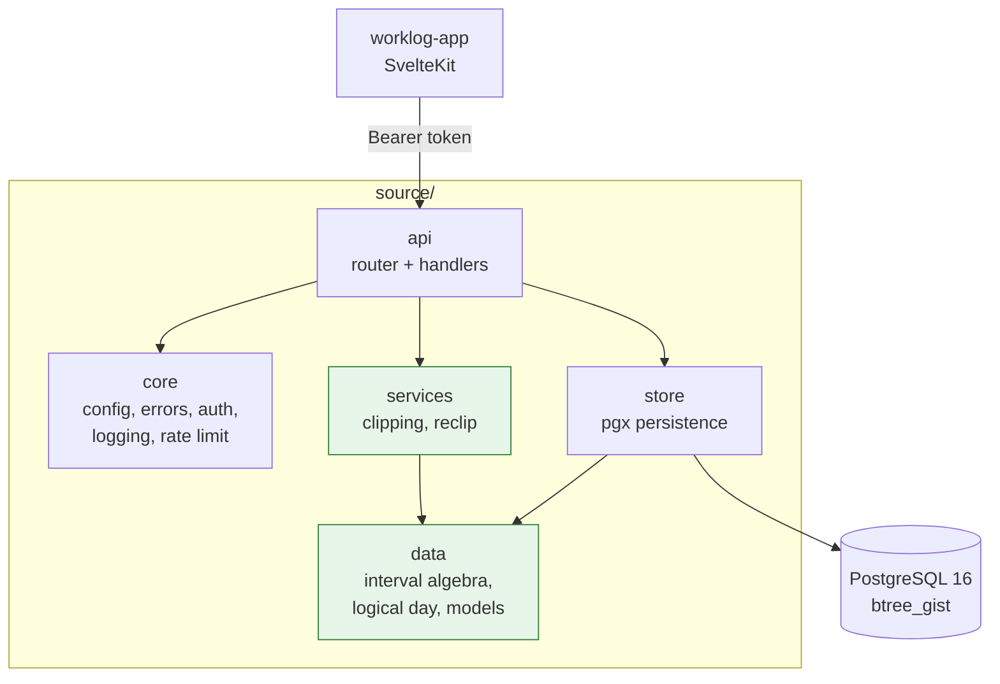
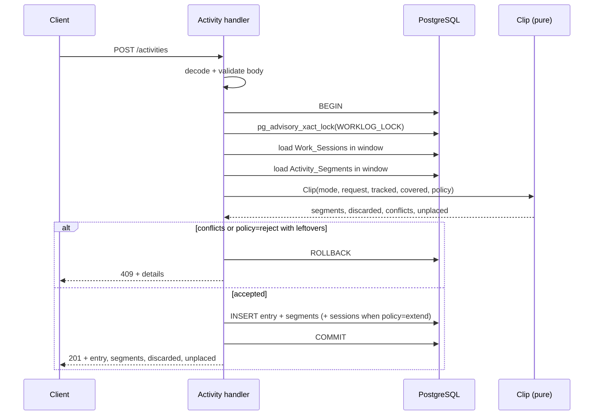
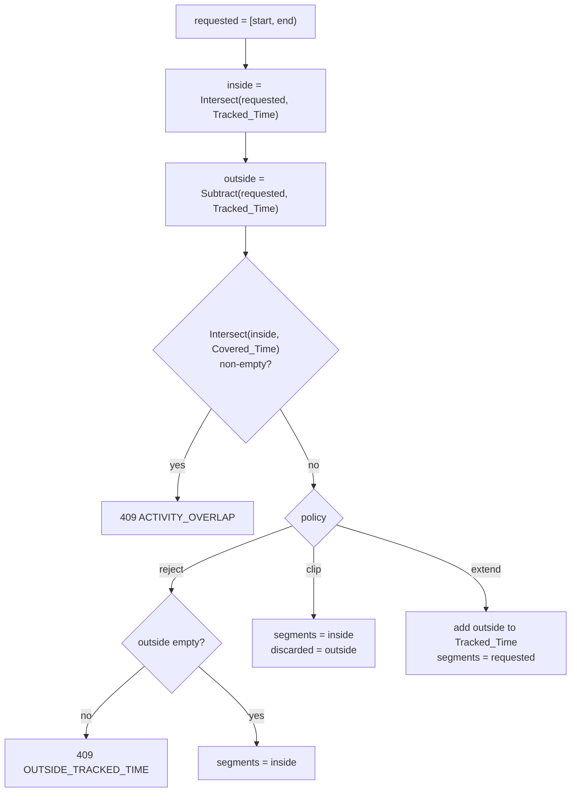
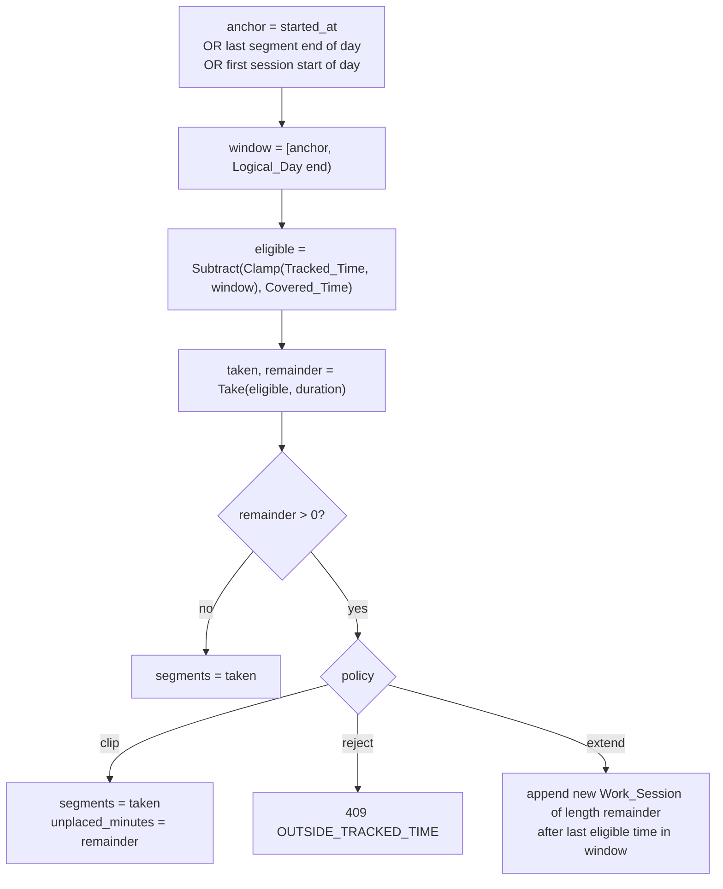
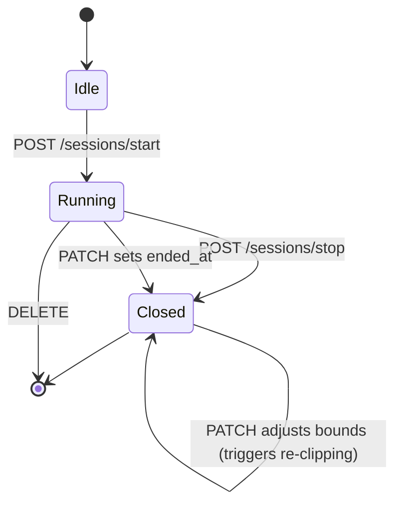

# Design Document: Worklog Server API

## Overview

`Worklog_Server` is a single-binary Go HTTP service backed by PostgreSQL. It stores two independent streams — the timer frame (`Work_Session`) and the activity log (`Activity_Entry`) — and reconciles the second against the first at write time through an operation called `Clipping`.

The central design idea is that `Clipping` is a **pure function over interval lists**. All the difficult behavior — splitting a three-hour entry around a fifteen-minute break, walking a bare duration forward through eligible time, deciding what falls outside the timer frame — reduces to `Normalize`, `Intersect`, `Subtract` and `Take` over `[]Interval`. The database layer supplies the input lists and persists the output; it contains no reconciliation logic of its own. This keeps the hard part testable without a database and makes it a natural fit for property-based tests.

The second design idea is that an `Activity_Entry` keeps **both** what the user asked for and what was actually stored. The requested interval or duration is written to the entry unchanged; the reconciled result lives in its `Activity_Segment` rows. A later audit can therefore show "you told me 13:00–16:00, and here are the two stretches that survived the break" rather than silently rewriting history.

**Key design decisions:**

- **Pure interval algebra**: the `data` package and `services/clipping.go` import neither `pgx` nor `net/http`. Every reconciliation rule is a total function on sorted, disjoint interval lists, and a guard test enforces the import restriction.
- **Database-enforced non-overlap**: PostgreSQL `EXCLUDE USING gist` constraints on `tstzrange` make overlapping `Work_Session` rows and overlapping `Activity_Segment` rows unrepresentable, independent of application code. A partial unique index enforces the single-`Open_Session` rule.
- **Serialized writes via advisory lock**: every mutating request runs inside one transaction that first takes `pg_advisory_xact_lock`. The service is single-user, so the cost is irrelevant and it removes every read-modify-write race from `Clipping`.
- **Entry keeps the original request**: `requested_started_at`, `requested_ended_at` and `requested_duration_minutes` are stored verbatim so the reconciliation stays auditable and re-runnable.
- **Re-clipping is a first-class operation**: editing or deleting a `Work_Session` re-runs `Clipping` for every affected `Activity_Entry` in deterministic order, so the two streams can never drift apart.



Dependencies point in one direction only: `data` imports nothing from the project, `store` and `services` import `data`, and `api` sits on top. The green packages hold the pure logic — no `pgx`, no `net/http`.

## Architecture

### Request Flow for a Mutating Endpoint

Every write follows the same shape. The handler parses and validates, opens one transaction, takes the advisory lock, loads the interval context, calls the pure `Clip` function, persists the result, and commits. Nothing is written outside the transaction, so a rejected request leaves no trace.



### The Clipping Algorithm

`Clipping` has two entry paths that share the same output shape.

**Explicit_Mode** — the requested interval is known, so the algorithm is set arithmetic:



**Duration_Mode** — the interval is unknown, so the algorithm walks forward consuming eligible time:



`Take` is what makes the user's example work. Given `eligible = [14:00–14:45, 15:00–17:00]` and `duration = 2h`, it consumes the first interval whole (45 min), then takes the first 1h15 of the second, returning `[14:00–14:45, 15:00–16:15]`. The break survives, and the segments still total exactly two hours.

### Re-clipping After a Timer Change

When a `Work_Session` is patched or deleted, `Tracked_Time` changes and existing segments may no longer be valid. The service recomputes them:

1. Compute `affected = Union(old session interval, new session interval)`.
2. Select every `Activity_Entry` owning an `Activity_Segment` overlapping `affected`.
3. Order those entries by `requested_started_at` ascending, then by `created_at` ascending — a total order, so the result is deterministic.
4. Delete all segments of those entries.
5. Re-run `Clip` for each in order with policy `clip`, treating already re-clipped entries as part of `Covered_Time`.

Policy `extend` is never used here: the service is reacting to a change the user made to the frame, so it must not silently grow the frame back.

Step 4 deletes before step 5 re-inserts, which is why `activity_segments_no_overlap` is declared `DEFERRABLE INITIALLY DEFERRED` — the intermediate state inside the transaction may violate it, the committed state may not.

## Project Structure

Source files are grouped into Go packages by responsibility rather than kept flat, so no directory approaches the eight-file threshold. Each directory under `source/` is one Go package named after the directory.

```
worklog/
├── .kiro/specs/001-worklog-server-api/   # this spec
├── worklog-app/                          # SvelteKit client, specified separately
└── worklog-server/
    ├── cmd/
    │   └── main.go                       # package main — parses config, calls api.Run
    ├── source/
    │   ├── core/                         # package core — cross-cutting infrastructure
    │   │   ├── config.go                 # env parsing, validation, fail-fast startup
    │   │   ├── logger.go                 # slog JSON handler, redaction helpers
    │   │   ├── errors.go                 # APIError type, error codes, JSON writer
    │   │   ├── request_id.go             # X-Request-Id propagation and generation
    │   │   ├── middleware.go             # recovery, logging, body limit, CORS
    │   │   ├── auth.go                   # constant-time bearer token middleware
    │   │   └── ratelimit.go              # per-IP token bucket
    │   ├── data/                         # package data — PURE domain types and algebra
    │   │   ├── interval.go               # Normalize, Intersect, Subtract, Take, Gaps
    │   │   ├── logicalday.go             # DayResolver — Logical_Day boundaries
    │   │   └── models.go                 # WorkSession, Project, ActivityEntry, ...
    │   ├── store/                        # package store — PostgreSQL persistence
    │   │   ├── db.go                     # pgxpool setup, advisory lock, tx helper
    │   │   ├── session_store.go          # Work_Session persistence
    │   │   ├── project_store.go          # Project persistence
    │   │   └── activity_store.go         # Activity_Entry + Activity_Segment persistence
    │   ├── services/                     # package services — reconciliation
    │   │   ├── clipping.go               # PURE: Clip(ClipInput) ClipResult
    │   │   └── reclip.go                 # re-clipping orchestration after timer changes
    │   └── api/                          # package api — HTTP transport
    │       ├── server.go                 # Run, graceful shutdown
    │       ├── router.go                 # net/http pattern routes, middleware chain
    │       ├── sessions.go               # /sessions/*
    │       ├── projects.go               # /projects/*
    │       ├── activities.go             # /activities/*
    │       ├── days.go                   # /days, /days/{date}
    │       ├── coverage.go               # /coverage
    │       └── health.go                 # /health
    ├── migrations/
    │   └── 001_init.sql
    ├── scripts/
    │   ├── build.sh
    │   ├── start-docker.sh
    │   ├── stop-docker.sh
    │   ├── deploy.sh
    │   └── migrate.sh
    ├── tests/                            # mirrors source/ — one directory per package
    │   ├── core/
    │   ├── data/
    │   ├── store/
    │   ├── services/
    │   └── api/
    ├── .env.example
    ├── .dockerignore
    ├── Dockerfile
    ├── fly.toml
    ├── go.mod
    └── README.md
```

### Package Dependency Rules

| Package | May import | Must never import |
|---|---|---|
| `data` | stdlib only | any project package, `pgx`, `net/http` |
| `store` | `data`, `core`, `pgx` | `api`, `services` |
| `services` | `data`, `core` | `api`, `pgx`, `net/http` |
| `core` | stdlib, `net/http` | `data`, `store`, `services`, `api` |
| `api` | all of the above | — |

`services/reclip.go` needs to read and write through the stores but must not import `store`, so it receives the store operations it needs as a small interface declared in `services`. This keeps the dependency graph acyclic and lets `reclip` be tested with an in-memory fake.

The module path is `worklog-server`, so packages import as `worklog-server/source/data`, `worklog-server/source/store` and so on.

File names inside a package do not repeat the package name: the HTTP handlers for sessions live in `api/sessions.go`, not `api/session_handlers.go`. The directory already states the layer, so the suffix would only stutter at every path.

## Technology Choices

| Concern | Choice | Rationale |
|---|---|---|
| HTTP routing | stdlib `net/http` with Go 1.22 method patterns | `mux.Handle("POST /sessions/start", …)` covers every route here; no framework dependency |
| Database driver | `github.com/jackc/pgx/v5` + `pgxpool` | native `tstzrange` and `timestamptz` handling, no `database/sql` conversion layer |
| Non-overlap enforcement | `btree_gist` + `EXCLUDE USING gist` | makes the core invariant a schema property rather than an application convention |
| Migrations | plain SQL in `migrations/`, applied by `scripts/migrate.sh` | matches the workspace convention; the script tracks applied files in `schema_migrations` and is idempotent |
| Config | `github.com/joho/godotenv` + `os.Getenv` | same pattern as the other Go service in the workspace |
| Identifiers | `github.com/google/uuid`, UUIDv7 | time-ordered primary keys keep index locality without exposing a sequence |
| Logging | stdlib `log/slog` with a JSON handler | structured logging without a dependency |
| Property tests | `pgregory.net/rapid` | already the workspace's property-testing library |

## Components and Interfaces

### 1. Interval Algebra (`source/data/interval.go`)

The foundation. Every function takes and returns **normalized** lists: sorted by start, pairwise disjoint, non-touching. Intervals are half-open `[Start, End)`, which is why two sessions may touch at 12:00 without overlapping. The whole `data` package imports only the standard library.

```go
// Interval is a half-open time range [Start, End).
type Interval struct {
    Start time.Time `json:"start"`
    End   time.Time `json:"end"`
}

func (i Interval) Duration() time.Duration
func (i Interval) IsEmpty() bool          // End is not after Start
func (i Interval) Overlaps(o Interval) bool

// Normalize sorts, drops empty intervals, and merges overlapping or touching ones.
// The result is sorted, pairwise disjoint and non-touching. Idempotent.
func Normalize(in []Interval) []Interval

// Union normalizes the concatenation of a and b.
func Union(a, b []Interval) []Interval

// Intersect returns the parts of a that also lie in b. Inputs need not be normalized;
// the result always is.
func Intersect(a, b []Interval) []Interval

// Subtract returns the parts of a that do not lie in b.
func Subtract(a, b []Interval) []Interval

// Clamp restricts in to the given window.
func Clamp(in []Interval, window Interval) []Interval

// Total sums the durations of a normalized list.
func Total(in []Interval) time.Duration

// Take walks in forward and consumes exactly d of time, splitting the interval in
// which d runs out. It returns the consumed prefix and how much of d could not be
// consumed because in was exhausted. Take(in, 0) returns (nil, 0).
func Take(in []Interval, d time.Duration) (taken []Interval, remainder time.Duration)

// Gaps returns the complement of in within window.
func Gaps(in []Interval, window Interval) []Interval
```

### 2. Logical Day Resolution (`source/data/logicalday.go`)

Converts between calendar dates and the `Logical_Day` windows they denote. Pure apart from the loaded `*time.Location`.

```go
type DayResolver struct {
    loc       *time.Location
    startHour int
}

// NewDayResolver fails when tz does not name a loadable zone or startHour is
// outside 0..23.
func NewDayResolver(tz string, startHour int) (*DayResolver, error)

// Bounds returns the window of the Logical_Day named by a "YYYY-MM-DD" string.
// The window runs from startHour on that date to startHour on the next date.
func (r *DayResolver) Bounds(date string) (Interval, error)

// DateOf returns the "YYYY-MM-DD" name of the Logical_Day containing t.
// An instant before startHour belongs to the previous calendar date.
func (r *DayResolver) DateOf(t time.Time) string

// Range returns one window per Logical_Day from the date of from to the date of to.
func (r *DayResolver) Range(from, to time.Time) []Interval
```

### 3. Clipping (`source/services/clipping.go`)

The reconciliation core. Pure: it receives every list it needs and returns a description of what should be written. It never decides HTTP status codes — it reports conflicts and leftovers, and the handler maps them. `ActivityMode` lives in `data` because it is a stored field; `UncoveredPolicy` lives here because it is a write-time instruction that is never persisted.

```go
type UncoveredPolicy string

const (
    PolicyClip   UncoveredPolicy = "clip"   // default
    PolicyExtend UncoveredPolicy = "extend"
    PolicyReject UncoveredPolicy = "reject"
)

type ClipInput struct {
    Mode      data.ActivityMode
    Requested data.Interval   // Explicit_Mode only
    Duration  time.Duration   // Duration_Mode only
    Anchor    time.Time       // Duration_Mode only: resolved placement start
    DayBounds data.Interval   // Duration_Mode only: forward search is bounded by this
    Tracked   []data.Interval // normalized Work_Session intervals
    Covered   []data.Interval // normalized Activity_Segment intervals of OTHER entries
    Policy    UncoveredPolicy
}

type ClipResult struct {
    Segments  []data.Interval // what to persist as Activity_Segment rows
    Discarded []data.Interval // policy=clip: parts of the request dropped as untracked
    Extend    []data.Interval // policy=extend: intervals to add to Tracked_Time
    Conflicts []data.Interval // Explicit_Mode: overlaps with Covered, non-empty means reject
    Unplaced  time.Duration   // Duration_Mode: duration that found no eligible time
}

// Clip is total: it never panics and never returns an error for well-formed input.
// Callers inspect Conflicts and Unplaced to decide whether to accept the result.
func Clip(in ClipInput) ClipResult

// ResolveAnchor picks the Duration_Mode placement start per Requirements 5.2-5.5.
// It returns ErrNoPlacementAnchor when the day holds neither segments nor sessions.
func ResolveAnchor(explicit *time.Time, segments, sessions []data.Interval) (time.Time, error)
```

### 4. Data Models (`source/data/models.go`)

```go
type ActivityMode string

const (
    ModeExplicit ActivityMode = "explicit"
    ModeDuration ActivityMode = "duration"
)

type WorkSession struct {
    ID        uuid.UUID  `json:"id"`
    StartedAt time.Time  `json:"started_at"`
    EndedAt   *time.Time `json:"ended_at"` // nil while the timer runs
    CreatedAt time.Time  `json:"created_at"`
    UpdatedAt time.Time  `json:"updated_at"`
}

type Project struct {
    ID         uuid.UUID  `json:"id"`
    Name       string     `json:"name"`
    ArchivedAt *time.Time `json:"archived_at"`
    CreatedAt  time.Time  `json:"created_at"`
}

type ActivityEntry struct {
    ID          uuid.UUID    `json:"id"`
    ProjectID   uuid.UUID    `json:"project_id"`
    ProjectName string       `json:"project_name"` // joined, read-only
    Description string       `json:"description"`
    Mode        ActivityMode `json:"mode"`

    // The original request, stored verbatim and never rewritten by Clipping.
    RequestedStartedAt      *time.Time `json:"requested_started_at"`
    RequestedEndedAt        *time.Time `json:"requested_ended_at"`
    RequestedDurationMinutes *int      `json:"requested_duration_minutes"`

    CreatedAt time.Time         `json:"created_at"`
    UpdatedAt time.Time         `json:"updated_at"`
    Segments  []ActivitySegment `json:"segments"`
}

type ActivitySegment struct {
    ID        uuid.UUID `json:"id"`
    EntryID   uuid.UUID `json:"entry_id"`
    StartedAt time.Time `json:"started_at"`
    EndedAt   time.Time `json:"ended_at"`
}
```

### 5. Session Store and Handlers (`source/store/session_store.go`, `source/api/sessions.go`)

```go
type SessionStore struct{ pool *pgxpool.Pool }

func (s *SessionStore) Open(ctx context.Context, tx pgx.Tx, startedAt time.Time) (*data.WorkSession, error)
func (s *SessionStore) CloseOpen(ctx context.Context, tx pgx.Tx, endedAt time.Time) (*data.WorkSession, error)
func (s *SessionStore) CurrentOpen(ctx context.Context, tx pgx.Tx) (*data.WorkSession, error) // nil, nil when none
func (s *SessionStore) ListOverlapping(ctx context.Context, tx pgx.Tx, w data.Interval) ([]data.WorkSession, error)
func (s *SessionStore) Get(ctx context.Context, tx pgx.Tx, id uuid.UUID) (*data.WorkSession, error)
func (s *SessionStore) Update(ctx context.Context, tx pgx.Tx, id uuid.UUID, startedAt, endedAt *time.Time) (*data.WorkSession, error)
func (s *SessionStore) Delete(ctx context.Context, tx pgx.Tx, id uuid.UUID) error
func (s *SessionStore) InsertMany(ctx context.Context, tx pgx.Tx, in []data.Interval) ([]data.WorkSession, error)

// TrackedIntervals returns the normalized Tracked_Time of a window. An Open_Session
// is treated as running until now.
func (s *SessionStore) TrackedIntervals(ctx context.Context, tx pgx.Tx, w data.Interval, now time.Time) ([]data.Interval, error)
```

Handlers registered by `source/api/router.go`:

| Method | Path | Handler | Requirements |
|---|---|---|---|
| POST | `/sessions/start` | `HandleSessionStart` | 1.1–1.3, 1.8 |
| POST | `/sessions/stop` | `HandleSessionStop` | 1.4–1.6 |
| GET | `/sessions/current` | `HandleSessionCurrent` | 1.7 |
| GET | `/sessions` | `HandleSessionList` | 2.1, 2.2 |
| PATCH | `/sessions/{id}` | `HandleSessionPatch` | 2.3–2.5, 2.7 |
| DELETE | `/sessions/{id}` | `HandleSessionDelete` | 2.6, 2.7 |

### 6. Activity Store and Handlers (`source/store/activity_store.go`, `source/api/activities.go`)

```go
type ActivityStore struct{ pool *pgxpool.Pool }

func (s *ActivityStore) Create(ctx context.Context, tx pgx.Tx, e *data.ActivityEntry, segs []data.Interval) (*data.ActivityEntry, error)
func (s *ActivityStore) Get(ctx context.Context, tx pgx.Tx, id uuid.UUID) (*data.ActivityEntry, error)
func (s *ActivityStore) ListOverlapping(ctx context.Context, tx pgx.Tx, w data.Interval, projectID *uuid.UUID) ([]data.ActivityEntry, error)
func (s *ActivityStore) UpdateMeta(ctx context.Context, tx pgx.Tx, id uuid.UUID, description *string, projectID *uuid.UUID) (*data.ActivityEntry, error)
func (s *ActivityStore) ReplaceSegments(ctx context.Context, tx pgx.Tx, entryID uuid.UUID, segs []data.Interval) error
func (s *ActivityStore) Delete(ctx context.Context, tx pgx.Tx, id uuid.UUID) error

// CoveredIntervals returns normalized Covered_Time of a window, optionally excluding
// one entry's own segments (used when re-clipping that entry).
func (s *ActivityStore) CoveredIntervals(ctx context.Context, tx pgx.Tx, w data.Interval, exclude *uuid.UUID) ([]data.Interval, error)

// EntriesOverlapping returns the entries whose segments intersect w, ordered by
// requested_started_at then created_at — the deterministic re-clipping order.
func (s *ActivityStore) EntriesOverlapping(ctx context.Context, tx pgx.Tx, w data.Interval) ([]data.ActivityEntry, error)
```

Request and response bodies:

```go
type CreateActivityRequest struct {
    ProjectID       uuid.UUID  `json:"project_id"`
    Description     string     `json:"description"`
    StartedAt       *time.Time `json:"started_at"`
    EndedAt         *time.Time `json:"ended_at"`
    DurationMinutes *int       `json:"duration_minutes"`
    Policy          *string    `json:"uncovered_policy"` // clip | extend | reject, default clip
}

type ActivityResponse struct {
    Entry            data.ActivityEntry `json:"entry"`
    Discarded        []data.Interval    `json:"discarded"`         // policy=clip
    ExtendedSessions []data.WorkSession `json:"extended_sessions"` // policy=extend
    UnplacedMinutes  int                `json:"unplaced_minutes"`  // Duration_Mode
}
```

Mode selection follows Requirement 4.3: `ended_at` present and `duration_minutes` absent means `Explicit_Mode`; `duration_minutes` present and `ended_at` absent means `Duration_Mode`; both present is `AMBIGUOUS_MODE`; neither present is `VALIDATION_ERROR`.

| Method | Path | Handler | Requirements |
|---|---|---|---|
| POST | `/activities` | `HandleActivityCreate` | 4.1–4.8, 5.1–5.9, 6.1–6.9 |
| GET | `/activities` | `HandleActivityList` | 7.1–7.3 |
| GET | `/activities/{id}` | `HandleActivityGet` | 7.4 |
| PATCH | `/activities/{id}` | `HandleActivityPatch` | 7.5–7.7 |
| DELETE | `/activities/{id}` | `HandleActivityDelete` | 7.8 |

### 7. Re-clipping Orchestration (`source/services/reclip.go`)

`services` must not import `store`, so the operations `reclip` needs are declared here as a narrow interface that `store` satisfies structurally. This keeps the dependency graph acyclic and lets the orchestration be tested against an in-memory fake with no database.

```go
// ReclipPorts is the slice of persistence that re-clipping needs. Both store
// types satisfy it; tests supply a fake.
type ReclipPorts interface {
    TrackedIntervals(ctx context.Context, w data.Interval, now time.Time) ([]data.Interval, error)
    EntriesOverlapping(ctx context.Context, w data.Interval) ([]data.ActivityEntry, error)
    CoveredIntervals(ctx context.Context, w data.Interval, exclude *uuid.UUID) ([]data.Interval, error)
    ReplaceSegments(ctx context.Context, entryID uuid.UUID, segs []data.Interval) error
}

// ReclipAffected re-runs Clipping for every Activity_Entry whose segments intersect
// affected, in deterministic order, with policy clip. It is called after a
// Work_Session is created, patched or deleted. The caller must already hold the
// advisory lock and an open transaction; ports are bound to that transaction.
func ReclipAffected(
    ctx context.Context,
    ports ReclipPorts,
    days *data.DayResolver,
    affected data.Interval,
    now time.Time,
) (reclipped int, err error)
```

### 8. Day and Coverage Handlers (`source/api/days.go`, `source/api/coverage.go`)

```go
type CoverageResponse struct {
    From      time.Time       `json:"from"`
    To        time.Time       `json:"to"`
    Tracked   []data.Interval `json:"tracked"`
    Covered   []data.Interval `json:"covered"`
    Uncovered []data.Interval `json:"uncovered"` // tracked but no activity described
    Untracked []data.Interval `json:"untracked"` // breaks — timer was not running
}

type DayResponse struct {
    Date     string               `json:"date"`
    Bounds   data.Interval        `json:"bounds"`
    Sessions []data.WorkSession   `json:"sessions"`
    Entries  []data.ActivityEntry `json:"entries"`
    Coverage CoverageResponse     `json:"coverage"`
    Totals   DayTotals            `json:"totals"`
}

type DayTotals struct {
    TrackedSeconds   int              `json:"tracked_seconds"`
    CoveredSeconds   int              `json:"covered_seconds"`
    UncoveredSeconds int              `json:"uncovered_seconds"`
    ByProject        []ProjectTotal   `json:"by_project"`
}

type ProjectTotal struct {
    ProjectID      uuid.UUID `json:"project_id"`
    ProjectName    string    `json:"project_name"`
    CoveredSeconds int       `json:"covered_seconds"`
}
```

`Uncovered` is computed as `data.Subtract(Tracked, Covered)` and `Untracked` as `data.Gaps(Tracked, window)`, which is what makes Requirement 9.3 hold by construction.

### 9. Configuration (`source/core/config.go`)

```go
type Config struct {
    Port                string        // PORT, default 8080
    DatabaseURL         string        // DATABASE_URL, required
    APIToken            string        // WORKLOG_API_TOKEN, required, min 32 chars
    Timezone            string        // TIMEZONE, default Europe/Prague
    DayStartHour        int           // DAY_START_HOUR, default 3
    CORSOrigins         []string      // CORS_ORIGINS, comma-separated
    AppEnv              string        // APP_ENV, default production
    DBQueryTimeout      time.Duration // DB_QUERY_TIMEOUT_SECONDS, default 5
    RateLimitPerMinute  int           // RATE_LIMIT_PER_MINUTE, default 120
    ShutdownTimeout     time.Duration // SHUTDOWN_TIMEOUT_SECONDS, default 30
    Version             string        // build-time ldflag, default "dev"
}

// Load reads the environment, applies defaults, and validates. It returns an error
// listing every problem rather than the first one, so a misconfigured deployment
// surfaces all issues in one startup log line.
func Load() (*Config, error)
```

### 10. Error Type (`source/core/errors.go`)

```go
type APIError struct {
    Status  int            `json:"-"`
    Code    string         `json:"error"`
    Message string         `json:"message"`
    Details map[string]any `json:"details,omitempty"`
}

func (e *APIError) Error() string
func WriteError(w http.ResponseWriter, r *http.Request, err error)

func ErrValidation(msg string, details map[string]any) *APIError
func ErrNotFound(resource string) *APIError
func ErrConflict(code, msg string, details map[string]any) *APIError
```

`WriteError` maps an unknown non-`APIError` to `500 INTERNAL_ERROR` with a fixed message and logs the real cause at `error` level with the `requestId`, satisfying Requirement 12.2.

## Data Models

### Schema (`migrations/001_init.sql`)

```sql
CREATE EXTENSION IF NOT EXISTS btree_gist;

CREATE TABLE projects (
    id          uuid PRIMARY KEY,
    name        text NOT NULL,
    archived_at timestamptz,
    created_at  timestamptz NOT NULL DEFAULT now(),
    CONSTRAINT projects_name_length CHECK (char_length(name) BETWEEN 1 AND 200)
);

-- Case- and whitespace-insensitive uniqueness (Requirement 3.2).
CREATE UNIQUE INDEX projects_name_unique ON projects (lower(btrim(name)));

CREATE TABLE work_sessions (
    id         uuid PRIMARY KEY,
    started_at timestamptz NOT NULL,
    ended_at   timestamptz,
    created_at timestamptz NOT NULL DEFAULT now(),
    updated_at timestamptz NOT NULL DEFAULT now(),
    CONSTRAINT work_sessions_interval_valid
        CHECK (ended_at IS NULL OR started_at < ended_at),
    CONSTRAINT work_sessions_no_overlap EXCLUDE USING gist (
        tstzrange(started_at, ended_at) WITH &&
    ) WHERE (ended_at IS NOT NULL)
);

-- At most one Open_Session (Requirement 1.8).
CREATE UNIQUE INDEX work_sessions_one_open
    ON work_sessions ((true)) WHERE ended_at IS NULL;

CREATE INDEX work_sessions_started_at ON work_sessions (started_at);

CREATE TABLE activity_entries (
    id                        uuid PRIMARY KEY,
    project_id                uuid NOT NULL REFERENCES projects (id) ON DELETE RESTRICT,
    description               text NOT NULL DEFAULT '',
    mode                      text NOT NULL,
    requested_started_at      timestamptz,
    requested_ended_at        timestamptz,
    requested_duration_minutes integer,
    created_at                timestamptz NOT NULL DEFAULT now(),
    updated_at                timestamptz NOT NULL DEFAULT now(),
    CONSTRAINT activity_entries_mode_valid CHECK (mode IN ('explicit', 'duration')),
    CONSTRAINT activity_entries_description_length CHECK (char_length(description) <= 2000),
    CONSTRAINT activity_entries_mode_fields CHECK (
        (mode = 'explicit'
            AND requested_started_at IS NOT NULL
            AND requested_ended_at IS NOT NULL
            AND requested_started_at < requested_ended_at)
     OR (mode = 'duration'
            AND requested_duration_minutes IS NOT NULL
            AND requested_duration_minutes > 0)
    )
);

CREATE INDEX activity_entries_project_id ON activity_entries (project_id);
CREATE INDEX activity_entries_order ON activity_entries (requested_started_at, created_at);

CREATE TABLE activity_segments (
    id         uuid PRIMARY KEY,
    entry_id   uuid NOT NULL REFERENCES activity_entries (id) ON DELETE CASCADE,
    started_at timestamptz NOT NULL,
    ended_at   timestamptz NOT NULL,
    CONSTRAINT activity_segments_interval_valid CHECK (started_at < ended_at),
    -- No two activities may claim the same instant (Requirements 4.5, 6.4).
    -- Deferred so that re-clipping can delete and reinsert within one transaction.
    CONSTRAINT activity_segments_no_overlap EXCLUDE USING gist (
        tstzrange(started_at, ended_at) WITH &&
    ) DEFERRABLE INITIALLY DEFERRED
);

CREATE INDEX activity_segments_entry_id ON activity_segments (entry_id);
CREATE INDEX activity_segments_range
    ON activity_segments USING gist (tstzrange(started_at, ended_at));

CREATE TABLE schema_migrations (
    filename   text PRIMARY KEY,
    applied_at timestamptz NOT NULL DEFAULT now()
);
```

The constraint behavior above was verified against `postgres:16-alpine` before being written down: two open sessions are rejected by the partial unique index, overlapping closed sessions and overlapping segments are rejected by the exclusion constraints, touching intervals are accepted because `tstzrange` is half-open, and a delete-then-reinsert reshuffle inside one transaction succeeds thanks to the deferred constraint.

### Work Session State Machine



`pause` is not a distinct state. Pausing is stopping: the client sends `/sessions/stop`, and resuming sends `/sessions/start`, producing two sessions with a gap between them. That gap is exactly the break the reconciliation later preserves.

### Advisory Lock

Every mutating transaction begins with `SELECT pg_advisory_xact_lock(4919372001)`. The constant is arbitrary but fixed, defined once in `source/store/db.go` as `WorklogAdvisoryLock`. The lock is released automatically at commit or rollback.

## Correctness Properties

### Property 1: Segments never cover untracked time

*For any* set of `Work_Session` intervals and any `Activity_Entry` request clipped with policy `clip` or `reject`, every produced `Activity_Segment` SHALL lie entirely within `Tracked_Time`.

**Validates: Requirements 6.1, 6.2**

### Property 2: Duration mode preserves the requested duration

*For any* positive duration `d` and any `Tracked_Time` containing at least `d` of eligible time after the anchor and within the `Logical_Day`, the total duration of the produced `Activity_Segment` records SHALL equal `d` exactly, and `Unplaced` SHALL be zero.

**Validates: Requirements 5.6, 5.7**

### Property 3: Breaks survive inside an entry

*For any* requested interval and any `Tracked_Time`, the gaps between consecutive `Activity_Segment` records of the produced entry SHALL contain no `Tracked_Time` that was eligible at write time.

**Validates: Requirements 6.3, 6.4**

### Property 4: Interval algebra is conservative

*For any* two interval lists `a` and `b`, `Total(Intersect(a,b)) + Total(Subtract(a,b))` SHALL equal `Total(Normalize(a))`.

**Validates: Requirements 9.3**

### Property 5: Normalization is idempotent and canonical

*For any* interval list `x`, `Normalize(Normalize(x))` SHALL equal `Normalize(x)`, and the result SHALL be sorted by start, pairwise disjoint and non-touching.

**Validates: Requirements 9.2**

### Property 6: Take is exact and order-preserving

*For any* normalized list `in` and non-negative duration `d`, `Total(taken) + remainder` SHALL equal `d`, `Total(taken)` SHALL equal `min(Total(in), d)`, and `taken` SHALL be a time-ordered prefix of `in` — every instant in `taken` lies in `in`, and no instant of `in` before the end of `taken` is omitted.

**Validates: Requirements 5.6, 5.7**

### Property 7: Coverage partitions tracked time

*For any* range, the `Covered_Time` and `Uncovered_Time` lists returned by `/coverage` SHALL be pairwise disjoint and their union SHALL equal the returned `Tracked_Time` exactly.

**Validates: Requirements 9.3**

### Property 8: Activity segments never overlap globally

*For any* sequence of accepted write operations against the service, no two `Activity_Segment` rows in the database SHALL overlap.

**Validates: Requirements 4.5, 6.4**

### Property 9: Re-clipping is deterministic and idempotent

*For any* database state, applying `ReclipAffected` twice over the same interval SHALL produce the same `Activity_Segment` rows as applying it once.

**Validates: Requirements 2.7, 2.8**

### Property 10: Rejected writes leave no trace

*For any* request rejected with HTTP 4xx, the contents of `work_sessions`, `activity_entries` and `activity_segments` SHALL be identical to their contents before the request.

**Validates: Requirements 6.9**

### Property 11: The original request is preserved

*For any* accepted `Activity_Entry`, the stored `requested_started_at`, `requested_ended_at` and `requested_duration_minutes` SHALL equal the submitted values, regardless of how `Clipping` altered the stored segments.

**Validates: Requirements 4.2**

### Property 12: Logical day assignment is a partition

*For any* instant `t`, `DateOf(t)` SHALL name exactly one `Logical_Day`, and `t` SHALL lie inside `Bounds(DateOf(t))`.

**Validates: Requirements 10.5, 10.6**

## Error Handling

All error responses use the shape from Requirement 12.1: `{"error": CODE, "message": "...", "details": {...}}`.

| Code | HTTP | Trigger | Details payload |
|---|---|---|---|
| `VALIDATION_ERROR` | 400 | malformed body, unknown field, bad query parameter, missing required field, timestamp without offset, unknown `project_id` | `fields` map of field name to reason |
| `INVALID_INTERVAL` | 400 | start not strictly before end; `from` not before `to` | `start`, `end` |
| `AMBIGUOUS_MODE` | 400 | both `ended_at` and `duration_minutes` supplied | — |
| `RANGE_TOO_LARGE` | 400 | `/days` range exceeds 366 days | `max_days` |
| `UNAUTHORIZED` | 401 | missing, malformed or wrong bearer token | — |
| `NOT_FOUND` | 404 | path identifier matches no record | `resource` |
| `SESSION_ALREADY_RUNNING` | 409 | `/sessions/start` while an `Open_Session` exists | `session_id` |
| `NO_SESSION_RUNNING` | 409 | `/sessions/stop` with no `Open_Session` | — |
| `SESSION_OVERLAP` | 409 | a session write would overlap another session | `conflicts` array of `{session_id, interval}` |
| `ACTIVITY_OVERLAP` | 409 | an `Explicit_Mode` request overlaps another entry's segments | `conflicts` array of `{entry_id, interval}` |
| `OUTSIDE_TRACKED_TIME` | 409 | policy `reject` and part of the request is untracked | `outside` array of intervals |
| `NO_PLACEMENT_ANCHOR` | 409 | `Duration_Mode` without `started_at` in an empty day | `date` |
| `PROJECT_EXISTS` | 409 | duplicate project name | `project_id` |
| `PROJECT_IN_USE` | 409 | deleting a project referenced by an entry | `entry_count` |
| `PAYLOAD_TOO_LARGE` | 413 | request body over 1 MiB | `max_bytes` |
| `RATE_LIMITED` | 429 | more than `RATE_LIMIT_PER_MINUTE` requests from one address | `retry_after_seconds` |
| `INTERNAL_ERROR` | 500 | any unhandled failure | — |

Database constraint violations are translated rather than surfaced: a `23P01` exclusion violation on `work_sessions` becomes `SESSION_OVERLAP`, on `activity_segments` becomes `ACTIVITY_OVERLAP`, and a `23505` on `work_sessions_one_open` becomes `SESSION_ALREADY_RUNNING`. The application checks the same conditions before writing, so these translations are a safety net for races, not the primary path.

## Testing Strategy

Tests live under `worklog-server/tests/`, mirroring the package layout of `source/` one directory per package, as required by `infra-project-structure.md`.

**Unit tests** (Go `testing`) — `tests/data/interval_test.go`, `tests/data/logicalday_test.go`, `tests/services/clipping_test.go`, `tests/core/config_test.go`, `tests/core/errors_test.go`. These need no database. `clipping_test.go` carries the worked example from the requirements as a named case: `Tracked_Time = [08:00–14:48, 15:12–18:00]`, request `13:00–16:00` explicit, expected segments `[13:00–14:48, 15:12–16:00]`; and the duration case anchored at 14:00 with `duration = 2h` over the same frame, expected `[14:00–14:48, 15:12–16:24]`.

**Property tests** (`pgregory.net/rapid`) — `tests/data/interval_property_test.go`, `tests/data/logicalday_property_test.go`, `tests/services/clipping_property_test.go`. Generators produce random sorted interval sets and random requests. Each test is tagged in a comment with `Feature: worklog-server-api, Property N: <title>` matching the Correctness Properties above. Properties 1–7, 11 and 12 are verified here without a database.

**Architecture test** — `tests/core/imports_test.go` walks the package import graph and fails when a package imports something the Package Dependency Rules table forbids, so the purity of `data` and `services` cannot rot silently.

**Integration tests** (Go `testing` against a real PostgreSQL) — `tests/store/session_store_test.go`, `tests/store/activity_store_test.go`, `tests/store/schema_test.go`, `tests/services/reclip_test.go`. These verify the constraint behavior that cannot be tested in pure code: the single-`Open_Session` index, both exclusion constraints, the deferred reshuffle, and Properties 8, 9 and 10. The database is started with plain `docker run` on the sandbox's own network and reached by container name — never through a published port and never with Docker Compose.

**HTTP tests** (`net/http/httptest`) — `tests/api/sessions_test.go`, `tests/api/projects_test.go`, `tests/api/activities_test.go`, `tests/api/days_test.go`, `tests/api/coverage_test.go`, `tests/api/health_test.go`, `tests/core/auth_test.go`, `tests/core/ratelimit_test.go`. These verify status codes, the error envelope, mode selection, `Uncovered_Policy` behavior and that `/health` is reachable without a token.
