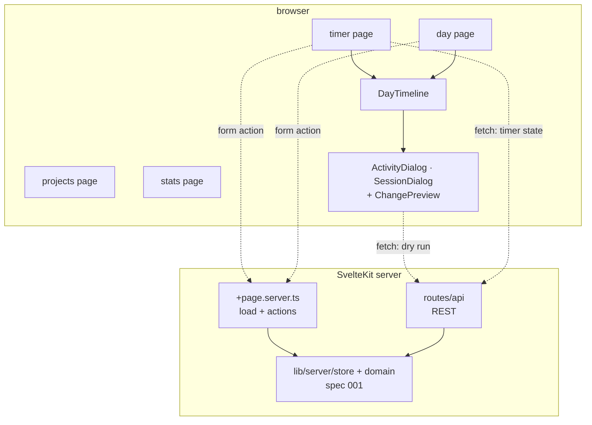
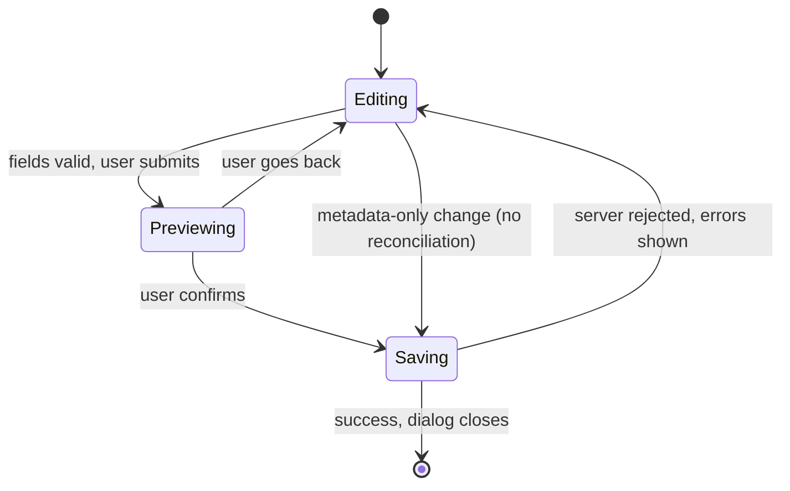

# Design Document: Worklog UI

## Overview

The `Worklog_UI` is the browser half of the Worklog SvelteKit application. It reads through load functions, writes through form actions, and reaches the REST routes from `001-worklog-domain-api` only where an interactive round trip is genuinely needed: the `Dry_Run` behind every `Change_Preview`, and the timer state refresh.

The interface is organized around one idea: **the day is a picture, not a list**. The `Day_Timeline` draws the timer frame and the logged activities against a single time axis, so a break inside a three-hour entry is visible rather than something the user has to infer from two rows in a table. Everything else in the day page hangs off that picture — clicking a bar edits it, clicking a gap fills it.

The second idea is that **nothing is written blind**. Because the server reconciles every write against the timer frame, a change can remove time the user did not intend to touch. Every such write goes through a `Dry_Run` first, and the result is shown as a `Change_Preview` the user has to confirm. The browser never recomputes the reconciliation itself — it would be a second implementation of the hardest logic in the project, and it would drift.

**Key design decisions:**

- **Load functions and form actions by default.** Reads happen in `+page.server.ts`; writes are form actions with `sveltekit-superforms` and Zod. This gives progressive enhancement and keeps validation in one place. `fetch` is reserved for the `Dry_Run` and the timer refresh.
- **One core, two entry points.** Form actions and the REST routes call the same store and domain modules and share the same Zod schemas, so the interface and an external script cannot diverge in behavior.
- **Server owns the timer.** The elapsed readout ticks locally, but the authoritative state comes from `GET /api/sessions/current` on load and on tab focus. Closing the browser does not stop the timer, and a reload never invents state.
- **`Change_Preview` is always server-computed.** It renders the `Dry_Run` response verbatim. The browser holds no clipping logic.
- **Eight-slot categorical palette, validated.** Project colors come from a fixed palette assigned by `color_index`, verified with the data-viz validator in both modes rather than picked by eye.



## Architecture

### Read and Write Paths

| Interaction | Path | Why |
|---|---|---|
| Loading a day, the projects list, statistics | `+page.server.ts` `load` | server-rendered, no client round trip, no loading flash on navigation |
| Start / stop timer | form action | works without JavaScript, one round trip, invalidates the page data |
| Create / edit / delete an activity or session | form action | superforms keeps field-level errors and the user's input on failure |
| `Change_Preview` | `fetch` to `/api/…` with `dryRun: true` | needs a result *before* submitting, so it cannot be a form action |
| Timer refresh on tab focus | `fetch` to `/api/sessions/current` | no navigation, no page data invalidation needed |
| Project creation from inside the `Project_Picker` | `fetch` to `/api/projects` | must not navigate away from the open dialog |
| `Quick_Log` | form action posting in `Open_Mode` | the server resolves the interval; the browser sends only the project |

### The Dialog Flow

Both write dialogs follow the same three states, which is what makes the preview feel consistent rather than bolted on.



The `Editing → Saving` shortcut exists because a change to only a description or a `Project` cannot move any segment, so a preview would be noise. Anything touching times or duration goes through `Previewing`.

### Day Timeline Geometry

The `Day_Timeline` maps time to a percentage along one axis. The visible range is not the whole `Logical_Day` — an empty 03:00–03:00 span would squeeze a working day into a third of the width. Instead:

1. Collect every record of the day plus `now` when the day is today.
2. Take the earliest start and the latest end, and round outward to whole hours.
3. Pad by one hour on each side, clamped to the `Logical_Day` bounds.
4. When the day holds no records at all, fall back to 08:00–18:00.

```
pct(t) = (t − visibleStart) / (visibleEnd − visibleStart) × 100
```

Bars are absolutely positioned by `left`/`width` when horizontal and `top`/`height` when vertical. The two lanes share one range object, so they always line up.

```
        08:00      10:00      12:00      14:00      16:00      18:00
        │          │          │          │          │          │
frame   ████████████████████████████████████│  │███████████████████
                                        14:48  15:12
activity ▓▓▓▓ API ▓▓▓▓│░ meeting ░│▒▒▒▒▒▒▒▒▒│  │▓▓▓ API ▓▓▓│//////
                                                              ↑ uncovered
```

Bars are rendered in chronological DOM order so keyboard tabbing follows the day. Each is a `<button>` carrying an `aria-label` with its times, project and description, so the picture is not the only way to read it.

## Project Structure

Files owned by this specification; everything else comes from `001-worklog-domain-api`.

```
worklog/
├── messages/
│   ├── cs.json                          # Czech — the primary language
│   └── en.json                          # English fallback
├── project.inlang/settings.json         # baseLocale en, locales [en, cs]
├── src/
│   ├── app.css                          # Tailwind 4 entry + @theme tokens
│   ├── app.html
│   ├── hooks.client.ts
│   ├── hooks.ts                         # reroute via deLocalizeUrl
│   ├── lib/
│   │   ├── core/i18n/                   # locale state, init, switch
│   │   │   ├── state.svelte.ts
│   │   │   └── index.ts
│   │   ├── theme/                       # theme.css, theme.ts, theme-store.ts
│   │   ├── ui/                          # Design_System, ported subset
│   │   │   ├── elements/                # Button, Badge, Icon, Input, Select,
│   │   │   │                            #   Checkbox, Spinner, Tooltip, flags/
│   │   │   ├── forms/                   # FormField, DatePicker, TimeInput, SearchInput
│   │   │   ├── layout/                  # Shell, Topbar, BottomNav, PageHeader, Section
│   │   │   ├── overlays/                # Modal, ConfirmDialog, Toast, ToastContainer,
│   │   │   │                            #   LoadingSkeleton, toast-store.svelte.ts
│   │   │   └── components/              # StatCard, Chart, EmptyState, DataTable
│   │   └── viz/
│   │       ├── palette.ts               # the eight validated categorical slots
│   │       └── format.ts                # duration, time and date formatting
│   ├── modules/
│   │   ├── timer/                       # TimerControl, elapsed store, tab title
│   │   │   ├── schema.ts  actions.ts  elapsed.svelte.ts
│   │   │   ├── pages/TimerPage.svelte
│   │   │   └── components/TimerControl.svelte
│   │   ├── day/                         # the centrepiece
│   │   │   ├── schema.ts  actions.ts  query.ts  dry-run.ts
│   │   │   ├── pages/DayPage.svelte
│   │   │   └── components/
│   │   │       ├── DayTimeline.svelte
│   │   │       ├── TimelineLane.svelte
│   │   │       ├── TimelineAxis.svelte
│   │   │       ├── ActivityDialog.svelte
│   │   │       ├── SessionDialog.svelte
│   │   │       ├── ChangePreview.svelte
│   │   │       ├── ActivityList.svelte
│   │   │       ├── UncoveredList.svelte
│   │   │       └── DayNav.svelte
│   │   ├── projects/
│   │   │   ├── schema.ts  actions.ts  query.ts
│   │   │   ├── pages/ProjectsPage.svelte
│   │   │   └── components/ProjectPicker.svelte, ProjectRow.svelte
│   │   └── stats/
│   │       ├── query.ts
│   │       ├── pages/StatsPage.svelte
│   │       └── components/ProjectBreakdown.svelte, DayStack.svelte, CoverageMeter.svelte
│   └── routes/
│       ├── +layout.svelte  +layout.server.ts  +error.svelte
│       ├── +page.svelte  +page.server.ts               # timer
│       ├── day/[date]/+page.svelte  +page.server.ts
│       ├── projects/+page.svelte  +page.server.ts
│       ├── stats/+page.svelte  +page.server.ts
│       ├── login/+page.svelte  +page.server.ts
│       └── logout/+page.server.ts
└── tests/
    ├── modules/{timer,day,projects,stats}/            # logic, node
    ├── components/                                    # jsdom + @testing-library/svelte
    └── e2e/                                           # Playwright
```

Route files stay thin: `+page.server.ts` is the only place that touches `RequestEvent` and the stores, and `+page.svelte` renders the module's page component with props. Modules never import from `src/routes/`.

## Components and Interfaces

### 1. Colour Palette (`src/lib/viz/palette.ts`)

The eight categorical slots from the data-viz reference, validated in both modes with `validate_palette.js` against the reference surfaces. Both modes are selected steps of the same hues, not an automatic flip.

```ts
export const PROJECT_PALETTE = [
  { light: '#2a78d6', dark: '#3987e5' },  // 0 blue
  { light: '#eb6834', dark: '#d95926' },  // 1 orange
  { light: '#1baf7a', dark: '#199e70' },  // 2 aqua
  { light: '#eda100', dark: '#c98500' },  // 3 yellow
  { light: '#e87ba4', dark: '#d55181' },  // 4 magenta
  { light: '#008300', dark: '#008300' },  // 5 green
  { light: '#4a3aa7', dark: '#9085e9' },  // 6 violet
  { light: '#e34948', dark: '#e66767' }   // 7 red
] as const;

export const PALETTE_SIZE = PROJECT_PALETTE.length;

/** CSS custom property carrying a project's colour, set once per project on a wrapper. */
export function projectColorVar(colorIndex: number): string;

/**
 * The ink a label must use to sit on a Palette_Slot fill. Measured per slot against
 * white and #0f172a — a fixed white label fails AA on four of the eight.
 */
export function labelInkOn(colorIndex: number): '#ffffff' | '#0f172a';
```

Label ink is **per slot, not fixed white**. Measured contrast of a label on each fill:

| Slot | Fill | on white | on `#0f172a` | ink |
|---|---|---|---|---|
| 0 blue | `#2a78d6` | 4.42 | 4.04 | white |
| 1 orange | `#eb6834` | 3.20 | **5.58** | dark |
| 2 aqua | `#1baf7a` | 2.82 | **6.34** | dark |
| 3 yellow | `#eda100` | 2.17 | **8.25** | dark |
| 4 magenta | `#e87ba4` | 2.69 | **6.63** | dark |
| 5 green | `#008300` | 4.95 | 3.61 | white |
| 6 violet | `#4a3aa7` | 8.56 | 2.09 | white |
| 7 red | `#e34948` | 3.95 | **4.52** | dark |

A uniform white label would sit at 2.17 on yellow and 2.82 on aqua — unreadable. `labelInkOn` is therefore not a nicety; a timeline bar without it fails Requirement 14.9.

Validator results, recorded so a future change can be compared rather than re-argued:

| Check | Light | Dark |
|---|---|---|
| Lightness band | PASS | PASS |
| Chroma floor | PASS | PASS |
| Adjacent CVD separation | PASS — worst ΔE 9.1 | PASS — worst ΔE 8.4 |
| Adjacent normal-vision floor | PASS — worst ΔE 19.6 | PASS — worst ΔE 19.3 |
| Contrast vs surface | **WARN** — aqua 2.74, yellow 2.11, magenta 2.62 | PASS |

The light-mode warning triggers the **relief rule**: those slots must never carry meaning alone. Two mechanisms satisfy it and both are required — every timeline bar wide enough shows its project name directly, and the `ActivityList` beside the timeline is the table view of the same data. On the statistics page the same relief comes from `Requirement 12.9`, which requires every chart's numbers as text.

Beyond eight projects the index wraps, so two projects can share a hue. This is why the label and the list are not optional. Charts never cycle: `ProjectBreakdown` and `DayStack` show the top seven projects by `Covered_Time` and fold the rest into an "Other" slot in muted ink.

### 2. Day Timeline (`src/modules/day/components/DayTimeline.svelte`)

```ts
type Interval = { start: Date; end: Date };

type DayTimelineProps = {
  bounds: Interval;                 // Logical_Day bounds from the server
  sessions: WorkSession[];
  entries: ActivityEntry[];         // each carrying its segments
  uncovered: Interval[];
  now: Date;
  orientation: 'horizontal' | 'vertical';
  editable: boolean;                // drag handles, add-session affordance
  compact?: boolean;                // the timer page variant
  onActivityActivate: (entryId: string) => void;
  onSessionActivate: (sessionId: string) => void;
  onUncoveredActivate: (range: Interval) => void;
  onSessionResize: (sessionId: string, next: Interval) => void;
};

/** Pure geometry, unit tested without a DOM. */
export function visibleRange(bounds: Interval, sessions: WorkSession[], entries: ActivityEntry[], now: Date): Interval;
export function toPercent(t: Date, range: Interval): number;
export function hourTicks(range: Interval): Date[];
```

`visibleRange`, `toPercent` and `hourTicks` live in a plain `.ts` module beside the component so they can be tested as functions rather than through the DOM.

Orientation is chosen by the caller from a media query, not by the component, so the timer page can force `compact` horizontal on any width.

Dragging a session edge is a pointer-event interaction on a handle element, snapping to five-minute steps. On release the component does **not** commit — it calls `onSessionResize`, which opens the `SessionDialog` already carrying the dragged values, so the change still passes through a `Change_Preview`.

### 3. Change Preview (`src/modules/day/components/ChangePreview.svelte`, `src/modules/day/dry-run.ts`)

```ts
export type ActivityPreview = {
  kind: 'activity';
  segments: Interval[];
  discarded: Interval[];
  unplacedMinutes: number;
  extendedSessions: WorkSession[];
  rejection: { code: string; details?: Record<string, unknown> } | null;
};

export type SessionPreview = {
  kind: 'session';
  reclipped: { entryId: string; projectName: string; description: string; before: Interval[]; after: Interval[]; removedMs: number }[];
  removedSeconds: number;
  rejection: { code: string; details?: Record<string, unknown> } | null;
};

export type Preview = ActivityPreview | SessionPreview;

/** POSTs the pending change with dryRun: true and maps the response. Never computes anything locally. */
export function previewActivity(input: CreateActivityInput, signal: AbortSignal): Promise<ActivityPreview>;
export function previewSessionChange(input: SessionChangeInput, signal: AbortSignal): Promise<SessionPreview>;
```

The component renders, in this order: what will be stored, what will be lost, and what is unresolved. A rejection replaces the whole body with the reason and disables the confirm action. In-flight requests are aborted when the user edits a field again, and a new `Dry_Run` is requested only after a 400 ms pause in typing, so editing a time field cannot exhaust the rate limit.

`rejection` is the client's mapping of a non-2xx response: the server has no such field. A `Dry_Run` that returns 409 is a rejection to render, never a transport failure to swallow.

Every preview carries the `previewToken` the server computed it against, and the confirming write sends it back. If another device changed the frame in between, the write returns `STALE_PREVIEW`, the component recomputes and asks again — so what the user confirmed is always what happens.

When a preview reports `discarded` intervals, the component offers the `Uncovered_Policy` choice inline — `clip` selected, `extend` available — and re-runs the `Dry_Run` when the choice changes, so the user sees the consequence of each option before picking one.

### 4. Activity Dialog (`src/modules/day/components/ActivityDialog.svelte`)

```ts
type ActivityDialogProps = {
  mode: 'create' | 'edit';
  entry?: ActivityEntry;            // edit only
  prefill?: { range?: Interval; projectId?: string; description?: string };
  date: string;                     // the Logical_Day being edited
  projects: Project[];
  open: boolean;
  onClose: () => void;
};
```

The mode switch between `Explicit_Mode` and `Duration_Mode` is a segmented control, not a hidden toggle — both paths are first class. In `Duration_Mode` with no start given, the dialog shows the anchor the server will use, computed from the day data already loaded, labelled as an inference rather than an input.

Prefill sources, in precedence order: an explicit `prefill` from a clicked gap; then the `Project` and description of the most recent entry of the day; then empty.

`Quick_Log` does not open this dialog. It is a single control that posts in `Open_Mode` with only the project, and the server resolves the interval from the `Placement_Anchor` to now. The control displays the interval it expects — read from the day data already loaded — but that display is a courtesy, not the value sent; the server decides. This keeps the anchor rule in exactly one place and makes the same quick log available to a shell script.

### 5. Timer Control (`src/modules/timer/`)

```ts
// elapsed.svelte.ts — a rune-based store
export function createElapsed(initial: { openedAt: Date | null; trackedSecondsToday: number }): {
  readonly runningSeconds: number;      // ticks locally once per second
  readonly trackedSecondsToday: number; // server value plus the local tick
  sync(state: CurrentSessionResponse): void;
  start(): void;
  stop(): void;
};
```

The store ticks with `setInterval` but never treats its own count as truth: `sync()` replaces it whenever the server answers, on load, on `visibilitychange` back to visible, and after every start or stop. The tab title is written from the same store, so it cannot disagree with the on-screen readout.

Start and stop are form actions with `use:enhance`; the store applies the change optimistically and rolls back if the action fails, showing the reason.

### 6. Project Picker (`src/modules/projects/components/ProjectPicker.svelte`)

A combobox over non-archived projects with substring search, keyboard navigation, and a "create <typed name>" row when nothing matches. Creation posts to `/api/projects` and inserts the result without closing the surrounding dialog. Each option shows its palette swatch next to the name, never the swatch alone.

### 7. Statistics (`src/modules/stats/`)

| Component | Form | Why this form |
|---|---|---|
| `CoverageMeter` | horizontal meter with a hero number | one ratio — described share of `Tracked_Time` — reads better as a figure than a chart |
| `ProjectBreakdown` | horizontal bar chart, one bar per project, sorted descending | comparing magnitudes across a nominal category; a donut makes small shares unreadable |
| `DayStack` | stacked vertical bars, one per `Logical_Day`, segments by project | change over time with composition; the day total stays readable as bar height |

All three follow the mark specs: 2px surface gaps between stacked segments and adjacent bars, 4px rounded data-ends anchored to the baseline, recessive gridlines, hover tooltips, and a legend whenever two or more projects appear. Every chart is accompanied by its numbers in a table, which is also what satisfies the light-mode relief rule.

`DayStack` bars are activatable and navigate to that day page.

### 8. Internationalization (`src/lib/core/i18n/`)

Follows the workspace pattern exactly: `@inlang/paraglide-js` with flat snake_case keys in `messages/cs.json` and `messages/en.json`, compiled into `src/lib/paraglide/`, imported as `import * as m from '$lib/paraglide/messages'`.

Switching is client-side with no reload, through `overwriteGetLocale` / `overwriteSetLocale` over a `$state` rune in `state.svelte.ts`. `initLocale()` resolves `localStorage` → `navigator.language` → Czech and runs in `onMount` of the root layout; `switchLocale()` strips the hash with `history.replaceState` before changing, and updates `document.documentElement.lang`.

Key naming follows the workspace's domain prefix convention: `common_*`, `errors_*`, `timer_*`, `day_*`, `activity_*`, `session_*`, `projects_*`, `stats_*`.

The server sends the key: every error envelope carries `messageKey` beside the English `message`, so the interface renders `m[messageKey]()` and never derives, parses or displays the raw `error` code. `001` owns the code-to-key mapping in one function; a test asserts every key it can emit exists in both message files.

### 9. Formatting (`src/lib/viz/format.ts`)

```ts
/** "2 h 14 min" — never a bare decimal of hours. Below a minute renders as "< 1 min". */
export function formatDuration(seconds: number, locale: string): string;

/**
 * Every wall-clock rendering and every parse goes through these, in the SERVER's
 * zone — never the device's. `/api/health` reports it; the root layout loads it once.
 */
export function formatTimeOfDay(t: Date, locale: string, timeZone: string): string;
export function formatDayLabel(date: string, locale: string, today: string): string;
export function parseTimeOfDay(text: string, date: string, timeZone: string): Date;
```

Passing the zone explicitly is what closes a whole class of bugs: a laptop set to the
wrong zone would otherwise render the axis in local time while the day boundaries came
from Prague, and a hand-typed "14:00" would be sent with the device offset and clipped
away as outside `Tracked_Time`. When the two zones differ the shell says which one the
times are in.

Timestamps arrive as RFC 3339 strings and are revived into `Date` at the boundary — the
load function for server-rendered data, `dry-run.ts` for `fetch` responses. Nothing
downstream handles a string where the types say `Date`.

## Data Models

The interface adds no persistent state. It holds three pieces of client state:

| State | Lives in | Lifetime |
|---|---|---|
| Active locale | `state.svelte.ts` rune, mirrored to `localStorage` | across visits |
| Theme choice | `theme-store.ts`, mirrored to `localStorage` | across visits |
| Elapsed tick, dialog open state, pending preview | component-local runes | the page view |

Nothing about the timer, the day or the projects is cached in the browser. Requirement 3.6 exists because a cached timer state that survives a server-side change is worse than no cache at all.

## Error Handling

Server error codes from `001` map to interface behavior:

| Code | Where it surfaces | Behavior |
|---|---|---|
| `VALIDATION_ERROR` | beside the field named in `details.fields` | keeps the user's input, focuses the first bad field |
| `INVALID_INTERVAL` | beside the time fields | inline message |
| `AMBIGUOUS_MODE` | the dialog's mode switch | cannot occur through the interface; treated as an internal error if it does |
| `ACTIVITY_OVERLAP` | `Change_Preview` and on submit | names each conflicting entry and offers to open it |
| `SESSION_OVERLAP` | `Session_Dialog` | names the conflicting sessions, confirm stays disabled |
| `OUTSIDE_TRACKED_TIME` | `Change_Preview` | shown with the `Uncovered_Policy` choice, since `extend` resolves it |
| `NO_PLACEMENT_ANCHOR` | `Activity_Dialog` in `Duration_Mode` | explains that the day has nothing to anchor to and asks for an explicit start |
| `SESSION_ALREADY_RUNNING` · `NO_SESSION_RUNNING` | `Timer_Control` | resyncs from the server and shows what the real state is |
| `PROJECT_EXISTS` | beside the name field | inline message |
| `PROJECT_IN_USE` | projects page | explains and offers archiving instead |
| `PROJECT_ARCHIVED` | `Project_Picker` | explains the project is archived and offers unarchiving it |
| `FUTURE_TIMESTAMP` | beside the offending time field | inline message; the field caps at now |
| `INTERVAL_TOO_SHORT` | beside the time fields | states the minimum |
| `STALE_PREVIEW` | `Change_Preview` | recomputes the preview and asks for confirmation again |
| `NOTHING_TO_LOG` | `Quick_Log` | explains there is nothing new since the last entry |
| `RANGE_TOO_LARGE` | statistics range control | falls back to the last valid range |
| `NOT_FOUND` | any list or dialog | says the record is gone, refreshes the day |
| `PAYLOAD_TOO_LARGE` | `Activity_Dialog` | points at the description length |
| `RATE_LIMITED` | toast | shows the retry delay |
| `INTERNAL_ERROR` | toast with a retry action | keeps the input, offers to report the `requestId` |
| `UNAUTHORIZED` | any page | redirect to login with a session-ended message |
| network failure | connection error page or toast with retry | the dialog stays open with its input intact |

A write that succeeds but reports `discarded` intervals or `unplacedMinutes` is **not** shown as a plain success. The confirmation names what did not fit and offers to open the affected day range, satisfying Requirement 15.6.

## Testing Strategy

**Unit tests** (Vitest, node) — `tests/modules/day/timeline-geometry.test.ts` covers `visibleRange`, `toPercent` and `hourTicks`: an empty day falls back to 08:00–18:00; a day with one session pads to whole hours; a running session extends the range to `now`; ticks land on whole hours inside the range. `tests/lib/viz/format.test.ts` covers duration, time and day-label formatting in both locales, including "today". `tests/lib/viz/palette.test.ts` asserts the palette has eight slots and that `color_index` values outside 0..7 wrap rather than throw.

**Component tests** (Vitest, jsdom, `@testing-library/svelte`) — one file per significant component in `tests/components/`. `DayTimeline` renders one bar per session and per segment, marks uncovered stretches, orders bars chronologically in the DOM, and gives every bar an accessible name containing its times. `ChangePreview` renders each preview shape and keeps confirm disabled while loading and on rejection. `ActivityDialog` switches modes, prefills from a gap, and closes on Escape returning focus to its opener. `ProjectPicker` filters, creates inline, and is keyboard navigable.

**Message coverage test** — `tests/lib/i18n.test.ts` asserts that `cs.json` and `en.json` hold exactly the same key set, that every error code from the `001` table has a message in both, and that no `.svelte` file under `src/` contains a user-facing string literal outside a message call.

**E2E tests** (Playwright, `tests/e2e/`) — against a real database seeded by fixtures, `workers: 1` with a `resetDb` fixture, following the workspace pattern. Scenarios:

1. **The day in the requirements** — start the timer, stop it at the break, start again, stop at the end; then log `13:00–16:00` on a project and assert the timeline shows two bars with the break between them and the entry list states it was split.
2. **Duration mode** — log "2 hours" with no start over the same frame and assert the segments total exactly 120 minutes across the break.
3. **Frame edit with preview** — shorten a session that carries an activity, assert the `Change_Preview` names the entry and the minutes it will lose, cancel, assert nothing changed, then repeat and confirm, asserting the timeline updates.
4. **Filling a gap** — click an uncovered stretch, assert the dialog opens prefilled with exactly that range, save, assert the uncovered total drops to zero and the day reports itself fully described.
5. **Conflict** — log an activity overlapping an existing one and assert the conflict is named and nothing is written.
6. **Locale switch** — switch to English mid-page and assert the text changes without a reload and without losing scroll position.
7. **Session expiry** — clear the cookie and assert the next navigation redirects to login with the session-ended message.

**Accessibility checks** — the Playwright suite runs an axe pass on the timer, day, projects and statistics pages, and a keyboard-only walk of the day page that reaches every bar, opens a dialog, and completes a save without a pointer.
