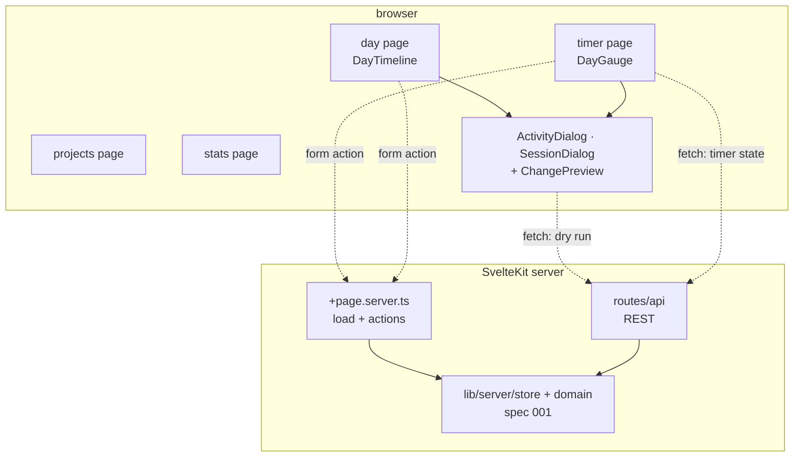
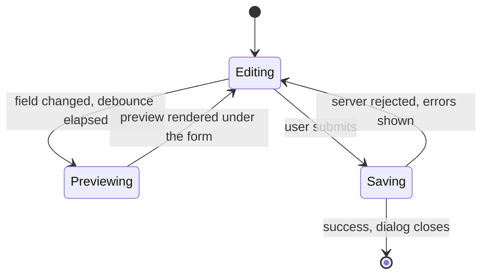
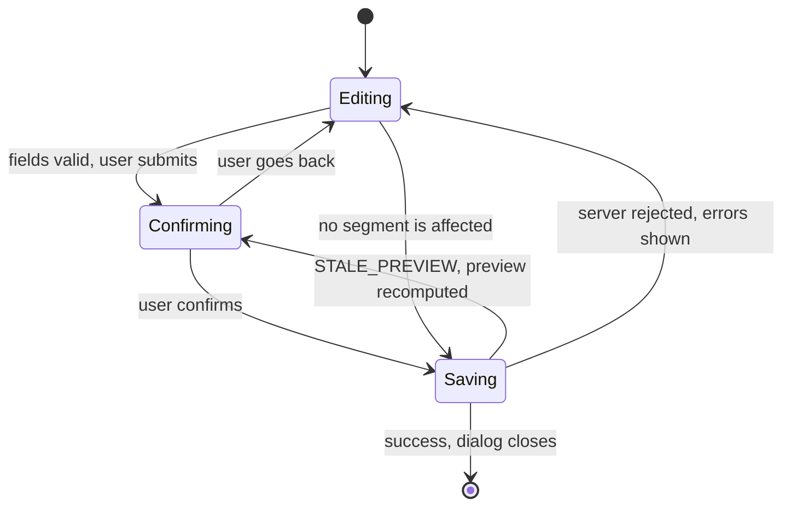

# Design Document: Worklog UI

## Overview

The `Worklog_UI` is the browser half of the Worklog SvelteKit application. It reads through load functions, writes through form actions, and reaches the REST routes from `001-worklog-domain-api` only where an interactive round trip is genuinely needed: the `Dry_Run` behind every `Change_Preview`, the timer state refresh, and inline project creation.

The interface is organized around one idea: **the day is a picture, not a list**. It is drawn twice, for two different jobs.

The `Day_Gauge` on the timer page answers *what shape did today have* — a circle where a given clock time always sits at the same angle, so a glance tells you whether the day was one long block or six scattered ones, and whether it ran past your usual hours. The `Day_Timeline` on the day page answers *what did I do and where do I still owe a description* — one `Work_Block` per session stacked vertically, breaks collapsed to a labelled row so a four-hour evening gap costs one line instead of a fifth of the screen.

They are deliberately different. The gauge keeps time proportional everywhere and sacrifices legibility of short entries; the timeline keeps entries legible and sacrifices proportionality across breaks. Each is right for its own question, and having both is what lets each stay honest about what it gives up.

The second idea is that **nothing is written blind**. Because the server reconciles every write against the timer frame, a change can remove time the user did not intend to touch. Every such write goes through a `Dry_Run` first, and the result is shown as a `Change_Preview` the user has to confirm. The browser never recomputes the reconciliation itself — it would be a second implementation of the hardest logic in the project, and it would drift.

The third idea is that **the appearance is settled**. `.design/DESIGN.md` and the artboards beside it are the `Design_Contract`; the `Design_Tokens` and Page Layouts sections below transcribe it into the values the implementation uses. Nothing about colour, type or arrangement is invented here.

**Key design decisions:**

- **Load functions and form actions by default.** Reads happen in `+page.server.ts`; writes are form actions with `sveltekit-superforms` and the Zod schemas declared by `001`. This gives progressive enhancement and keeps validation in one place. `fetch` is reserved for the `Dry_Run`, the timer refresh and inline project creation.
- **One core, two entry points.** Form actions and the REST routes call the same `src/lib/server/services/` functions and share the same Zod schemas, so the interface and an external script cannot diverge in behavior. `002` writes no orchestration of its own: an action validates with `superValidate` and calls the service `001` declares. Reads go through the stores; writes always go through a service.
- **Server owns the timer.** The elapsed readout ticks locally, but the authoritative state comes from `GET /api/sessions/current` on load and on tab focus. Closing the browser does not stop the timer, and a reload never invents state.
- **`Change_Preview` is always server-computed.** It renders the `Dry_Run` response verbatim. The browser holds no clipping logic.
- **Two themes, one token set.** Every colour is a CSS custom property with a `dark` and a `light` value. Nothing draws from a literal.
- **No inline styles anywhere.** The production `Content-Security-Policy` from `001` carries no `unsafe-inline`, so project colours and computed block heights are applied through precompiled classes, not through `style=` attributes.



## Architecture

### Read and Write Paths

**Pages read the server layer directly. The REST routes are for other callers.**

`+page.server.ts` imports `lib/server/store` and calls it — it does not `fetch` its own `/api` routes. Going through REST from a load function serialises everything twice, forces every `Date` to be revived from a string, and costs a network hop to the same process. `/api` exists for shell scripts and phone shortcuts, and `002` uses it only where the browser itself must talk to the server mid-page: the `Dry_Run`, the timer refresh, inline project creation.

That is also what makes the module-boundary test pass. `+page.server.ts` and `+server.ts` are the only files allowed to import `lib/server/**`; nothing under `src/modules/**` may, which is why there are **no `modules/*/query.ts` and no `modules/*/actions.ts`** — form actions live in `+page.server.ts`, and the modules hold components and pure logic only.

| Interaction | Path | Why |
|---|---|---|
| Loading a day, the projects list, statistics | `+page.server.ts` `load`, calling the store directly | server-rendered, no double serialisation, no `Date` revival |
| Start / stop timer | form action | works without JavaScript, one round trip, invalidates the page data |
| Create / edit / delete an activity or session | form action in `+page.server.ts` | superforms keeps field-level errors and the user's input on failure |
| `Change_Preview` | `fetch` to `/api/…` with `dryRun: true` | needs a result *before* submitting, so it cannot be a form action |
| Timer refresh on tab focus | `fetch` to `/api/sessions/current` | no navigation, no page data invalidation needed |
| Project creation from inside the `Project_Picker` | `fetch` to `/api/projects` | must not navigate away from the open dialog |
| `Quick_Log` | form action posting in `Open_Mode` | the server resolves the interval; the browser sends only the project |

### File Ownership Across the Two Specifications

Two files are split down the middle, and the split is exact:

| File | Owned by | Note |
|---|---|---|
| `src/app.html` | **002** | 002 creates the file and writes `<html lang="%lang%" data-theme="%theme%">`, `%sveltekit.head%`, `%sveltekit.body%` and `%sveltekit.nonce%`. 001 substitutes **only** `%lang%` and `%theme%`, through `transformPageChunk`; `%sveltekit.nonce%` is stamped by `kit.csp` and needs no hook |
| `src/routes/login/+page.server.ts` | 001 | the form action, the passphrase check, the cookie |
| `src/routes/login/+page.svelte` | **002** | the page that renders it |
| `src/routes/logout/+page.server.ts` | 001 | ends the stored session |
| `src/routes/logout/+page.svelte` | **002** | the confirmation view for a no-JavaScript logout |
| `src/hooks.server.ts` | 001 | `Auth_Hook`, CSP, rate limiting — 002 never edits it |
| `src/lib/contracts/schemas.ts` | 001 | the shared Zod schemas, client-safe by construction; 002 imports, never edits |
| `src/hooks.client.ts` | **002** | reports an uncaught client error through the interface's own error surface |
| `messages/{cs,en}.json`, `project.inlang/` | **002** | 001 emits `messageKey` values; 002 owns the translations |

### What the Server Hands the Interface

Five things the browser must never work out for itself. Each is a field `001` puts in a payload `002` already loads; none costs an extra request.

| Value | Where it arrives | Why not client-side |
|---|---|---|
| the current `Logical_Day` and its bounds | `event.locals.today` → root `+layout.server.ts` → context | working it out means reimplementing `DAY_START_HOUR`, the server's zone and its DST rules in the browser |
| `sessionCount`, `longestBlockSeconds`, `eveningSeconds` for a day | `DayResponse.totals` | the day page's *tvar dne* panel needs them, and a second endpoint call for three integers is waste |
| the `Placement_Anchor` a request resolved to | the **successful** `Dry_Run` response | the anchor is a reconciliation rule; reading it out of an error payload only works when the request fails |
| the `Quick_Log` interval and project | `DayResponse.quickLog` | the pill has to name what it will do *before* it is pressed, and the answer is the anchor rule again |
| `colorIndex` on every interval and total | `ProjectInterval`, `ProjectTotal`, `ActivityEntry` | a client-side join is wrong for an archived project and stale after a recolour |

```ts
// additions 002 depends on, in 001's contracts module
type DayTotals = { …; sessionCount: number; longestBlockSeconds: number; eveningSeconds: number };
type QuickLogHint = { start: string; end: string;                       // RFC 3339 UTC, revived on receipt
                      anchorSource: 'last-segment' | 'first-session';
                      projectId: string; projectName: string;
                      colorIndex: number } | null;                      // DayResponse.quickLog
type ProjectInterval = Interval & { projectId: string; colorIndex: number };
type Anchor = { at: Date; source: 'explicit' | 'last-segment' | 'first-session' } | null;
type Today = { date: string; bounds: Interval };                        // event.locals.today
```

`DayResponse.quickLog` is `null` when there is nothing to log, which is what disables the pill — the interface never computes that condition either.

### The Shared Zod Schemas

`001` declares one Zod schema per write and forbids a second copy. `002` therefore has **no `schema.ts` of its own** in any module — form actions import `createActivitySchema`, `patchActivitySchema`, `createSessionSchema`, `patchSessionSchema`, `createProjectSchema` and `patchProjectSchema` from `src/lib/contracts/schemas.ts`. A delete has no body schema: `deleteSessionQuery` and `deleteActivityQuery` validate the `dry_run` and `preview_token` **query parameters**, so they belong to the dry-run client rather than to superforms.

That file is owned by `001` and sits deliberately **outside** `src/lib/server/`: it is a pure module importing nothing from `$env`, Drizzle or the server layer, so superforms can import it in the browser for the validation Requirement 6.10 asks for. `002` imports from it and never edits it.

The same applies to the **domain types**. Every component signature in this document is written in terms of `Interval`, `WorkSession`, `ActivityEntry`, `ActivitySegment` and `Project`, which `001` declares in `src/lib/contracts/models.ts`, and of `DaySummary`, `DayResponse`, `DaysRangeResponse`, `CoverageResponse`, `ActivityResponse`, `ActivityListResponse`, `SessionChangePreview`, `CurrentSessionResponse` and `HealthResponse`, which `001` declares beside them in `src/lib/contracts/responses.ts` — models and responses are two files, and a component that draws a day imports from both. Both are equally client-safe. A type under `src/lib/server/` cannot be imported by a `.svelte` file at all, so this is a build requirement rather than a preference.

### The Two Dialog Flows

The two write dialogs do **not** share one flow, because they answer different questions. `ActivityDialog` is composing something new, so the preview belongs under the form as continuous feedback. `SessionDialog` is destroying something that exists, so the preview belongs in front of the save as a gate.

**`ActivityDialog` — live preview under the form.** Every change to a time, a duration or the `Untracked_Policy` schedules a debounced `Dry_Run`; the result renders in a panel beneath the fields, headed *uloží se takto*. The save action stays enabled unless the `Dry_Run` returned a rejection.



**`SessionDialog` — preview as a confirmation state.** A change to the start or the end runs the same debounced `Dry_Run`, but its result takes over the dialog: the footer's save action becomes *confirm and save* beside *back to editing*, and the body shows what disappears.



The `Editing → Saving` shortcut exists in both: for an activity, a change to only a description or a `Project` cannot move a segment; for a session, a `Dry_Run` reporting no `reclipped` entries and `removedSeconds: 0` has nothing to confirm.

### Two Readings of One Day

**The gauge** maps twenty-four hours onto 360°, so an hour is 15° and a clock time always lands at the same angle. The `Gauge_Track` covers only the `Gauge_Window`; the rest of the circle is bare. With the default `06:00 → 00:00` that is 270° of track and a 90° opening at the bottom, centred on 03:00.

```
              12        15
         09  ╌╌┼╌╌╌╌╌╌╌╌┼╌╌  18
       ╱                        ╲
     06                          21        track: graduated, numbered
       ╲                        ╱          gap:   nothing at all
         ╌╌╌╌╌╌      ╌╌╌╌╌╌╌╌╌╌
        00 ┘  bare gap  └ (work here
                          reads as overtime)
```

Work outside the window is drawn in the gap with no track under it, so it visibly leaves the dial rather than continuing along it — and because there is no scale there, the arc carries its own end label.

**The timeline** stacks one `Work_Block` per session, each with its own local axis, and collapses the break between two blocks into a single `Break_Marker`:

```
08:00 – 12:30  ·  4 h 30 min v kuse
 ┃ ┌──────────────────────────┐
 ┃ │ Trindade CRM             │   proportional inside the block
 ┃ │ Oprava filtrů ve flotile │
 ┃ │ 08:00 – 10:15 · 2 h 15   │
 ┃ ├──────────────────────────┤
 ┃ │ Worklog                  │
 ┃ └──────────────────────────┘
 ╌╌╌╌╌  pauza 4 h 00 min · 17:00 – 21:00  ╌╌╌╌╌   one row, not a fifth of the screen
21:00 – 03:00  ·  6 h 00 min v kuse · noční
 ┃ ┌──────────────────────────┐
```

The `┃` is the `Session_Rail` — one 8 px rounded bar per `Work_Session`, spanning the height of that block's segment column. There is no second lane and no shared axis: `Untracked_Time` is never drawn as empty space, it is the `Break_Marker` row.

Every segment gets a floor on its rendered height, so a twenty-minute task stays readable and clickable instead of collapsing to a sliver.

Both readings render blocks in chronological DOM order, each a `<button>` with an `aria-label` carrying its times, project and description — the picture is never the only way to read the day.

## Design_Tokens

Transcribed from `.design/DESIGN.md` §§ 1–4. Declared once in `src/lib/theme/theme.css` and mapped into Tailwind through an `@theme` block in `src/app.css`. Nothing below is a suggestion.

### Theme: dark — "Midnight"

| Token | Value |
|---|---|
| `--bg` | `#0F1319` |
| `--text` | `#E6EAF2` |
| `--text-dim` | `rgba(230,234,242,0.62)` |
| `--text-faint` | `rgba(230,234,242,0.50)` |
| `--accent` | `#D18A6A` |
| `--accent-hover` | `#E2A88D` |
| `--ink-on-accent` | `#1A0F0A` |
| `--panel` | `rgba(255,255,255,0.043)` |
| `--dialog` | `#171B22` |
| `--scrim` | `rgba(9,11,15,0.72)` |
| `--field` | `rgba(255,255,255,0.05)` |
| `--field-active-bg` | `rgba(209,138,106,0.10)` |
| `--field-active-ring` | `inset 0 0 0 1px rgba(209,138,106,0.40)` |
| `--divider` | `rgba(255,255,255,0.05)` |
| `--destructive` | `#E06A5E` |
| `--rail` | `rgba(230,234,242,0.30)` |
| `--arc-closed` | `rgba(230,234,242,0.34)` |
| `--groove-outer` · `--groove-inner` | `rgba(255,255,255,0.055)` · `rgba(255,255,255,0.045)` |
| `--dial-hour` · `--dial-3h` · `--dial-6h` | `rgba(230,234,242,0.14)` · `…,0.24)` · `…,0.30)` |
| `--dial-numeral` | `rgba(230,234,242,0.17)` |
| `--uncovered-dash` | `rgba(209,138,106,0.65)` |

### Theme: light — "Daylight"

| Token | Value |
|---|---|
| `--bg` | `#F3EEE6` |
| `--text` | `#2B2420` |
| `--text-dim` | `rgba(43,36,32,0.78)` |
| `--text-faint` | `rgba(43,36,32,0.66)` |
| `--accent` | `#A5522E` |
| `--accent-hover` | `#8A4724` |
| `--ink-on-accent` | `#FBF7F1` |
| `--panel` | `rgba(0,0,0,0.045)` |
| `--dialog` | `#FBF7F1` |
| `--scrim` | `rgba(43,36,32,0.38)` |
| `--field` | `rgba(0,0,0,0.05)` |
| `--field-active-bg` | `rgba(165,82,46,0.10)` |
| `--field-active-ring` | `inset 0 0 0 1px rgba(165,82,46,0.45)` |
| `--segment-active` | `rgba(165,82,46,0.14)` — dark `rgba(209,138,106,0.16)` |
| `--divider` | `rgba(0,0,0,0.07)` |
| `--hairline` | `rgba(0,0,0,0.20)` — dark `rgba(255,255,255,0.14)` |
| `--meter-track` | `rgba(0,0,0,0.09)` — dark `rgba(255,255,255,0.07)` |
| `--destructive` | `#A8321F` |
| `--rail` | `rgba(43,36,32,0.32)` |
| `--arc-closed` | `rgba(43,36,32,0.34)` |
| `--groove-outer` · `--groove-inner` | `rgba(0,0,0,0.07)` · `rgba(0,0,0,0.055)` |
| `--dial-hour` · `--dial-3h` · `--dial-6h` | `rgba(43,36,32,0.18)` · `…,0.28)` · `…,0.34)` |
| `--dial-numeral` | `rgba(43,36,32,0.24)` |
| `--uncovered-dash` | `rgba(165,82,46,0.75)` |

**Every token above is drawn and measured. None is derived.** `AddTaskLight` paints the light dialog, so the six values that were once computed — dialog, scrim, field, active field, divider and destructive — are now taken from an artboard and measured against the surface they actually sit on:

| Token | Value | On `#FBF7F1` |
|---|---|---|
| `--text` | `#2B2420` | 14.30:1 |
| `--text-dim` | `rgba(43,36,32,0.78)` | 7.18:1 |
| `--text-faint` | `rgba(43,36,32,0.66)` | 4.85:1 |
| `--accent` | `#A5522E` | 5.12:1 |
| `--destructive` | `#A8321F` | 6.26:1 |

The active segmented item is the one place the two themes take different alphas for the same job: `rgba(209,138,106,0.16)` dark against `rgba(165,82,46,0.14)` light. The light accent is the darker colour, so it needs less of itself to reach the same weight. `--destructive` is its own token in both themes — 5.67:1 on the dark ground, 6.26:1 on the light dialog — and is never derived from a `Palette_Slot`.

**Both themes reached AA with their own numbers, and neither set may be copied onto the other.**

| | dim | faint |
|---|---|---|
| dark on `#0F1319` | 0.62 → 6.44:1 | 0.50 → 4.63:1 |
| light on `#F3EEE6` | 0.78 → 6.84:1 | 0.66 → 4.69:1 |

Both pairs started lower and were raised after measurement. The light pair computed to 4.17 and 2.99; dark faint — which carries every block time, every break label and every caps label — sat at **3.38:1**, under the 4.5:1 Requirement 14.10 demands. Dark dim moved up with it so the two levels stay visibly apart instead of collapsing into one. Four numbers, four measurements; do not "unify" them.

**Two collisions the implementation must not merge.**

1. `--accent` carries *primary action* **and** *uncovered / attention*. Both are legitimate; they are told apart by shape — a primary action is a filled pill or circle in `--accent` with `--ink-on-accent` text, uncovered time is a dashed outline with an accent title on a 6 % accent fill. Never by colour.
2. The pink `Palette_Slot` (`#B7466C` / `#CC5A7F`) sits close to `--destructive`. A destructive control is styled from `--destructive` and never from a slot; a project swatch is styled from its slot and never from `--destructive`. A project that happens to be pink is not a warning.

### Project Palette

Assigned by `color_index` 0–7, overridable by the user (Requirement 11.10).

| Slot | Name | Dark | Light |
|---|---|---|---|
| 0 | blue | `#3899EA` | `#2287D7` |
| 1 | pink | `#B7466C` | `#CC5A7F` |
| 2 | green | `#09AF72` | `#006640` |
| 3 | amber | `#A67102` | `#B27A00` |
| 4 | violet | `#7C5CC0` | `#613FA0` |
| 5 | teal | `#019FB5` | `#0191A6` |
| 6 | olive | `#A19201` | `#7F7302` |
| 7 | clay | `#BA4939` | `#CB5848` |

These replace the palette the artboards were drawn with. That earlier set failed the data-viz validator on four checks — most seriously green↔pink at deuteranope ΔE 1.7, meaning a red-green colourblind user could not separate two adjacent projects at all.

Measured separation of the palette above, all pairs, both themes:

| Projects in use | CVD ΔE | Normal ΔE | Verdict |
|---|---|---|---|
| 2 | 13.8 | 25.1 | passes |
| 3 | 10.4 | 20.9 | passes |
| 4 | 10.4 | 16.8 | passes |
| 5 | 10.4 | 16.5 | passes |
| 6 | 8.3 | 8.9 | at the floor — the name must appear beside the colour |
| 7 | 4.8 | 8.8 | colour alone is not sufficient |
| 8 | 4.6 | 7.3 | colour alone is not sufficient |

**Eight mutually distinguishable categorical colours do not exist.** A search over OKLCH found the mathematical optimum for each palette size; even the best possible eight-colour set reaches only ΔE 6.0. Five is the practical ceiling.

That makes the following a **rule, not a caveat**: *colour never carries the identity of a project on its own.* Every surface showing a project colour also shows the project name. The `Segment_Block` elements, the statistics breakdown, the `Project_Legend` and the `Project_Picker` satisfy it by construction. The `Day_Gauge` arcs are the one surface that cannot show a name inline, which is why Requirement 16.16 gives every inner arc a hover and focus label.

Beyond eight projects `color_index` wraps and two projects share a hue — another reason the name is never optional. Charts fold everything past the top seven by `Covered_Time` into an "Other" slot in muted ink rather than cycling.

**No text is ever placed on a filled `Palette_Slot`.** A `Segment_Block` is a 16 % tint of its slot with `--text` on it and a 3 px full-strength left border; a swatch carries no label; a gauge arc carries no label. This is why there is no per-slot label ink table: the situation that would need one does not arise, and if a future surface introduces one, its ink must be measured per slot before it ships.

### Typography

**Inter Tight**, weights 300 / 400 / 500 / 600, falling back to `system-ui, sans-serif`, with `-webkit-font-smoothing: antialiased`.

**The faces are served from this origin, not from Google Fonts.** The artboards link `fonts.googleapis.com` because they are previews opened straight from disk; production does not, and cannot: the CSP from `001` carries no `font-src` beyond `'self'` and no third-party stylesheet host, so a linked webfont would simply be blocked and the entire type scale would fall back to `system-ui`. Four `woff2` files — 300, 400, 500, 600, `latin` + `latin-ext` subset, which is what Czech needs — live in `static/fonts/` and are declared as `@font-face` in `theme.css` with `font-display: swap`. `001` serves `font-src 'self'`. Every numeric readout carries `font-variant-numeric: tabular-nums` so digits do not jitter as the timer ticks.

| Role | Size / weight / tracking |
|---|---|
| Elapsed time (hero) | 68 / 300 / `-0.035em` — mobile 56 |
| Stats KPI figure | 30 / 300 / `-0.03em` |
| Timer figure | 26 / 300 / `-0.02em` — mobile 19 |
| Page heading | 20 / 500 — mobile 15 |
| Dialog heading | 17 / 500 |
| Brand | 15 / 600 |
| Summary value | 15 / 500 |
| Nav, form fields, project row | 14 |
| Project name in a `Segment_Block` | 14 / 500 — mobile 13 |
| Buttons | 13.5, primary 600 |
| Block head time | 13 / 500 — mobile 12 |
| Description, preview prose | 12.5 |
| Times, legend, gauge numerals | 12 — mobile 10.5–11 |
| Break label, short | 11.5 / 400 `--text-faint` — mobile 10.5 |
| Break label, `Long_Break` | 12 / 500 `--text-dim` — mobile 11 / 500 |
| Caps label (`.lbl`) | 11 / `letter-spacing: 0.16em` / uppercase / `--text-faint` — mobile 10 |

**Line height is part of the contract, because the layout budget counts it.** A block whose head is 29 px is 29 px because of its line height, and `layOutDay` reserves exactly that:

| Role | `line-height` |
|---|---|
| Hero elapsed | `1` — the readout is a single line and any leading pushes the gauge down |
| Stats KPI, timer figure | `1.1` |
| Page and dialog headings, brand, summary values | `1.3` |
| Nav, fields, project names, buttons, block head | `1.4` |
| Description, preview prose, observation line, panel rows | `1.55` |
| Times, legend, break labels, caps labels | `1.35` |
| Gauge numerals | `1` — SVG text, positioned by baseline |

Durations read as `14 h 15 min`. Mobile drops the unit on the hero and the timer figures only: `14 h 15`.

### Surface Tokens

Every place the artboards write a bare `rgba(255,255,255,…)` gets a name, because the light theme needs a different value at the same job and a literal cannot carry one. The light column follows the same ladder the drawn light artboards use — a light ground needs roughly the same alpha in black that a dark ground needs in white, one step lower where the surface is large.

| Token | Dark | Light | Used by |
|---|---|---|---|
| `--chip` | `rgba(255,255,255,0.07)` | `rgba(0,0,0,0.06)` | settings gear chip, dialog close button, round icon buttons |
| `--menu-border` | `rgba(255,255,255,0.06)` | `rgba(0,0,0,0.08)` | settings menu outline |
| `--menu-shadow` | `0 18px 44px rgba(0,0,0,0.55)` | `0 18px 44px rgba(43,36,32,0.18)` | settings menu |
| `--dialog-shadow` | `0 28px 70px rgba(0,0,0,0.6)` | `0 28px 70px rgba(43,36,32,0.22)` | both write dialogs |
| `--grabber` | `rgba(255,255,255,0.14)` | `rgba(0,0,0,0.16)` | settings sheet handle |
| `--group` | `rgba(255,255,255,0.04)` | `rgba(0,0,0,0.04)` | segmented-control groups |
| `--segment-active` | `rgba(209,138,106,0.16)` | `rgba(165,82,46,0.14)` | selected segment |
| `--footer` | `rgba(255,255,255,0.02)` | `rgba(0,0,0,0.025)` | dialog footer band |
| `--row` | `rgba(255,255,255,0.035)` | `rgba(0,0,0,0.035)` | `Orphan_Panel` rows, inset boxes |
| `--track` | `rgba(255,255,255,0.05)` | `rgba(0,0,0,0.055)` | rhythm strip, breakdown bar track |
| `--meter-track` | `rgba(255,255,255,0.07)` | `rgba(0,0,0,0.09)` | 4 px coverage meters |
| `--hairline` | `rgba(255,255,255,0.14)` | `rgba(0,0,0,0.20)` | dashed break rules |

`SettingsLight` has landed and confirms the first five rows: chip `rgba(0,0,0,0.06)`, menu border `rgba(0,0,0,0.08)`, menu shadow `0 18px 44px rgba(43,36,32,0.18)`, group `rgba(0,0,0,0.04)`, active segment `rgba(165,82,46,0.14)`, and the menu's divider is `--divider` itself. Only `--grabber` has no light drawing, because the light mobile sheet is not among the artboards; its value follows the same ladder and is binding as written.

### Interaction States

The artboards draw resting states only — about thirty surfaces, none of them with a hover, active, disabled or focus variant. Rather than draw thirty more, the states are **derived from the resting tokens by one rule, and that rule is binding**:

| State | Rule | Example on `--chip` dark (`0.07`) |
|---|---|---|
| hover | surface alpha **+0.03**; text token moves one level brighter (`faint → dim → text`) | `0.10` |
| active / pressed | surface alpha **+0.06**, and the element takes `transform: none` — nothing moves | `0.13` |
| disabled | the whole element at `opacity: 0.4`, no hover, no pointer cursor, `aria-disabled` | — |
| focus-visible | the focus ring, unchanged by any of the above | — |

On a filled accent control — `Timer_Control`, FAB, primary pill — hover is `--accent-hover` and active is `--accent-hover` with the halo dropped to `0.06`; there is no alpha to raise. On a `Segment_Block` hover raises `--pj-tint` by half again, which is the same rule expressed in the tint's own units. Transitions are 200 ms as Requirement 14.8 states, and disabled controls animate not at all.

### Radii, Heights, Widths

Radii: 2 (legend swatch) · 4 (rail) · 5 (bar) · 9 (icon box, segment control item, mobile block) · 10 (block) · 11 (field, swatch, inner panel) · 12 (segment control group) · 14 (panel) · 20 (dialog) · 9999 (pills, round buttons).

Heights: field 44 · dialog button 42 · segment control item 36 · quick-log pill 50 · header 84 desktop (88 on the day page) / 56–60 mobile · bottom nav 66–68 · FAB 54 · rhythm strip 22 · meter 4 · breakdown bar 8.

Widths: day-page side column **290** · projects content max **940** · `Session_Rail` 8 desktop / 6 mobile · segment left border 3.

**Start/stop button: 104 px with a 42 px icon** (mobile 98 / 40). The halo is **11 % of the control's diameter** at `rgba(accent,0.09)`: `0 0 0 12px` at the desktop 104, `0 0 0 11px` at the mobile 98. It scales rather than being fixed, because a constant 12 reads as a heavier ring on the smaller button — which is what `TimerMobile` draws. The control was deliberately reduced from 132, where it overpowered the gauge.

The rule is a **ratio, not a distance**: the control's diameter stays at or below **0.31 of the gauge box** (104 / 340 desktop, 98 / 300 mobile). The clear space that leaves between the halo and the inner arc is a consequence of the box size — about 66 px at the desktop's 340 and about 48 px at the mobile's 300, because the gauge scales through its `viewBox` while the control does not. Quoting 66 px as an absolute would make the mobile gauge look broken when it is correct. Do not enlarge the control past the ratio.

**Block heights.** Desktop blocks run 98 / 96 / 74 / 60 / 38 / **36**; mobile 62 / 58 / 48 / 44 / **26**. `MIN_BLOCK_PX` is **36 on desktop and 26 on mobile** — see Requirement 14.3 for why this is an explicit exception to the 44 × 44 rule rather than an oversight.

**Spacing.** The `Design_Contract` uses values off the 4/8/12/16/24/32/48/64 scale — 7, 9, 11, 13, 14, 18, 22, 26, 30, 56, 84, 290, 940 — and it wins wherever it speaks (Requirement 14.7). The scale governs only new surfaces the artboards do not cover.

### Applying Tokens Without Inline Styles

The production CSP from `001` carries `style-src 'self' 'nonce-…'` with no `unsafe-inline`. An inline `style=` attribute is not covered by a nonce — it is simply forbidden. Three consequences:

1. **Project colour** goes through one precompiled class per slot, not through a custom property written into the element:

```css
/* src/lib/theme/palette.css — generated once, eight of these per theme */
.pj-0 { --pj: #3899EA; --pj-tint: rgba(56,153,234,0.16); }   /* light theme: alpha 0.13 */
```

`projectSlotClass(colorIndex)` returns `pj-0` … `pj-7` (wrapping at eight); `Segment_Block` uses `background: var(--pj-tint); border-left-color: var(--pj)` from its own stylesheet. `projectColorVar()` — which built an inline custom property — is deleted.

2. **Computed block heights** are quantised to a 2 px ladder and applied through precompiled classes `.tl-h-26` … `.tl-h-320`, a continuous sequence in which every drawn height — 26, 36, 38, 44, 48, 58, 60, 62, 74, 96, 98, **106** — is a member by construction. A block taller than 320 px — a day with one entry easily reaches 700 — takes **`.tl-h-fill`** (`flex: 1 1 auto`) instead and absorbs whatever the flex column has left; a block column contains at most one such block, which is the tallest, and `layOutDay` marks it. `layOutDay` does the quantising itself and returns a `heightPx` already on the ladder, giving each block's remainder to that block's tallest segment; the component only picks the matching class. Rounding in two places was the earlier draft's mistake. 148 rules in the compiled stylesheet cost less than one nonce round trip. If a future layout needs a height outside the ladder, the alternative is a single nonced `<style>` element rendered from `locals.nonce` — never an inline attribute.

3. **SVG is unaffected.** `d`, `stroke`, `stroke-width`, `stroke-dasharray`, `fill`, `x`, `y` are SVG presentation attributes, not CSS, and no CSP directive applies to them. The `Day_Gauge` may therefore compute its geometry per render and write it straight onto the elements. The `Day_Rhythm_Strip` may not — its segment offsets are CSS percentages, so it renders as an inline SVG with `<rect>` elements instead of positioned `<div>` elements.

### Motion

Two curves and three durations, and nothing else.

| Token | Value | Used by |
|---|---|---|
| `--ease-standard` | `cubic-bezier(0.2, 0, 0, 1)` | everything entering or changing in place |
| `--ease-exit` | `cubic-bezier(0.4, 0, 1, 1)` | everything leaving |
| `--dur-hover` | `200ms` | colour, background, border, shadow, tint |
| `--dur-panel` | `300ms` | anything that changes size or position |
| `--dur-shimmer` | `1.2s` | the skeleton sweep, `linear`, infinite |

**What animates, exhaustively.** Nothing absent from this table moves.

| Surface | Property | Duration / curve |
|---|---|---|
| any hover, active or focus state | `background-color`, `color`, `border-color`, `box-shadow`, `--pj-tint` | `--dur-hover` `--ease-standard` |
| dialog scrim | `opacity` 0 → 1 | `--dur-panel` `--ease-standard` |
| desktop dialog | `opacity` 0 → 1 and `translateY(8px)` → 0 | `--dur-panel` `--ease-standard`; exit `--ease-exit` |
| full-screen mobile dialog | `translateY(100%)` → 0 | `--dur-panel` `--ease-standard` |
| settings sheet, mobile | `translateY(100%)` → 0 | `--dur-panel` `--ease-standard` |
| settings menu, desktop | `opacity` and `translateY(4px)` → 0 | `--dur-hover` `--ease-standard` |
| toast | `opacity` and `translateY(8px)` → 0 | `--dur-hover` in, `--ease-exit` out |
| FAB and `Timer_Control` press | `scale(0.96)` | `100ms` `--ease-standard` |
| coverage meter, breakdown bar | `width` | `--dur-panel` `--ease-standard`, on a data change only |
| gauge arcs | `stroke-dashoffset` sweep, once per page load | `--dur-panel` `--ease-standard` — **never** on the per-second tick |
| skeleton | shimmer sweep | `--dur-shimmer` `linear` |
| theme swap | **nothing** | `data-theme` changes instantly |

The theme swap is deliberately unanimated. A 300 ms colour transition across every
surface at once reads as a fault rather than a transition, and the `Day_Gauge`'s SVG
presentation attributes would not follow it anyway, so half the page would change
instantly and the other half would fade — which looks worse than either.

**"Non-essential" means everything above that moves or repeats.** Under
`prefers-reduced-motion: reduce`: every `transform`- and `opacity`-based entrance and
exit becomes an instant state change with a duration of `0s` and no transform, the
skeleton shimmer becomes a flat `--panel` fill, the gauge draws its arcs at full length
with no sweep, the meter and bar widths jump, and the press scale is dropped. What
survives is colour — the `--dur-hover` transitions of hover, active and focus — because
those signal state rather than movement, and removing them makes the interface feel
broken rather than calm.

### Announcements

One rule: a screen reader hears a **change of state**, never a change of digits.

| Surface | Region | Politeness | Announced when |
|---|---|---|---|
| toast container, success | `role="status"` | polite | a toast is inserted; the container is mounted empty in the root layout at first paint |
| toast container, failure | `role="alert"` | assertive | as above; a failure toast never auto-dismisses, so the message outlives its announcement |
| `Change_Preview` body | `aria-live="polite"`, `aria-busy` while the `Dry_Run` is in flight | polite | once per settled response — `aria-busy` suppresses the intermediate renders of the 400 ms debounce |
| inline field error | none — `aria-describedby` and `aria-invalid` on the field itself | — | reached when focus moves to the field, which is where Requirement 15.4 sends it |
| hero elapsed, `Running_Indicator`, tab title | no live region; digits `aria-hidden="true"` | never | a per-second announcement makes the page unusable |
| `Timer_Control` | its accessible name | — | changes between `timer_start` and `timer_stop`, which is the state change worth hearing |

There are exactly two live regions in the whole interface, both in the root layout and
both **empty at first paint**. A region created at the moment its first message arrives
is not announced by most screen readers, which is the failure this table exists to
prevent — and it is invisible in testing unless a screen reader is actually running.

## Page Layouts

Transcribed from `.design/DESIGN.md` § 6 and the artboards named beside each item.

### Application Shell

**Top bar** (`Main`, `DayCollapsed`, `Stats`) — `grid-template-columns: 1fr auto 1fr`, height **84 on every page**, horizontal page padding 48. Brand `Worklog` 15/600 at the left; navigation centred with `gap: 30`, items 14 in `--text-faint`, the active one 14/500 in `--text`; at the right, `gap: 14`, the `Running_Indicator` (6 px round accent dot + elapsed in 13 tabular `--text-dim`, internal `gap: 8`) and the `Settings_Menu` chip.

**Mobile shell** (`TimerMobile`, `DayMobile`, `SettingsMobile`) — top bar 56–60 with the brand, the `Running_Indicator` (12 px elapsed) and the `Settings_Menu` chip; bottom navigation 66–68 with a 1 px top divider and four tabs, each an icon of 20 above a 10 px label; the active tab is drawn in `--accent`, not in full-strength text. A create action appears as a 54 px round accent FAB, 18 from the right and 12 above the bottom bar, with the same halo as the timer control.

The two "active" treatments are deliberate: on desktop the accent is reserved for the timer and for uncovered time, so the active nav item earns its emphasis from weight and full-strength ink; on the bottom bar there is no room for that and the accent is the only legible signal.

**Settings** (`Settings`, `SettingsMobile`) — the `Theme_Switcher`, the `Locale_Switcher` and logout sit behind **one** control, not three in the bar: a round gear chip at the right end of the top bar, 30 px on desktop and 32 on mobile, on `rgba(255,255,255,0.07)`, holding a 16 px gear at `stroke-width: 1.7` in `--text`. The right cluster is therefore the `Running_Indicator` and then the chip, `gap: 14`.

Activating it opens a **268 px menu** anchored under the chip at the page's right padding on desktop — `--dialog` at radius 14 with a `1px solid rgba(255,255,255,0.06)` border, `0 18px 44px rgba(0,0,0,0.55)`, `padding: 16`, `gap: 16` — and the **same content as a bottom sheet** on mobile: `--dialog`, radius `20px 20px 0 0`, `padding: 10px 22px 26px`, `gap: 20`, opened by a 38 × 4 grabber of radius 9999 in `rgba(255,255,255,0.14)` centred at the top.

| Row | Desktop | Mobile |
|---|---|---|
| `MOTIV` — three-way `Theme_Switcher`: Systém / Světlý / Tmavý | items 34 tall, radius 9, 13 px; group radius 11 | items 44 tall, radius 10, 14 px; group radius 13 |
| `JAZYK` — two-way `Locale_Switcher`: Čeština / English | as above | as above |
| hairline `--divider` — `rgba(255,255,255,0.05)` dark, `rgba(0,0,0,0.07)` light | 1 px | 1 px |
| `Odhlásit se` in `--destructive` with a 15 px exit icon | row 34 tall, 13.5 px | row 44 tall, icon 17, 14.5 px |

Both groups sit on `rgba(255,255,255,0.04)` with `padding: 4` and `gap: 4`; the selected item is `rgba(209,138,106,0.16)` with accent text at 500 — the same segmented-control treatment the `AddTask` dialog uses.

**One control rather than two switchers, for three reasons.** The mobile top bar is 56–60 px and already carries the day navigation — one chip fits there, two do not, and settings must not live in a different place on each width. **Logout finally has a home**: the requirements demanded it and no artboard had ever drawn it, so one menu closes three gaps at once. And the four navigation destinations are places you *work*; a control set once a year does not belong beside them. The cost is that switching language is no longer one click, which for something set once is the right trade.

**The sheet is modal, and the dimming has exactly one source.** The scrim (`--scrim`) covers the page content **and** the bottom navigation at `z-index: 2`; the sheet sits over it at `z-index: 3`. Neither the page content nor the tab bar may carry an `opacity` of its own: an opacity creates a stacking context, and the bottom navigation then paints *over* the sheet. This is a real trap, not a hypothetical one — it was hit while the artboard was drawn. Dim through the scrim, never through the layers underneath it.

**The `Running_Indicator` is not on the timer page.** It appears in the top bar of the day, projects and statistics pages, and is deliberately absent from `Main`, `TimerLight` and `TimerMobile`, where the 68 px hero already states the elapsed time — two copies of one number in one view is noise. The `Settings` artboard draws the cluster with the indicator because it is demonstrating the menu, not the timer page.

### Timer Page (`Main`, `TimerLight`, `TimerMobile`; `GaugeNormal` for the resting state)

Centred column, in this order, `gap: 18` (mobile 20):

1. **Hero elapsed** 68/300 tabular, and beneath it the caps caption `běží od 21:00`
2. **`Day_Gauge`** — 340 × 340 (mobile 300), with the `Timer_Control` absolutely centred on the arc centre
3. **Three figures** — `odpracováno` / `popsáno` / `chybí popis`, 26/300 tabular under caps labels, `gap: 56`; the third is drawn in `--accent`. On mobile they spread across the full width at 19/300 with shortened labels
4. **`Quick_Log` pill** — 50 tall, fully rounded, `--field` background, a 34 px round icon box, `Zapsat 01:30 → teď` at 14 `--text-dim`, and the outstanding `Uncovered_Time` at 13 `--text-faint` (dropped on mobile)
5. **`Project_Legend`** — 12 `--text-faint` items with `gap: 22`, each an 8 × 8 swatch of radius 2 beside the project name, closing with a 14 px dashed accent rule labelled `bez popisu`

### Day Page, Desktop (`DayCollapsed`, `DayCollapsedLight`)

Heading line: the date at 20/500 beside `08:00 – 03:00 · odpracováno 14 h 15 min` at 13 `--text-faint`. `DayCollapsed` draws its top bar at 88; **84 is the value** — the shell is one component with one height, and those four pixels are a drawing slip rather than a per-page rule. Below it a two-column layout, `gap: 24`: the `Day_Timeline` growing to fill, and a fixed **290 px** column at the right holding two panels of radius 14 on `--panel`, `gap: 14`:

- **`souhrn dne`** — worked / described / missing as label-value rows (13 `--text-dim` against 15/500 tabular, the missing value in `--accent`), a 4 px meter on `--meter-track` filled to 81 %, and `81 % odpracovaného času má popis` at 12 `--text-faint`
- **`tvar dne`** — work blocks (`sessionCount`), longest unbroken (`longestBlockSeconds`), time after the `Evening_Hour` (`eveningSeconds`)
- **`mimo výkaz`** — the `Orphan_Panel`, present only when the day holds an `Orphaned_Entry`: one row per emptied entry with its project, its originally requested interval and a sentence saying nothing of it remains inside the timer frame, each offering deletion or re-entry

The `Orphan_Panel` exists because an `Orphaned_Entry` has no `Activity_Segment` and therefore **cannot** appear on the `Day_Timeline` — it has no position to be drawn at. Everything else that used to be listed beside the timeline is now the timeline: there is no `ActivityList` and no `UncoveredList`. A `Segment_Block` already carries the project, the description, the times and the duration, and an `Uncovered_Marker` already carries its stretch; a second rendering of the same records beside the picture was two things to keep in sync and one of them redundant.

Inside the timeline, per `Work_Block`: a head of `08:00 – 12:30` at 13/500 tabular beside `4 h 30 min v kuse` at 12 `--text-faint` (a night block adds `· noční`); then a row of `gap: 14` holding the `Session_Rail` and the segment column with `gap: 4`. A `Segment_Block` is radius 10, padding `9px 13px`, `--pj-tint` background, 3 px `--pj` left border, and carries project name 14/500 → description 12.5 `--text-dim` → `08:00 – 10:15 · 2 h 15 min` 12 `--text-faint` tabular. At `MIN_BLOCK_PX` it collapses to one row: name 13/500 and times 12 `--text-faint` side by side.

The desktop day page draws **no** date navigation in the artboards even though Requirement 5.2 needs it; it goes into the heading line, left of the date, as two 34 px round icon buttons matching the mobile treatment.

The heading line's right end carries the two create actions: **`+ Přidat úkol`** as a filled accent pill, 34 tall, radius 9999, `padding: 0 16`, 13.5/600 in `--ink-on-accent`, and beside it **`+ úsek`** as a ghost pill on `--chip` in `--text-dim` at the same height. The task is the everyday action and gets the filled treatment; adding a timer block is a repair and stays quiet. On mobile both live behind the FAB's two-item sheet and neither appears in the heading.

### Day Page, Mobile (`DayMobile`)

Date navigation is a 44 px row: a 34 px round back button, the date 15/500 centred over `08:00 – 03:00 · 14 h 15 min` at 10 `--text-faint`, and a forward button at `opacity: 0.3` when the day is today. Blocks are radius 9, padding `8px 11px`, `gap: 4`, rail 6 wide; the head drops to 12/500 + 11. The two side panels move below the timeline.

### Break Markers

A `Break_Marker` is a centred label between two dashed hairlines that run to both edges of the timeline column, indented to clear the rail (`padding-left: 22` desktop, 18 mobile). The rule is `--hairline` — `rgba(255,255,255,0.14)` dark, `rgba(0,0,0,0.20)` light. The light value is higher on purpose, exactly as the text tokens are.

| | Duration | Label | Vertical padding |
|---|---|---|---|
| short break | < 1 h | 11.5 `--text-faint` tabular | 11 |
| `Long_Break` | ≥ 1 h | 12 / 500 `--text-dim` tabular | 13 |

**`LONG_BREAK_SECONDS = 3600`.** The threshold is one hour because that is what separates a coffee or a lunch — which the reader skims past — from the evening gap that changes the shape of the day and is worth stopping at. Desktop labels carry the bounds (`pauza 4 h 00 min · 17:00 – 21:00`); mobile drops them for width (`pauza 4 h 00 min`).

### The Night Marker

A `Work_Block` whose session has any part at or after the `Evening_Hour` of its `Logical_Day` adds `· noční` to its head. Deliberately the same hour the statistics measure `eveningSeconds` against — one configured value, one meaning, so a block called noční on the day page is a block contributing to *v noci po 21:00* in the statistics. Crossing midnight is not the test: 22:00–23:30 is a night block and 06:00–09:00 is not, whatever date it started on.

### Running, Capped and Continuing Blocks

Three flags on `DayLayout.blocks` change how a `Work_Block` is drawn, and each is carried
in text as well as in shape, because Requirement 14.11 forbids meaning by appearance alone.
Without these, an open session and a closed one are indistinguishable on the day page while
the gauge already marks the difference in accent.

| State | Rail | Head | Text |
|---|---|---|---|
| `running` | `--accent` instead of `--rail`, bottom end square rather than rounded — the block has no end yet | a 6 px `--accent` dot before the head time | `day_block_running` at the head's right, 12/500 `--accent` |
| `capped` | `--accent` down to the cap instant, then `--rail` at `opacity: 0.5`, the two divided by a 1 px `--hairline` across the rail | as `running` | `day_block_capped` replaces the `v kuse` phrase at 12 `--accent`, and the head time is the cap instant rather than `now` |
| `continues` | bottom end square, with a 7 px `--rail` triangle centred on the bottom edge — the `Split_Marker` notch in the rail's own ink rather than a project's | unchanged | `day_block_continues` on the meta line at 12 `--text-faint` |

`running` and `continues` can hold at once — a timer started yesterday evening and still
going — in which case the rail is accent, the end is square, the notch is drawn and both
strings appear. `capped` excludes `continues`: a session that stopped counting inside the
day it started in does not reach the next one.

### The Focus Ring

`box-shadow: 0 0 0 2px var(--focus-gap), 0 0 0 4px var(--accent)` — an inner ring of the **surrounding** background before the accent ring. Without that gap the indicator disappears exactly where it matters most: on the `Timer_Control`, the FAB and every primary button, which are themselves filled with `--accent`, and on a `Segment_Block`, whose ground is a `--pj-tint`.

`--focus-gap` is set per surface rather than globally — `--bg` on the page, `--dialog` inside a dialog or the settings menu, `--panel` inside a panel, and the block's own `--pj-tint` on a `Segment_Block`. It is the one token whose value depends on where the element sits.

### The Split Marker

The `Split_Marker` is specified here in full rather than in an artboard. When one `Activity_Entry` produced several `Activity_Segment` records, **every** `Segment_Block` of that entry carries all three of:

1. **A part counter in text** — `část 2 ze 3` appended to the meta line at 12 `--text-faint` (`· 2/3` on a collapsed block). Text, so the marker survives greyscale, colour blindness and a screen reader; the same phrase goes into the `aria-label`.
2. **A continuation notch** — a 7 px triangle in `--pj` centred on the edge facing the break: on the bottom edge of every part but the last, on the top edge of every part but the first. It reads as "this block continues past the gap" without a legend.
3. **A linked hover and focus state** — hovering or focusing any part raises the `--pj-tint` of *all* parts of that entry by half again (0.16 → 0.24 dark, 0.13 → 0.20 light) and draws a 1 px `--pj` outline around each. The blocks share a `data-entry-id`, which is what the component keys the state on.

Three mechanisms, because the first is the accessible one, the second is the glanceable one, and the third is what proves the connection when several entries are split in the same block.

### Uncovered_Marker

One treatment — the `Uncovered_Marker` — in four variants, all built from the same tokens: fill `rgba(209,138,106,0.06)`, border `1px dashed rgba(209,138,106,0.45)`, title in `--accent`. The light theme keeps the 0.06 fill over `165,82,46` but takes the border to **0.52**, the same reason its text tokens sit higher.

| Variant | Where | Content |
|---|---|---|
| tall block | desktop, ≥ 60 px — the same threshold that shows a description | `Zatím bez popisu` 13/500 accent, then `01:30 – 03:00 · 1 h 30 min — klikni a doplň` 12 `--text-faint` |
| short block | desktop, under 60 px | `Bez popisu` 13/500 accent · times 12 `--text-faint` · flexible gap · `doplnit` 12 accent at the right edge |
| mobile tall | mobile, above the floor | title 12.5/500 accent over times 10.5 `--text-faint`, with `doplnit` as a rounded 11 px accent pill on `rgba(209,138,106,0.14)` |
| mobile short | mobile, at the 26 px floor | `Bez popisu` 12.5/500 accent and the times 10.5 `--text-faint` on one row, **no `doplnit` pill** — 26 px cannot hold it, and the whole block is the activation target anyway, so the pill would be a second affordance for the same tap |

### Dialogs (`AddTask`, `AddTaskLight`, `AddTaskMobile`, `SessionEdit`)

Scrim `--scrim` over the page, dialog `--dialog` at radius 20 with `0 28px 70px rgba(0,0,0,0.6)`, header `22px 26px 18px` with the title at 17/500 and a 32 px round close button, body `0 26px 22px` with `gap: 18`, footer `16px 26px` on `rgba(255,255,255,0.02)` carrying a hint at 12 `--text-faint`, a ghost pill and a primary pill, both 42 tall.

**Below 768 px both dialogs fill the screen** (`AddTaskMobile`, 390 × 844). There is no scrim and no radius: the dialog *is* the viewport, so nothing shows through behind it.

| | desktop | mobile |
|---|---|---|
| header | `22px 26px 18px`, close button 32 | **58 px** tall, `padding: 0 20px`, close button 34 |
| body padding | `0 26px 22px` | `0 20px`, scrolls |
| field height / type | 44 / 14 | **48 / 15** |
| caps label | 11 | 10 |
| field layout | grid per mode | **one field per row**, `gap: 14` |
| description field | 66 | **62** |
| segmented item | 36, 13 px | **40, 12.5 px** |
| footer | one row: hint, ghost pill, primary pill | pinned to the bottom, `padding: 14px 20px 24px`, separated by a `--divider` hairline over `rgba(255,255,255,0.02)` |
| footer buttons | side by side | **stacked**: primary 50 px on top, `Zrušit` 46 px beneath, `gap: 10` |

The bigger fields and type are a touch decision, not a scaling accident: 48 px clears the activation floor by itself and 15 px is the smallest comfortable value in a field a thumb is aiming at. The mode labels shorten to fit (`Od–do` for `Přesně od–do`).

**The `Change_Preview` keeps its full form on mobile** — the resulting blocks, the warning and the `Uncovered_Policy` control, all of it. It is the reason the dialog exists; shrinking it away on the smaller screen would remove the point of the screen. `SessionDialog` follows the same rules, with its preview replacing the body as it does on desktop.

**Adding a `Work_Session`** uses the `SessionDialog` in its create mode, reached from a `+ úsek` ghost pill in the day page's heading line on desktop. On mobile the FAB opens a two-item sheet — *Přidat úkol* and *Přidat úsek timeru* — because one round button cannot mean two things and the day page needs both. Every other page's FAB performs its single create action directly, with no sheet.

**Add task.** Segmented control of three modes (`Přesně od–do` / `Jen délka` / `Od posledního`), items 36 tall and radius 9 inside a radius-12 group on `rgba(255,255,255,0.04)`; the active item is `rgba(209,138,106,0.16)` with accent 13/500 text. The field row is a grid whose columns follow the mode, because the modes need different fields: `Explicit_Mode` shows day, from, to and project (`1fr 0.8fr 0.8fr 1.4fr`), `Duration_Mode` shows day, duration and project (`1fr 1fr 1.2fr`, the layout the artboard draws), and `Open_Mode` shows day and project alone (`1fr 1.6fr`) since the server resolves both ends. The day field appears in all three — `Explicit_Mode` composes its timestamps from it, and the other two send it as the `Target_Day`. Fields are `gap: 12`, each 44 tall at radius 11 on `--field`; the field the active mode derives is drawn with `--field-active-bg` and `--field-active-ring`. The description field is 66 tall. An inference is explained in a tinted note with an info icon. The live preview panel is radius 14 on `--panel`, headed by an eye icon and the caps label `uloží se takto` in accent, and renders the resulting segments as miniature blocks, then a dashed accent warning for anything that does not fit, then the `Untracked_Policy` segmented control (`Zahodit` / `Prodloužit timer`). Footer hint: `Esc zavře · nic se neuloží, dokud nepotvrdíš`.

**Edit session.** Start and end as two 44 px fields; the changed one carries the new value with the old one struck through at 12 `--text-faint`. The consequence panel is radius 14 on `rgba(209,138,106,0.07)` with a `1px solid rgba(209,138,106,0.28)` border: a warning row naming the loss with **one** total at 15/500 accent — `removedSeconds + lostUncoveredSeconds`, which is where the artboard's `−2 h 00 min` comes from, being 30 min taken from an entry plus 1 h 30 of uncovered time — then one row per affected entry inside a radius-11 `--panel` box — a 3 × 18 slot-coloured tick, the project name at 13.5/500, the loss at 12.5 accent, and beneath it a `1fr 20px 1fr` grid of *teď* → *po úpravě* with an arrow between. An entry that would be emptied — becoming an `Orphaned_Entry` — gets prose instead of columns, and so does the `Uncovered_Time` row (see below). The panel closes with `preview_total` — the **duration** is the combined total, while the **count** counts `Activity_Entry` records only, because uncovered time is not a record. Directly under the headline sits `preview_total_split`, naming the two parts, so no reader has to work out why the headline exceeds the entries listed beneath it. (`SessionEdit` says *2 záznamy* over one entry and one uncovered row; the artboard is being corrected, and the rule here — entries only — is what holds.) Deletion is an inline `--destructive` text link. Footer hint: `Počítá to server, ne prohlížeč — co vidíš, to se stane`.

**The uncovered row in a session preview.** The artboard lists `Zatím bez popisu` among the affected records, and it stays. `Uncovered_Time` is not an `Activity_Entry`, so it is not one of the `reclipped` entries — it arrives as its own pair of fields on `SessionChangePreview`: `lostUncoveredSeconds` and `lostUncovered`, the intervals that would fall outside `Tracked_Time`.

The browser computes none of it. It could — the intersection of the day's `uncovered` intervals with the interval the change removes is arithmetic over data the page already holds — but that would be the one place a figure in the report was derived on the client, and the whole `Dry_Run` rests on the rule that it never is. The server performs the write and rolls it back to build the preview anyway, so it has both numbers for free.

The row is rendered last, marked as `Uncovered_Time` rather than as an entry, described in prose, with its tick in `rgba(209,138,106,0.6)` rather than a `Palette_Slot`. It refreshes with the rest of the preview whenever the `Dry_Run` is recomputed.

**Modality is asserted here, not inherited.** The ported `Modal` happens to implement
most of what follows; that is a fact about the template, not a contract, and nothing in
it is currently asserted by a criterion or a test, so it can be lost without anything
failing. Every write dialog, every confirmation and the mobile settings sheet therefore
carry `role="dialog"` and `aria-modal="true"`, labelled by their own heading.

On open, focus moves into the surface — a rail edge focuses and selects that end's field,
`Quick_Log` with no project focuses the `Project_Picker`, an `Uncovered_Marker` focuses
the description, and everything else focuses the first control — and Tab wraps inside it.
`document.body` takes `overflow: hidden` and the page root takes `inert` for as long as
the surface is open; the `inert` is also what stops the bottom navigation being tabbable
underneath a sheet, which no `z-index` can fix.

Escape closes every one of them and returns focus to the opener. **The scrim does not.**
It closes a confirmation and the `Settings_Menu`, both of which hold nothing, but a write
dialog holds unsaved input and Requirement 14.14 forbids losing it to a stray click —
so a scrim activation on `Activity_Dialog` or `Session_Dialog` does nothing at all.

### Statistics (`Stats`)

Heading row: `Statistiky` 20/500, the range segmented control, the resolved range at 13 `--text-faint`. Then, `gap: 22`:

- **`KPI_Row`** — `repeat(4, 1fr)`, `gap: 18`, panels of radius 14 padded `18px 20px`, each a caps label over a 30/300 tabular figure. The four are: `odpracováno` (`Tracked_Time`), `popsáno` (`Covered_Time`), `podíl popsaného` (percentage plus a 4 px meter), `mimo obvyklé hodiny` (`Overtime`, summed from `overtimeSeconds`, with its share of `Tracked_Time` at 11.5 `--text-faint` beneath). The artboard's fourth card showed the `Evening_Hour` figure; that number moves to the rhythm panel, and the card's shape is unchanged.
**A one-day range drops both rhythm panels.** With a single `Logical_Day` selected there is no `Day_Rhythm_Strip` — one row on a shared axis says nothing the day page does not say better — and no rhythm panel, because *days worked*, *average per working day* and the observation line all compare days that are not there. The layout collapses to a single column: the `KPI_Row`, then the project breakdown. Both return at week and month.

- **`Day_Rhythm_Strip`** — a panel headed `Kam v čase práce padla` with the sub-line `každý řádek je jeden logický den, 03:00 → 03:00` (rendered from the server's `DAY_START_HOUR`, not from a literal) and the project legend at the right. One row per day: the day label in a 58 px gutter, a 22 px strip of radius 5 on `rgba(255,255,255,0.05)` with three recessive tick lines, the day's segments, and the day total in a 62 px right gutter.

**What the segments are drawn from.** Each `DaySummary` in an `include=intervals` response carries `covered[]` — intervals with a `projectId` and its `colorIndex` — and `uncovered[]`. A covered interval draws as a `<rect>` in its slot colour; an uncovered interval draws in the same geometry with a **hatch**, taken from `Stats`: an SVG `<pattern>` with `patternUnits="userSpaceOnUse"`, `width="6" height="6"` and `patternTransform="rotate(45)"`, holding one `<rect width="3" height="6">` in `--accent` at `fill-opacity: 0.5` — 3 px of accent, 3 px bare, on a 45° diagonal, **with no fill beneath it**. The bare half is what makes a partly-described day read as partly described; a fill underneath closes the texture back up. The light theme keeps the same geometry over its own accent. It is an SVG pattern rather than a CSS gradient because the strip is inline SVG, where a `repeating-linear-gradient` is not available at all, so a day that was worked but never described reads differently from one that was described, in texture as well as in colour. Today's row is labelled in `--accent` and the strip carries `inset 0 0 0 1px rgba(209,138,106,0.30)`; a day with no work shows an empty strip and an em dash. Beneath the rows, an axis of five labels: `DAY_START_HOUR` at each end and three interior ticks at 25 %, 50 % and 75 % of the span. With the default 3 that reads `03:00 · 09:00 · 15:00 · 21:00 · 03:00`; with a `DAY_START_HOUR` of 5 it reads `05:00 · 11:00 · 17:00 · 23:00 · 05:00`. The artboard's `08:00 / 14:00 / 20:00` interior labels are a drawing convenience — the rule is even divisions, and it is the rule that is implemented. The strip is drawn **only** when the response carries the per-day intervals — see *When the server omits the intervals* below.
- **Breakdown and rhythm panel** — `grid-template-columns: 1.4fr 1fr`. The breakdown lists projects descending: a 9 × 9 swatch, the name at 14, the duration at 14/300 tabular, the share at 12 `--text-faint` in a 42 px gutter, and beneath each a 8 px track of radius 4 filled to that project's **share of the range's total `Covered_Time`**. Below a divider, `Bez popisu` as a plain figure in `--accent` — never a bar. The rhythm panel lists days worked, average per working day, longest day, longest unbroken block, total blocks, and time after the `Evening_Hour`, closing with the observation line at 12.5 `--text-faint`.

**The observation line is three fixed templates.** Exactly one renders — the first whose condition holds — and when none holds the line is **omitted**, not replaced by filler and not left as blank space.

| # | Condition | Key | Czech | English |
|---|---|---|---|---|
| 1 | `nights ≥ 1` | `stats_observation_nights` | `Práce po {eveningHour} padla na {nights, plural, one {# den} few {# dny} other {# dnů}} z {workdays}.` | `Work after {eveningHour} fell on {nights, plural, one {# day} other {# days}} of {workdays}.` |
| 2 | `longest ≥ 2 h` | `stats_observation_longest` | `Nejdelší nepřerušený úsek: {duration}, {weekday}.` | `Longest unbroken stretch: {duration}, {weekday}.` |
| 3 | `idleDays ≥ 1` | `stats_observation_idle` | `Bez práce: {idleDays, plural, one {# den} few {# dny} other {# dnů}}.` | `No work on {idleDays, plural, one {# day} other {# days}}.` |

Each variable is one field of the range payload, so nothing here is a judgement call:

| Variable | Source |
|---|---|
| `nights` | days whose `eveningSeconds > 0` |
| `workdays` | days whose `trackedSeconds > 0` |
| `eveningHour` | the `Evening_Hour` from context, formatted as a wall-clock time |
| `longest` / `duration` | `max(longestBlockSeconds)` over the range, and its formatted duration |
| `weekday` | the `date` of the day holding that maximum, formatted as a weekday name |
| `idleDays` | days in the range whose `trackedSeconds === 0` |

Two rules these templates follow deliberately, and both hold for **every** message in the interface, not only these three:

1. **A countable noun always goes through a plural form.** Czech needs one / few / other, and a noun interpolated beside a bare number is wrong for two of the three.
2. **No verb ever follows a number.** Czech verb agreement would then depend on the count as well, turning one plural choice into two coupled ones. Every template above is a noun phrase for exactly that reason — `Nejdelší nepřerušený úsek: …`, never `Nejdelší úsek trval …`.

**Length is a two-language problem, not a Czech one.** English is usually shorter but not always — `not described` against `bez popisu`, `Longest unbroken block` against `Nejdelší blok v kuse` — so wherever a surface is too narrow for the full string, the **short form exists in both languages** as its own key (`timer_worked_short`, `timer_uncovered_short`, `day_break_short`, `activity_mode_explicit_short`, `day_segment_part_short`). Nothing is truncated with an ellipsis and nothing relies on one language happening to fit; a caps label that overflows in either language gets a short key or the surface gets wider.

The bar and the printed percentage state the same quantity. The artboard drew bars relative to the largest project (100/54/14 %) while printing shares of the total (59/32/9 %); two scales in one row is a misreading waiting to happen, and the share is the number the reader is being given.

**The ranges are a day, a week and a month — deliberately, and there is no year.** A year on the rhythm strip would be 365 rows of two-pixel marks, which is unreadable, and that is the same reason the server caps interval payloads at `MAX_INTERVAL_RANGE_DAYS` (62 days). This is a closed decision, not a gap waiting to be filled.

**The cap is still not dead code.** `GET /api/days` returns per-day intervals only for `include=intervals` and only inside that cap; beyond it the server answers **HTTP 200** with the summaries, drops the intervals and says so with `intervalsIncluded: false`. That branch protects a route the interface is not the only caller of — scripts and phone shortcuts hit `/api/days` too, and a year-long request from a shell script has to come back with summaries rather than fail. The interface simply never asks for more than a month, so it never sees the flag set; it handles it in one place anyway, because a public route's contract is not conditional on who calls it. One criterion, no dedicated test.

### Surfaces the artboards do not draw

Nine surfaces are specified here in tokens rather than as artboards. All nine are fully pinned below — there is nothing left to choose while implementing them.

**Field error.** Directly beneath the field it belongs to, `margin-top: 6`, 12 px in `--destructive`, with the field itself taking `box-shadow: inset 0 0 0 1px var(--destructive)` in place of its resting ring and keeping its value. The message is a catalogue key: `001` maps each Zod issue to one, the envelope carries it in `details.fields[name]`, and the interface renders the translation. **A validator's English sentence never reaches the screen** — the schema is shared with a REST API whose messages are deliberately English prose for shell output.

**Confirmation dialog.** The dialog shell at its smallest: `--dialog` at radius 20, `max-width: 420`, header 17/500, body 13.5 `--text-dim` naming exactly what will be lost, footer as the write dialogs have it — a ghost pill and, for a destructive confirmation, a filled pill in `--destructive` with `--ink-on-accent` text rather than the accent. Never a bare "are you sure": the body names the record and the duration.

**Toast.** Bottom centre on mobile, bottom right on desktop, 16 from the edge, `--dialog` at radius 14 with the dialog's shadow, `padding: 12px 16px`, text 13.5, a 15 px leading icon, `max-width: 420`. A success carries no action and dismisses itself after about four seconds; an error carries a text action in `--accent` and stays until dismissed. Failures never auto-dismiss — a message the user did not see is the same as no message.

**Tooltip.** `--dialog` at radius 9 with the menu shadow and a 1 px `--menu-border`,
`padding: 7px 10px`, text 12 / line-height 1.4 in `--text` with times in `--text-dim`
tabular, `max-width: 240`. Placed above the trigger and centred on it with an 8 px offset,
flipping below when there is no room above and shifting along the axis to stay 8 px inside
the viewport. No arrow — at this size it costs more than it explains.

**Delay 400 ms in, 100 ms out**, and the delay is skipped entirely when a tooltip is
already open and the pointer moves to another trigger, so scanning a timeline does not
stutter. Focus opens one with **no** delay: a keyboard user asked for it explicitly.

It is an **enhancement and never the only carrier**. Everything a tooltip says is already
in the DOM — a `Segment_Block` carries its project, description and times as text, and the
tooltip exists for the collapsed block, which drops the description; a gauge arc's project
is named in the `Project_Legend` beneath. So it renders as `role="tooltip"` referenced by
`aria-describedby`, it is never the accessible name of anything, and on a touch device,
where there is no hover at all, a tap activates the element instead. That is why no
information may live only here.

The `Day_Gauge` positions its own: an SVG `<path>` has no layout box, so an arc's tooltip
anchors at `pointAt(midAngle, 118)` in the gauge's coordinate space, converted to page
coordinates by the component.

**Empty state.** Centred in the space its content would have filled: a 20 px icon in `--text-faint`, a line at 14 `--text-dim`, and where there is an obvious next step, one filled accent pill. `padding: 48px 24px`, `gap: 12`. Every empty state in this interface has a next step — start the timer, create the first project, pick another range.

**Stale-session notice.** Above the hero readout on the timer page: a `--panel` box at radius 14, `padding: 14px 16px`, `gap: 10`, with a `1px solid rgba(209,138,106,0.28)` accent border like the `Orphan_Panel`. A 15 px warning icon and a line at 13 `--text-dim` saying the timer has run since its start and stopped counting, then a row holding a 44 px time field prefilled with the instant counting stopped (`startedAt + MAX_OPEN_SESSION_HOURS`) and one filled accent pill, 42 px, that stops the session at that time. No second action: dismissing a stale timer without deciding is what created it.

**Skeleton.** The shape and radius of the block it stands in, on `--panel`, with a 1.2 s shimmer sweeping left to right; never a spinner.

Skeletons have exactly three callers, because every first load is server-rendered and arrives complete: a client-side navigation between days or statistics ranges, an `invalidate` after a write or on `visibilitychange`, and the statistics range switch. Nothing renders a skeleton on mount.

**What reaches `/offline`.** A page `load` that fails with `SERVICE_UNAVAILABLE` or with no response at all redirects there, carrying `?next=<path>`; its retry action navigates back to `next`. A *later* failure — a `Dry_Run`, the timer refresh, a form action — never navigates: it surfaces as a retryable message where the user is, because taking someone away from a filled-in dialog to an error page loses their input, which Requirement 15.7 forbids.

**Login, error and offline pages.** The page shell with a centred column at `max-width: 420`, `gap: 16`: a 20/500 heading, a line at 14 `--text-dim`, then the form or the single action as a filled accent pill. The login page adds the passphrase field at the standard 44 px (48 on mobile); the offline page adds a ghost *retry* pill beside the primary action.

**Timezone notice.** One line at 12 `--text-faint` directly under the top bar, centred on the page width, shown only while the device zone differs from the server's.

**Focus ring.** As defined under *The Focus Ring* above — `0 0 0 2px var(--focus-gap), 0 0 0 4px var(--accent)`.

### Projects (`Projects`)

Content max 940. Rows of `padding: 16px 18px` separated by 1 px dividers, each with a 32 px icon box of radius 9 tinted from the project's slot and carrying a 13 px rounded swatch, the name, the thirty-day `Covered_Time`, a share bar, and row actions. The colour control belongs to the row it changes: activating the row's swatch expands a strip of eight swatches **inside that row**, each 38 tall at radius 11, the current one ringed with `0 0 0 2px var(--bg), 0 0 0 4px var(--text)`; choosing one saves and collapses the strip. The artboard draws the strip as a standalone panel to show all eight at once, which is a presentation of the control rather than its placement — a page-level picker would have no way of saying which project it is about.

### Statistics and Projects, Mobile

Neither page has a mobile artboard. The rules below are the contract in their place, and
they are binding exactly as a drawn screen would be — `Stats` and `Projects` are the two
densest surfaces in the application and the two most likely to overflow a 320 px viewport,
which is what Requirement 14.1 forbids and Requirement 14.25 pins.

**Statistics.** The `KPI_Row` becomes `grid-template-columns: repeat(2, 1fr)` with
`gap: 12`, panels padded `14px 16px`, the figure at 22/300 and the caps label at 10. The
range control spans the full width with its three items 36 tall. The `Day_Rhythm_Strip`
keeps one row per day and narrows around it: the day-label gutter to 40, the total gutter
to 46, the strip to 18 tall — and the axis carries **three** labels rather than five,
`DAY_START_HOUR` at each end with one interior tick at 50 %, because five do not fit at
this width. The rule is unchanged and still even divisions of the span; only the count
drops. Breakdown and rhythm panel stack at `grid-template-columns: 1fr`, `gap: 14`. A
breakdown row wraps onto two lines: swatch and name at 13.5 on the first, duration and
share at 12 `--text-faint` on the second, the 8 px bar beneath both. The observation line
stays as it is.

**Projects.** Content padding 16, no 940 cap. A row is two lines inside
`padding: 12px 14px`: a 28 px icon box, the name at 14/500 and the archived badge on the
first line; the thirty-day total at 13 tabular, the share bar and a single 32 px overflow
button on the second. The three row actions collapse behind that button, which opens the
`Settings_Menu`'s mobile sheet treatment carrying *Přejmenovat*, *Archivovat*, *Smazat*
and *Změnit barvu*. Choosing the colour expands the eight swatches inside the row as two
rows of four, each 38 tall at radius 11, the current one ringed — still inside the row it
changes, for the same reason as on desktop.

## Project Structure

Files owned by this specification; everything else comes from `001-worklog-domain-api`.

```
worklog/
├── messages/
│   ├── cs.json                          # Czech — the primary language
│   └── en.json                          # English fallback
├── project.inlang/settings.json         # baseLocale en, locales [en, cs]
├── src/
│   ├── app.css                          # Tailwind 4 entry + @theme tokens
│   ├── app.html                         # 002 owns it; carries %sveltekit.nonce%
│   │                                    #   and the nonced pre-paint theme script
│   ├── hooks.client.ts                  # handleError → the interface error surface
│   ├── lib/
│   │   ├── core/i18n/                   # locale state, init, switch
│   │   │   ├── state.svelte.ts
│   │   │   └── index.ts
│   │   ├── theme/
│   │   │   ├── theme.css                # both themes as custom properties
│   │   │   ├── palette.css              # .pj-0 … .pj-7, generated from palette.ts
│   │   │   ├── timeline-heights.css     # .tl-h-26 … .tl-h-320 + .tl-h-fill (generated)
│   │   │   └── theme.svelte.ts          # ThemePreference rune, resolution, persistence
│   │   ├── ui/                          # Design_System, ported subset
│   │   │   ├── elements/                # Button, Badge, Icon, Input, Select,
│   │   │   │                            #   Checkbox, Spinner, Tooltip, flags/
│   │   │   ├── forms/                   # FormField, DatePicker, TimeInput, SearchInput
│   │   │   ├── layout/                  # Shell, Topbar, BottomNav, Fab, SettingsMenu,
│   │   │   │                            #   PageHeader, Section
│   │   │   ├── overlays/                # Modal, ConfirmDialog, Toast, ToastContainer,
│   │   │   │                            #   LoadingSkeleton, toast-store.svelte.ts
│   │   │   └── components/              # StatCard, EmptyState, DataTable
│   │   └── viz/
│   │       ├── palette.ts               # the eight Palette_Slot values, slot → class
│   │       └── format.ts                # duration, time and date formatting
│   ├── modules/
│   │   ├── timer/
│   │   │   ├── elapsed.svelte.ts
│   │   │   ├── components/DayGauge.svelte
│   │   │   ├── components/gauge-geometry.ts   # PURE: angleOf, arc, graduations
│   │   │   ├── components/TimerControl.svelte
│   │   │   ├── components/ProjectLegend.svelte
│   │   │   └── pages/TimerPage.svelte
│   │   ├── day/                         # the centrepiece
│   │   │   ├── dry-run.ts
│   │   │   ├── pages/DayPage.svelte
│   │   │   └── components/
│   │   │       ├── timeline-geometry.ts       # PURE: layOutDay, MIN_BLOCK_PX
│   │   │       ├── DayTimeline.svelte
│   │   │       ├── WorkBlock.svelte
│   │   │       ├── SegmentBlock.svelte
│   │   │       ├── BreakMarker.svelte
│   │   │       ├── ActivityDialog.svelte
│   │   │       ├── SessionDialog.svelte
│   │   │       ├── ChangePreview.svelte
│   │   │       ├── DaySummaryPanels.svelte    # souhrn dne · tvar dne · Orphan_Panel
│   │   │       └── DayNav.svelte
│   │   ├── projects/
│   │   │   ├── pages/ProjectsPage.svelte
│   │   │   └── components/ProjectPicker.svelte, ProjectRow.svelte
│   │   └── stats/
│   │       ├── aggregate.ts             # PURE: DaySummary[] → view models
│   │       ├── pages/StatsPage.svelte
│   │       └── components/KpiRow.svelte, ProjectBreakdown.svelte,
│   │                       DayRhythm.svelte, RhythmPanel.svelte, CoverageMeter.svelte
│   └── routes/
│       ├── +layout.svelte  +layout.server.ts  +error.svelte
│       ├── +page.svelte  +page.server.ts               # timer
│       ├── day/[date]/+page.svelte  +page.server.ts
│       ├── projects/+page.svelte  +page.server.ts
│       ├── stats/+page.svelte  +page.server.ts
│       ├── offline/+page.svelte                        # connection error page
│       ├── login/+page.svelte                          # server half owned by 001
│       └── logout/+page.svelte                         # server half owned by 001
└── tests/
    ├── lib/                                          # shared code, node + jsdom
    ├── modules/{timer,day,projects,stats}/           # logic and components, mirrored
    └── e2e/                                          # Playwright
```

Route files hold the server contact: `+page.server.ts` is the only place that touches `RequestEvent` and the stores, and it carries the load function and the form actions. `+page.svelte` renders the module's page component with props. Modules hold components and **pure** logic — `timeline-geometry.ts`, `gauge-geometry.ts`, `aggregate.ts` — which take data as arguments and import nothing from `lib/server/`; that is what the boundary test enforces, and it is why the modules have no `query.ts` or `actions.ts` at all. Modules never import from `src/routes/`.

Test files mirror the source tree exactly — `tests/modules/day/components/day-timeline.test.ts` for `src/modules/day/components/DayTimeline.svelte`, `tests/lib/viz/format.test.ts` for `src/lib/viz/format.ts`. There is no `tests/components/` directory.

## Components and Interfaces

### 0. What the `Design_System` Port Actually Is

`src/lib/ui/` starts from `template-crm/src/lib/ui/`, and the port is not a copy. Two things differ, and both are settled here rather than discovered mid-task.

**Tokens.** The template's components speak their own token vocabulary. Every reference is rewritten to this project's tokens as the component is ported — no compatibility layer, no aliasing shim, because a second vocabulary is how a design contract rots. The mapping is mechanical: surface → `--panel`, elevated surface → `--dialog`, border → `--divider`, muted text → `--text-dim`, subtle text → `--text-faint`, primary → `--accent`, on-primary → `--ink-on-accent`, danger → `--destructive`, input → `--field`. Anything with no counterpart here is dropped along with the component that needed it.

**Missing components.** `BottomNav`, `Fab` and `SettingsMenu` do not exist in the template and are written for this project from the artboards. `Modal` exists but is desktop-only and gains the full-screen mobile behaviour described under Dialogs. Everything else — `Button`, `Badge`, `Icon`, `Input`, `Select`, `Checkbox`, `Spinner`, `Tooltip`, `FormField`, `DatePicker`, `TimeInput`, `SearchInput`, `Shell`, `Topbar`, `PageHeader`, `Section`, `ConfirmDialog`, `Toast`, `ToastContainer`, `LoadingSkeleton`, `StatCard`, `EmptyState`, `DataTable` — ports with a token rewrite and no structural change.

### 1. Colour Palette (`src/lib/viz/palette.ts`)

```ts
export type PaletteSlot = { readonly dark: string; readonly light: string };

export const PROJECT_PALETTE: readonly PaletteSlot[] = [
  { dark: '#3899EA', light: '#2287D7' },  // 0 blue
  { dark: '#B7466C', light: '#CC5A7F' },  // 1 pink
  { dark: '#09AF72', light: '#006640' },  // 2 green
  { dark: '#A67102', light: '#B27A00' },  // 3 amber
  { dark: '#7C5CC0', light: '#613FA0' },  // 4 violet
  { dark: '#019FB5', light: '#0191A6' },  // 5 teal
  { dark: '#A19201', light: '#7F7302' },  // 6 olive
  { dark: '#BA4939', light: '#CB5848' }   // 7 clay
] as const;

export const PALETTE_SIZE = PROJECT_PALETTE.length;   // 8

/** `pj-0` … `pj-7`, wrapping at eight. The class is precompiled in palette.css. */
export function projectSlotClass(colorIndex: number): string;

/** The slot a color_index resolves to, for the gauge, which writes SVG attributes. */
export function projectColor(colorIndex: number, theme: 'dark' | 'light'): string;
```

There is no `projectColorVar` and no `labelInkOn`. The first wrote an inline custom property, which the CSP forbids; the second answered a question the design never asks, because no text is ever placed on a filled slot.

**Where `colorIndex` comes from.** Every read shape that names a project carries it: `ActivityEntry.colorIndex` for a `Segment_Block` and a gauge arc, `ProjectTotal.colorIndex` for the statistics breakdown, the `Project_Legend` and the projects page, and the interval attribution of a `DaySummary` for the `Day_Rhythm_Strip`. The interface never looks a colour up by joining the projects list against an id — a join would be wrong for an archived project missing from that list, and stale for one recoloured in another tab.

`palette.css` and `timeline-heights.css` are **generated, and both are committed**. A small script under `scripts/` writes them from `palette.ts` and from the ladder constants, and `bun run check` fails if regenerating produces a diff. They are committed rather than built at install time so a clean checkout renders correctly without a pre-step, and generated rather than hand-written so the hexes exist in exactly one place. The tint alpha is **0.16 in the dark theme and 0.13 in the light one**: the lighter ground needs less of it to read at the same weight.

### 2. Timeline Geometry (`src/modules/day/components/timeline-geometry.ts`)

Pure TypeScript, no DOM, unit and property tested as a function.

```ts
type Interval = { start: Date; end: Date };

export const MIN_BLOCK_PX = { desktop: 36, mobile: 26 } as const;
/** Below this a block shows name and times only. Desktop only — mobile never shows one. */
export const DESCRIPTION_MIN_PX = 60;
export const BLOCK_GAP_PX = 4;                 // between two segments of one block
export const HEAD_GAP_PX = { desktop: 8, mobile: 6 } as const;      // head to segment column
export const BLOCK_TO_BREAK_PX = { desktop: 11, mobile: 9 } as const; // block to Break_Marker
export const BLOCK_HEAD_PX = { desktop: 29, mobile: 24 } as const;
export const BREAK_MARKER_PX = { short: 38, long: 42 } as const;
export const LONG_BREAK_SECONDS = 3600;
export const MIN_UNCOVERED_SECONDS = 300;
/** The ladder step every rendered height is snapped to. */
export const HEIGHT_STEP_PX = 2;

export type Density = 'desktop' | 'mobile';

/** One layout group per Work_Session, with the breaks between them collapsed. */
export type DayLayout = {
  blocks: {
    session: WorkSession;
    segments: LaidOutSegment[];
    /** Sum of the segment heights plus the gaps between them. */
    heightPx: number;
    /** True when the session is open and still counting. */
    running: boolean;
    /** True when the session is open but past MAX_OPEN_SESSION_HOURS — Requirement 4.9. */
    capped: boolean;
    /** True when the session continues past the displayed Logical_Day — Requirement 4.17. */
    continues: boolean;
  }[];
  breaks: { after: number; interval: Interval; long: boolean }[];   // index of the block it follows
};

export type LaidOutSegment = {
  segment: ActivitySegment | null;   // null for an Uncovered_Time stretch
  entry: ActivityEntry | null;
  /** Quantised to HEIGHT_STEP_PX, never below MIN_BLOCK_PX for the density. */
  heightPx: number;
  /** True when heightPx >= DESCRIPTION_MIN_PX and the density is desktop. */
  showsDescription: boolean;
  partIndex: number | null;          // "part 2 of 3" when the entry was split
  partCount: number | null;
};

export function layOutDay(
  sessions: WorkSession[],
  entries: ActivityEntry[],
  uncovered: Interval[],
  availablePx: number,
  density: Density,
  now: Date,
  maxOpenSessionHours: number       // from the Health_Endpoint — the capped-session rule
): DayLayout;
```

A single proportional axis over the whole day was tried and rejected: on a real day of 08:00–03:00 with a four-hour evening break, the break consumed 21 % of the height while showing nothing, and a twenty-minute task rendered 13 px tall — unreadable and unclickable. Collapsing the break costs the property that distance equals time *across* blocks; proportions still hold *inside* a block, which is where the reading happens. The shape of the whole day is read from the `Day_Gauge` instead.

**`availablePx` is the height of the timeline column** — the viewport height less the shell, the page heading and the page padding. It exists on the server too, which is what makes a server-rendered day deterministic:

- the `viewport` cookie carries the last known viewport as `<width>x<height>`;
- with no cookie — a first visit — the server assumes **1440 × 900**, which resolves to `density: 'desktop'` and `availablePx = 900 − 84 (shell) − 56 (heading) − 48 (padding) = 712`;
- on mount the client measures the real viewport, and **only if it differs** writes the cookie and lays out again. A returning desktop user sees no relayout at all.

It is a **budget, not a limit**.

**The algorithm, which is normative.** The heights drawn in the artboards illustrate it; they do not define it, and reproducing them exactly is not a requirement (Requirement 17.13).

1. **Reserve the fixed rows.** `fixed = Σ BLOCK_HEAD_PX + Σ HEAD_GAP_PX + Σ BREAK_MARKER_PX + Σ BLOCK_TO_BREAK_PX + Σ BLOCK_GAP_PX` — every head, every gap under a head, every marker, both gaps around each marker and every inter-segment gap. Omitting the last two is what would make Property 2 false. What remains, `flex = availablePx − fixed`, is what the segments share.
2. **Distribute proportionally.** Each segment gets `flex × its seconds / total segment seconds`. The denominator counts **every** stretch inside the blocks, including uncovered stretches under `MIN_UNCOVERED_SECONDS` that will get no block of their own — their share stays with the block and is absorbed by the segment that follows them, so what is drawn still sums to the session.
3. **Lift to the floor.** Any segment below `MIN_BLOCK_PX` is raised to it and pinned. The deficit this creates is repaid by the unpinned segments in **descending current height**, one `HEIGHT_STEP_PX` at a time — take 2 px from the tallest, re-sort, take 2 px from the new tallest, and so on — stopping when the deficit is settled or every segment has reached the floor and is pinned. Repaying in steps rather than proportionally is what keeps a segment from being pushed under the floor by the repayment itself. This runs **before** quantisation, so step 4 has nothing left to undo.
4. **Quantise.** Round each height **down** to `HEIGHT_STEP_PX`. The remainder — at most 2 px per segment — is given back to the tallest segment of each block, so the block's own total is exact.
5. **The floor outranks the budget.** If every segment is pinned and the total still exceeds `availablePx`, the layout returns the larger total and the page scrolls. A block too small to read is worse than a page that scrolls, and this is why Property 2's premise is `MIN_BLOCK_PX × segments + Σ heads + Σ breaks + Σ gaps ≤ availablePx` — outside that premise there is nothing to prove.

**The extremes, so none of them is a surprise:**

| Day | Outcome |
|---|---|
| fifty short entries | every segment is pinned at `MIN_BLOCK_PX`; the column is ~2 000 px and the page scrolls |
| one entry all day | one segment takes the whole of `flex`; there is no upper cap, and a very tall block is correct |
| one session, one break, one session | two heads, one `Break_Marker`, and `flex` split between two blocks in proportion to their worked time |
| a day with no sessions | no blocks, no breaks; the empty state replaces the timeline entirely |

The mobile artboard puts `overflow: hidden` on the timeline column. That is a drawing convenience, not the contract — the column scrolls.

An `Open_Session` extends to `now`. When the server reports it as a `Stale_Session`, the drawn end is instead `session.startedAt + MAX_OPEN_SESSION_HOURS`, and the block is marked `capped`. That is exactly where `001` stops counting an abandoned timer towards `Tracked_Time`, so the picture and the figure beside it cannot disagree. The limit is read from the `Health_Endpoint` along with the time zone, the `DAY_START_HOUR`, the `Gauge_Window` and the `Evening_Hour`, and put in layout context once — never guessed, never hard-coded, and never reconstructed from the day's totals. Every one of those five values is configurable on the server, and every place that needs one takes it from context.

### 3. Day Timeline (`src/modules/day/components/DayTimeline.svelte`)

```ts
type DayTimelineProps = {
  sessions: WorkSession[];
  entries: ActivityEntry[];         // each carrying its segments
  uncovered: Interval[];
  maxOpenSessionHours: number;      // from the Health_Endpoint, through layout context
  now: Date;
  density: Density;                 // 'desktop' | 'mobile' — resolved from the viewport cookie
  onActivityActivate: (entryId: string) => void;
  onSessionActivate: (sessionId: string) => void;
  onSessionEdgeActivate: (sessionId: string, edge: 'start' | 'end') => void;
  onUncoveredActivate: (range: Interval) => void;
};
```

There is no `orientation` prop: the timeline is vertical at every width, and desktop and mobile differ in density — block floor, padding, type sizes and whether the break label carries its bounds. There is no `compact` prop either: the timer page shows the `Day_Gauge`, never a second timeline. There is no `bounds` prop: `layOutDay` never used it, because a block's axis is its own session.

**The element tree, because a button inside a button is invalid HTML.** A `Work_Block` head has to be activatable *and* its segments have to be activatable, and neither may nest inside the other:

```html
<section aria-labelledby="wb-3-head">                <!-- one Work_Block -->
  <div class="wb-head">
    <button id="wb-3-head" class="wb-head-btn">08:00 – 12:30 · 4 h 30 min v kuse</button>
  </div>
  <div class="wb-body">                              <!-- rail + column, side by side -->
    <div class="wb-rail">                            <!-- 8 px, not a button itself -->
      <button class="wb-rail-edge wb-rail-start" aria-label="…">…</button>
      <button class="wb-rail-mid"   aria-label="…">…</button>
      <button class="wb-rail-edge wb-rail-end"   aria-label="…">…</button>
    </div>
    <ol class="wb-col">
      <li><button class="sb pj-0 tl-h-98" data-entry-id="…">…</button></li>
      <li><button class="sb uncovered tl-h-38">…</button></li>
    </ol>
  </div>
</section>
<div class="break-marker" role="separator" aria-label="pauza 45 min, 12:30 – 13:15">…</div>
```

The rail is a container of three sibling buttons — two 12 px edges and the middle — so the edge targets exist without nesting. Those edges take the same activation-area exception as a `Segment_Block`, for the same reason: three targets on an 8 px rail cannot each be 44 px. **Below a block height of 60 px the edges are not rendered at all** and the rail is one target — three stacked targets inside 36 px is a lottery, and the `Session_Dialog` is one activation away on the block itself. The segment column is an `<ol>` so its order is exposed, each `<li>` holding exactly one button. `BreakMarker` is a `role="separator"` with a label, not a control: there is nothing to activate on a break.

The component renders `WorkBlock` and `BreakMarker` in DOM order and owns nothing else. `WorkBlock` renders the head, the `Session_Rail` (with drag handles when `editable` and density is `desktop`) and its `SegmentBlock` children. `SegmentBlock` carries `data-entry-id` so the `Split_Marker` hover state can link the parts of one entry.

**There is no dragging.** An earlier draft let a `Session_Rail` edge be dragged with five-minute snapping, and it cannot work: a block's height is proportional only *within* its block, every segment is clamped at `MIN_BLOCK_PX`, and a break is a fixed row rather than a span of time. The moment any segment is pinned to the floor the axis stops being linear, so there is no pixel-to-minute conversion — a drag would report a time it is not setting, on exactly the surface where being wrong costs recorded work.

The rail still carries the affordance where the edge is: its top and bottom 12 px are their own targets, and activating one opens the `Session_Dialog` with that end's field focused and its content selected, ready to be typed or stepped. The rest of the rail opens the same dialog with neither field focused. Every boundary change therefore goes through a field and a `Change_Preview`, which is where it was always going to end up.

### 4. Day Gauge (`src/modules/timer/components/DayGauge.svelte`, `gauge-geometry.ts`)

The timer page's centrepiece. Twenty-four hours map onto a full circle, so **one hour is a fixed 15°** and a given time of day always sits at the same angle. The `Gauge_Track` is drawn only over the `Gauge_Window`; everything outside it is bare.

```ts
export type GaugeGeometry = {
  /** Angle in degrees for an instant: 45 + minutesSinceMidnight × 0.25. Absolute. */
  angleOf(t: Date): number;
  /** SVG path for an arc between two instants at a given radius. */
  arc(from: Date, to: Date, radius: number): string;
  /** Point on the circle at an angle and radius — for marks, dots and numerals. */
  pointAt(angleDeg: number, radius: number): { x: number; y: number };
  /** Marks inside the window only — the gap carries none. */
  graduations(): { angle: number; hour: number; level: 1 | 3 | 6; label: string | null }[];
  trackStart: number;   // degrees
  trackEnd: number;     // degrees
};

export function createGaugeGeometry(
  window: { start: string; end: string },   // GAUGE_START / GAUGE_END from the server
  date: string,                             // the Logical_Day being drawn
  timeZone: string,
  cx: number, cy: number
): GaugeGeometry;
```

The mapping is a function of the **clock time**, not of the `Logical_Day` length — that is what makes it survive DST, as `001`'s design explains: a 23-hour or 25-hour day does not move a single graduation, because the hour lost or gained falls inside the bare gap.

**Geometry, fixed by the artboards.** Box 340 × 340 (mobile 300), `viewBox="-22 -22 364 364"`, centre 160/160, outer radius 138, inner radius 118. Graduations run outward from r = 146: to 150 hourly, to 154 three-hourly, to 156 six-hourly.

**Every number in this section is a `viewBox` unit, not a CSS pixel.** The 364-unit box is painted into 340 px on desktop and 300 on mobile, so the scale is 0.934 and 0.824: a 12-unit numeral renders at **11.2 px** desktop and **9.9 px** mobile. That matters wherever contrast is argued from size — the dial numerals are smaller on screen than their nominal 12.

Label radii follow **the end of the tick plus 12**, which is why they differ by level: three-hourly numerals sit at r = 166 (tick ends at 154), six-hourly at r = 168 (tick ends at 156). The overrun's end label has no tick to measure from and sits at r = 162. A text element is placed at its radius and its baseline shifted by +0.35 em, which is why the drawn `y` is about 4.2 units past the geometric point.

| Level | Occurs | Length | Width | Ink |
|---|---|---|---|---|
| 1 | every hour | 4 | 1.1 | `--dial-hour` |
| 3 | every 3 h — 09, 15, 21 | 8 | 1.3 | `--dial-3h` |
| 6 | every 6 h — 06, 12, 18, 00 | 10 | 1.5 | `--dial-6h` |

Numerals are **two-digit hours with no minutes** — `06 09 12 15 18 21 00` — at 12 units in `--dial-numeral` (about 1.5:1, deliberately below body text; 11.2 CSS px desktop, 9.9 mobile). Three-hourly numerals sit at r = 166, six-hourly at r = 168 — tick end plus 12 in both cases. **`03` is never drawn**: it falls in the gap.

| Element | Treatment |
|---|---|
| Outer groove | `--groove-outer`, 10 px, round cap, over the window only |
| Inner groove | `--groove-inner`, 6 px, round cap, over the window only |
| Closed `Work_Session` | `--arc-closed`, 10 px |
| `Open_Session` | `--accent`, 10 px — the accent marks **running**, not overtime |
| `Activity_Segment` | `--pj` of its slot, 6 px |
| `Uncovered_Time` | `--uncovered-dash`, 6 px, `stroke-dasharray="3 6"`, `stroke-linecap="round"` |
| `Gauge_Gap` | nothing at all — no groove, no mark, no numeral, at any coverage |
| `Overtime_Arc` | same stroke widths, floating in the gap. **One per stretch outside the window, so a day can carry two** — one before `GAUGE_START`, one after `GAUGE_END`. Each gets a filled `r=4` accent dot at the track end it left and its own 12/500 accent label at **r = 162** on its far end: the earlier arc labels its start, the later one its end, since those are the two instants the gap cannot be read against |
| Centre | the `Timer_Control`: 104 px (mobile 98), icon 42 (40), halo at 11 % of the diameter in `rgba(accent,0.09)` — `0 0 0 12px` desktop, `0 0 0 11px` mobile |
| Elapsed | above the circle, never inside it |

At 24 hours of work the arc closes into a complete circle — **and the gap stays bare**. Requirement 16.12 is deliberate: the reason the gap carries no scale is that work there is outside the expected day, and that reason does not stop applying when the day happens to be full. `GaugeNonstop` draws exactly this and is correct.

A closed ring cannot be drawn as an arc back to its own start point — that path is degenerate and paints nothing. At full coverage the outer arc is emitted as a `<circle>` instead.

**The minimum arc.** At 0.25° per minute a two-minute `Activity_Segment` is a 0.5° arc —
about one unit at r = 118, under a 6 px round-capped stroke whose cap is then six times the
mark it caps. An arc whose sweep is under **1.5°**, six minutes, is therefore drawn *at*
1.5°, centred on its true midpoint. `MIN_INTERVAL_SECONDS` defaults to 60, so one-minute
segments are legal and this case is reachable rather than theoretical.

The floor is cosmetic and never changes a number: the `Project_Legend`, the three figures
and the gauge's text alternative all report true durations, and the gauge is explicitly not
the surface anything is measured from.

Floored arcs may overlap, so paint order settles it and is fixed. Inner arcs are emitted in
chronological order of their interval start, so a later segment paints over an earlier one,
and the `Uncovered_Time` dashes are emitted **last of all** — undescribed time is what the
page exists to surface and must never end up hidden under a floored segment. On the outer
ring the accent `Open_Session` is emitted after the closed arcs, for the same reason.

`GaugeNormal` shows the other end of the range: a day whose sessions are all closed draws every arc in `--arc-closed` and the control carries the **start** icon. The accent appears only while a session is open.

**Accessibility.** The whole gauge is one `role="img"` with an `aria-label` summarising the day — worked, described and undescribed totals, and whether the timer is running. The arcs inside it are `aria-hidden`: an SVG `<path>` is not focusable, and thirty individually announced arcs would be unusable even if it were. Project identity is carried in text by the `Project_Legend` directly beneath, which is why the legend is not optional.

On top of that, an inner arc responds to **hover** with a label naming the project and the arc's times. That is an enhancement for a pointer, not the accessible path.

`angleOf`, `arc`, `pointAt` and `graduations` are pure and live in `gauge-geometry.ts`, so the mapping is unit and property tested without a DOM. The component writes their output straight into SVG presentation attributes, which no CSP directive touches.

### 5. Change Preview (`src/modules/day/components/ChangePreview.svelte`, `src/modules/day/dry-run.ts`)

```ts
export type ActivityPreview = {
  kind: 'activity';
  /** The anchor the server resolved, for Duration_Mode and Open_Mode. */
  anchor: Anchor;
  /** Segments dropped for falling under MIN_INTERVAL_SECONDS — discarded time the user must see. */
  slivers: Interval[];
  /** The entry as it would be stored, carrying its resulting segments — the server's shape. */
  entry: ActivityEntry;
  discarded: Interval[];
  extendedSessions: WorkSession[];
  unplacedMinutes: number;
  removedSeconds: number;
  previewToken: string;
  rejection: Rejection | null;
};

export type SessionPreview = {
  kind: 'session';
  session: WorkSession | null;      // null for a delete
  reclipped: {
    entryId: string; projectName: string; description: string;
    before: Interval[]; after: Interval[]; removedMs: number; orphaned: boolean;
  }[];
  removedSeconds: number;
  /** Uncovered_Time that would fall outside Tracked_Time — from the server, never derived here. */
  lostUncoveredSeconds: number;
  lostUncovered: Interval[];
  previewToken: string;
  rejection: Rejection | null;
};

export type Rejection = { code: string; messageKey: string; details?: Record<string, unknown> };
export type Preview = ActivityPreview | SessionPreview;

/** Every call posts or sends dryRun and maps the response. None computes anything locally. */
export function previewCreateActivity(input: CreateActivityInput, signal: AbortSignal): Promise<ActivityPreview>;
export function previewPatchActivity(id: string, input: PatchActivityInput, signal: AbortSignal): Promise<ActivityPreview>;
export function previewCreateSession(input: CreateSessionInput, signal: AbortSignal): Promise<SessionPreview>;
export function previewPatchSession(id: string, input: PatchSessionInput, signal: AbortSignal): Promise<SessionPreview>;
/** DELETE carries no body, so its flags are query parameters. `001` names them in snake_case
 *  and parses them with a `.strict()` schema, so camelCase is a 400: ?dry_run=true&preview_token=… */
export function previewDeleteSession(id: string, previewToken: string | null, signal: AbortSignal): Promise<SessionPreview>;
```

Five functions rather than two, because five writes can destroy something: creating and editing an activity, creating, editing and deleting a session. `DELETE /api/sessions/{id}` takes `dryRun` and `previewToken` as **query parameters** — a DELETE has no body to put them in.

Both shapes mirror `001`'s `ActivityResponse` and `SessionChangePreview` field for field, including `anchor`, `slivers`, `lostUncoveredSeconds` and `lostUncovered`. `slivers` is rendered beside `discarded` — a segment dropped for being shorter than `MIN_INTERVAL_SECONDS` is time that disappears, and a preview that hides it is lying by omission. The single addition is `rejection`, the client's mapping of a non-2xx envelope — the server has no such field. `segments` is not a field: the segments live inside `entry`, exactly as the server returns them, so the interface cannot hold a second opinion about them. Neither function takes the day data, because neither computes anything from it.

The component renders, in this order: what will be stored, what will be lost, and what is unresolved. A rejection replaces the whole body with the translated `messageKey` and disables the confirm action. In-flight requests are aborted when the user edits a field again, and a new `Dry_Run` is requested only after a 400 ms pause in typing, so editing a time field cannot exhaust the rate limit.

Every preview carries the `previewToken` the server computed it against, and the confirming write sends it back. If another device changed the frame in between, the write returns `STALE_PREVIEW`, the component recomputes and asks again — so what the user confirmed is always what happens.

When a preview reports `discarded` intervals, the component offers the `Untracked_Policy` choice inline — `clip` selected, `extend` available — and re-runs the `Dry_Run` when the choice changes, so the user sees the consequence of each option before picking one.

### 6. Activity Dialog (`src/modules/day/components/ActivityDialog.svelte`)

```ts
type ActivityDialogProps = {
  mode: 'create' | 'edit';
  entry?: ActivityEntry;            // edit only
  prefill?: { range?: Interval; projectId?: string; description?: string };
  date: string;                     // the Logical_Day being edited
  projects: Project[];
  open: boolean;
  onClose: () => void;
};

type EntryMode = 'explicit' | 'duration' | 'open';
```

The mode switch is a segmented control with **three** items, all first class: `Přesně od–do` (`Explicit_Mode`), `Jen délka` (`Duration_Mode`) and `Od posledního` (`Open_Mode`). In `Duration_Mode` and `Open_Mode` with no start given, the dialog shows the `Placement_Anchor` **the `Dry_Run` returned**, labelled as an inference rather than as an input. It is not computed in the browser: the anchor is a reconciliation rule, the preview already runs on every field change, and a second implementation of that rule would drift from the server exactly like a second implementation of clipping. In `Open_Mode` neither an end nor a duration is offered at all: the request carries the project, the description and the date, and the server resolves the interval.

**Which project `Quick_Log` sends.** `projectId` is required by the server, and the pill has no picker — so the pill does not resolve one at all. It sends the project the server named in `DayResponse.quickLog`, which already applies the whole rule: the `Project` of the most recent `Activity_Entry` of the displayed `Logical_Day`, and failing that the most recent of any day. No endpoint exposes a last-used timestamp per project, and the projects list carries none, so this is not a lookup `002` could perform even if it were allowed to. When `quickLog` is `null` — a database with no project in it at all, or a day with no anchor — the pill does not post. It opens the `Activity_Dialog` in `Open_Mode` with focus on the `Project_Picker`, which is also where the first project gets created. The pill always names the project it will send, so a one-tap log is never a blind one.

`Open_Mode` is reachable **from both** the dialog and the `Quick_Log` pill. The pill is the one-tap path for the common case; the dialog's third mode is the same request with a description and a project picker attached. Both post the identical body, so the anchor rule stays in exactly one place — on the server, where a shell script gets the same behaviour.

Prefill sources, in precedence order: an explicit `prefill` from a clicked gap; then the `Project` and description of the most recent entry of the day; then empty.

**Where the requested values show.** When an entry's stored segments differ from what was asked for, the dialog says so above the field row: one line at 12.5 `--text-faint` — `žádáno 13:00 – 16:00 · uloženo ve 2 částech` — with the requested interval or duration from `requestedStartedAt` / `requestedEndedAt` / `requestedDurationMinutes`. It is a statement, not a field; editing the times replaces them. This is the only place the difference is shown, because it is the only place it can be acted on.

### 7. Timer Control (`src/modules/timer/`)

```ts
// elapsed.svelte.ts — a rune-based store
export function createElapsed(initial: { openedAt: Date | null }): {
  readonly runningSeconds: number;      // ticks locally once per second
  readonly stale: boolean;
  sync(state: CurrentSessionResponse): void;
  start(): void;
  stop(): void;
};
```

The store holds **one** number: the elapsed seconds of the open session, which is exactly what `GET /api/sessions/current` returns. It carried a `trackedSecondsToday` as well, and that was a mistake — the endpoint does not return it, so nothing could refresh it. The day's totals come from the page data, and the page data is invalidated on the same `visibilitychange` that syncs the timer, so both are fresh at the same moment and neither is derived from the other.

The store ticks with `setInterval` but never treats its own count as truth: `sync()` replaces it whenever the server answers — on load, on `visibilitychange` back to visible, and after every start or stop. The tab title is written from the same store, so it cannot disagree with the on-screen readout.

**The logical day rolls over while the page is open.** At `DAY_START_HOUR` the current `Logical_Day` changes, and a page left open overnight would otherwise show yesterday's totals beside a running timer that now belongs to today. The layout schedules a single timer for the next boundary, computed in the server's zone, and on firing re-resolves the current day and invalidates the page data. For a user who routinely works past midnight this is a nightly event, not an edge case.

Start and stop are form actions with `use:enhance`; the store applies the change optimistically and rolls back if the action fails, showing the reason.

`ProjectLegend.svelte` renders the swatch-and-name row beneath the gauge from the day's `byProject` totals, closing with the dashed `Uncovered_Time` entry.

### 8. Project Picker (`src/modules/projects/components/ProjectPicker.svelte`)

A combobox over non-archived projects with substring search, keyboard navigation, and a "create <typed name>" row when nothing matches. Creation posts to `/api/projects` and inserts the result without closing the surrounding dialog. Each option shows its `Palette_Slot` swatch next to the name, never the swatch alone.

### 9. Statistics (`src/modules/stats/`)

| Component | Form | Why this form |
|---|---|---|
| `KpiRow` | four figures in panels | the four totals of the range, read before anything is compared |
| `CoverageMeter` | 4 px meter under the percentage | one ratio reads better as a figure with a bar than as a chart |
| `ProjectBreakdown` | one row per project: swatch, name, duration, share, bar | comparing magnitudes across a nominal category; a donut makes small shares unreadable |
| `DayRhythm` | one 22 px strip per `Logical_Day` on a shared `DAY_START_HOUR → DAY_START_HOUR` axis | shows **where in the day** the work fell — the thing totals cannot tell you, and why a night pattern is visible at a glance |
| `RhythmPanel` | plain figures | days worked, average, longest day, `longestBlockSeconds`, total blocks, `eveningSeconds` — the time after the `Evening_Hour` |

```ts
/** What the stats load function hands the page, from the store's day summaries with intervals. */
type StatsRange = {
  days: DaySummary[];               // date, trackedSeconds, coveredSeconds, uncoveredSeconds,
                                    //   sessionCount, longestBlockSeconds, overtimeSeconds,
                                    //   eveningSeconds, byProject[] — and intervals when included
  /** False when the range exceeded MAX_INTERVAL_RANGE_DAYS and the server dropped the intervals. */
  intervalsIncluded: boolean;
  suggestedWindow: { start: string; end: string };
};

type DayRhythmProps = {
  days: DaySummary[];               // each carrying its intervals
  /** From the server, never a literal — the axis runs dayStartHour → dayStartHour. */
  dayStartHour: number;
  timeZone: string;
  today: string;
  onDayActivate: (date: string) => void;
};
```

`DayRhythm` is rendered only when `intervalsIncluded` is true, so it never has to defend itself against missing intervals. The page, not the component, owns that branch.

**The window suggestion is advice, not a control.** `GAUGE_START` and `GAUGE_END` are server configuration with no write endpoint, so the suggestion renders as the two values to put in `.env` followed by a restart — never as a button, which would look broken the moment it was pressed. If the window ever becomes editable it becomes a `001` endpoint first.

The figures the statistics page reads by name, so no one has to guess which field carries which number: `trackedSeconds`, `coveredSeconds`, `uncoveredSeconds` for the `KPI_Row` and the coverage meter; `overtimeSeconds` for the fourth card; `sessionCount`, `longestBlockSeconds` and `eveningSeconds` for the rhythm panel; `byProject[]` for the breakdown. `eveningSeconds` is measured against the `Evening_Hour` the server is configured with — the interface renders that hour in the panel's label and never assumes 21:00.

`DayStack` — a stacked vertical bar per day — is **not** part of this design. The `Day_Rhythm_Strip` replaced it: a stacked bar repeats what the `KPI_Row` and the breakdown already say, while the strip answers a question nothing else does.

All five components follow the mark specs: 2 px surface gaps between adjacent segments and bars, rounded data-ends, recessive gridlines, hover tooltips, and a legend whenever two or more projects appear. Every chart is accompanied by its numbers in text, which is also what satisfies Requirement 12.13.

`DayRhythm` strips are activatable and navigate to that day page. Because their segment offsets would otherwise be inline percentage styles, the strip renders as an inline `<svg>` with `<rect>` elements — an SVG attribute is not CSS and the CSP does not touch it.

### 10. Theme (`src/lib/theme/theme.svelte.ts`, `src/app.html`)

**Everything that decides the first paint is a cookie, never `localStorage`.** The server cannot read `localStorage`, so a preference kept there means the server renders one thing and the client corrects it — the flash Requirement 17.7 forbids, and worse for the gauge, whose arc colours are SVG attributes a pre-paint script would not repaint. Three values are therefore cookies, all readable by both sides, `SameSite=Lax`, one year, not `HttpOnly`:

| Cookie | Value | Written by | Read by |
|---|---|---|---|
| `worklog_theme` | `system` \| `light` \| `dark` — the **preference** | the `Theme_Switcher`, and nothing else, ever | `001`'s hook → `%theme%` |
| `worklog_theme_resolved` | `light` \| `dark` — the last **resolved** theme | the client, from `prefers-color-scheme`, whenever it changes | `001`'s hook → `%theme%`, only when the preference is `system` |
| `worklog_locale` | `cs` \| `en` | the `Locale_Switcher` | `001`'s hook → `locals.locale` and `%lang%` |
| `worklog_viewport` | `<width>x<height>` in CSS pixels | the client, only when the measurement differs | `+layout.server.ts` → density and `availablePx` |

**Two theme cookies, not one.** A single cookie cannot hold both: the moment the client wrote its resolved `light` into it, the preference `system` would be gone — the switcher would show *Světlý* and the browser's dusk switch would stop being followed. So the preference cookie is written **only** by a user touching the switcher, and the resolved cookie is the client's own scratch value. The server prefers the preference and consults the resolved one only when the preference says `system`.

**The one flash the interface permits.** On a first visit neither cookie exists, so the server renders `DEFAULT_RENDER_THEME` (`dark`) and the client corrects it once during hydration if the browser asks for light. There is no way around it: a server cannot know a system preference the browser has never reported to it. Every subsequent visit is correct in the first byte, because that hydration also wrote `worklog_theme_resolved`.

**Language is resolved entirely by `001`.** Its hook reads `worklog_locale`, falls back to `Accept-Language`, falls back again to Czech, and puts the answer on `locals.locale` — which is also what fills `%lang%`. `002` reads `locals.locale` and renders it, and runs no negotiation of its own anywhere, `+layout.server.ts` included.

`src/app.html` carries `<html lang="%lang%" data-theme="%theme%">`. `002` owns that file and writes the placeholders; **`001` substitutes those two** in its `transformPageChunk`, from the values its hook resolved. `%sveltekit.nonce%` is not part of that exchange: SvelteKit's own `kit.csp` fills it, which is exactly why `001`'s design refuses to inject a nonce by hand — a hand-rolled header competing with the framework's is what breaks hydration under a strict policy. Neither half can do the `%lang%`/`%theme%` pair alone: the file is `002`'s and the hook is `001`'s.

There is no `reroute` and no URL locale prefix. The language lives in a cookie; a prefix would be a second source of truth for the same fact.

```ts
/** What the user chose. */
export type ThemePreference = 'system' | 'light' | 'dark';
/** What is actually painted. */
export type Theme = 'dark' | 'light';

/** Resolves a preference to a Theme; 'system' reads prefers-color-scheme, defaulting to 'dark'. */
export function resolveTheme(preference: ThemePreference): Theme;
/** Sets data-theme on <html>, persists the preference, and updates the runes. */
export function setThemePreference(next: ThemePreference): void;
export const theme: { readonly preference: ThemePreference; readonly current: Theme };
```

The distinction matters: the `Theme_Switcher` is three-way (`Systém` / `Světlý` / `Tmavý`) and its default is `system`, so what is persisted is the **preference**, not the resolved theme. While the preference is `system` the store listens to `matchMedia('(prefers-color-scheme: dark)')` and re-resolves when the browser flips at dusk — a stored `dark` would not do that.

`setThemePreference` writes `worklog_theme` and nothing else. A separate effect, alive whenever the preference is `system`, writes `worklog_theme_resolved` from `matchMedia` and rewrites it on every change — so after one paint even `system` is server-known, without the preference ever being overwritten.

Both themes live in `theme.css` as `[data-theme='dark']` and `[data-theme='light']` blocks over a `:root` default, so switching is one attribute write with no reload and no flash.

There is **no** pre-paint script: `data-theme` arrives already correct in the HTML. The only inline script `app.html` carries is the nonced one-liner that corrects the `system` case described above and writes the resolved value back into the cookie, so it runs at most once per browser.

### 10a. Settings Menu (`src/lib/ui/layout/SettingsMenu.svelte`)

```ts
type SettingsMenuProps = {
  /** Below 768 the menu renders as a modal bottom sheet, above it as an anchored menu. */
  density: Density;
};
```

One component for both presentations, because the content is identical and only the container differs: an anchored popover positioned under the chip, or a sheet pinned to the bottom edge over a full-viewport scrim. It owns the `Theme_Switcher`, the `Locale_Switcher` and the logout form — the only logout control in the interface.

Modality on mobile is where this component earns its own section. The scrim covers the page content **and** the bottom navigation, and the sheet sits above the scrim. **Nothing beneath the scrim may carry an `opacity` of its own**: any value below 1 creates a stacking context, and the bottom navigation then paints over the sheet no matter what `z-index` the sheet is given. Dimming comes from the scrim and from nowhere else. The same rule already applies to the two write dialogs; it is stated here because this is the surface that has an element pinned above the page underneath it.

Escape, an activation outside the container, and choosing logout all close it, and focus returns to the chip. Open state is component-local — there is nothing to persist about a menu.

### 11. Internationalization (`src/lib/core/i18n/`)

Follows the ecosystem default: `@inlang/paraglide-js` with flat snake_case keys in `messages/cs.json` and `messages/en.json`, compiled into `src/lib/paraglide/`, imported as `import * as m from '$lib/paraglide/messages'`.

**The locale is resolved on the server, exactly like the theme.** Resolving it in `onMount` over an English base would server-render English and switch to Czech on hydration — the same flash the theme avoids — and would emit the wrong `lang` on `<html>` for the whole SSR pass, which is a correctness problem for a screen reader, not only a visual one.

So: `switchLocale()` writes the `worklog_locale` cookie (a year, `SameSite=Lax`, not `HttpOnly` — the client reads it too) and that is the whole of `002`'s part in resolving a language. **`001`'s hook does the resolving** — cookie, then `Accept-Language`, then Czech — and puts the answer on `locals.locale`, which is what fills `%lang%`. `002` seeds its rune from `locals.locale` and never negotiates: two negotiations disagree the moment they differ, and the one that wins the `lang` attribute would not be the one in `002`.

There is **no** `src/hooks.ts`, no `reroute` and no `deLocalizeUrl`: the URL carries no locale prefix, because the language is a cookie and a prefix would be a second source of truth. Client-side switching stays instant through `overwriteGetLocale` / `overwriteSetLocale` over a `$state` rune in `state.svelte.ts`; `switchLocale()` strips the hash with `history.replaceState` before changing and updates `document.documentElement.lang`.

**Czech is the fallback everywhere.** Not Czech in one place and English in another: the cookie, the `Accept-Language` negotiation and the final default all end at Czech. `baseLocale` stays `en` because that is what Paraglide compiles message ids against — it is not a user-facing default and must not be read as one.

**Plurals are not optional in Czech.** Czech selects between one / few (2–4) / many (5+), and this interface counts things constantly: `2 záznamy` against `5 záznamů`, `Bloky práce 3`, `6 ze 7 dnů`, `část 2 ze 3`. Every message carrying a count is declared with plural forms and called with the number; a flat string with the count interpolated is wrong in Czech for two thirds of the values it can take. The English forms are the trivial two-way case, which is precisely why this breaks silently if only English is checked.

Key naming follows the workspace's domain prefix convention: `common_*`, `nav_*`, `shell_*`, `settings_*`, `auth_*`, `timer_*`, `day_*`, `activity_*`, `session_*`, `preview_*`, `projects_*`, `stats_*`, `feedback_*`, `errors_*`, `aria_*`. **The complete catalogue — every key with its Czech and English value — is the Message Catalogue section below.** `messages/cs.json` and `messages/en.json` are written from it, and a string that is not in it does not appear on screen.

The server sends the key: every error envelope carries `messageKey` beside the English `message`, so the interface renders `m[messageKey]()` and never derives, parses or displays the raw `error` code. `001` owns the code-to-key mapping in one function — `messageKeyFor('ACTIVITY_OVERLAP')` → `errors_activity_overlap` — and the catalogue's `errors_*` block carries one key per `ErrorCode`. Three codes whose `details` change the sentence (`NOTHING_TO_LOG` by `reason`, `RATE_LIMITED` by `scope`, `SESSION_OVERLAP` by whether the conflict is the open session) take one key per value, suffixed; the interface reads the field and selects, and never composes a sentence itself. A test asserts every key `messageKeyFor` can emit exists in both files.

### 12. Formatting (`src/lib/viz/format.ts`)

```ts
/** "5:12:08" — the running clock. Hero readout and tab title while a session is open. */
export function formatClock(seconds: number): string;
/** "2 h 14 min" — never a bare decimal. Under a minute renders as "< 1 min". Everywhere else. */
export function formatDuration(seconds: number, locale: string): string;
/** "14 h 15" — unit dropped. Mobile hero and the three mobile timer figures only. */
export function formatDurationShort(seconds: number, locale: string): string;
/** "−2 h 00 min" / "+30 min" — signed, for preview deltas only. */
export function formatDelta(seconds: number, locale: string): string;

/**
 * Every wall-clock rendering and every parse goes through these, in the SERVER's
 * zone — never the device's. `/api/health` reports it; the root layout loads it once.
 */
export function formatTimeOfDay(t: Date, locale: string, timeZone: string): string;
export function formatDayLabel(date: string, locale: string, today: string, form: 'relative' | 'long' | 'short'): string;
export function parseTimeOfDay(text: string, date: string, timeZone: string): Date;
```

Four forms, and each has exactly one home: `formatClock` for the hero and the tab title, where the value ticks every second and has to read as a clock; `formatDuration` for every total, every block, every panel row; `formatDurationShort` for the mobile hero and the three mobile timer figures, where the units do not fit; `formatDelta` for the `Change_Preview`, where the sign is the point. `formatClock` is the only one that is not localised — a colon-separated clock is the same in both languages.

Passing the zone explicitly is what closes a whole class of bugs: a laptop set to the wrong zone would otherwise render times in local time while the day boundaries came from Prague, and a hand-typed "14:00" would be sent with the device offset and clipped away as outside `Tracked_Time`. When the two zones differ the shell says which one the times are in.

`formatDayLabel` answers three different questions and takes a `form` to say which: `relative` gives `dnes` / `včera` and otherwise falls through to `long` — the day page heading and `formatDayLabel`'s own default; `long` gives `pátek 21. srpna` for a heading; `short` gives `pá 21.` for the rhythm strip's 58 px gutter and the mobile date row. A single function with three call sites that each wanted something else was the bug this parameter prevents.

Timestamps arrive as RFC 3339 strings and are revived into `Date` at the boundary — the load function for server-rendered data, `dry-run.ts` for `fetch` responses. Nothing downstream handles a string where the types say `Date`.

## Data Models

The interface adds no persistent state. It holds four pieces of client state:

| State | Lives in | Lifetime |
|---|---|---|
| Active locale | `state.svelte.ts` rune seeded from `locals.locale`, mirrored to the `worklog_locale` cookie | across visits |
| `Theme_Preference` and the `Theme` it resolves to | `theme.svelte.ts` runes, mirrored to the `worklog_theme` and `worklog_theme_resolved` cookies | across visits |
| Elapsed tick, dialog and `Settings_Menu` open state, pending preview | component-local runes | the page view |
| Aborted-request controllers | `dry-run.ts` module scope | one dialog session |

Nothing about the timer, the day or the projects is cached in the browser. Requirement 3.10 exists because a cached timer state that survives a server-side change is worse than no cache at all.

## Correctness Properties

### Property 1: The gauge mapping is monotone and turns exactly once per day

*For any* pair of instants `a < b` within one calendar day, `angleOf(b) − angleOf(a)` SHALL equal `(b − a)` in minutes × 0.25, SHALL be strictly positive, and SHALL equal exactly 360 when `b − a` is 24 hours — so the mapping is strictly increasing, uniform, and completes exactly one turn per 24 hours regardless of the `Gauge_Window`.

**Validates: Requirements 16.1, 16.18**

### Property 2: A laid-out day fits its budget and keeps every block clickable

*For any* set of `Work_Session` and `Activity_Segment` records and any `availablePx` at least

```
  MIN_BLOCK_PX × segmentCount
+ BLOCK_HEAD_PX      × blockCount
+ HEAD_GAP_PX        × blockCount        // head to segment column
+ BLOCK_GAP_PX       × (segmentCount − blockCount)   // between segments of a block
+ BREAK_MARKER_PX    × breakCount        // label row incl. its own vertical padding
+ BLOCK_TO_BREAK_PX  × 2 × breakCount    // block to marker, marker to next head
```

— that is, at least the space the fixed rows, the gaps between them and the floors already claim — the layout returned by `layOutDay` SHALL satisfy both invariants at once: the sum of every block height, every block head, every `Break_Marker` and every gap SHALL be at most `availablePx`, **and** every `LaidOutSegment.heightPx` SHALL be at least `MIN_BLOCK_PX` for the density.

The premise has to name every term, gaps included. Two segments in two sessions at `availablePx = 72` satisfies `MIN_BLOCK_PX × 2` and is still impossible — two heads and a `Break_Marker` have to go somewhere — so a generator built on the shorter premise fails on its first case for a reason that is not a defect. Below the premise the floor wins and the page scrolls, which is a stated behaviour rather than an invariant to prove.

**Validates: Requirements 4.3, 4.20, 4.23, 14.3**

### Property 3: The gap is never graduated

*For any* `Gauge_Window` the server can report and any coverage of the day up to and including 24 hours, every mark `graduations()` returns SHALL lie on the track — tested as `((angle − trackStart) mod 360) ≤ ((trackEnd − trackStart) mod 360)`, not as `trackStart ≤ angle ≤ trackEnd`, because the window wraps past 360° whenever it crosses midnight and the naive comparison then describes an empty interval — and no mark or label SHALL fall inside the `Gauge_Gap`.

**Validates: Requirements 16.2, 16.9, 16.12**

## Error Handling

Server error codes from `001` map to interface behavior:

| Code | Where it surfaces | Behavior |
|---|---|---|
| `VALIDATION_ERROR` | beside the field named in `details.fields` | keeps the user's input, focuses the first bad field |
| `INVALID_INTERVAL` | beside the time fields | inline message |
| `AMBIGUOUS_MODE` | the dialog's mode switch | cannot occur through the interface; treated as an internal error if it does |
| `ACTIVITY_OVERLAP` | `Change_Preview` and on submit | names each conflicting entry and offers to open it |
| `SESSION_OVERLAP` | `Session_Dialog` | names the conflicting sessions, confirm stays disabled |
| `OUTSIDE_TRACKED_TIME` | `Change_Preview` | shown with the `Untracked_Policy` choice, since `extend` resolves it |
| `NO_PLACEMENT_ANCHOR` | `Activity_Dialog` in `Duration_Mode` or `Open_Mode`, and `Quick_Log` | explains that the day has nothing to anchor to and asks for an explicit start |
| `SESSION_ALREADY_RUNNING` · `NO_SESSION_RUNNING` | `Timer_Control` | resyncs from the server and shows what the real state is |
| `PROJECT_EXISTS` | beside the name field | inline message |
| `PROJECT_IN_USE` | projects page | explains and offers archiving instead |
| `PROJECT_ARCHIVED` | `Project_Picker` | explains the project is archived and offers unarchiving it |
| `FUTURE_TIMESTAMP` | beside the offending time field | inline message; the field caps at now |
| `INTERVAL_TOO_SHORT` | beside the time fields | states the minimum |
| `STALE_PREVIEW` | `Change_Preview` | recomputes the preview and asks for confirmation again |
| `NOTHING_TO_LOG` | `Quick_Log` and `Open_Mode` in the dialog | explains there is nothing new since the last entry |
| `RANGE_TOO_LARGE` | statistics range control | falls back to the last valid range |
| `NOT_FOUND` | any list or dialog | says the record is gone, refreshes the day |
| `PAYLOAD_TOO_LARGE` | `Activity_Dialog` | points at the description length |
| `RATE_LIMITED` | toast | shows the retry delay |
| `INTERNAL_ERROR` | toast with a retry action | keeps the input, offers to report the `requestId` |
| `UNAUTHORIZED` | any browser-issued request | navigates to `/login?next=<path>&reason=session_expired` |
| network failure | connection error page or toast with retry | the dialog stays open with its input intact |
| uncaught client error | `hooks.client.ts` → `+error.svelte` | the same surface as a failed request, never a blank page |

A write that succeeds but reports `discarded` intervals or `unplacedMinutes` is **not** shown as a plain success. The confirmation names what did not fit and offers to open the affected day range, satisfying Requirement 15.6.

**The session-expired message.** `001`'s `Auth_Hook` redirects an unauthenticated *navigation* to the login route carrying only the requested path, so a server-issued redirect cannot say whether a session expired or never existed, and the login page stays silent. The message exists for the other case: when the browser's own `fetch` — a `Dry_Run`, the timer refresh, inline project creation — receives `UNAUTHORIZED`, the interface navigates to the login route itself and appends `reason=session_expired`. That is the only source of the message, and Requirement 2.7 pins it.

## Message Catalogue

Every user-facing string, in both languages. This is the contract Requirement 13.1 promises and the file `messages/cs.json` and `messages/en.json` are written from; a string that is not here does not appear on screen. Keys are flat snake_case with a domain prefix. `{…}` are Paraglide placeholders; `{n, plural, …}` selects Czech one / few / other.

### common_*

| Key | Czech | English |
|---|---|---|
| `common_save` | Uložit | Save |
| `common_cancel` | Zrušit | Cancel |
| `common_delete` | Smazat | Delete |
| `common_confirm` | Potvrdit | Confirm |
| `common_back` | Zpět | Back |
| `common_close` | Zavřít | Close |
| `common_retry` | Zkusit znovu | Try again |
| `common_today` | dnes | today |
| `common_yesterday` | včera | yesterday |
| `common_none` | — | — |
| `common_of_total` | {value} z {total} | {value} of {total} |
| `common_esc_hint` | Esc zavře · nic se neuloží, dokud nepotvrdíš | Esc closes · nothing is saved until you confirm |
| `common_server_computed` | Počítá to server, ne prohlížeč — co vidíš, to se stane | The server computes this, not the browser — what you see is what happens |

### nav_* and shell

| Key | Czech | English |
|---|---|---|
| `nav_timer` | Timer | Timer |
| `nav_day` | Den | Day |
| `nav_projects` | Projekty | Projects |
| `nav_stats` | Statistiky | Statistics |
| `nav_brand` | Worklog | Worklog |
| `shell_settings_open` | Nastavení | Settings |
| `shell_running_label` | Timer běží, {elapsed} | Timer running, {elapsed} |
| `shell_timezone_notice` | Časy jsou v pásmu {timeZone}, ne v pásmu tvého zařízení | Times are shown in {timeZone}, not your device's zone |

### settings_*

| Key | Czech | English |
|---|---|---|
| `settings_theme_label` | motiv | theme |
| `settings_theme_system` | Systém | System |
| `settings_theme_light` | Světlý | Light |
| `settings_theme_dark` | Tmavý | Dark |
| `settings_language_label` | jazyk | language |
| `settings_language_cs` | Čeština | Czech |
| `settings_language_en` | English | English |
| `settings_logout` | Odhlásit se | Log out |

### auth_*

| Key | Czech | English |
|---|---|---|
| `auth_title` | Worklog | Worklog |
| `auth_passphrase_label` | Heslo | Passphrase |
| `auth_submit` | Odemknout | Unlock |
| `auth_session_expired` | Přihlášení vypršelo, přihlas se znovu | Your session expired, please log in again |

The failure message is **`errors_login_failed`**, not an `auth_*` key: it is the
`messageKey` `001`'s login action returns, so it belongs with the other keys the
server emits and is listed under `errors_*` below. It is the one key there that is
not an `ErrorCode`.

### timer_*

| Key | Czech | English |
|---|---|---|
| `timer_start` | Spustit timer | Start the timer |
| `timer_stop` | Zastavit timer | Stop the timer |
| `timer_running_since` | běží od {time} | running since {time} |
| `timer_idle_caption` | timer neběží | timer is not running |
| `timer_stopped_at` | zastaveno v {time} | stopped at {time} |
| `timer_worked` | odpracováno | worked |
| `timer_covered` | popsáno | described |
| `timer_uncovered` | chybí popis | not described |
| `timer_worked_short` | odprac. | worked |
| `timer_covered_short` | popsáno | described |
| `timer_uncovered_short` | chybí | missing |
| `timer_legend_uncovered` | bez popisu | not described |
| `timer_gauge_label` | Den {date}: odpracováno {worked}, popsáno {covered}, chybí popis {uncovered}{running, select, true { · timer běží} other {}} | Day {date}: worked {worked}, described {covered}, not described {uncovered}{running, select, true { · timer running} other {}} |
| `timer_stale_title` | Timer běží od {start} a už se nezapočítává | The timer has run since {start} and stopped counting |
| `timer_stale_body` | Po {hours, plural, one {# hodině} few {# hodinách} other {# hodinách}} server přestal čas počítat. Vyber, kdy skončil. | After {hours, plural, one {# hour} other {# hours}} the server stopped counting. Choose when it ended. |
| `timer_stale_stop` | Zastavit v tomto čase | Stop at this time |
| `timer_quicklog` | Zapsat {from} → teď | Log {from} → now |
| `timer_quicklog_remaining` | {duration} bez popisu | {duration} not described |
| `timer_quicklog_open_dialog` | Otevřít dialog | Open the dialog |
| `timer_quicklog_no_project` | Nejdřív vytvoř projekt | Create a project first |

### day_*

| Key | Czech | English |
|---|---|---|
| `day_prev` | Předchozí den | Previous day |
| `day_next` | Následující den | Next day |
| `day_pick` | Vybrat datum | Pick a date |
| `day_heading_meta` | {from} – {to} · odpracováno {worked} | {from} – {to} · worked {worked} |
| `day_add_activity` | Přidat úkol | Add a task |
| `day_add_session` | Přidat úsek timeru | Add a timer block |
| `day_empty_title` | Zatím nic | Nothing yet |
| `day_empty_body` | Spusť timer a den se začne plnit sám. | Start the timer and the day fills itself in. |
| `day_block_head` | {from} – {to} | {from} – {to} |
| `day_block_duration` | {duration} v kuse | {duration} unbroken |
| `day_block_night` | noční | night |
| `day_block_running` | běží | running |
| `day_block_capped` | timer běží, ale už se nezapočítává | still running, no longer counting |
| `day_block_continues` | pokračuje do {time} | continues to {time} |
| `day_segment_label` | {project}, {from} – {to}, {duration}{part, select, true { · část {index} ze {count}} other {}} | {project}, {from} – {to}, {duration}{part, select, true { · part {index} of {count}} other {}} |
| `day_segment_part` | část {index} ze {count} | part {index} of {count} |
| `day_segment_part_short` | {index}/{count} | {index}/{count} |
| `day_break` | pauza {duration} · {from} – {to} | break {duration} · {from} – {to} |
| `day_break_short` | pauza {duration} | break {duration} |
| `day_uncovered_title` | Zatím bez popisu | Not described yet |
| `day_uncovered_title_short` | Bez popisu | Not described |
| `day_uncovered_hint` | {from} – {to} · {duration} — klikni a doplň | {from} – {to} · {duration} — click to fill in |
| `day_uncovered_action` | doplnit | fill in |
| `day_summary_label` | souhrn dne | day summary |
| `day_summary_worked` | Odpracováno | Worked |
| `day_summary_covered` | Popsáno | Described |
| `day_summary_uncovered` | Chybí popis | Not described |
| `day_summary_share` | {percent} % odpracovaného času má popis | {percent} % of worked time has a description |
| `day_summary_complete` | Celý den je popsaný. | The whole day is described. |
| `day_shape_label` | tvar dne | shape of the day |
| `day_shape_blocks` | Bloky práce | Work blocks |
| `day_shape_longest` | Nejdelší v kuse | Longest unbroken |
| `day_shape_evening` | Po {eveningHour} | After {eveningHour} |
| `day_orphans_label` | mimo výkaz | outside the log |
| `day_orphans_body` | Zápisy, kterým po úpravě timeru nezbyl žádný čas. Na ose je nevidíš, protože nikde neleží. | Entries left with no time after the timer was edited. They are not on the timeline, because they are nowhere. |
| `day_orphans_row` | žádáno {from} – {to} · zbylo 0 min | asked for {from} – {to} · 0 min left |
| `day_orphans_reenter` | Přepsat čas | Re-enter the time |

### activity_*

| Key | Czech | English |
|---|---|---|
| `activity_add_title` | Přidat úkol | Add a task |
| `activity_edit_title` | Upravit úkol | Edit the task |
| `activity_mode_label` | jak to zadáš | how you enter it |
| `activity_mode_explicit` | Přesně od–do | Exact from–to |
| `activity_mode_explicit_short` | Od–do | From–to |
| `activity_mode_duration` | Jen délka | Duration only |
| `activity_mode_open` | Od posledního | Since the last one |
| `activity_field_day` | den | day |
| `activity_field_from` | od | from |
| `activity_field_to` | do | to |
| `activity_field_duration` | jak dlouho | how long |
| `activity_field_project` | projekt | project |
| `activity_field_description` | co jsi dělal | what you did |
| `activity_anchor_note` | Začne se od {time} — konec posledního záznamu. Do {duration} se počítá jen čistá práce, pauzy se přeskakují. | Starts at {time} — the end of the last entry. Only worked time counts towards {duration}; breaks are skipped. |
| `activity_anchor_first_session` | Začne se od {time} — začátek prvního úseku timeru. | Starts at {time} — the beginning of the first timer block. |
| `activity_requested_note` | žádáno {requested} · uloženo {stored} | asked for {requested} · stored as {stored} |
| `activity_submit` | Uložit úkol | Save the task |
| `activity_delete_title` | Smazat úkol? | Delete this task? |
| `activity_delete_body` | {project}, {from} – {to} · {duration}. Zmizí z výkazu. | {project}, {from} – {to} · {duration}. It will disappear from the log. |

### session_*

| Key | Czech | English |
|---|---|---|
| `session_add_title` | Přidat úsek timeru | Add a timer block |
| `session_edit_title` | Upravit úsek timeru | Edit the timer block |
| `session_field_start` | začátek | start |
| `session_field_end` | konec | end |
| `session_delete_link` | Smazat celý úsek {from} – {to} | Delete the whole block {from} – {to} |
| `session_delete_title` | Smazat úsek timeru? | Delete this timer block? |
| `session_delete_body` | Úsek {from} – {to} · {duration} zmizí. {entries, plural, =0 {Žádný záznam to neovlivní.} one {Jeden záznam přijde o čas.} few {# záznamy přijdou o čas.} other {# záznamů přijde o čas.}} | The block {from} – {to} · {duration} disappears. {entries, plural, =0 {No entry is affected.} one {One entry loses time.} other {# entries lose time.}} |
| `session_confirm_save` | Potvrdit a uložit | Confirm and save |
| `session_back_to_edit` | Zpět k úpravě | Back to editing |

### preview_*

| Key | Czech | English |
|---|---|---|
| `preview_label` | uloží se takto | this is what will be saved |
| `preview_parts` | Uloží se {count, plural, one {# část} few {# části} other {# částí}} kolem pauzy. | Saved as {count, plural, one {# part} other {# parts}} around a break. |
| `preview_unplaced` | {duration} se nevejde. | {duration} will not fit. |
| `preview_unplaced_why` | Po {time} už timer neběžel, takže z {requested} se zapíše {stored}. | The timer was not running after {time}, so {stored} of {requested} is recorded. |
| | `{requested}` is the requested duration, `{stored}` the sum of the preview's resulting segments, `{time}` the end of the last tracked stretch before the gap | |
| `preview_sliver` | {duration} se zahodí — kratší úsek než {minimum} se neukládá. | {duration} is dropped — anything shorter than {minimum} is not stored. |
| `preview_policy_label` | Se zbytkem: | The remainder: |
| `preview_policy_clip` | Zahodit | Discard |
| `preview_policy_extend` | Prodloužit timer | Extend the timer |
| `preview_loss_title` | Zkrácením přijdeš o zapsaný čas | Shortening this loses recorded time |
| `preview_now` | teď | now |
| `preview_after` | po úpravě | after |
| `preview_entry_loss` | −{duration} | −{duration} |
| `preview_emptied` | Úsek {from} – {to} zmizí celý — po zkrácení už nebude uvnitř běhu timeru. | {from} – {to} disappears entirely — after the change it is outside the timer's run. |
| `preview_uncovered_row` | Zatím bez popisu | Not described yet |
| `preview_total_split` | Z toho {entriesDuration} ze záznamů a {uncoveredDuration} nepopsaného času. | Of that, {entriesDuration} from entries and {uncoveredDuration} of undescribed time. |
| `preview_total` | Celkem {count, plural, one {# záznam} few {# záznamy} other {# záznamů}} · {duration} zmizí z výkazu. | {count, plural, one {# entry} other {# entries}} · {duration} disappears from the log. |
| `preview_no_change` | Nic se neztratí. | Nothing is lost. |

### projects_*

| Key | Czech | English |
|---|---|---|
| `projects_title` | Projekty | Projects |
| `projects_meta` | {count, plural, one {# aktivní} few {# aktivní} other {# aktivních}} · za posledních 30 dní | {count, plural, one {# active} other {# active}} · over the last 30 days |
| `projects_new` | Nový projekt | New project |
| `projects_show_archived` | Zobrazit archivované | Show archived |
| `projects_hide_archived` | Skrýt archivované | Hide archived |
| `projects_name_label` | Název projektu | Project name |
| `projects_rename` | Přejmenovat | Rename |
| `projects_archive` | Archivovat | Archive |
| `projects_unarchive` | Vrátit z archivu | Unarchive |
| `projects_archived_badge` | archivovaný | archived |
| `projects_colour_label` | barva projektu | project colour |
| `projects_colour_auto` | přiřazena automaticky | assigned automatically |
| `projects_colour_help` | Osm ověřených barev. Nový projekt dostane první volnou, ale přepsat ji můžeš kdykoliv. | Eight validated colours. A new project takes the first free one, and you can change it whenever. |
| `projects_empty_title` | Zatím žádný projekt | No projects yet |
| `projects_empty_body` | Založ první projekt a začni k němu psát čas. | Create the first project and start logging time against it. |
| `projects_delete_title` | Smazat projekt? | Delete this project? |
| `projects_delete_body` | {project} nemá žádný záznam, takže po smazání nic nezmizí. | {project} has no entries, so nothing disappears with it. |
| `projects_picker_search` | Hledat projekt | Search projects |
| `projects_picker_create` | Vytvořit „{name}" | Create "{name}" |
| `projects_picker_empty` | Žádný projekt neodpovídá | No project matches |

### stats_*

| Key | Czech | English |
|---|---|---|
| `stats_title` | Statistiky | Statistics |
| `stats_range_day` | Den | Day |
| `stats_range_week` | Týden | Week |
| `stats_range_month` | Měsíc | Month |
| `stats_kpi_worked` | odpracováno | worked |
| `stats_kpi_covered` | popsáno | described |
| `stats_kpi_share` | podíl popsaného | described share |
| `stats_kpi_overtime` | mimo obvyklé hodiny | outside usual hours |
| `stats_kpi_overtime_share` | {percent} % rozsahu | {percent} % of the range |
| `stats_rhythm_title` | Kam v čase práce padla | Where the work fell |
| `stats_rhythm_sub` | každý řádek je jeden logický den, {from} → {to} | one row per logical day, {from} → {to} |
| `stats_breakdown_label` | podle projektu | by project |
| `stats_breakdown_uncovered` | Bez popisu | Not described |
| `stats_panel_label` | rytmus období | rhythm of the range |
| `stats_days_worked` | Dnů s prací | Days worked |
| `stats_average_day` | Průměr na pracovní den | Average per working day |
| `stats_longest_day` | Nejdelší den | Longest day |
| `stats_longest_block` | Nejdelší blok v kuse | Longest unbroken block |
| `stats_total_blocks` | Bloků práce celkem | Work blocks in total |
| `stats_evening` | Po {eveningHour} | After {eveningHour} |
| `stats_observation_nights` | Práce po {eveningHour} padla na {nights, plural, one {# den} few {# dny} other {# dnů}} z {workdays}. | Work after {eveningHour} fell on {nights, plural, one {# day} other {# days}} of {workdays}. |
| `stats_observation_longest` | Nejdelší nepřerušený úsek: {duration}, {weekday}. | Longest unbroken stretch: {duration}, {weekday}. |
| `stats_observation_idle` | Bez práce: {idleDays, plural, one {# den} few {# dny} other {# dnů}}. | No work on {idleDays, plural, one {# day} other {# days}}. |
| `stats_empty_title` | V tomhle období nic není | Nothing in this range |
| `stats_empty_body` | Vyber jiný rozsah nebo spusť timer. | Pick another range, or start the timer. |
| `stats_rhythm_unavailable` | Pás se kreslí do {days} dnů. | The strip is drawn for ranges up to {days} days. |
| `stats_window_suggestion` | Podle posledních týdnů sedí okno {start} – {end}. Nastav `GAUGE_START` a `GAUGE_END` v konfiguraci serveru a restartuj ho. | The last few weeks fit a {start} – {end} window. Set `GAUGE_START` and `GAUGE_END` in the server configuration and restart it. |

### feedback_* and offline

| Key | Czech | English |
|---|---|---|
| `feedback_saved` | Uloženo | Saved |
| `feedback_deleted` | Smazáno | Deleted |
| `feedback_saved_partial` | Uloženo, ale {duration} se nevešlo | Saved, but {duration} did not fit |
| `feedback_open_conflict` | Otevřít záznam | Open the entry |
| `feedback_unsaved_title` | Zahodit rozepsané? | Discard your changes? |
| `feedback_unsaved_body` | Máš rozepsaný formulář, který se neuložil. | You have an unsaved form open. |
| `offline_title` | Server neodpovídá | The server is not responding |
| `offline_body` | Zkus to za chvíli znovu. Nic, co jsi napsal, se neztratilo. | Try again in a moment. Nothing you typed was lost. |
| `error_page_title` | Tady nic není | Nothing here |
| `error_page_body` | Stránka, kterou hledáš, neexistuje. | The page you are looking for does not exist. |
| `error_page_home` | Zpět na timer | Back to the timer |

### errors_*

One key per `ErrorCode` in `001`, named by its `messageKeyFor` rule (`ACTIVITY_OVERLAP` → `errors_activity_overlap`), **including the base key of every code that also has variants** — a server that emits the unsuffixed key must find it here, which is what the catalogue-completeness test checks. Three codes carry a `details.reason` or `details.scope` that changes the sentence, so they take one key per value in addition to their base; the interface reads the field and picks, and never composes a sentence itself. Field-level validation lives in its own `fields_*` namespace below, not here — it maps a Zod issue to one field of one form rather than an API failure.

| Key | Czech | English |
|---|---|---|
| `errors_validation_error` | Zkontroluj vyplněná pole. | Check the fields you filled in. |
| `errors_invalid_interval` | Konec musí být po začátku. | The end has to be after the start. |
| `errors_ambiguous_mode` | Zadej buď konec, nebo délku — ne obojí. | Give either an end or a duration, not both. |
| `errors_range_too_large` | Rozsah je moc velký, nejvíc {maxDays} dnů. | That range is too large; {maxDays} days at most. |
| `errors_unauthorized` | Přihlášení vypršelo, přihlas se znovu. | Your session expired, please log in again. |
| `errors_not_found` | Záznam už neexistuje. | That record no longer exists. |
| `errors_session_already_running` | Timer už běží od {startedAt}. | The timer has been running since {startedAt}. |
| `errors_no_session_running` | Timer neběží. | The timer is not running. |
| `errors_session_overlap` | Překrývá se s úsekem {from} – {to}. | This overlaps the block {from} – {to}. |
| `errors_session_overlap_open` | Překrývá se s běžícím timerem od {from}. | This overlaps the running timer, going since {from}. |
| `errors_activity_overlap` | Překrývá se se záznamem {project} ({from} – {to}). | This overlaps {project} ({from} – {to}). |
| `errors_outside_tracked_time` | {duration} je mimo běh timeru. | {duration} falls outside the timer's run. |
| `errors_no_placement_anchor` | {date} nemá žádný záznam ani úsek timeru, od kterého by se dalo začít. | {date} has no entry and no timer block to start from. |
| `errors_nothing_to_log_empty_interval` | Od posledního záznamu neuplynul žádný čas. | No time has passed since your last entry. |
| `errors_nothing_to_log_no_tracked_time` | V tu dobu timer neběžel. | The timer was not running then. |
| `errors_nothing_to_log_already_covered` | Ten čas už popsaný je. | That time is already described. |
| `errors_project_exists` | Projekt {projectName} už existuje. | A project called {projectName} already exists. |
| `errors_project_in_use` | {projectName} má {entryCount, plural, one {# záznam} few {# záznamy} other {# záznamů}}, takže ho nejde smazat. Archivace ho schová z nabídky. | {projectName} has {entryCount, plural, one {# entry} other {# entries}}, so it cannot be deleted. Archiving hides it from the picker. |
| `errors_project_archived` | {projectName} je archivovaný. | {projectName} is archived. |
| `errors_future_timestamp` | Čas nemůže být v budoucnosti. | That time cannot be in the future. |
| `errors_interval_too_short` | Úsek musí trvat aspoň {minSeconds} s. | A block has to last at least {minSeconds} s. |
| `errors_stale_preview` | Mezitím se něco změnilo — tady je nový náhled. | Something changed in the meantime — here is the new preview. |
| `errors_payload_too_large` | Popis je moc dlouhý. | That description is too long. |
| `errors_rate_limited_request` | Moc požadavků. Zkus to za {retryAfterSeconds} s. | Too many requests. Try again in {retryAfterSeconds} s. |
| `errors_rate_limited_login` | Moc pokusů o přihlášení. Zkus to za {retryAfterSeconds} s. | Too many login attempts. Try again in {retryAfterSeconds} s. |
| `errors_service_unavailable` | Server teď nemůže odpovědět. Zkus to za {retryAfterSeconds} s. | The server cannot answer right now. Try again in {retryAfterSeconds} s. |
| `errors_method_not_allowed` | Tahle akce tady není povolená. | That action is not allowed here. |
| `errors_idempotency_key_reused` | Tenhle požadavek už proběhl. | This request has already been processed. |
| `errors_nothing_to_log` | Není co zapsat. | There is nothing to log. |
| `errors_rate_limited` | Moc požadavků. Zkus to za {retryAfterSeconds} s. | Too many requests. Try again in {retryAfterSeconds} s. |
| `errors_login_failed` | Nesprávné heslo. | Incorrect passphrase. |
| `errors_internal_error` | Něco se pokazilo. Když to nahlásíš, přilož kód {requestId}. | Something went wrong. If you report it, quote {requestId}. |
| `errors_login_failed` | Nesprávné heslo. | Incorrect passphrase. |

### fields_*

Field-level validation, returned by `001`'s `fieldMessageKeyFor(issue)`. This is a **separate
namespace from `errors_*`** on purpose: these describe one field of one form, not an API
failure. The catalogue must carry every key that function can return, `fields_invalid`
included — it is the fallback, and without it an unmapped issue renders nothing at all.

| Key | Czech | English |
|---|---|---|
| `fields_required` | Vyplň tohle pole. | This field is required. |
| `fields_invalid` | Tahle hodnota nesedí. | This value is not valid. |
| `fields_invalid_choice` | Vyber jednu z nabízených možností. | Choose one of the offered options. |
| `fields_invalid_date` | Zadej datum ve tvaru RRRR-MM-DD. | Enter a date as YYYY-MM-DD. |
| `fields_invalid_timestamp` | Zadej čas ve tvaru HH:MM. | Enter a time as HH:MM. |
| `fields_invalid_id` | Tohle není platný identifikátor. | This is not a valid identifier. |
| `fields_wrong_type` | Tahle hodnota má být jiného typu. | This value is of the wrong type. |
| `fields_too_long` | Nejvíc {max} znaků. | {max} characters at most. |
| `fields_too_short` | Nejmíň {min} znaků. | {min} characters at least. |
| `fields_too_large` | Nejvíc {max}. | {max} at most. |
| `fields_too_small` | Nejmíň {min}. | {min} at least. |
| `fields_bounds_together` | Začátek i konec se zadávají spolu. | Start and end go together. |
| `fields_date_required_for_duration` | U délky vyplň i den. | A duration needs a day as well. |
| `fields_unknown` | Tohle pole sem nepatří. | This field does not belong here. |

### aria_*

Labels with no visible text of their own.

| Key | Czech | English |
|---|---|---|
| `aria_timeline` | Časová osa dne {date} | Timeline for {date} |
| `aria_session_block` | Úsek timeru {from} – {to}, {duration} | Timer block {from} – {to}, {duration} |
| `aria_session_start_edge` | Upravit začátek úseku, {time} | Edit the block's start, {time} |
| `aria_session_end_edge` | Upravit konec úseku, {time} | Edit the block's end, {time} |
| `aria_uncovered_block` | Bez popisu, {from} – {to}, {duration}, doplnit | Not described, {from} – {to}, {duration}, fill in |
| `aria_rhythm_row` | {date}, odpracováno {worked} | {date}, worked {worked} |
| `aria_project_swatch` | Barva projektu {project} | Colour of {project} |
| `aria_close_dialog` | Zavřít dialog | Close the dialog |
| `aria_open_settings` | Otevřít nastavení | Open settings |

## Testing Strategy

**Unit tests** (Vitest, node) — `tests/modules/timer/components/gauge-geometry.test.ts` pins the mapping: one hour is exactly 15°; the same clock time yields the same angle on any date; the default window produces a 270° track and a 90° gap; graduations exist only inside the window and carry the three levels with the right lengths; `03` is never labelled; an instant past the window returns an angle beyond `trackEnd` rather than being clamped; a full day closes the circle without adding a graduation.

`tests/modules/day/components/timeline-geometry.test.ts` covers `layOutDay`: one block per session; breaks between blocks become markers and a break of an hour or more is marked `long`; segment heights are proportional **within** a block; a twenty-minute segment still receives `MIN_BLOCK_PX`; `showsDescription` is true only at 60 px and above and never at mobile density; an uncovered stretch under `MIN_UNCOVERED_SECONDS` produces no block; a stale open session ends at `startedAt + MAX_OPEN_SESSION_HOURS` however long ago it was opened; a day of 08:00–03:00 with a four-hour break lays out without exceeding the available height; and the three extremes — fifty entries, one entry, one break — behave as the algorithm's table says.

`tests/lib/viz/format.test.ts` covers duration, time and day-label formatting in both locales, including "today" and the mobile short form, and pins that a time renders in the server zone rather than the device zone. `tests/lib/viz/palette.test.ts` asserts the eight slots match the design table exactly in both themes, that `projectSlotClass` wraps an index of 8 to `pj-0`, and that no slot equals `--destructive` in either theme.

**Property tests** (Vitest + `fast-check`, node) — one file per property, tagged in the test name so a failure traces back to the design: `tests/modules/timer/components/gauge-geometry.property.test.ts` for Properties 1 and 3, `tests/modules/day/components/timeline-geometry.property.test.ts` for Property 2. Property 2 is the invariant that killed the proportional axis, and it is not optional.

**Component tests** (Vitest, jsdom, `@testing-library/svelte`) — mirrored under `tests/modules/<feature>/components/`. `DayTimeline` renders one block per session and per segment, marks uncovered stretches, orders blocks chronologically in the DOM, gives every block an accessible name containing its times, and shows the part counter on a split entry. `ChangePreview` renders both preview shapes and keeps confirm disabled while loading and on rejection. `ActivityDialog` switches between all three modes, prefills from a gap, and closes on Escape returning focus to its opener. `ProjectPicker` filters, creates inline, and is keyboard navigable. `DaySummaryPanels` renders the `Orphan_Panel` only when the day holds an `Orphaned_Entry`. `DayGauge` draws nothing in the `Gauge_Gap` and places the control at the centre. `SettingsMenu` renders the three-way `Theme_Switcher`, the two-way `Locale_Switcher` and one logout control in that order, closes on Escape returning focus to the chip, and — at mobile density — renders a scrim over the bottom navigation while setting no `opacity` on the page content or the tab bar.

**Theme and CSP tests** — `tests/lib/theme/theme.test.ts` asserts both themes define the full token set with no missing key, that the light dim and faint values are not the dark ones, that `resolveTheme('system')` follows `prefers-color-scheme` and falls back to `dark`, and that `light` and `dark` preferences ignore it. `tests/lib/theme/contrast.test.ts` computes the measured ratio of `--text-dim` and `--text-faint` against `--bg` in both themes and asserts each clears 4.5:1 — the check that would have caught dark faint at 3.38. A source-level test asserts that no `.svelte` file under `src/` contains a `style=` attribute, so the no-inline-style rule cannot rot.

**Message coverage test** — `tests/lib/i18n.test.ts` asserts that `cs.json` and `en.json` hold exactly the same key set, that every error code from the `001` table has a message in both, and that no `.svelte` file under `src/` contains a user-facing string literal outside a message call.

**E2E tests** (Playwright, `tests/e2e/`) — against a real database on `TEST_DATABASE_URL` seeded by fixtures, `workers: 1` with the `resetDb` fixture, both configured by `001` task 1.9. Scenarios:

1. **The day in the requirements** — start the timer, stop it at the break, start again, stop at the end; then log `13:00–16:00` on a project and assert the timeline shows two blocks with the `Break_Marker` between them, the split blocks carry the part counter, and the entry list states it was split.
2. **Duration mode** — log "2 hours" with no start over the same frame and assert the segments total exactly 120 minutes across the break.
3. **Open mode from both entry points** — log through the `Quick_Log` pill and through the dialog's third mode, and assert both produce the same interval.
4. **Frame edit with preview** — shorten a session that carries an activity, assert the `Change_Preview` names the entry and the minutes it will lose and lists the lost uncovered stretch separately, cancel, assert nothing changed, then repeat and confirm, asserting the timeline updates.
5. **Filling a gap** — click an uncovered stretch, assert the dialog opens prefilled with exactly that range, save, assert the uncovered total drops to zero and the day reports itself fully described.
6. **Conflict** — log an activity overlapping an existing one and assert the conflict is named and nothing is written.
7. **Locale switch** — switch to English mid-page and assert the text changes without a reload and without losing scroll position.
8. **Settings menu** — open it from the chip on both widths; assert the desktop menu is anchored under the chip and the mobile sheet is modal with the bottom navigation under the scrim and neither the content nor the tab bar carrying an `opacity`; switch to the light theme, assert `data-theme` changes with no reload; reload and assert the light theme is applied before the first paint; switch the preference back to `system` and assert it follows the emulated `prefers-color-scheme`.
9. **Logout and session expiry** — log out from the `Settings_Menu` and assert the login page follows; then clear the cookie and assert a browser-issued request redirects to login with the session-ended message.

**Accessibility checks** — the Playwright suite runs an axe pass on the timer, day, projects and statistics pages in **both themes**, and a keyboard-only walk of the day page that reaches every block, opens a dialog, and completes a save without a pointer.

**Visual conformance** — the artboards in `.design/artboards/` are the acceptance reference. `canvas.json` is the list, so an artboard added later joins the comparison by appearing there. It holds 21 today; **16 are screens and all 16 are compared** (`Main`, `TimerLight`, `TimerMobile`, `DayCollapsed`, `DayCollapsedLight`, `DayMobile`, `AddTask`, `AddTaskLight`, `AddTaskMobile`, `SessionEdit`, `Projects`, `Stats`, `Settings`, `SettingsLight`, `SettingsMobile`, `SettingsMobileLight`), each rendered at its own frame size against the matching PNG in `.design/screens/`. The other five — `GaugeNormal`, `GaugeOverrun`, `GaugeNonstop`, `Demo`, `DemoSideBySide` — explain the gauge and are not compared. `Demo` and `DemoSideBySide` in particular are **not** geometric references: they shrink the gauge to fit a teaching layout, so their radii, stroke widths and control size do not match the production figures. Read geometry from `GaugeNormal`, `GaugeOverrun` and `GaugeNonstop` only, and read placement from `Main`. Arrangement, relative proportion and palette must match; **exact pixel heights need not** — the block heights an artboard draws illustrate the layout algorithm rather than fixing its output, and the algorithm is what is normative. Copy and example data need not match either. This pass is **not optional**: it is the only check covering the surfaces no automated test can see.
