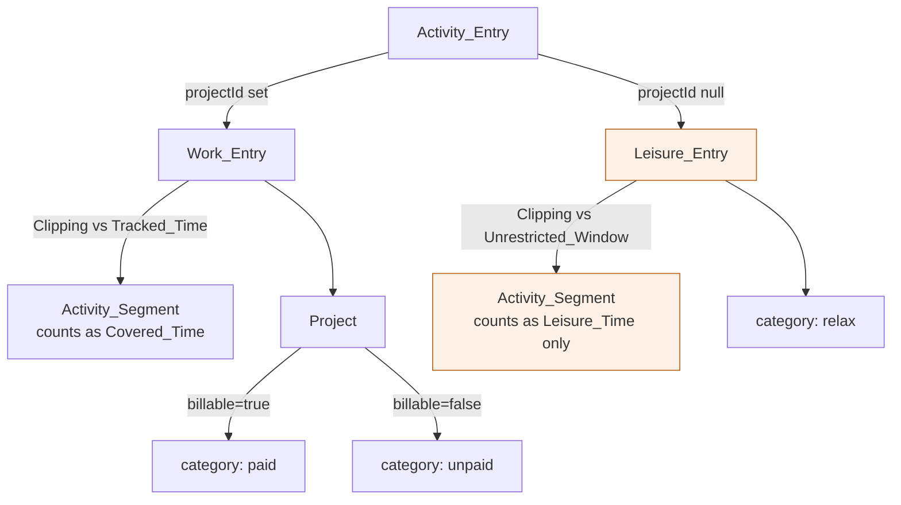
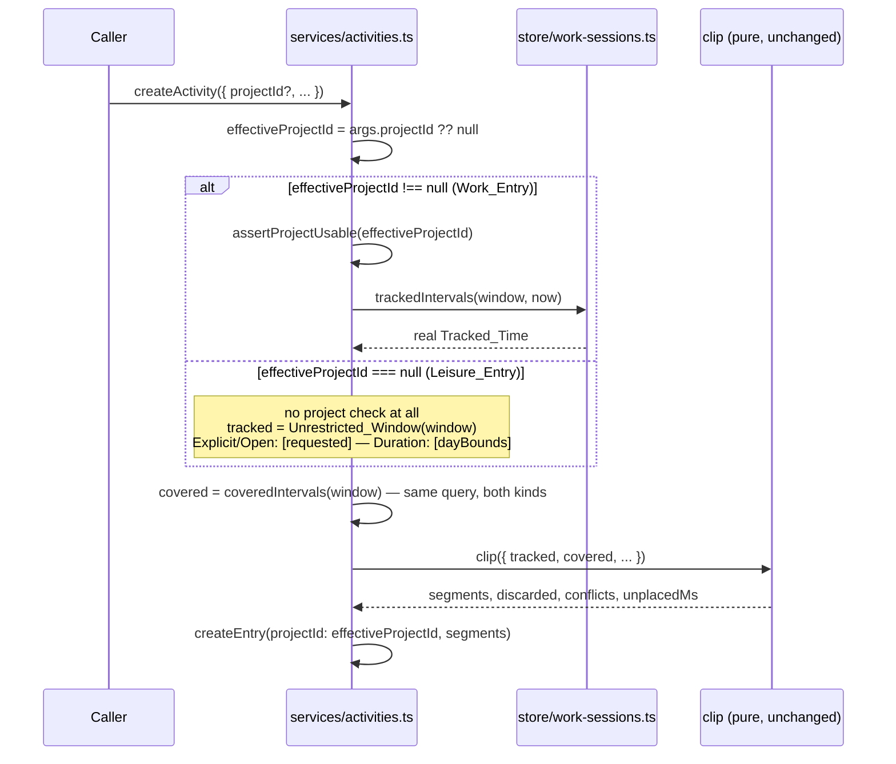
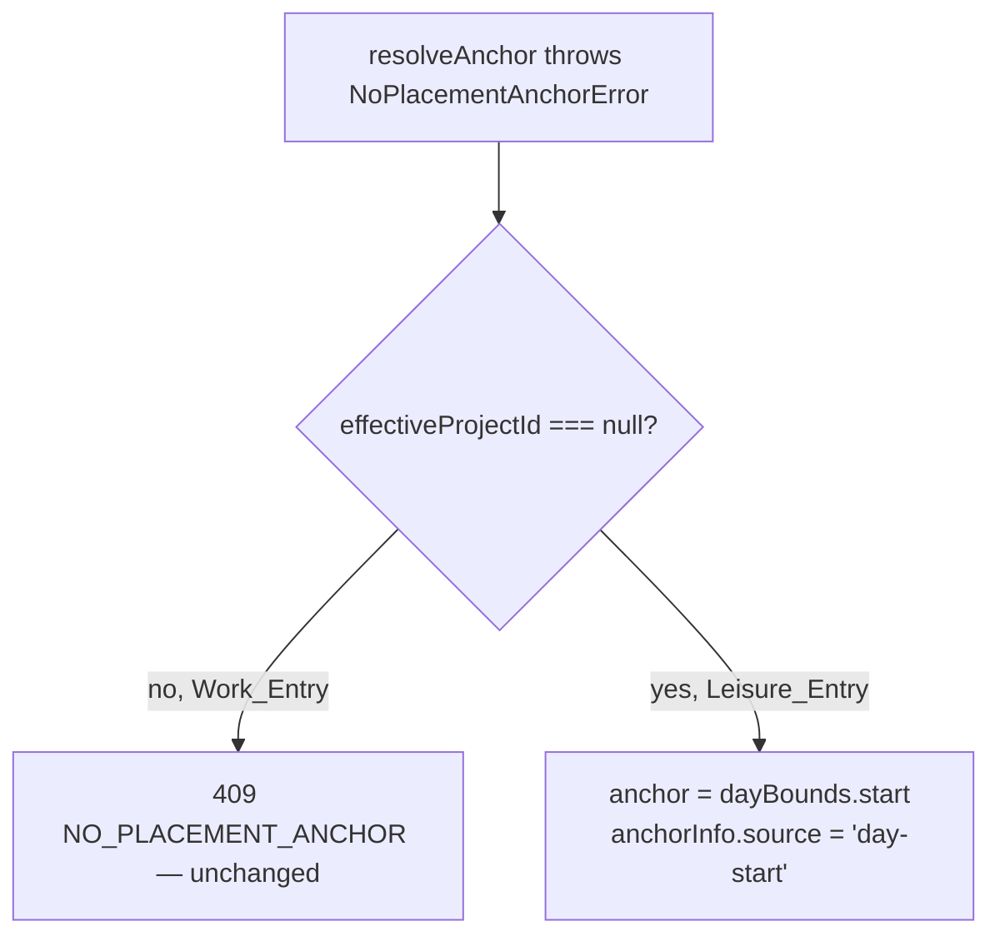
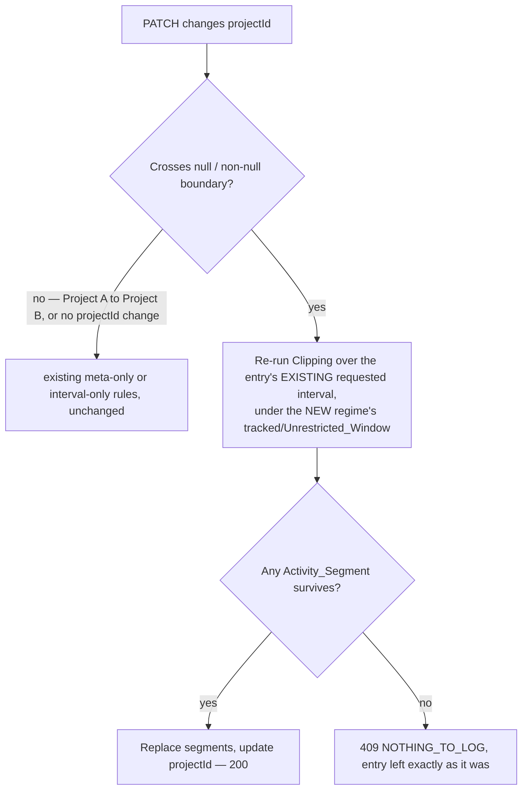

# Design Document: Worklog Time Categories

## Overview

This design adds two independent things to `001-worklog-domain-api`/`002-worklog-ui`'s
existing model, and deliberately nothing else: a `Billable` flag on `Project`, and a
`Leisure_Entry` — an `Activity_Entry` with no `Project` at all, reconciled against an
`Unrestricted_Window` instead of `Tracked_Time`. Both are additive to the existing
schema and both leave `Work_Session` and `clip()`'s pure arithmetic completely
unchanged.

**Key design decisions:**

- **Category is derived, never stored.** No `category` column exists anywhere. A
  `Work_Entry`'s category is `projects.billable ? 'paid' : 'unpaid'`, read fresh every
  time; a `Leisure_Entry`'s category is always `relax`, read from `project_id IS
  NULL`. Flipping a `Project`'s `Billable` value retroactively reclassifies every
  `Work_Entry` ever attributed to it, on every subsequent read — this is intentional
  (Requirement 1.6), not a cache-invalidation bug to guard against.
- **`clip()`'s signature and pure math do not change at all.** `Leisure_Entry`
  reconciliation is not a third algorithm — it is `clipExplicit`/`clipDuration` called
  with `tracked` set to the `Unrestricted_Window` instead of real `Tracked_Time`. The
  entire difference lives in `src/lib/server/services/activities.ts`, in what one
  function call passes as `tracked`.
- **One normalized `effectiveProjectId`, never a raw `undefined` check.** `undefined`
  and `null` mean different things on the two write paths — on create, an absent
  `projectId` *is* the leisure signal; on patch, an absent one means "not being
  changed at all" while an explicit `null` is the leisure signal. Both paths therefore
  resolve a single `string | null` value first, and every downstream branch tests that
  value. This is the one place a plausible implementation silently mis-routes a
  convert-to-leisure PATCH into the `Work_Entry` regime.
- **`Covered_Time` and `Uncovered_Time` are narrowed to `Work_Entry` time.** This is
  the one place a naive implementation breaks an existing invariant: if a
  `Leisure_Entry`'s segments were folded into the same `covered` list `Work_Entry`
  segments already populate, `Covered_Time` could exceed `Tracked_Time` (a
  `Leisure_Entry` is not a subset of it), and `001-worklog-domain-api`'s guarantee that
  `Covered_Time` and `Uncovered_Time` together reconstruct `Tracked_Time` exactly
  (its Requirement 9.3) would silently start failing the day someone logged an
  evening of leisure with no timer running. `Leisure_Time` is therefore its own
  figure, computed by its own query, additive to the day response rather than mixed
  into `coveredSeconds`. The narrowing is stated in requirements.md's Glossary rather
  than left implicit, because it changes an inherited term's meaning.
- **Three different questions over one `activity_segments` table, three filters.**
  `activity_segments` holds both kinds of entry's segments, and which kind a query
  must see depends entirely on what it is asking:
  1. *"Does this instant already belong to something?"* — the overlap and conflict
     queries (`coveredIntervals`, `entriesOverlapping`, `segmentsOverlapping`) must
     see **both** kinds, because a person cannot work and rest at the same instant.
  2. *"How much of `Tracked_Time` has been described?"* — `Covered_Time`,
     `Uncovered_Time`, the per-`Project` breakdown must see **`Work_Entry` only**.
  3. *"Which entries must be re-clipped because the timer frame moved?"* —
     `entriesAffectedBy`, used only by `reclipAffected`, must see **`Work_Entry`
     only**. A `Leisure_Entry` is not reconciled against `Tracked_Time`, so a session
     change has nothing to re-derive for it; letting one through deletes leisure time
     the user logged (Requirement 3.11).
  Every place this design touches `activity_segments` states which of the three it is
  answering. Conflating (1) with (3) is the specific mistake that destroys data.
- **The Day_Gauge is untouched, not redesigned.** It already draws `Work_Session` and
  `Activity_Segment` data; the change is that its caller filters `entries` to
  `Work_Entry` records before handing them to it, and that its own `projectName`
  typing narrows accordingly. Its props' *shape*, geometry and paint order
  (`gauge-geometry.ts`, the outer/inner ring split) are unmodified.
- **The Day_Timeline gains a sibling rendering unit, not a new mode.** A
  `Leisure_Entry` has no `Work_Session` to nest inside, so `layOutDay` gains a second
  kind of top-level unit — `Leisure_Block` — interleaved with the existing block and
  break units in chronological order, **sharing the same proportional height budget**
  so `002-worklog-ui`'s Property 2 (`total <= availablePx`) still holds.



## Architecture

### Creating or Patching an Entry: the Branch on `effectiveProjectId`

Both kinds of entry go through the same `createActivity`/`patchActivity` service
functions, the same mode selection, and the same `clip()` call — they differ only in
what is computed for `tracked` before `clip()` runs.

Each path first resolves one normalized value, and every branch below reads it:

| Path | `effectiveProjectId` |
|---|---|
| `createActivity` | `args.projectId ?? null` — absent means a `Leisure_Entry` |
| `patchActivity` | `args.projectId === undefined ? existing.projectId : args.projectId` — absent means "unchanged", explicit `null` means convert to `Leisure_Entry` |



Because `tracked` for a `Leisure_Entry` is defined to already equal the window being
placed into, `outside = subtract(requested, tracked)` is always empty in
`Explicit_Mode`/`Open_Mode`, and `eligible = subtract(clamp(tracked, window),
covered)` in `Duration_Mode` reduces to "the window minus what is already covered by
anything." `Untracked_Policy` therefore never has anything to `clip`, `extend` or
`reject` for a `Leisure_Entry` — `discarded` is always `[]` and `extend` is always
`[]` — which is exactly Requirements 3.6 and 3.7. No branch of `clip()` itself needed
to change to make this true; it falls out of what is passed in.

`assertProjectUsable` is guarded by `effectiveProjectId !== null` at **both** its call
sites. Today `createActivity` calls it unconditionally and `patchActivity` guards it
with `!== undefined` — and since `null !== undefined` is true, both would reject every
leisure write with `VALIDATION_ERROR` if left as they are.

### The Unrestricted Window, Precisely

| Mode | `tracked` for a `Work_Entry` (unchanged) | `tracked` for a `Leisure_Entry` (`Unrestricted_Window`) |
|---|---|---|
| `Explicit_Mode` / `Open_Mode` | `sessionsStore.trackedIntervals(window)` | `[requested]` — the requested interval itself |
| `Duration_Mode` | `sessionsStore.trackedIntervals(window)` | `[dayBounds]` — the whole `Target_Day` |

`covered`, the `MIN_INTERVAL_SECONDS` floor, and the `ACTIVITY_OVERLAP` conflict check
are computed identically for both kinds — they read `activity_segments` without
filtering by `project_id`, because one instant cannot belong to two entries of either
kind at once (Requirement 3.2). This is question (1) of the Overview's three.

### Placement_Anchor's Day-Start Fallback

`resolveAnchor` in `src/lib/server/domain/clipping.ts` is **not modified** — it keeps
throwing `NoPlacementAnchorError` when a `Target_Day` holds neither an
`Activity_Segment` nor a `Work_Session`, exactly as `001-worklog-domain-api` specifies.
The fallback belongs to the service layer, which already catches that error to map it
to a response — at **two** call sites, not one: `resolveCreateWindow` (used by
`createActivity`) and the equivalent block inside `patchActivity`, which a PATCH
supplying `durationMinutes` reaches instead.



Both sites compute `anchorInfo.source` *after* the `try`/`catch` returns, from
`daySegments.length > 0`, so an implementation that only substitutes the anchor value
inside the catch will have its `'day-start'` source overwritten a few lines later. The
source must be threaded out of the catch, not recomputed.

`Open_Mode` on a **past** `Logical_Day` with no `Work_Session` is a deliberate dead
end (Requirement 3.12): `lastSessionEndWithin` returns `dayBounds.start` for a day with
no sessions, the day-start fallback anchors at the same instant, the resolved interval
is empty, and the existing `NOTHING_TO_LOG` (`empty-interval`) check rejects it. No new
semantics are invented for that case; `Explicit_Mode` and `Duration_Mode` cover it.

### Category Transitions (PATCH crossing the null/non-null boundary)

Today, a PATCH that only changes `description`/`projectId` is treated as
meta-only and never re-runs `Clipping` (`001-worklog-domain-api` Requirement 7.8). That
rule assumed changing `projectId` could never change *which reconciliation regime*
the entry's stored interval is valid under — true when every entry was a `Work_Entry`,
false now. This design adds one precondition to the meta-only branch:



The re-clip in the `yes` branch runs the entry's stored `requestedStartedAt`/
`requestedEndedAt` through `clip()` in `explicit` mode — precisely the same treatment
`reclipAffected` already gives a `Duration_Mode` entry being re-clipped after a
session change (`001-worklog-domain-api` design, "Re-clipping After a Timer Change"):
the frozen requested interval is taken at face value, and no `Placement_Anchor` is
resolved again.

### Leisure Immunity to Re-clipping

`reclipAffected` (`domain/reclip.ts`) runs on every `Work_Session` create, patch and
delete (`services/sessions.ts`) and on the `extend` path of an activity write
(`services/activities.ts`). For each entry its `entriesAffectedBy` port returns, it
deletes that entry's segments and re-clips them against real `Tracked_Time` with
`policy: 'clip'`.

`domain/reclip.ts` itself needs no change. Its **port** does: `entriesAffectedBy`
(`store/activities.ts`) currently selects every entry whose segment *or* requested
interval overlaps the changed window, with no `project_id` filter. Left as it is, a
session added anywhere near a leisure interval re-clips that `Leisure_Entry` against
`Tracked_Time` and deletes whatever falls outside it — the exact outcome Requirement
3.1 exists to prevent. `entriesAffectedBy` therefore gains `project_id IS NOT NULL` on
both of its branches. This is question (3) of the Overview's three, and it is the one
query where the answer differs from the overlap queries directly above it in the same
file.

With that filter in place, no path can empty a stored `Leisure_Entry`: creation
rejects an empty result with `NOTHING_TO_LOG`, a PATCH that would empty one leaves it
untouched, and re-clipping never sees one. A `Leisure_Entry` therefore can never
become an `Orphaned_Entry` (Requirement 4.8) — which is also why `ReclipOutcome` may
keep its non-nullable `projectName`/`colorIndex` fields (component 2).

## Components and Interfaces

### 1. Schema (`src/db/schema/`, `migrations/002_leisure_time_categories.sql`)

```ts
// src/db/schema/projects.ts — one new column
export const projects = pgTable('projects', {
  // ...unchanged columns...
  billable: boolean('billable').notNull().default(true)
});

// src/db/schema/activity-entries.ts — projectId becomes nullable
export const activityEntries = pgTable('activity_entries', {
  // ...unchanged columns...
  projectId: uuid('project_id').references(() => projects.id, { onDelete: 'restrict' })
  // .notNull() removed — NULL means Leisure_Entry
});
```

`ON DELETE RESTRICT` is unaffected by the column becoming nullable: a foreign key
constraint is never evaluated against a NULL value, so a `Leisure_Entry` never blocks
or is affected by a `Project` deletion (Requirement 6.5). No new CHECK constraint
ties `projectId` to anything — there is no stored `category` for one to protect.

```sql
-- migrations/002_leisure_time_categories.sql
ALTER TABLE projects
    ADD COLUMN billable boolean NOT NULL DEFAULT true;

ALTER TABLE activity_entries
    ALTER COLUMN project_id DROP NOT NULL;

-- activity_entries_mode_fields and activity_entries_description_length are
-- unaffected: neither mentions project_id. No index changes — at this
-- application's single-user scale (aggregates.ts's own reasoning already
-- accepted this: "a personal single-user log holds at most a few thousand
-- rows even over a full year"), the existing activity_entries_project_id
-- index degrades gracefully with NULLs and nothing queries "WHERE project_id
-- IS NULL" on a hot path.
```

The `ADD COLUMN … DEFAULT true` is itself the backfill required by Requirement 1.7 —
every pre-existing `Project` row acquires `billable = true` with no separate `UPDATE`.

### 2. Contracts (`src/lib/contracts/models.ts`, `schemas.ts`, `responses.ts`)

```ts
// models.ts
export type Category = 'paid' | 'unpaid' | 'relax';

export type Project = {
  // ...unchanged fields...
  billable: boolean;
};

export type ActivityEntry = {
  id: string;
  /** Null for a Leisure_Entry. */
  projectId: string | null;
  /** Null for a Leisure_Entry. */
  projectName: string | null;
  /** Null for a Leisure_Entry — none of the eight Palette_Slot values represents it. */
  colorIndex: number | null;
  /** Derived: paid/unpaid from the Project's billable flag, or relax when projectId is null. */
  category: Category;
  // ...description, mode, requestedStartedAt/EndedAt/DurationMinutes,
  //    orphaned, timestamps, segments unchanged...
};

/** `projectId` is nullable now — see ActivityEntry. */
export type NewActivityEntry = {
  projectId: string | null;
  // ...remaining fields unchanged...
};

export type ProjectTotal = {
  // ...projectId, projectName, colorIndex, archived, coveredSeconds unchanged...
  /** Addition — lets a caller split a breakdown into paid/unpaid without a second Project lookup. */
  billable: boolean;
};
```

`ReclipOutcome` (also in `models.ts`) keeps `projectName: string` and
`colorIndex: number` **non-nullable**, and `domain/reclip.ts` needs no edit: with
`entriesAffectedBy` filtered to `Work_Entry` rows (Architecture, "Leisure Immunity"),
no `Leisure_Entry` ever reaches `reclipAffected`, so neither field can be null there.
This is stated explicitly because it is the one model type left otherwise looking
inconsistent with `ActivityEntry`'s nullable fields.

```ts
// schemas.ts
export const createActivitySchema = z.object({
  /** Absent creates a Leisure_Entry (Requirement 2.3). */
  projectId: z.uuid().optional(),
  // ...remaining fields unchanged...
}).strict();

export const patchActivitySchema = z.object({
  /**
   * Three states, all meaningful (Requirements 4.1, 4.2): absent leaves projectId
   * unchanged; null clears it, converting to a Leisure_Entry; a uuid sets/changes it,
   * converting to (or keeping) a Work_Entry. Reachable only over the JSON API — the
   * form-action path uses `clearProject` instead (component 5).
   */
  projectId: z.uuid().nullable().optional(),
  // ...remaining fields unchanged...
}).strict();
// existing .refine()s unchanged; none of them mention projectId

/**
 * The form-action variant, and the ONLY schema carrying `clearProject` — the
 * form-action encoding of "convert to a Leisure_Entry" (Requirement 4.9). A FormData
 * body carries no null and cannot distinguish an absent field from an empty one, so
 * `patchActivitySchema`'s `projectId: null` is unrepresentable on that path.
 * `patchActivityAction` translates a true value into `projectId: null` before calling
 * the service; the service itself never sees this field.
 *
 * Declared as a separate schema rather than a field on the shared one deliberately:
 * `patchActivitySchema` is `.strict()`, so keeping `clearProject` out of it makes the
 * JSON route REJECT the field with `VALIDATION_ERROR` instead of accepting and
 * silently dropping it. `projectId: null` stays the one JSON encoding (Requirement 4.10).
 */
export const patchActivityFormSchema = patchActivitySchema.extend({
  clearProject: z.coerce.boolean().optional()
}).strict();

export const createProjectSchema = z.object({
  // ...name unchanged...
  /** Defaults to true (Requirement 1.1). */
  billable: z.boolean().default(true)
}).strict();

export const patchProjectSchema = z.object({
  // ...name, archived, colorIndex unchanged...
  billable: z.boolean().optional()
}).strict();
```

```ts
// responses.ts
export type DaySummary = {
  // ...date, trackedSeconds, coveredSeconds, uncoveredSeconds, sessionCount,
  // longestBlockSeconds, overtimeSeconds, eveningSeconds unchanged...
  /** Addition — coveredSeconds split by Project.billable. paidSeconds + unpaidSeconds === coveredSeconds. */
  paidSeconds: number;
  unpaidSeconds: number;
  /** Addition — total Leisure_Entry segment duration in the day. NOT part of coveredSeconds. */
  relaxSeconds: number;
  // ...tracked?, covered?, uncovered? unchanged...
  /** Addition — present under the same include=intervals condition as the other three. */
  leisure?: Interval[];
  // ...byProject unchanged in shape; its rows gain `billable` via ProjectTotal...
};
// DayResponse.totals gains the same three numeric fields, mirrored from DaySummary
// exactly as it already mirrors trackedSeconds/coveredSeconds/uncoveredSeconds.

/** `anchor.source` gains one union member; the object gains no new field. */
export type ActivityResponse = {
  // ...unchanged...
  anchor: { at: string; source: 'explicit' | 'last-segment' | 'first-session' | 'day-start' } | null;
};
```

`DaysRangeResponse.intervalsIncluded`'s doc comment names the interval collections the
flag governs and gains `leisure` alongside `tracked`/`covered`/`uncovered`.

`DayResponse.quickLog.anchorSource` is a **separate** union
(`'last-segment' | 'first-session'`) and deliberately does **not** gain `'day-start'`:
`Quick_Log` resolves against `Work_Entry` data only (Requirement 6.6) and has no
day-start fallback. It is called out here so it is not "made consistent" by mistake.

No other response type changes. `SessionChangePreview` and every `Work_Session`
response need to know nothing about category.

### 3. Reconciliation Wiring (`src/lib/server/services/activities.ts`)

The exported argument types widen — the Zod schemas alone are not enough, since these
types are what the routes and form actions call through:

```ts
export type CreateActivityArgs = {
  projectId?: string;          // was: string (required)
  // ...unchanged...
};

export type PatchActivityArgs = {
  projectId?: string | null;   // was: string | undefined
  // ...unchanged...
};
```

The existing `resolveCreateWindow`, `clipAndRescue`, `createActivity` and
`patchActivity` functions are extended, not replaced. Two new internal primitives:

```ts
/**
 * The Unrestricted_Window a Leisure_Entry's Clipping runs against, standing in for
 * Tracked_Time. Never queries the database — it is exactly the window already being
 * placed into: `[dayBounds]` in Duration_Mode, `[requested]` otherwise.
 */
function unrestrictedTracked(
  mode: ActivityMode,
  requested: Interval | null,
  dayBounds: Interval | null
): Interval[];

/**
 * True when a PATCH moves the entry across the null / non-null projectId boundary —
 * i.e. converts a Work_Entry to a Leisure_Entry or the reverse. False when projectId
 * is absent from the request, and false for a Project-to-Project change.
 */
function crossesProjectBoundary(existing: ActivityEntry, args: PatchActivityArgs): boolean;
```

Every branch that previously read `args.projectId` reads the normalized
`effectiveProjectId` (Architecture) instead:

- **`tracked`** — `effectiveProjectId !== null` selects `sessionsStore.trackedIntervals`
  (unchanged), `=== null` selects `unrestrictedTracked`. This applies in
  `resolveCreateWindow`, in `clipAndRescue`'s `runClip`/`rerunClip` closures, and in
  `patchActivity`'s equivalents.
- **`openSessionSpan`** — computed only when `effectiveProjectId !== null`; it is a
  `Work_Session` concept with no meaning against an `Unrestricted_Window`, and since
  `outside` is always empty for a `Leisure_Entry`, `extend`'s use of it would never be
  reached regardless.
- **`assertProjectUsable`** — called only when `effectiveProjectId !== null`, at both
  its call sites.
- **The `NoPlacementAnchorError` catch** — the day-start fallback applies when
  `effectiveProjectId === null`, at both catch sites.
- **`createEntry`/`updateEntryRequested`** — passed `projectId: effectiveProjectId`.

**Category transitions** (`patchActivity`): when `selectPatchMode` would otherwise
return `'meta'` but `crossesProjectBoundary` is true, `patchActivity` takes the
interval-re-clipping path instead — re-running `clip()` over the entry's own
`requestedStartedAt`/`requestedEndedAt` in `explicit` mode, with `tracked` resolved by
the **new** `effectiveProjectId` — rather than the meta-only `updateEntryMeta` path,
even when `startedAt`/`endedAt`/`durationMinutes` are all absent from the request.

**Idempotency.** `canonicalRequestHash` (`store/idempotency.ts`) iterates the keys of
the object it is given and serializes with `JSON.stringify`, which drops `undefined`
values while keeping `null`. The three `projectId` states therefore already hash
distinctly and the function needs no change — but `createActivity` passes
`projectId: effectiveProjectId` (i.e. `?? null`) into it rather than a possibly-
`undefined` value, so the canonical form is deterministic rather than
presence-dependent.

**Preview_Token.** `computePreviewToken` (`core/preview-token.ts`) fingerprints
`Work_Session` and `Activity_Segment` ids and times within the window, with no
reference to `project_id`, `billable` or category. A `Leisure_Entry` `Dry_Run` is
therefore already covered correctly, and flipping a `Project`'s `Billable` value
invalidates no preview — correct, since category is never stored and never changes a
fingerprinted row. No change is required.

### 4. Store Changes

```ts
// store/projects.ts
export async function createProject(tx: Tx, name: string, billable: boolean): Promise<Project>;
export async function updateProject(
  tx: Tx, id: string,
  patch: { name?: string; archived?: boolean; colorIndex?: number; billable?: boolean }
): Promise<Project>;
// toProject() reads `billable` off the row.
```

```ts
// store/activities.ts
/** Accepts a nullable project; derives `category` and nulls projectName/colorIndex. */
function toEntry(
  row: EntryRow,
  project: Pick<ProjectRow, 'name' | 'colorIndex' | 'billable'> | null,
  segments: SegmentRow[]
): ActivityEntry;

/** New — the most recent Work_Entry only, for Quick_Log's project resolution
 *  (Requirement 6.6). Same ordering as mostRecentEntry, filtered to project_id IS NOT NULL. */
export async function mostRecentWorkEntry(tx: Tx): Promise<ActivityEntry | null>;
```

`hydrate()` collects only non-null `projectId` values before its
`inArray(projects.id, projectIds)` lookup, and maps a row whose `projectId` is null to
`project = null` directly — never through the existing "project not found for entry"
throw, which stays reserved for a genuine referential-integrity violation.

**`entriesAffectedBy` gains `project_id IS NOT NULL` on both branches** (the
segment-overlap select and the requested-interval select). It is the *only* query in
this file that filters on kind, because it is the only one answering question (3) —
"which entries must be re-clipped because the timer frame moved". See Architecture,
"Leisure Immunity to Re-clipping", for why letting a `Leisure_Entry` through here
deletes user data.

Every other exported function in the file — `createEntry`, `updateEntryMeta`,
`updateEntryRequested`, `coveredIntervals`, `segmentsOverlapping`,
`entriesOverlapping`, `listEntriesOverlapping`, `orphanedEntriesOverlapping`,
`entriesBlockingProject`, `entryIdsForProject` — needs **no** signature or query
change: each either answers question (1) and correctly sees both kinds, or already
filters by `project_id = <id>`, which excludes NULLs by construction (Requirement
6.5).

```ts
// store/aggregates.ts — the Covered_Time / Leisure_Time split (question 2).
/** Work_Entry segments only — an added `AND activity_entries.project_id IS NOT NULL`
 *  on the existing join. Feeds Covered_Time, Uncovered_Time, byProject. The returned
 *  `projectId` must be narrowed to `string` explicitly: Drizzle infers `string | null`
 *  from the now-nullable column, which the filter makes impossible but the type
 *  system cannot see. */
async function fetchWorkSegments(tx: Tx, range: Interval): Promise<RawSegment[]>;

/** Leisure_Entry segments only — the mirror query, `WHERE project_id IS NULL`, no
 *  project join needed. Feeds Leisure_Time / relaxSeconds only. */
async function fetchLeisureSegments(tx: Tx, range: Interval): Promise<{ startedAt: Date; endedAt: Date }[]>;
```

`daySummaries()` sources `byProject` from `fetchWorkSegments` (now provably free of a
null-`projectId` key), derives `paidSeconds`/`unpaidSeconds` by splitting `byProject`
on each project's `billable`, and computes `relaxSeconds` from `fetchLeisureSegments`
clamped to each day the same way `coveredSeconds` already is. `dayIntervals()` gains a
fourth parallel array, `leisure: Interval[][]`, built exactly as `tracked`/`uncovered`
already are. `coverageForRange()` (`/api/coverage`) switches its internal fetch to
`fetchWorkSegments`, which is what keeps its own shape meaning `Work_Entry` time only
(Requirement 6.1).

```ts
// store/work-sessions.ts, store/tx.ts, domain/clipping.ts, domain/reclip.ts,
// domain/interval.ts, domain/logical-day.ts — NO CHANGES. Listed explicitly because
// these are the files most sensitive to a hidden regression. Note that reclip.ts is
// unchanged only because its `entriesAffectedBy` PORT (store/activities.ts) is fixed
// instead — see Architecture, "Leisure Immunity to Re-clipping".
```

### 5. Form Actions (`src/lib/server/services/activity-form-actions.ts`, `src/routes/projects/+page.server.ts`)

This is the path the interface actually writes through — `ActivityDialog` and the
projects page post to form actions, not to the JSON API, so a change confined to
`src/routes/api/**` would leave the UI unable to write anything new.

- **`createActivityAction`** passes `form.data.projectId` (now `string | undefined`)
  straight through to `createActivityService`; absent means a `Leisure_Entry`, exactly
  as over JSON.
- **`patchActivityAction`** translates the `clearProject` field into the service's
  `projectId: null` before calling `patchActivityService`, and otherwise passes
  `form.data.projectId` through:

  ```ts
  // contract, not an implementation:
  //   clearProject === true            → projectId: null   (convert to Leisure_Entry)
  //   clearProject falsy, projectId set → projectId: <uuid> (set or change the Project)
  //   clearProject falsy, projectId absent → projectId: undefined (leave unchanged)
  // Sending clearProject === true together with a projectId is a VALIDATION_ERROR;
  // the two name contradictory outcomes.
  ```

- **`src/routes/projects/+page.server.ts`** gains a `billable` and an `unbillable`
  action, mirroring the existing `archive`/`unarchive` pair exactly — one named action
  per operation, each validated by a row-scoped schema built from `projectIdSchema`,
  each calling `patchProject` with the corresponding value (Requirement 9.4). There is
  no `patchProject` action in this file and this design does not introduce one; the
  granular convention is the established one.
- **`create`** in the same file threads the new `billable` field from
  `createProjectSchema` through to the service.

### 6. Day_Gauge Caller Filter (`src/routes/+page.svelte`, `src/routes/day/[date]/+page.svelte`)

`DayGauge.svelte`'s and `ProjectLegend.svelte`'s prop *contracts* are unchanged in
shape. The page component — not `DayGauge` itself — filters before passing down:

```ts
const workEntries = $derived(entries.filter((e) => e.category !== 'relax'));
// <DayGauge entries={workEntries} .../>
// byProject already excludes Leisure_Entry by construction (component 4) — no filter needed.
```

`ProjectLegend` consumes `ProjectTotal`, whose `colorIndex` stays non-null, so it
needs no change at all (Requirement 7.3).

### 7. Nullable-Project Consumers (type narrowing)

Making `ActivityEntry.projectName`/`colorIndex` nullable breaks every existing
consumer that passes them to `projectSlotClass(colorIndex: number)` or renders
`projectName` as a string. Each one narrows explicitly — there is no single global
fallback, because the correct answer differs per surface:

| Consumer | Resolution |
|---|---|
| `DayGauge.svelte` (`InnerPiece.projectName`) | Receives `Work_Entry` records only (component 6); narrows its own local type at the point it builds `InnerPiece`, keeping the field non-null internally |
| `ChangePreview.svelte` | Renders `ReclipOutcome`, whose fields stay non-null (component 2) — but its own draft-entry rendering path must tolerate a leisure draft: `projectName ?? ''` and the `Leisure_Palette_Slot` class in place of `projectSlotClass` |
| `SegmentBlock.svelte` | Draws `Work_Entry` segments only — `layOutDay` no longer routes leisure segments into it (component 8) — so it narrows like `DayGauge` |
| `DaySummaryPanels.svelte` | Renders across all entries; falls back to `LEISURE_SLOT_CLASS` and the translated leisure label when `colorIndex`/`projectName` are null |
| `activityOverlapError` (`services/activities.ts`) | Puts `projectName`/`colorIndex` into `ACTIVITY_OVERLAP` details. A `Leisure_Entry` is a legitimate conflict source (Requirement 3.3), so the detail shape widens to nullable and whatever renders it supplies the leisure label |
| `src/modules/day/dry-run.ts` | Holds the only two client-side `ActivityEntry` constructions, both upstream of `ChangePreview.svelte` — so the null arrives one layer *above* the row for it. `reviveEntry` maps the wire shape field by field and must carry `category` through, with `projectName`/`colorIndex` passed through as nullable; the `EMPTY_ACTIVITY_ENTRY` literal must gain a `category` (`'paid'`, matching its existing non-null placeholder fields). `SessionPreview.reclipped` stays non-null, consistent with `ReclipOutcome` |

### 8. Day_Timeline: `Leisure_Block` (`timeline-geometry.ts`, `DayTimeline.svelte`)

Drawn in `.design/artboards/DayCategories.dc.html` (Requirement 8.8): a `Leisure_Block`
carries no session rail, sits between `Work_Block` groups in chronological order, and
names its category in text beside the title rather than by colour alone. The same
text tag is added to `SegmentBlock.svelte` for a `Work_Entry`'s derived `paid`/
`unpaid` (Requirement 8.7) — the artboard draws it on every work block, and it is
what keeps a work block's category off colour alone.

`layOutDay`'s existing `DayLayout` — `blocks: { session, segments, heightPx, running,
capped, continues }[]` and `breaks: { after: number; interval: Interval; long:
boolean }[]`, both inline anonymous types — is extended with one new array:

```ts
export type LeisureBlockUnit = {
  entry: ActivityEntry;      // category === 'relax'
  segment: ActivitySegment;
  interval: Interval;
  /** Drawn from the same proportional budget as every other unit, floored at MIN_BLOCK_PX. */
  heightPx: number;
};

export type DayLayout = {
  // blocks and breaks unchanged, in shape and meaning
  /** Addition — every Leisure_Block for the day, in chronological order. */
  leisureBlocks: LeisureBlockUnit[];
};
```

Three existing behaviours must change, none of them obvious from the addition alone:

1. **The early return.** `layOutDay` returns `{ blocks: [], breaks: [] }` immediately
   when `sessions.length === 0`, and `DayTimeline.svelte` does not call it at all in
   that case, rendering its empty state instead. Both guards become "no sessions
   **and** no leisure segments" — otherwise the headline case of this whole
   specification, a day of leisure with the timer never started, draws nothing
   (Requirement 8.5).
2. **The work-segment loop.** `layOutDay` currently pushes *every* entry's segments
   through `ownerBlockIndex`, which assumes each segment was clipped server-side to
   the session it overlaps — false for a `Leisure_Entry`. Left as it is, leisure
   segments are assigned to an arbitrary block, silently dropped by the subsequent
   `intersect`, and still counted into `totalSeconds`, skewing every work segment's
   height. That loop skips entries whose `category === 'relax'`; they are laid out as
   `leisureBlocks` instead.
3. **The height budget.** A `Leisure_Block` participates in the same closed budget as
   everything else: its duration counts into `totalSeconds` and its height comes out
   of `flex = availablePx - fixed`, floored at `MIN_BLOCK_PX` exactly as a
   `Segment_Block` is (Requirement 8.3). This is what keeps `002-worklog-ui`'s
   Property 2 (`total <= availablePx`) true.

`DayTimeline.svelte` merges `layout.blocks`, `layout.breaks` and
`layout.leisureBlocks` into one chronological render list by each unit's start
instant, replacing today's single iteration over `blocks` with a break looked up by
block index. A new sibling component, `LeisureBlock.svelte`, mirrors
`SegmentBlock.svelte`'s self-contained pressable-block shape (title, times,
description) but tints with the `Leisure_Palette_Slot` and calls the same
`onActivityActivate(entry.id)` callback `Segment_Block` already exposes
(Requirement 8.4).

### 9. Palette Addition (`src/lib/viz/palette.ts`, `scripts/generate-palette-and-heights.ts`)

```ts
// palette.ts — a ninth, reserved slot, never reached by projectSlotClass's modular
// wraparound (PALETTE_SIZE stays 8; this is a distinct constant and a distinct class).
export const LEISURE_SLOT: PaletteSlot = { dark: '#7C8899', light: '#5F6B7A' };
export const LEISURE_SLOT_CLASS = 'pj-relax';
export function leisureColor(theme: 'dark' | 'light'): string;
```

**These two values are decided, not placeholders, and the reasoning matters more than
the hexes.** A `Leisure_Palette_Slot` is deliberately **not** a ninth categorical
colour. `.design/DESIGN.md` § 2 already establishes that eight mutually
distinguishable categorical colours do not exist — the committed palette measures
CVD ΔE **4.6** and normal-vision ΔE **7.3** at eight projects, against targets of 8
and 15, which is why that section's standing rule is that colour never carries
project identity on its own and every surface showing a colour also shows the name.
A ninth saturated hue would make an already-saturated scale worse.

Leisure therefore **opts out** of the categorical scale rather than joining it, and
is encoded by *absence of chroma*:

| | Value | Contrast on its ground | OKLCH chroma |
|---|---|---|---|
| Dark | `#7C8899` | 5.18:1 on `--bg` `#0F1319` | 0.029 |
| Light | `#5F6B7A` | 4.70:1 on `--bg` `#F3EEE6`, 5.08:1 on `--dialog` `#FBF7F1` | 0.028 |

The eight project hues sit at chroma 0.137–0.150, so leisure is roughly five times
less saturated than any of them and reads unambiguously as "grey — not a project".
Both values clear 4.5:1 as well as the 3:1 mark floor, which matters because a
`Leisure_Block` carries text.

Measured honestly, leisure's separation *from* the project hues under simulated
deuteranopia is poor (ΔE 5.7 dark, 1.0 light) — but no colour fixes that, because
olive and amber also collapse toward grey under the same simulation. It is
acceptable here for the same reason `.design/DESIGN.md` already accepts it between
two projects: colour is not carrying the distinction. A `Leisure_Entry` is separated
**structurally** — a `Leisure_Block` is a top-level unit never nested inside a
`Work_Block` (component 8), it carries its own description and times, it is excluded
from the `Day_Gauge` entirely (Requirement 7), and the statistics page files it
under its own heading (Requirement 11.2). The colour only has to say "not a project",
and low chroma says exactly that.

`generate-palette-and-heights.ts` needs more than a new source token: its
`buildPaletteCss` loops `for (i = 0; i < PALETTE_SIZE; i++)` and emits a header
comment reading "Eight classes, `.pj-0` … `.pj-7`". Both the loop (to append the
reserved slot after the eight) and that comment must change, so that `pj-relax`'s
`--pj`/`--pj-tint` custom properties are generated exactly like `pj-0`..`pj-7`'s and
never hand-written into the committed CSS (CLAUDE.md's standing rule for this file).

### 10. Projects UI — Billable Toggle (`ProjectRow.svelte`, `ProjectsPage.svelte`)

`ProjectRow.svelte` gains a two-way control following its existing archive-toggle
hidden-form pattern, posting to the `?/billable` and `?/unbillable` actions of
component 5, plus a plain text label naming the current state beside it (Requirement
9.3 — never colour alone). `ProjectsPage.svelte`'s creation form gains the same
two-way control, defaulting to paid. `ProjectPicker.svelte` itself needs **no change**
— `ActivityDialog` filters the `projects` array it is given by `billable` before
passing it in (component 11), so the picker keeps rendering whatever list it receives.

Message keys follow the file's existing `projects_*` convention (`projects_archive`,
`projects_unarchive`, …), so the new ones are `projects_billable` /
`projects_unbillable` and their label counterparts — not `project_billable`.

### 11. Activity_Dialog — Category Control (`src/modules/day/components/ActivityDialog.svelte`)

Drawn in `.design/artboards/AddTaskCategories.dc.html` (Requirement 10.9): the category
control sits above the existing mode control and reuses its exact segmented shape; the
project field's label names the active filter.

A new segmented control, `category: Category`, added to `ActivityFormValues` and
rendered above the existing mode control, following the same `role="radiogroup"` +
arrow-key pattern already implemented for that control.

```ts
type ActivityFormValues = {
  category: Category;   // addition
  // ...mode, date, from, to, durationMinutes, description unchanged...
  projectId: string;    // '' when category is 'relax', or between selections
};
```

`filteredProjects` is derived from `projects` and `category`: empty for `relax` (the
`Project_Picker` is hidden entirely rather than rendered empty, Requirement 10.4),
otherwise `projects.filter((p) => p.billable === (category === 'paid'))`.

Five existing behaviours must change, each of which would otherwise break a leisure
draft outright:

1. **`activityFormSchema`'s base constraint**, not only its `superRefine`:
   `projectId` is currently `z.string().min(1)`, which rejects `''` before any refine
   runs. The base type relaxes and the `superRefine` requires a non-empty `projectId`
   only when `category !== 'relax'`.
2. **`canPreview`** currently returns false whenever `$form.projectId === ''`. A relax
   draft always satisfies that, so the `Change_Preview` would never appear — and,
   worse, the write form only emits the `previewToken` when a preview exists, so a
   leisure write would carry none. That project guard applies only when
   `category !== 'relax'` (Requirement 10.8).
3. **The hidden wire form's `projectId` input** is rendered unconditionally and would
   post `''` into `z.uuid().optional()`. It is gated on `category !== 'relax'` for a
   create; a patch converting to leisure posts `clearProject` instead (component 5).
   Changing only `buildCreateInput`/`buildPatchInput` is not sufficient — those feed
   the `Dry_Run` fetch, not the real submission.
4. **`initialValues()`** seeds `projectId` from `entry.projectId`, now nullable —
   `?? ''`.
5. **Category seeding.** Opening to edit seeds `category` from `entry.category`
   (Requirement 10.6). For a new entry the default comes from the `recentEntry` prop,
   which currently carries only `{ projectId, description }` and therefore cannot say
   what category to default to; it gains the resolved `category` (and keeps naming a
   `Work_Entry` only, per Requirement 6.6) so the dialog never has to look the project
   up in a `projects` list that may not contain it, as when it is archived.

`ChangePreview.svelte` needs the narrowing of component 7 but no behavioural change:
it already renders whatever outcome shape `clip()` produced, and that shape is
identical for both kinds (Requirement 10.8).

### 12. Statistics — Category Breakdown (`src/modules/stats/`)

The timer page's own category figures are drawn in
`.design/artboards/TimerCategories.dc.html` (Requirement 7.4) — a single strip beside
the unchanged gauge readouts, with the gauge and its `Project_Legend` untouched.

`ProjectBreakdown.svelte` consumes `ProjectRangeTotal` from `aggregate.ts`, not the
server's `ProjectTotal`, so the `billable` flag must be threaded into that type:

```ts
export type ProjectRangeTotal = {
  // ...projectId, projectName, colorIndex, archived, coveredSeconds unchanged...
  /** Addition — the group this row belongs to. */
  billable: boolean;
};

/** Folds per-day byProject rows into range totals, now grouping by `billable` FIRST
 *  and applying TOP_PROJECT_COUNT WITHIN each group, so each group gets its own
 *  "Other" row and a combined row never mixes a paid Project with an unpaid one
 *  (Requirement 11.2). */
export function foldProjectTotals(days: DaySummary[]): {
  paid: ProjectRangeTotal[];
  unpaid: ProjectRangeTotal[];
};
```

`KpiRow.svelte` adds `paidSeconds`/`unpaidSeconds`/`relaxSeconds` beside the existing
figures (Requirement 11.1). `ProjectBreakdown.svelte` renders the two groups under
their own headings and the range's `Leisure_Time` total beneath both, outside the bars
(Requirement 11.3). `DayRhythm.svelte`/`rhythm-geometry.ts` draw the new per-day
`leisure: Interval[]` list in `LEISURE_SLOT_CLASS`, positioned exactly as the existing
covered/uncovered draws are (Requirement 11.4).

## Data Models

```sql
-- migrations/002_leisure_time_categories.sql (see component 1 for the full statement
-- and its reasoning)
ALTER TABLE projects ADD COLUMN billable boolean NOT NULL DEFAULT true;
ALTER TABLE activity_entries ALTER COLUMN project_id DROP NOT NULL;
```

| Field | Before | After |
|---|---|---|
| `projects.billable` | does not exist | `boolean NOT NULL DEFAULT true` |
| `activity_entries.project_id` | `uuid NOT NULL REFERENCES projects(id) ON DELETE RESTRICT` | `uuid REFERENCES projects(id) ON DELETE RESTRICT` (nullable) |

No table is added, no existing column beyond these two changes, no constraint is
dropped or weakened. `activity_entries_mode_fields`, `activity_segments_no_overlap`,
`work_sessions_one_open`, `work_sessions_no_overlap` and every other constraint from
`migrations/001_init.sql` apply unchanged to both `Work_Entry` and `Leisure_Entry`
rows alike, since none of them distinguishes on `project_id`.

**Deliberately out of scope:** `GET /api/activities?project_id=` can filter *for* a
named `Project` but gains no way to filter *for* `Leisure_Entry` records. No
requirement needs it, the day and range responses already carry leisure separately,
and adding a magic sentinel value to a uuid-typed query parameter would cost more
than it returns. Stated here so its absence reads as a decision rather than an
oversight.

## Correctness Properties

### Property 1: Category is a pure function of stored state

*For any* `Activity_Entry`, its reported `category` equals `'relax'` when
`projectId` is null, `'paid'` when `projectId` names a `Project` whose `billable` is
`true`, and `'unpaid'` otherwise — computed identically on every read, with no stored
value that could disagree with a fresh computation.

**Validates: Requirements 1.5, 1.6, 5.2**

### Property 2: Mutual exclusivity holds across categories

*For any* two `Activity_Segment` records, of any `Activity_Entry` kind, their
intervals never overlap — the existing `activity_segments_no_overlap` invariant,
unmodified, continues to hold with `Leisure_Entry` rows participating in it exactly
as `Work_Entry` rows do.

**Validates: Requirements 3.2, 3.3**

### Property 3: Covered_Time excludes Leisure_Time

*For any* range, the `Covered_Time` and `Uncovered_Time` intervals reported by
`/api/coverage`, `/api/days` and `/api/days/{date}` are computed from `Work_Entry`
segments only, and together reconstruct exactly the reported `Tracked_Time` intervals
— unaffected by the presence, number or placement of any `Leisure_Entry` segment in
the same range. This is `001-worklog-domain-api`'s Requirement 9.3 guarantee, restated
here because it is the one guarantee this specification could silently break.

**Amendment to `001-worklog-domain-api`'s Property 22.** That property currently
asserts that *every* stored `Activity_Segment` lies entirely within `Tracked_Time`. It
is amended to: *every stored `Activity_Segment` **of a `Work_Entry`** lies entirely
within `Tracked_Time`*. A `Leisure_Entry`'s segments are by design not a subset of
`Tracked_Time`, so the unrestricted form becomes false the first time leisure is
logged. The amendment narrows the assertion's domain; it does not weaken what it
guarantees about work time.

**Validates: Requirements 6.1**

### Property 4: The paid/unpaid split is a true partition of Covered_Time

*For any* day or range, `paidSeconds + unpaidSeconds` equals `coveredSeconds` exactly
— no `Work_Entry` second is counted twice or dropped between the two buckets.

**Validates: Requirements 6.2**

### Property 5: A category transition is all-or-nothing

*For any* PATCH crossing the null/non-null `projectId` boundary, the write either
succeeds with the entry's `Activity_Segment` records replaced under the new regime,
or fails with `NOTHING_TO_LOG` and leaves the `Activity_Entry` — its `projectId`, its
requested interval and its stored segments — exactly as it was before the request.

**Validates: Requirements 4.3, 4.4**

### Property 6: A Work_Session change never disturbs a Leisure_Entry

*For any* sequence of `Work_Session` creates, patches and deletes, every stored
`Leisure_Entry` and every one of its `Activity_Segment` records is byte-for-byte
unchanged afterwards — no segment shortened, split, added or deleted, and no
`Leisure_Entry` left orphaned.

**Validates: Requirements 3.11, 4.8**

### Property 7 (preserved, not introduced): the timeline height budget still holds

`002-worklog-ui`'s Property 2 — the sum of every rendered unit's height never exceeds
the available height — continues to hold with `Leisure_Block` units present, because
a `Leisure_Block` is sized from the same proportional budget as every other unit
rather than from its own duration independently.

**Validates: Requirements 8.3**

## Error Handling

No new error code is introduced. Every failure mode a `Leisure_Entry` or a category
transition can hit already exists and is reused unchanged:

| Code | HTTP | When (new trigger added by this specification) |
|---|---|---|
| `VALIDATION_ERROR` | 400 | `projectId` supplied on create but names no existing `Project` (Requirement 2.6); a form-action PATCH sending `clearProject` together with a `projectId` (Requirement 4.9) |
| `PROJECT_ARCHIVED` | 400 | `projectId` supplied names an archived `Project` (Requirement 2.7) |
| `ACTIVITY_OVERLAP` | 409 | A `Leisure_Entry`'s requested interval overlaps any other entry's segment (Requirement 3.3). Its `details` carry a nullable `projectName`/`colorIndex` now, since the conflicting entry may itself be a `Leisure_Entry` |
| `NOTHING_TO_LOG` | 409 | `Clipping` against the `Unrestricted_Window` (Requirement 3.5), `Open_Mode` leisure on a past day with no `Work_Session` (Requirement 3.12), or a category-transition re-clip (Requirement 4.4) leaves no segment |

`NO_PLACEMENT_ANCHOR` becomes unreachable for a `Leisure_Entry` (Requirement 3.8's
day-start fallback) while remaining exactly as it is for a `Work_Entry`.

## Testing Strategy

- **Unit (Vitest, no database)**: `unrestrictedTracked` across all three modes; the
  day-start `Placement_Anchor` fallback at both catch sites; `crossesProjectBoundary`
  across every combination of (existing null/non-null) × (incoming absent/null/uuid);
  `toEntry`'s category derivation for all three project states. These live in the
  existing `tests/lib/server/services/activities.test.ts` and
  `tests/lib/server/store/activities.test.ts`.
- **Property-based (`fast-check`)**: Properties 3, 4 and 6, generated over random
  mixes of `Work_Session`, `Work_Entry` and `Leisure_Entry` data, extending the
  existing `tests/lib/server/store/overlap.property.test.ts` harness rather than
  adding a new file — with its Property 22 assertion loop filtered to `Work_Entry`
  segments per the amendment above. Property 2 is confirmed by the same generator with
  `Leisure_Entry` rows included. Property 5 belongs in the existing
  `tests/lib/server/store/atomicity.property.test.ts`, which already exercises
  all-or-nothing write behaviour. Property 7 is covered by the existing
  `tests/modules/day/components/timeline-geometry.property.test.ts`.
- **Integration (PostgreSQL)**: `tests/lib/server/store/schema.test.ts` (which asserts
  the Drizzle schema and the SQL migration agree) for both column changes;
  `projects.test.ts` for `billable`; `activities.test.ts` for the `Leisure_Entry`
  round trip and the nullable-project `hydrate` path; `aggregates.test.ts` for a day
  mixing all three categories; `tests/lib/server/domain/reclip.test.ts` and
  `reclip.property.test.ts` for leisure immunity.
- **API (`tests/api/`)**: `activities.test.ts` for leisure create/patch/delete in every
  mode, the empty description, the shared validation bounds, the sliver floor, the
  `Target_Day` bound, `ACTIVITY_OVERLAP` across kinds, both transition directions and
  the `NOTHING_TO_LOG` rejection; `projects.test.ts` for `billable`; `days.test.ts`
  and `coverage.test.ts` for the new figures and the unchanged coverage shape.
- **Component (Vitest + jsdom)**: `ActivityDialog`'s category control (filtering,
  clearing, seeding, `canPreview`); the new `LeisureBlock.svelte`; `layOutDay`'s
  leisure placement and its no-session day; `ProjectBreakdown`'s grouped fold;
  `tests/lib/viz/palette.test.ts` for `LEISURE_SLOT`'s separation from the eight
  project slots; `tests/lib/i18n.test.ts` for cs/en key parity.
- **E2E (Playwright)**: `tests/e2e/fixtures.ts`'s `createActivity` helper — which
  currently requires a `projectId` — gains a leisure-capable variant first, since
  every leisure E2E scenario depends on it. Then `day.spec.ts` logs leisure on a day
  with no `Work_Session` at all; `conflict.spec.ts` covers a leisure-vs-work overlap;
  `a11y.spec.ts` re-runs its axe sweep with a `Leisure_Block` present and over the
  projects page's new toggle; `a11y-interaction.spec.ts`'s keyboard walk accounts for
  the `Leisure_Block` now in the tab order.
